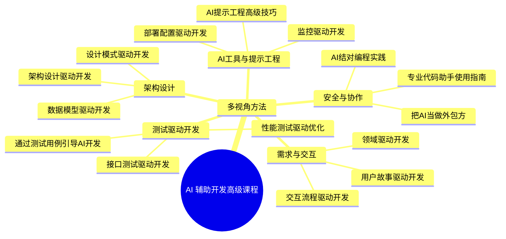
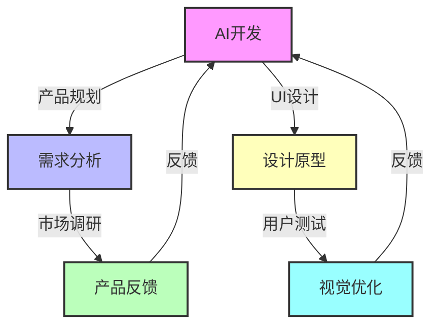
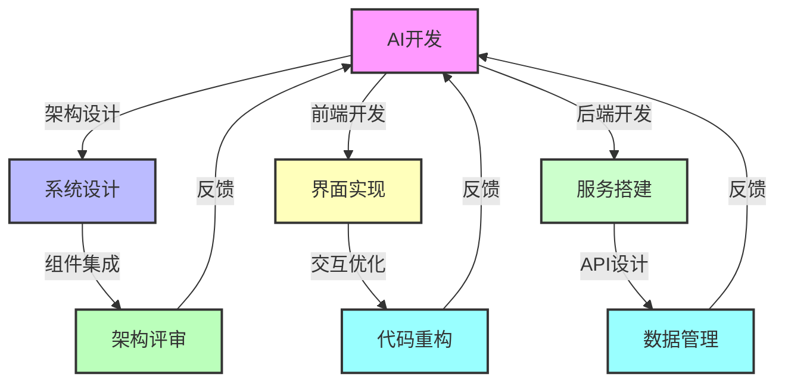
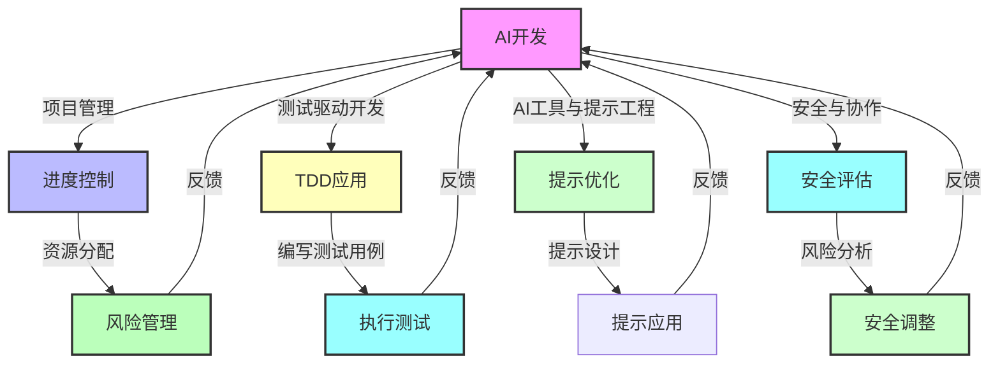
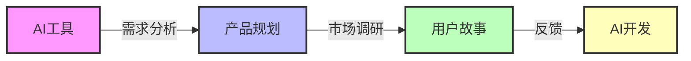
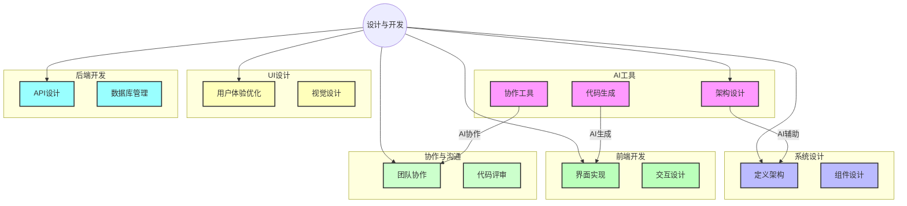
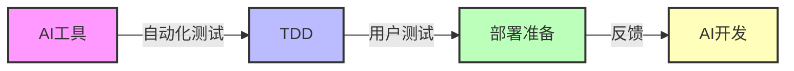
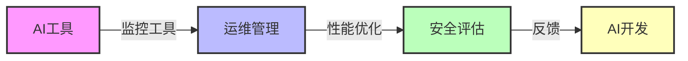
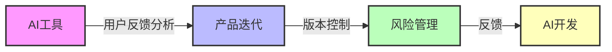

[返回目录](./README.md) | [下一章：通过测试用例引导AI开发](./第一章-通过测试用例引导AI开发.md)

# 前言

## 课程背景

随着 AI 辅助开发工具的快速发展，开发人员需要掌握更高级的技能来充分利用这些工具。本课程的高级部分将帮助你从一个普通的 AI 工具使用者，成长为能够精准控制和引导 AI 的专业开发者。

## 课程特点

### 开发者视角
不同于基础课程，高级课程完全从开发者的视角出发，教你如何更好地利用 AI 工具。我们不是简单地告诉你"如何使用工具"，而是教你"如何引导 AI 按照你的思路来工作"。

### 思维方式训练
本课程的核心是训练开发者的多维度思维能力：
- 测试思维：通过测试用例引导开发
- 架构思维：用系统设计驱动开发
- 产品思维：从用户需求出发开发
- 运维思维：考虑系统运行的全生命周期

### 实战项目驱动
每个章节都包含完整的实战项目，这些项目经过精心设计，能够帮助你：
- 掌握不同类型的开发方法
- 积累实际项目经验
- 提升问题解决能力

## 思维导图

以下是课程的思维导图，展示了各个章节的主题及其关系：

通过这幅思维导图，您可以直观地看到如何通过不同的视角（如测试、架构、产品、运维）来驱动AI辅助开发。这种多视角的方法不仅提高了开发效率，还提升了代码质量。

## 辅助开发流程图

### 产品与用户体验

### 技术实现与架构

### 项目管理与质量保障

通过这些流程图，您可以更清晰地看到不同视角和具体方法如何在AI开发中发挥作用，确保项目的顺利进行和高质量交付。

## 产品开发阶段流程图

### 需求分析与规划

### 设计与开发

### 测试与部署

### 运维与优化

### 反馈与迭代

通过这些流程图，您可以看到AI开发工具如何贯穿于产品开发的每一个阶段，并通过不同的方法和视角支持AI开发和文档编写。

## 多视角方法的引入

在本课程中，我们采用了多视角的方法来使用AI工具。这种方法的优势在于：
- **全面性**：从多个角度分析问题，确保解决方案的全面性和可靠性。
- **灵活性**：根据不同的开发需求，灵活调整AI工具的使用策略。
- **创新性**：通过不同视角的结合，激发创新思维，寻找更优的解决方案。

结合高级课程的内容，我们将详细说明每个视角在实际项目中的应用，并提供具体的案例或项目示例，展示如何通过这些视角来引导AI进行开发。

## 学习建议

### 前置知识
开始学习本课程前，你应该：
1. 完成基础课程的学习
2. 有一定的实际开发经验
3. 熟悉基本的 AI 辅助开发工具

### 学习方法
1. 动手实践：每个章节的示例代码都要亲自尝试
2. 思考总结：思考每种方法的适用场景
3. 举一反三：将学到的方法应用到自己的项目中

### 配套资源
- 示例代码仓库
- 项目模板
- 开发工具配置指南

## 课程目标

完成本课程后，你将能够：
1. 精准地引导 AI 完成开发任务
2. 提高代码质量和开发效率
3. 更好地处理复杂项目
4. 建立系统化的开发思维

让我们开始这段提升开发能力的进阶之旅吧！

---

[返回目录](./README.md) | [下一章：通过测试用例引导AI开发](./第一章-通过测试用例引导AI开发.md)
