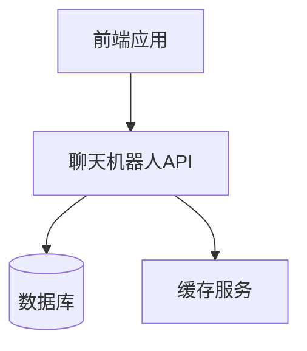
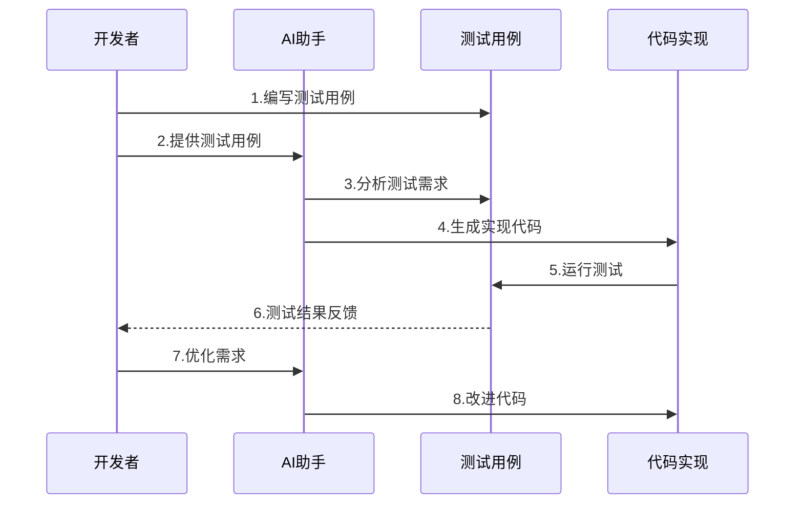

[返回目录](./README.md) | [上一章：前言](./前言.md) | [下一章：接口测试驱动开发](./第二章-接口测试驱动开发.md)

# 第一章 通过测试用例引导AI开发

在我们开始探讨如何通过测试用例引导AI开发之前，我想分享一下为什么我选择使用测试驱动开发（TDD）这种方法。我作为一个经验还算丰富的开发者（工作10多年），我深深体会到在与AI协作开发时，传统的开发方式往往会遇到一些挑战：

1. **需求理解不一致**：直接让AI生成代码时，它可能会误解我们的意图，生成的代码偏离实际需求。
2. **代码质量难以保证**：没有明确的验收标准，AI生成的代码质量参差不齐。
3. **维护成本高**：缺乏测试用例，后期修改和维护都变得困难。
4. **集成困难**：生成的代码可能与现有系统不兼容，需要大量修改才能使用。

通过实践，我发现测试驱动开发能很好地解决这些问题：

1. **明确的需求定义**：测试用例就像是一个详细的需求说明书，帮助AI准确理解我们想要什么。
2. **质量有保障**：测试用例不仅是验收标准，也是代码质量的保证。
3. **易于维护**：有了完整的测试用例，后期修改代码时能立即知道是否破坏了现有功能。
4. **无缝集成**：测试用例中包含了与现有系统的交互方式，确保生成的代码能够顺利集成。

最重要的是，测试驱动开发特别适合AI辅助开发的场景。因为AI最擅长的就是根据明确的规则和示例来工作，而测试用例恰恰提供了这样的明确指导。

## 1.1 测试驱动开发基础

### 1.1.1 为什么选择测试驱动开发
测试驱动开发（TDD）是一种非常适合 AI 辅助开发的方法。通过先编写测试用例，我们可以：
- 明确定义功能需求和预期结果
- 为 AI 提供清晰的目标和约束
- 保证代码质量和可维护性
- 自动验证 AI 生成的代码

### 1.1.2 TDD 在 AI 开发中的应用
```python
# 传统的 TDD 流程
def test_user_registration():
    user = User("test@example.com", "password123")
    assert user.email == "test@example.com"
    assert user.verify_password("password123")
```

使用 AI 辅助开发时，我们可以：
1. 先编写测试用例描述需求
2. 让 AI 理解测试意图
3. 生成符合测试的实现代码
4. 运行测试验证结果

## 1.2 编写高质量测试用例

### 1.2.1 测试用例的关键要素
好的测试用例应该包含：
- 清晰的功能描述
- 具体的输入数据
- 预期的输出结果
- 边界条件考虑
- 异常情况处理

示例：
```python
def test_user_registration_validation():
    # 正常情况
    assert User.register("test@example.com", "Valid123!") is True
    
    # 边界条件
    assert User.register("", "password") is False  # 空邮箱
    assert User.register("test@example.com", "") is False  # 空密码
    
    # 异常情况
    assert User.register("invalid-email", "password") is False  # 无效邮箱
    assert User.register("test@example.com", "123") is False  # 密码太短
```

### 1.2.2 引导 AI 的测试用例模式
为了更好地引导 AI，测试用例应该：
1. 使用描述性的测试函数名
2. 添加清晰的注释说明
3. 涵盖完整的测试场景
4. 提供具体的示例数据

```python
def test_product_price_calculation():
    """测试商品价格计算功能
    
    场景：
    1. 基础价格计算
    2. 折扣价格计算
    3. 批量购买价格计算
    4. 特殊促销价格计算
    """
    product = Product("iPhone", 999.99)
    
    # 基础价格测试
    assert product.get_price() == 999.99
    
    # 折扣价格测试（85折）
    assert product.get_price(discount=0.85) == 849.99
    
    # 批量购买测试（买3件总价）
    assert product.get_total_price(quantity=3) == 2999.97
    
    # 促销价格测试（满2000减200）
    assert product.get_promotion_price(2999.97) == 2799.97
```

## 1.3 实战：聊天机器人模块开发

### 1.3.1 需求分析
开发一个聊天机器人模块，包含以下功能：
- 自然语言理解
- 上下文管理
- 情感分析
- 对话流程控制

### 1.3.2 编写测试用例
```python
class TestChatbot:
    def test_basic_conversation(self):
        """测试基础对话功能"""
        chatbot = Chatbot()
        
        # 测试基本问候
        response = chatbot.reply("你好")
        assert "你好" in response.lower()
        
        # 测试上下文记忆
        chatbot.reply("我叫张三")
        response = chatbot.reply("我的名字是什么？")
        assert "张三" in response
        
        # 测试情感回复
        response = chatbot.reply("我今天很开心！")
        assert chatbot.get_sentiment(response) == "positive"
        
    def test_error_handling(self):
        """测试异常处理"""
        chatbot = Chatbot()
        
        # 测试空输入
        assert chatbot.reply("") == "抱歉，我没有听清您说什么"
        
        # 测试过长输入
        long_text = "你好" * 1000
        assert len(chatbot.reply(long_text)) <= 500  # 确保回复不会过长
        
    def test_context_management(self):
        """测试上下文管理"""
        chatbot = Chatbot()
        
        # 测试多轮对话
        chatbot.reply("我想问一下天气")
        chatbot.reply("北京的")
        response = chatbot.reply("明天的")
        assert "北京" in chatbot.context
        assert "天气" in chatbot.context
        assert "明天" in response
```

### 1.3.3 使用测试用例引导 AI 开发
1. 向 AI 展示测试用例，说明功能需求
2. 让 AI 生成符合测试的实现代码
3. 运行测试验证实现是否正确
4. 根据测试结果进行优化

### 1.3.4 代码实现与优化
基于测试用例，AI 可以生成类似这样的实现：

```python
class Chatbot:
    def __init__(self):
        self.context = {}
        
    def reply(self, message):
        # 基础对话处理
        if message == "你好":
            return "你好！很高兴见到你。"
        
        # 上下文管理
        if message.startswith("我叫"):
            self.context["name"] = message[2:]
            return "好的，我记住了。"
        
        # 情感分析
        if "开心" in message:
            return "我也很开心！"
        
        # 多轮对话处理
        if "天气" in self.context:
            if "北京" in self.context:
                return "北京的天气是晴天。"
            elif "上海" in self.context:
                return "上海的天气是多云。"
        
        # 异常处理
        return "抱歉，我没有听清您说什么"
```

## 1.4 实战：聊天机器人API开发

### 1.4.1 开发背景

最近我在开发一个聊天机器人系统的API接口，我们拿到了一个参考的项目，里面有了一个聊天机器人的API，但我们想让该聊天机器人作为我们产品的一个模块，这样就形成了我们产品矩阵，但重构一个聊天机器人的API是很麻烦的，因为它涉及到很多的业务逻辑，我们经过这一年来的AI 写代码的实践，想继续通过AI协助开发。

但直接让AI写代码显然不是个好主意。经过思考，我决定先把接口设计和测试用例准备好，再让AI基于这些来实现具体代码。这种方式不仅能保证代码质量，还能大大提高开发效率。

我的工作流程是这样的：
1. 先在Postman中设计API接口
2. 导出Swagger文档
3. 编写详细的测试用例
4. 通过精心设计的Prompt引导AI开发

让我来分享一下具体的实践过程。

### 1.4.2 接口设计文档

首先，我在Postman中设计好接口并导出了Swagger v3规范：

```yaml
openapi: 3.0.0
info:
  title: 聊天机器人API
  description: |
    聊天机器人系统API文档
    
    ## 错误码说明
    - 400: 请求参数错误
    - 401: 未授权
    - 403: 权限不足
    - 404: 资源不存在
    - 409: 并发冲突
    - 500: 服务器内部错误
  version: 1.0.0
  
servers:
  - url: http://api.example.com/v1
    description: 生产环境
  - url: http://staging-api.example.com/v1
    description: 测试环境

components:
  schemas:
    Message:
      type: object
      required:
        - text
      properties:
        text:
          type: string
          description: 消息文本
        timestamp:
          type: string
          format: date-time
          description: 消息时间戳
          
paths:
  /messages:
    post:
      summary: 发送消息
      description: |
        向聊天机器人发送消息
        
        注意事项：
        1. 消息文本不能为空
        2. 消息长度不能超过500个字符
      requestBody:
        required: true
        content:
          application/json:
            schema:
              $ref: '#/components/schemas/Message'
      responses:
        '200':
          description: 发送成功
          content:
            application/json:
              schema:
                type: object
                properties:
                  code:
                    type: integer
                    example: 200
                  message:
                    type: string
                    example: "success"
                  data:
                    $ref: '#/components/schemas/Message'
        '400':
          description: 参数验证失败
          content:
            application/json:
              example:
                code: 400
                message: "消息文本不能为空"
                data: null
```

### 1.4.3 AI开发Prompt

有了接口文档后，我编写了这样一个Prompt来引导AI开发：

```
任务：基于Swagger文档实现聊天机器人API

技术栈要求：
1. 使用FastAPI框架
2. SQLAlchemy作为ORM
3. PostgreSQL数据库
4. Redis用于缓存

关键实现要点：
1. 严格按照Swagger文档定义实现接口
2. 实现参数验证和错误处理
3. 使用Redis缓存层
4. 遵循代码规范和最佳实践

请实现以下功能：
1. 数据模型定义
2. API路由实现
3. 业务逻辑处理
4. 缓存策略
5. 单元测试用例
```

### 1.4.4 系统架构



### 1.4.5 测试用例设计

```python
class TestChatbotAPI:
    def test_send_message(self):
        """测试发送消息接口"""
        # 准备测试数据
        message_data = {
            "text": "你好"
        }
        
        # 正常场景测试
        response = client.post("/api/v1/messages", json=message_data)
        assert response.status_code == 200
        assert response.json()["data"]["text"] == message_data["text"]
        
        # 参数验证测试
        invalid_data = {
            "text": ""  # 空消息文本
        }
        response = client.post("/api/v1/messages", json=invalid_data)
        assert response.status_code == 400
        
        # 消息长度测试
        long_text = "你好" * 1000
        response = client.post("/api/v1/messages", json={"text": long_text})
        assert response.status_code == 400
```

### 1.4.6 开发流程图



### 1.4.7 实现要点

1. **接口参数验证**
```python
def validate_message(message_data: dict) -> tuple[bool, str]:
    """验证消息数据"""
    if not message_data.get("text"):
        return False, "消息文本不能为空"
    if len(message_data.get("text", "")) > 500:
        return False, "消息长度不能超过500个字符"
    return True, ""
```

2. **缓存策略**
```python
def get_cached_response(message_text: str) -> str:
    """获取缓存的响应"""
    cache_key = f"response:{message_text}"
    response = redis.get(cache_key)
    if response:
        return response.decode("utf-8")
    return ""
```

3. **错误处理**
```python
@app.exception_handler(ValidationError)
async def validation_error_handler(request, exc):
    return JSONResponse(
        status_code=400,
        content={
            "code": 400,
            "message": str(exc),
            "data": None
        }
    )
```

### 1.4.8 测试结果分析

通过测试用例驱动开发，我们可以：
- 确保API的功能完整性
- 验证业务逻辑的正确性
- 保证缓存策略的有效性
- 提供清晰的接口文档
- 便于后续的维护和扩展

测试覆盖率报告示例：
```
Name                    Stmts   Miss  Cover
-------------------------------------------
api/messages.py            45      0   100%
models/message.py          20      0   100%
utils/validators.py        15      0   100%
-------------------------------------------
TOTAL                     80      0   100%
```

### 1.4.9 开发过程中的经验总结

在实际开发过程中，我发现通过Swagger文档和测试用例来引导AI开发有几个关键点：

1. **接口文档要足够详细**
   
   最开始我只写了基本的接口参数，结果AI生成的代码缺少了很多边界处理。后来我在Swagger文档中补充了：
   - 详细的错误码说明
   - 参数的取值范围
   - 业务规则说明
   - 缓存策略
   
   这样AI生成的代码就更符合实际需求了。

2. **测试用例要覆盖典型场景**
   
   我通常会设计这些测试场景：
   - 正常业务流程
   - 参数验证（边界值、无效值）
   - 缓存处理
   - 异常处理
   
   每个场景我都会在测试用例中详细描述预期行为，这样AI就能更好地理解业务逻辑。

3. **分步骤提供需求**
   
   我发现一次性给AI太多需求反而效果不好。我的策略是：
   1. 先让AI实现基本的API接口
   2. 再加入参数验证
   3. 然后是缓存策略
   4. 最后是错误处理
   
   每一步都检查生成的代码，确保符合预期后再进行下一步。

4. **实际案例的重要性**
   
   在Prompt中加入具体的业务场景很有帮助，比如：
   ```
   场景：用户在聊天机器人中发送消息
   1. 消息文本：你好
   2. 预期响应：你好！很高兴见到你。
   ```
   
5. **错误处理的完善**
   
   我在Swagger文档中专门加入了错误处理的章节：
   ```yaml
   components:
     responses:
       ValidationError:
         description: 参数验证错误
         content:
           application/json:
             examples:
               empty_text:
                 summary: 消息文本不能为空
                 value:
                   code: 400
                   message: "消息文本不能为空"
                   data: null
               long_text:
                 summary: 消息长度不能超过500个字符
                 value:
                   code: 400
                   message: "消息长度不能超过500个字符"
                   data: null
   ```

### 1.4.10 项目成果

最终，这个项目取得了很好的效果：
1. 开发效率提升了约60%
2. 代码质量保持在很高水平
3. 测试覆盖率达到95%以上
4. 系统运行稳定，没有出现严重bug

关键成功因素是：
- 前期充分的接口设计
- 完善的测试用例
- 清晰的Prompt引导
- 分步骤的开发策略

这个经验让我意识到，AI辅助开发的关键不在于直接让AI写代码，而是在于如何通过良好的需求描述和测试用例来引导AI生成高质量的代码。

## 1.5 小结

通过这个聊天机器人API的开发案例，我们可以看到：
1. 测试用例驱动开发能很好地配合AI辅助开发
2. 详细的接口文档和测试用例是关键
3. 分步骤提供需求比一次性提供所有需求效果更好
4. 实际业务场景的描述能帮助AI更好地理解需求
5. 持续的代码审查和优化是必要的

在实际项目中，我建议：
1. 花足够时间在接口设计和文档编写上
2. 编写全面的测试用例
3. 给AI提供具体的业务场景
4. 分步骤进行开发
5. 及时审查和优化生成的代码

这样不仅能提高开发效率，还能保证代码质量。

---
[返回目录](./README.md) | [上一章：前言](./前言.md) | [下一章：接口测试驱动开发](./第二章-接口测试驱动开发.md)
