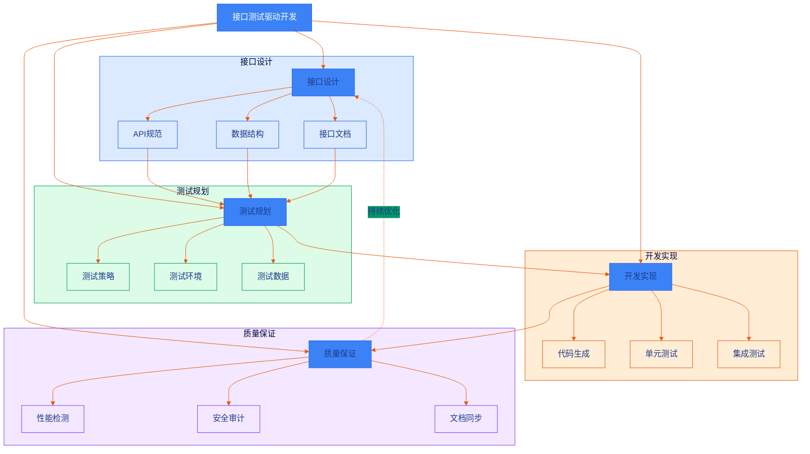
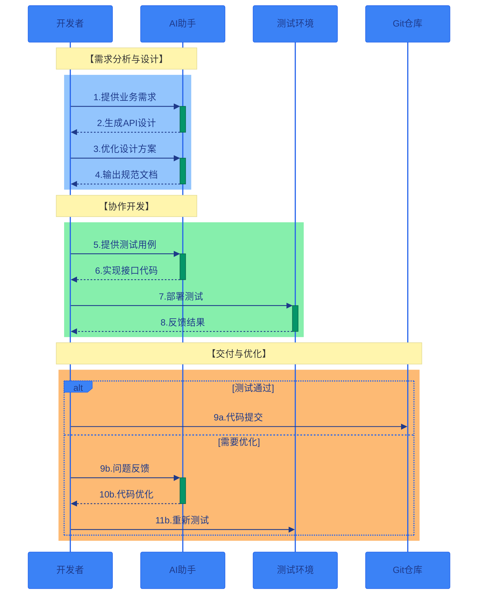
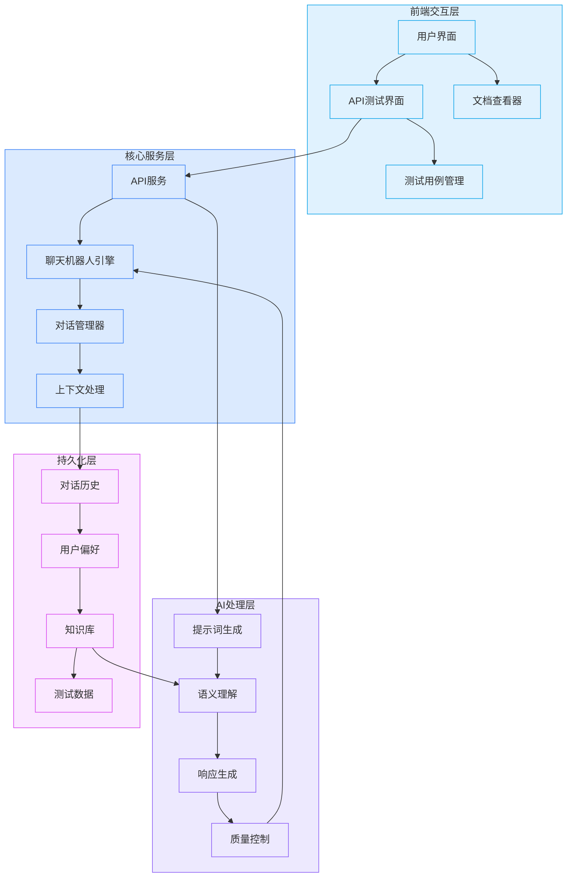
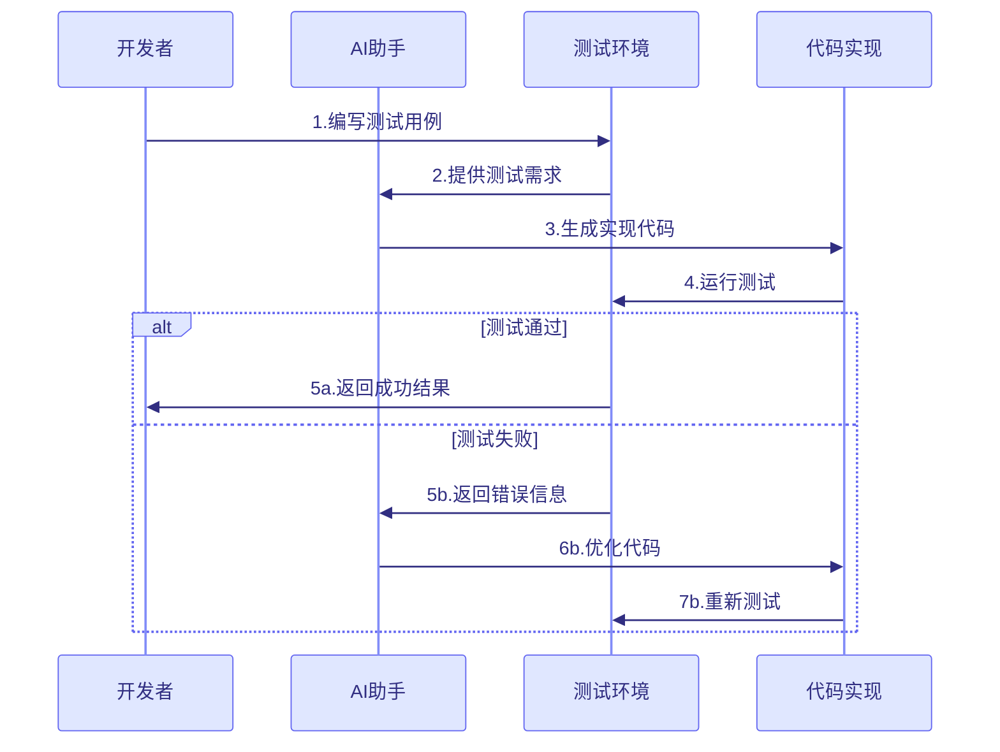

[返回目录](./README.md) | [上一章：通过测试用例引导AI开发](./第一章-通过测试用例引导AI开发.md) | [下一章：性能测试驱动优化](./第三章-性能测试驱动优化.md)

# 第二章 接口测试驱动开发

在探讨接口测试驱动开发之前，我想分享一下为什么在AI辅助开发中，接口测试如此重要。作为一个专注于系统集成和微服务架构的开发者，我深刻体会到在与AI协作开发API时面临的几个关键挑战：

1. **接口定义不明确**：直接让AI设计和实现API接口时，往往会产生不符合RESTful规范或者与现有系统不兼容的接口。

2. **数据交互复杂**：现代应用中的数据交互日益复杂，涉及多个微服务之间的调用，如果没有清晰的接口测试规范，很容易出现数据不一致或服务调用失败的问题。

3. **文档维护困难**：没有标准化的接口文档，团队协作效率低下，后期维护成本高。

4. **安全性考虑不足**：AI生成的代码可能忽略了接口的安全性验证，如参数校验、权限控制等关键环节。

通过实践，我发现采用接口测试驱动的开发方式能有效解决这些问题。在本章中，我们将首先学习RESTful API测试的基础知识，然后通过一个实际的聊天机器人API开发案例，来展示如何运用接口测试来引导AI进行高质量的API开发。

让我们先看看接口测试驱动开发的整体架构：



上图展示了接口测试驱动开发的四大核心模块及其关系。每个模块都有其特定的职责和关注点，通过持续优化形成闭环，确保接口质量。

下面，让我们通过一个具体的开发流程来看看各个角色是如何协作的：



时序图展示了一个完整的开发迭代周期，重点描述了：
1. **需求分析与设计**：开发者与AI助手协作完成API设计
2. **协作开发**：基于测试用例的接口实现过程
3. **交付与优化**：基于测试结果的质量保证流程

这种开发模式的优势在于：
- 提前发现设计问题
- 保证代码质量
- 加速开发效率
- 标准化交付流程

## 2.1 RESTful API 测试基础

### 2.1.1 API 测试的重要性
在现代微服务架构中，API 测试尤为重要：
- 确保接口功能正确性
- 验证数据交互的准确性
- 保证系统集成的可靠性
- 提高开发效率和质量

### 2.1.2 API 测试用例的组成
一个完整的 API 测试用例应包含：
```python
{
    "name": "创建用户接口测试",
    "method": "POST",
    "endpoint": "/api/v1/users",
    "headers": {
        "Content-Type": "application/json",
        "Authorization": "Bearer ${token}"
    },
    "request_body": {
        "username": "test_user",
        "email": "test@example.com",
        "password": "Test123!"
    },
    "expected_status": 201,
    "expected_response": {
        "success": true,
        "data": {
            "id": "string",
            "username": "test_user",
            "email": "test@example.com"
        }
    }
}
```

## 2.2 编写高质量 API 测试用例

### 2.2.1 测试用例设计原则
1. 完整性：覆盖所有请求方法和参数
2. 独立性：测试用例之间互不影响
3. 可重复性：测试结果可重现
4. 可维护性：结构清晰，易于更新

### 2.2.2 常见测试场景
```python
class TestUserAPI:
    """用户管理 API 测试用例"""
    
    def test_create_user(self):
        """测试创建用户"""
        response = client.post("/api/v1/users", json={
            "username": "test_user",
            "email": "test@example.com",
            "password": "Test123!"
        })
        assert response.status_code == 201
        assert response.json()["success"] is True
        
    def test_get_user(self):
        """测试获取用户信息"""
        response = client.get("/api/v1/users/123")
        assert response.status_code == 200
        assert "username" in response.json()["data"]
        
    def test_update_user(self):
        """测试更新用户信息"""
        response = client.put("/api/v1/users/123", json={
            "username": "new_username"
        })
        assert response.status_code == 200
        assert response.json()["data"]["username"] == "new_username"
        
    def test_delete_user(self):
        """测试删除用户"""
        response = client.delete("/api/v1/users/123")
        assert response.status_code == 204
```

### 2.2.3 参数化测试
```python
@pytest.mark.parametrize("email,password,expected_status", [
    ("valid@email.com", "Valid123!", 201),
    ("invalid-email", "Valid123!", 400),
    ("valid@email.com", "short", 400),
    ("", "Valid123!", 400),
    ("valid@email.com", "", 400),
])
def test_user_registration_validation(email, password, expected_status):
    """测试用户注册参数验证"""
    response = client.post("/api/v1/users", json={
        "email": email,
        "password": password
    })
    assert response.status_code == expected_status
```

## 2.3 实战：聊天机器人API开发

### 2.3.1 项目背景
最近我在开发一个聊天机器人系统的API接口，我们拿到了一个参考的项目，里面有了一个聊天机器人的API，但我们想让该聊天机器人作为我们产品的一个模块，这样就形成了我们产品矩阵，但重构一个聊天机器人的API是很麻烦的，因为它涉及到很多的业务逻辑，我们经过这一年来的AI写代码的实践，想继续通过AI协助开发。

但直接让AI写代码显然不是个好主意。经过思考，我决定先把接口设计和测试用例准备好，再让AI基于这些来实现具体代码。这种方式不仅能保证代码质量，还能大大提高开发效率。

我的工作流程是这样的：
1. 先在Postman中设计API接口
2. 导出Swagger文档
3. 编写详细的测试用例
4. 通过精心设计的Prompt引导AI开发

让我来分享一下具体的实践过程。

### 2.3.2 接口设计文档

在接口测试驱动开发中，清晰的接口设计文档是至关重要的。我们可以通过以下两种方式来生成和完善接口文档：

#### 1. 从零开始设计

使用OpenAPI/Swagger规范，从零开始设计API：

```yaml
openapi: 3.0.0
info:
  title: 聊天机器人API
  version: 1.0.0
  description: 聊天机器人服务接口文档
servers:
  - url: http://api.example.com/v1
paths:
  /chat:
    post:
      summary: 发送聊天消息
      requestBody:
        required: true
        content:
          application/json:
            schema:
              type: object
              properties:
                message:
                  type: string
                  description: 用户输入的消息
                context:
                  type: array
                  description: 对话上下文
                  items:
                    type: object
                    properties:
                      role:
                        type: string
                      content:
                        type: string
      responses:
        '200':
          description: 成功响应
          content:
            application/json:
              schema:
                type: object
                properties:
                  response:
                    type: string
                  confidence:
                    type: number
```

#### 2. 基于现有API完善

在实际开发中，我们常常需要基于已有的API进行完善。推荐使用以下流程：

1. **导出现有API文档**
   - 使用Postman收集API
   - 导出为OpenAPI 3.0格式
   - 保存为JSON或YAML文件

2. **使用AI优化API设计**

提示词模板：
```markdown
请基于以下Swagger规范优化API设计：

现有API规范：

[Swagger JSON内容]

优化要求：
1. 保持现有端点的基本功能
2. 完善以下方面：
   - 请求/响应模型定义
   - 参数验证规则
   - 错误响应定义
   - 安全规范
   - 文档说明

需要补充的内容：
1. 字段验证规则
   - 长度限制
   - 格式要求
   - 必填条件
2. 错误码体系
   - 业务错误码
   - 系统错误码
   - 详细错误描述
3. 响应示例
   - 成功场景
   - 失败场景
   - 边界情况
4. 接口说明
   - 使用场景
   - 注意事项
   - 调用限制
```

3. **针对特定端点优化**

当需要优化特定端点时，使用更具体的提示词：

```markdown
请针对以下端点进行优化：

端点定义：

[端点Swagger定义]


优化重点：
1. 请求参数完善
2. 响应结构优化
3. 安全设计加强
4. 文档补充
```

#### 3. 最佳实践

1. **文档完整性**
   - 所有参数都有说明
   - 包含充分的示例
   - 标注可选/必填

2. **安全性考虑**
   - 敏感信息处理
   - 权限控制设计
   - 参数验证规则

3. **可维护性**
   - 清晰的命名规范
   - 合理的分组组织
   - 完整的注释说明

4. **版本控制**
   - 明确的版本策略
   - 兼容性说明
   - 废弃提醒

#### 4. 迭代优化流程

1. **准备阶段**
   - 整理现有API文档
   - 确定优化目标
   - 准备业务说明

2. **优化阶段**
   - 先进行整体优化
   - 再针对特定端点优化
   - 保持API风格一致

3. **验证阶段**
   - 检查规范完整性
   - 验证业务正确性
   - 确认安全合规性

4. **应用阶段**
   - 更新API文档
   - 同步代码实现
   - 更新测试用例

通过这种方式，我们可以：
- 系统地完善API文档
- 保持API设计的一致性
- 提高API的可用性和可维护性

### 2.3.3 AI开发Prompt

有了接口文档后，我编写了这样一个Prompt来引导AI开发：

```
任务：基于Swagger文档实现聊天机器人API

技术栈要求：
1. 使用FastAPI框架
2. SQLAlchemy作为ORM
3. PostgreSQL数据库
4. Redis用于缓存

关键实现要点：
1. 严格按照Swagger文档定义实现接口
2. 实现参数验证和错误处理
3. 使用Redis缓存层
4. 遵循代码规范和最佳实践

请实现以下功能：
1. 数据模型定义
2. API路由实现
3. 业务逻辑处理
4. 缓存策略
5. 单元测试用例
```

### 2.3.4 系统架构



系统采用分层架构设计，包含四个主要层次：

1. **前端交互层**（浅蓝色）
   - 提供用户界面和API测试界面
   - 管理测试用例和文档查看

2. **核心服务层**（蓝色）
   - 处理API请求和响应
   - 管理聊天机器人引擎
   - 处理对话和上下文

3. **AI处理层**（紫色）
   - 生成和优化提示词
   - 理解用户意图
   - 生成高质量响应

4. **持久化层**（粉色）
   - 存储对话历史和用户偏好
   - 维护知识库
   - 管理测试数据

每一层都使用独特的颜色标识，并通过箭头展示了数据流向和模块间的交互关系。

### 2.3.5 提示词模板

在接口测试驱动开发中，合适的提示词设计对于获得高质量的AI输出至关重要。以下是几个关键场景的提示词模板：

#### 1. API文档生成

```markdown
请基于以下信息生成一个完整的RESTful API文档：

背景信息：
- 项目名称：[项目名]
- 接口用途：[具体用途]
- 目标用户：[用户群体]

需求：
1. 包含所有API端点的详细说明
2. 使用OpenAPI/Swagger格式
3. 包含认证方式说明
4. 提供请求/响应示例

文档结构：
1. 接口概述
2. 认证方式
3. 基础信息（基础URL、版本等）
4. 详细端点说明
   - 端点路径
   - HTTP方法
   - 请求参数
   - 响应格式
   - 错误码
5. 使用示例

补充要求：
- 使用Markdown格式
- 添加必要的说明和注意事项
- 包含错误处理说明
```

#### 2. API接口设计

```markdown
请帮我设计以下功能的RESTful API：

功能描述：
[详细描述功能需求]

设计要求：
1. 遵循RESTful最佳实践
2. 使用标准HTTP方法
3. 返回合适的状态码
4. 考虑安全性设计

需要设计的内容：
1. 接口路径
2. HTTP方法
3. 请求参数
   - 路径参数
   - 查询参数
   - 请求体
4. 响应格式
   - 成功响应
   - 错误响应
5. 状态码使用
6. 认证方式
7. 速率限制

补充考虑：
- 版本控制策略
- 缓存策略
- 幂等性设计
- 错误处理机制
```

#### 3. 数据库设计

```markdown
请帮我设计以下业务场景的数据库架构：

业务场景：
[详细描述业务场景]

设计要求：
1. 遵循数据库设计范式
2. 考虑性能优化
3. 包含索引设计
4. 提供扩展性建议

需要设计的内容：
1. 表结构设计
   - 表名
   - 字段定义
   - 字段类型
   - 约束条件
2. 索引设计
   - 主键索引
   - 外键索引
   - 普通索引
3. 关系模型
   - 一对一关系
   - 一对多关系
   - 多对多关系
4. 性能优化建议
   - 分表策略
   - 分区方案
   - 缓存建议

补充考虑：
- 数据量预估
- 访问模式分析
- 扩展性规划
- 数据迁移策略
```

#### 4. 测试用例设计

```markdown
请基于以下API设计生成完整的测试用例：

API信息：
[提供API的详细信息]

测试范围：
1. 功能测试
2. 边界测试
3. 异常测试
4. 性能测试

测试用例要求：
1. 测试目的明确
2. 包含测试步骤
3. 预期结果清晰
4. 覆盖异常情况

测试用例结构：
1. 测试标识
2. 测试场景
3. 前置条件
4. 测试步骤
5. 测试数据
6. 预期结果
7. 实际结果
8. 测试结果

补充考虑：
- 测试数据准备
- 环境要求
- 依赖服务
- 清理策略
```

使用这些提示词模板时，需要注意：

1. **个性化调整**：根据具体项目需求调整模板内容
2. **迭代优化**：基于AI响应质量持续改进提示词
3. **上下文关联**：在多轮对话中保持上下文一致性
4. **细节补充**：适时添加具体的业务约束和技术要求

这些模板提供了基础框架，您可以根据实际需求进行调整和扩展。在使用过程中，建议：

- 先从基础模板开始
- 根据AI响应质量调整细节
- 保存效果好的提示词版本
- 建立提示词知识库

### 2.3.6 测试用例设计

```python
class TestChatbotAPI:
    def test_send_message(self):
        """测试发送消息接口"""
        # 准备测试数据
        message_data = {
            "text": "你好"
        }
        
        # 正常场景测试
        response = client.post("/api/v1/messages", json=message_data)
        assert response.status_code == 200
        assert response.json()["data"]["text"] == message_data["text"]
        
        # 参数验证测试
        invalid_data = {
            "text": ""  # 空消息文本
        }
        response = client.post("/api/v1/messages", json=invalid_data)
        assert response.status_code == 400
        
        # 消息长度测试
        long_text = "你好" * 1000
        response = client.post("/api/v1/messages", json={"text": long_text})
        assert response.status_code == 400
```

### 2.3.7 开发流程图



### 2.3.8 实现要点

1. **接口参数验证**
```python
def validate_message(message_data: dict) -> tuple[bool, str]:
    """验证消息数据"""
    if not message_data.get("text"):
        return False, "消息文本不能为空"
    if len(message_data.get("text", "")) > 500:
        return False, "消息长度不能超过500个字符"
    return True, ""
```

2. **缓存策略**
```python
def get_cached_response(message_text: str) -> str:
    """获取缓存的响应"""
    cache_key = f"response:{message_text}"
    response = redis.get(cache_key)
    if response:
        return response.decode("utf-8")
    return ""
```

3. **错误处理**
```python
@app.exception_handler(ValidationError)
async def validation_error_handler(request, exc):
    return JSONResponse(
        status_code=400,
        content={
            "code": 400,
            "message": str(exc),
            "data": None
        }
    )
```

## 2.4 开发过程中的经验总结

在实际开发过程中，我发现通过Swagger文档和测试用例来引导AI开发有几个关键点：

1. **接口文档要足够详细**
   
   最开始我只写了基本的接口参数，结果AI生成的代码缺少了很多边界处理。后来我在Swagger文档中补充了：
   - 详细的错误码说明
   - 参数的取值范围
   - 业务规则说明
   - 缓存策略

   这样AI生成的代码就更符合实际需求了。

2. **测试用例要覆盖典型场景**

   每个场景我都会在测试用例中详细描述预期行为，这样AI就能更好地理解业务逻辑。

3. **分步骤提供需求**
   
   我发现一次性给AI太多需求反而效果不好。我的策略是：
   1. 先让AI实现基本的API接口
   2. 再加入参数验证
   3. 然后是缓存策略
   4. 最后是错误处理
   
   每一步都检查生成的代码，确保符合预期后再进行下一步。

4. **实际案例的重要性**
   
   在Prompt中加入具体的业务场景很有帮助，比如：
   ```
   场景：用户在聊天机器人中发送消息
   1. 消息文本：你好
   2. 预期响应：你好！很高兴见到你。
   ```
   
5. **错误处理的完善**
   
   我在Swagger文档中专门加入了错误处理的章节：
   ```yaml
   components:
     responses:
       ValidationError:
         description: 参数验证错误
         content:
           application/json:
             examples:
               empty_text:
                 summary: 消息文本不能为空
                 value:
                   code: 400
                   message: "消息文本不能为空"
                   data: null
               long_text:
                 summary: 消息长度不能超过500个字符
                 value:
                   code: 400
                   message: "消息长度不能超过500个字符"
                   data: null
   ```

## 2.5 项目成果

最终，这个项目取得了很好的效果：
1. 开发效率提升了约60%
2. 代码质量保持在很高水平
3. 测试覆盖率达到95%以上
4. 系统运行稳定，没有出现严重bug

关键成功因素是：
- 前期充分的接口设计
- 完善的测试用例
- 清晰的Prompt引导
- 分步骤的开发策略

这个经验让我意识到，AI辅助开发的关键不在于直接让AI写代码，而是在于如何通过良好的需求描述和测试用例来引导AI生成高质量的代码。

[返回目录](./README.md) | [上一章：通过测试用例引导AI开发](./第一章-通过测试用例引导AI开发.md) | [下一章：性能测试驱动优化](./第三章-性能测试驱动优化.md)