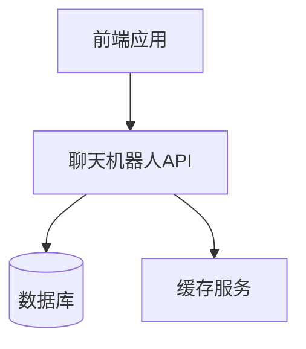
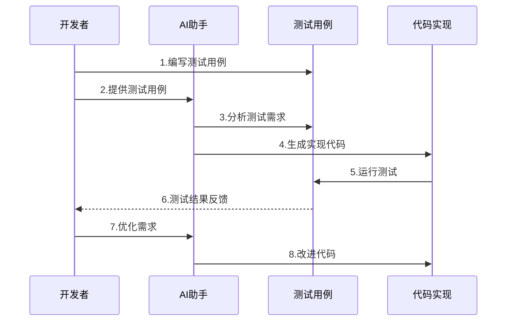

[返回目录](./README.md) | [上一章：通过测试用例引导AI开发](./第一章-通过测试用例引导AI开发.md) | [下一章：性能测试驱动优化](./第三章-性能测试驱动优化.md)

# 第二章 接口测试驱动开发

在探讨接口测试驱动开发之前，我想分享一下为什么在AI辅助开发中，接口测试如此重要。作为一个专注于系统集成和微服务架构的开发者，我深刻体会到在与AI协作开发API时面临的几个关键挑战：

1. **接口定义不明确**：直接让AI设计和实现API接口时，往往会产生不符合RESTful规范或者与现有系统不兼容的接口。

2. **数据交互复杂**：现代应用中的数据交互日益复杂，涉及多个微服务之间的调用，如果没有清晰的接口测试规范，很容易出现数据不一致或服务调用失败的问题。

3. **文档维护困难**：没有标准化的接口文档，团队协作效率低下，后期维护成本高。

4. **安全性考虑不足**：AI生成的代码可能忽略了接口的安全性验证，如参数校验、权限控制等关键环节。

通过实践，我发现采用接口测试驱动的开发方式能有效解决这些问题。在本章中，我们将首先学习RESTful API测试的基础知识，然后通过一个实际的聊天机器人API开发案例，来展示如何运用接口测试来引导AI进行高质量的API开发。

## 2.1 RESTful API 测试基础

### 2.1.1 API 测试的重要性
在现代微服务架构中，API 测试尤为重要：
- 确保接口功能正确性
- 验证数据交互的准确性
- 保证系统集成的可靠性
- 提高开发效率和质量

### 2.1.2 API 测试用例的组成
一个完整的 API 测试用例应包含：
```python
{
    "name": "创建用户接口测试",
    "method": "POST",
    "endpoint": "/api/v1/users",
    "headers": {
        "Content-Type": "application/json",
        "Authorization": "Bearer ${token}"
    },
    "request_body": {
        "username": "test_user",
        "email": "test@example.com",
        "password": "Test123!"
    },
    "expected_status": 201,
    "expected_response": {
        "success": true,
        "data": {
            "id": "string",
            "username": "test_user",
            "email": "test@example.com"
        }
    }
}
```

## 2.2 编写高质量 API 测试用例

### 2.2.1 测试用例设计原则
1. 完整性：覆盖所有请求方法和参数
2. 独立性：测试用例之间互不影响
3. 可重复性：测试结果可重现
4. 可维护性：结构清晰，易于更新

### 2.2.2 常见测试场景
```python
class TestUserAPI:
    """用户管理 API 测试用例"""
    
    def test_create_user(self):
        """测试创建用户"""
        response = client.post("/api/v1/users", json={
            "username": "test_user",
            "email": "test@example.com",
            "password": "Test123!"
        })
        assert response.status_code == 201
        assert response.json()["success"] is True
        
    def test_get_user(self):
        """测试获取用户信息"""
        response = client.get("/api/v1/users/123")
        assert response.status_code == 200
        assert "username" in response.json()["data"]
        
    def test_update_user(self):
        """测试更新用户信息"""
        response = client.put("/api/v1/users/123", json={
            "username": "new_username"
        })
        assert response.status_code == 200
        assert response.json()["data"]["username"] == "new_username"
        
    def test_delete_user(self):
        """测试删除用户"""
        response = client.delete("/api/v1/users/123")
        assert response.status_code == 204
```

### 2.2.3 参数化测试
```python
@pytest.mark.parametrize("email,password,expected_status", [
    ("valid@email.com", "Valid123!", 201),
    ("invalid-email", "Valid123!", 400),
    ("valid@email.com", "short", 400),
    ("", "Valid123!", 400),
    ("valid@email.com", "", 400),
])
def test_user_registration_validation(email, password, expected_status):
    """测试用户注册参数验证"""
    response = client.post("/api/v1/users", json={
        "email": email,
        "password": password
    })
    assert response.status_code == expected_status
```

## 2.3 实战：聊天机器人API开发

### 2.3.1 项目背景
最近我在开发一个聊天机器人系统的API接口，我们拿到了一个参考的项目，里面有了一个聊天机器人的API，但我们想让该聊天机器人作为我们产品的一个模块，这样就形成了我们产品矩阵，但重构一个聊天机器人的API是很麻烦的，因为它涉及到很多的业务逻辑，我们经过这一年来的AI写代码的实践，想继续通过AI协助开发。

但直接让AI写代码显然不是个好主意。经过思考，我决定先把接口设计和测试用例准备好，再让AI基于这些来实现具体代码。这种方式不仅能保证代码质量，还能大大提高开发效率。

我的工作流程是这样的：
1. 先在Postman中设计API接口
2. 导出Swagger文档
3. 编写详细的测试用例
4. 通过精心设计的Prompt引导AI开发

让我来分享一下具体的实践过程。

### 2.3.2 接口设计文档
首先，我在Postman中设计好接口并导出了Swagger v3规范：

```yaml
openapi: 3.0.0
info:
  title: 聊天机器人API
  description: |
    聊天机器人系统API文档
    
    ## 错误码说明
    - 400: 请求参数错误
    - 401: 未授权
    - 403: 权限不足
    - 404: 资源不存在
    - 409: 并发冲突
    - 500: 服务器内部错误
  version: 1.0.0
  
servers:
  - url: http://api.example.com/v1
    description: 生产环境
  - url: http://staging-api.example.com/v1
    description: 测试环境

components:
  schemas:
    Message:
      type: object
      required:
        - text
      properties:
        text:
          type: string
          description: 消息文本
        timestamp:
          type: string
          format: date-time
          description: 消息时间戳
          
paths:
  /messages:
    post:
      summary: 发送消息
      description: |
        向聊天机器人发送消息
        
        注意事项：
        1. 消息文本不能为空
        2. 消息长度不能超过500个字符
      requestBody:
        required: true
        content:
          application/json:
            schema:
              $ref: '#/components/schemas/Message'
      responses:
        '200':
          description: 发送成功
          content:
            application/json:
              schema:
                type: object
                properties:
                  code:
                    type: integer
                    example: 200
                  message:
                    type: string
                    example: "success"
                  data:
                    $ref: '#/components/schemas/Message'
        '400':
          description: 参数验证失败
          content:
            application/json:
              example:
                code: 400
                message: "消息文本不能为空"
                data: null
```

### 2.3.3 AI开发Prompt

有了接口文档后，我编写了这样一个Prompt来引导AI开发：

```
任务：基于Swagger文档实现聊天机器人API

技术栈要求：
1. 使用FastAPI框架
2. SQLAlchemy作为ORM
3. PostgreSQL数据库
4. Redis用于缓存

关键实现要点：
1. 严格按照Swagger文档定义实现接口
2. 实现参数验证和错误处理
3. 使用Redis缓存层
4. 遵循代码规范和最佳实践

请实现以下功能：
1. 数据模型定义
2. API路由实现
3. 业务逻辑处理
4. 缓存策略
5. 单元测试用例
```

### 2.3.4 系统架构



### 2.3.5 测试用例设计

```python
class TestChatbotAPI:
    def test_send_message(self):
        """测试发送消息接口"""
        # 准备测试数据
        message_data = {
            "text": "你好"
        }
        
        # 正常场景测试
        response = client.post("/api/v1/messages", json=message_data)
        assert response.status_code == 200
        assert response.json()["data"]["text"] == message_data["text"]
        
        # 参数验证测试
        invalid_data = {
            "text": ""  # 空消息文本
        }
        response = client.post("/api/v1/messages", json=invalid_data)
        assert response.status_code == 400
        
        # 消息长度测试
        long_text = "你好" * 1000
        response = client.post("/api/v1/messages", json={"text": long_text})
        assert response.status_code == 400
```

### 2.3.6 开发流程图



### 2.3.7 实现要点

1. **接口参数验证**
```python
def validate_message(message_data: dict) -> tuple[bool, str]:
    """验证消息数据"""
    if not message_data.get("text"):
        return False, "消息文本不能为空"
    if len(message_data.get("text", "")) > 500:
        return False, "消息长度不能超过500个字符"
    return True, ""
```

2. **缓存策略**
```python
def get_cached_response(message_text: str) -> str:
    """获取缓存的响应"""
    cache_key = f"response:{message_text}"
    response = redis.get(cache_key)
    if response:
        return response.decode("utf-8")
    return ""
```

3. **错误处理**
```python
@app.exception_handler(ValidationError)
async def validation_error_handler(request, exc):
    return JSONResponse(
        status_code=400,
        content={
            "code": 400,
            "message": str(exc),
            "data": None
        }
    )
```

## 2.4 开发过程中的经验总结

在实际开发过程中，我发现通过Swagger文档和测试用例来引导AI开发有几个关键点：

1. **接口文档要足够详细**
   
   最开始我只写了基本的接口参数，结果AI生成的代码缺少了很多边界处理。后来我在Swagger文档中补充了：
   - 详细的错误码说明
   - 参数的取值范围
   - 业务规则说明
   - 缓存策略

   这样AI生成的代码就更符合实际需求了。

2. **测试用例要覆盖典型场景**

   每个场景我都会在测试用例中详细描述预期行为，这样AI就能更好地理解业务逻辑。

3. **分步骤提供需求**
   
   我发现一次性给AI太多需求反而效果不好。我的策略是：
   1. 先让AI实现基本的API接口
   2. 再加入参数验证
   3. 然后是缓存策略
   4. 最后是错误处理
   
   每一步都检查生成的代码，确保符合预期后再进行下一步。

4. **实际案例的重要性**
   
   在Prompt中加入具体的业务场景很有帮助，比如：
   ```
   场景：用户在聊天机器人中发送消息
   1. 消息文本：你好
   2. 预期响应：你好！很高兴见到你。
   ```
   
5. **错误处理的完善**
   
   我在Swagger文档中专门加入了错误处理的章节：
   ```yaml
   components:
     responses:
       ValidationError:
         description: 参数验证错误
         content:
           application/json:
             examples:
               empty_text:
                 summary: 消息文本不能为空
                 value:
                   code: 400
                   message: "消息文本不能为空"
                   data: null
               long_text:
                 summary: 消息长度不能超过500个字符
                 value:
                   code: 400
                   message: "消息长度不能超过500个字符"
                   data: null
   ```

## 2.5 项目成果

最终，这个项目取得了很好的效果：
1. 开发效率提升了约60%
2. 代码质量保持在很高水平
3. 测试覆盖率达到95%以上
4. 系统运行稳定，没有出现严重bug

关键成功因素是：
- 前期充分的接口设计
- 完善的测试用例
- 清晰的Prompt引导
- 分步骤的开发策略

这个经验让我意识到，AI辅助开发的关键不在于直接让AI写代码，而是在于如何通过良好的需求描述和测试用例来引导AI生成高质量的代码。

[返回目录](./README.md) | [上一章：通过测试用例引导AI开发](./第一章-通过测试用例引导AI开发.md) | [下一章：性能测试驱动优化](./第三章-性能测试驱动优化.md)