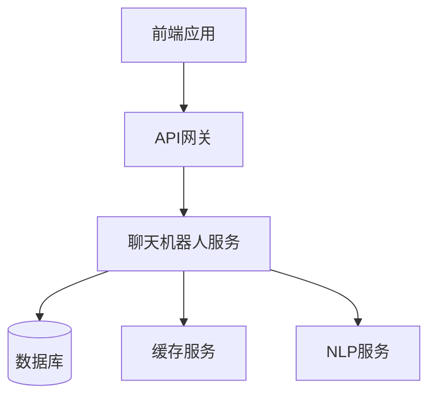

[返回目录](./README.md) | [上一章：通过测试用例引导AI开发](./第一章-通过测试用例引导AI开发.md) | [下一章：性能测试驱动优化](./第三章-性能测试驱动优化.md)

# 第二章 接口测试驱动开发

## 2.1 RESTful API 测试基础

### 2.1.1 API 测试的重要性
在现代微服务架构中，API 测试尤为重要：
- 确保接口功能正确性
- 验证数据交互的准确性
- 保证系统集成的可靠性
- 提高开发效率和质量

### 2.1.2 API 测试用例的组成
一个完整的 API 测试用例应包含：
```python
{
    "name": "创建用户接口测试",
    "method": "POST",
    "endpoint": "/api/v1/users",
    "headers": {
        "Content-Type": "application/json",
        "Authorization": "Bearer ${token}"
    },
    "request_body": {
        "username": "test_user",
        "email": "test@example.com",
        "password": "Test123!"
    },
    "expected_status": 201,
    "expected_response": {
        "success": true,
        "data": {
            "id": "string",
            "username": "test_user",
            "email": "test@example.com"
        }
    }
}
```

## 2.2 编写高质量 API 测试用例

### 2.2.1 测试用例设计原则
1. 完整性：覆盖所有请求方法和参数
2. 独立性：测试用例之间互不影响
3. 可重复性：测试结果可重现
4. 可维护性：结构清晰，易于更新

### 2.2.2 常见测试场景
```python
class TestUserAPI:
    """用户管理 API 测试用例"""
    
    def test_create_user(self):
        """测试创建用户"""
        response = client.post("/api/v1/users", json={
            "username": "test_user",
            "email": "test@example.com",
            "password": "Test123!"
        })
        assert response.status_code == 201
        assert response.json()["success"] is True
        
    def test_get_user(self):
        """测试获取用户信息"""
        response = client.get("/api/v1/users/123")
        assert response.status_code == 200
        assert "username" in response.json()["data"]
        
    def test_update_user(self):
        """测试更新用户信息"""
        response = client.put("/api/v1/users/123", json={
            "username": "new_username"
        })
        assert response.status_code == 200
        assert response.json()["data"]["username"] == "new_username"
        
    def test_delete_user(self):
        """测试删除用户"""
        response = client.delete("/api/v1/users/123")
        assert response.status_code == 204
```

### 2.2.3 参数化测试
```python
@pytest.mark.parametrize("email,password,expected_status", [
    ("valid@email.com", "Valid123!", 201),
    ("invalid-email", "Valid123!", 400),
    ("valid@email.com", "short", 400),
    ("", "Valid123!", 400),
    ("valid@email.com", "", 400),
])
def test_user_registration_validation(email, password, expected_status):
    """测试用户注册参数验证"""
    response = client.post("/api/v1/users", json={
        "email": email,
        "password": password
    })
    assert response.status_code == expected_status
```

## 2.3 实战：聊天机器人API开发

### 2.3.1 项目背景
最近我在开发一个聊天机器人系统的API接口，我们拿到了一个参考的项目，里面有了一个聊天机器人的API，但我们想让该聊天机器人作为我们产品的一个模块，这样就形成了我们产品矩阵，但重构一个聊天机器人的API是很麻烦的，因为它涉及到很多的业务逻辑，我们经过这一年来的AI写代码的实践，想继续通过AI协助开发。

但直接让AI写代码显然不是个好主意。经过思考，我决定先把接口设计和测试用例准备好，再让AI基于这些来实现具体代码。这种方式不仅能保证代码质量，还能大大提高开发效率。

### 2.3.2 接口设计文档
首先，我们需要一个清晰的API文档。我使用Swagger 3.0来定义接口：

```yaml
openapi: 3.0.0
info:
  title: 聊天机器人API
  description: |
    聊天机器人系统API文档
    
    ## 错误码说明
    - 400: 请求参数错误
    - 401: 未授权
    - 403: 权限不足
    - 404: 资源不存在
    - 409: 并发冲突
    - 500: 服务器内部错误
  version: 1.0.0
  
servers:
  - url: http://api.example.com/v1
    description: 生产环境
  - url: http://staging-api.example.com/v1
    description: 测试环境

components:
  schemas:
    Message:
      type: object
      required:
        - text
      properties:
        text:
          type: string
          description: 消息文本
        timestamp:
          type: string
          format: date-time
          description: 消息时间戳
          
paths:
  /messages:
    post:
      summary: 发送消息
      description: |
        向聊天机器人发送消息
        
        注意事项：
        1. 消息文本不能为空
        2. 消息长度不能超过500个字符
      requestBody:
        required: true
        content:
          application/json:
            schema:
              $ref: '#/components/schemas/Message'
      responses:
        '200':
          description: 发送成功
          content:
            application/json:
              schema:
                type: object
                properties:
                  code:
                    type: integer
                    example: 200
                  message:
                    type: string
                    example: "success"
                  data:
                    $ref: '#/components/schemas/Message'
        '400':
          description: 参数验证失败
          content:
            application/json:
              examples:
                empty_text:
                  summary: 消息文本不能为空
                  value:
                    code: 400
                    message: "消息文本不能为空"
                    data: null
                long_text:
                  summary: 消息长度不能超过500个字符
                  value:
                    code: 400
                    message: "消息长度不能超过500个字符"
                    data: null
```

### 2.3.3 测试用例设计
基于API文档，我们可以设计详细的测试用例：

```python
class TestChatbotAPI:
    def test_send_message(self):
        """测试发送消息接口"""
        # 准备测试数据
        message_data = {
            "text": "你好"
        }
        
        # 正常场景测试
        response = client.post("/api/v1/messages", json=message_data)
        assert response.status_code == 200
        assert response.json()["data"]["text"] == message_data["text"]
        
        # 参数验证测试
        invalid_data = {
            "text": ""  # 空消息文本
        }
        response = client.post("/api/v1/messages", json=invalid_data)
        assert response.status_code == 400
        
        # 消息长度测试
        long_text = "你好" * 1000
        response = client.post("/api/v1/messages", json={"text": long_text})
        assert response.status_code == 400
        
    def test_message_format(self):
        """测试消息格式验证"""
        # 测试时间戳格式
        message_data = {
            "text": "你好",
            "timestamp": "invalid-date"
        }
        response = client.post("/api/v1/messages", json=message_data)
        assert response.status_code == 400
        
        # 测试正确的时间戳
        message_data["timestamp"] = "2023-01-01T12:00:00Z"
        response = client.post("/api/v1/messages", json=message_data)
        assert response.status_code == 200
        
    def test_error_handling(self):
        """测试错误处理"""
        # 测试无效的JSON
        response = client.post(
            "/api/v1/messages", 
            data="invalid-json",
            headers={"Content-Type": "application/json"}
        )
        assert response.status_code == 400
        
        # 测试缺少必需字段
        response = client.post("/api/v1/messages", json={})
        assert response.status_code == 400
```

### 2.3.4 实现关键点

1. **参数验证**
```python
def validate_message(message_data: dict) -> tuple[bool, str]:
    """验证消息数据"""
    if not message_data.get("text"):
        return False, "消息文本不能为空"
    if len(message_data.get("text", "")) > 500:
        return False, "消息长度不能超过500个字符"
    return True, ""
```

2. **错误处理中间件**
```python
@app.exception_handler(ValidationError)
async def validation_error_handler(request, exc):
    return JSONResponse(
        status_code=400,
        content={
            "code": 400,
            "message": str(exc),
            "data": None
        }
    )
```

3. **响应格式化**
```python
def format_response(data: Any, message: str = "success") -> dict:
    """格式化API响应"""
    return {
        "code": 200,
        "message": message,
        "data": data
    }
```

### 2.3.5 系统架构


## 2.4 最佳实践总结

### 2.4.1 接口测试的注意事项
1. **测试隔离**：每个测试用例应该是独立的
2. **数据清理**：测试前后要清理测试数据
3. **环境一致**：确保测试环境与生产环境配置一致
4. **参数完整**：测试所有可能的参数组合

### 2.4.2 常见问题和解决方案
1. **测试数据管理**
   - 问题：测试数据难以维护
   - 解决：使用工厂模式创建测试数据

2. **环境依赖**
   - 问题：测试依赖外部服务
   - 解决：使用Mock或测试替身

3. **并发测试**
   - 问题：并发场景难以测试
   - 解决：使用专门的并发测试框架

### 2.4.3 提高测试效率的技巧
1. **参数化测试**：使用`@pytest.mark.parametrize`
2. **测试夹具**：合理使用`pytest fixtures`
3. **测试分组**：使用标记对测试进行分类
4. **并行执行**：启用测试并行运行

## 2.5 小结

本章我们通过一个实际的聊天机器人API项目，展示了如何：
1. 设计清晰的API文档
2. 编写全面的测试用例
3. 实现关键功能点
4. 处理常见问题

关键经验是：
1. 接口文档要详细完整
2. 测试用例要覆盖全面
3. 错误处理要充分考虑
4. 持续优化和改进

在下一章中，我们将探讨如何通过性能测试来优化API的性能。

---
[返回目录](./README.md) | [上一章：通过测试用例引导AI开发](./第一章-通过测试用例引导AI开发.md) | [下一章：性能测试驱动优化](./第三章-性能测试驱动优化.md)
