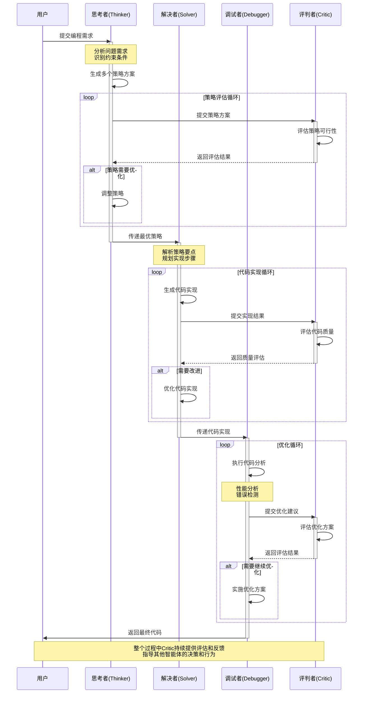

[回到目录](README.md)

上一章：[第十八章-IBM跷跷板机制分析](第十八章-IBM跷跷板机制分析.md)

下一章：[第二十章-Cursor结合Devin的智能编程实践](第二十章-Cursor结合Devin的智能编程实践.md)

# 第十九章 CodeTree智能编程实践

## 引言

在当今的软件开发领域，我们经常面临着一个共同的挑战：如何让AI更好地理解和实现我们的编程需求？虽然像如今2024年末 GPT-o1,Claude 3.5 sonat, Google gemini 2 等大语言模型在代码生成方面表现出色，但在处理复杂项目时，往往会遇到以下问题：

1. 代码生成缺乏系统性思考
2. 难以保持多个模块之间的一致性
3. 优化过程不够透明和可控
4. 难以平衡质量和效率

最近，Devin AI公司推出的智能程序员Devin引起了广泛关注。通过深入研究其背后的技术，我们发现CodeTree这个核心方案为解决上述问题提供了一个优雅的答案。

那么，CodeTree究竟是如何解决这些问题的？它的核心理念是什么？我们又该如何在实际项目中运用这个方案呢？

## 19.1 认识CodeTree：一个革新性的方案

想象一下，如果我们能像人类程序员团队协作那样，让不同的AI角色各司其职，会是什么样的情况？CodeTree正是基于这样的思路，提出了一个多智能体协作的框架。

在传统的AI编程方案中，我们往往是把所有任务都交给一个大模型来处理。这就像让一个全栈工程师独自完成整个项目 - 虽然可行，但并非最优解。CodeTree另辟蹊径，引入了专门的角色分工：

- 有的智能体负责思考整体策略（就像技术架构师）
- 有的专注于代码实现（如同开发工程师）
- 有的专门进行优化和调试（类似性能专家）
- 还有的负责质量控制（如同代码审查员）

这种分工不仅让每个环节都能得到专门的关注，更重要的是，它为整个开发过程带来了前所未有的可控性和透明度。

### 19.1.1 多智能体协作机制：让AI团队协作成为可能

你是否曾经想过，为什么人类的软件开发团队要采用不同的角色分工？这是因为复杂的软件开发过程需要不同视角和专业知识的配合。CodeTree正是将这种经过实践检验的团队协作模式，巧妙地应用到了AI编程领域。

让我们来看看这个"AI开发团队"是如何工作的：

#### 智能体协作时序图



#### 1. Thinker Agent：系统的"首席架构师"

就像优秀的技术架构师会在动手编码前先进行深入的思考和规划，Thinker Agent也肩负着类似的职责。它不仅要理解需求，还要:
- 全局性思考：从系统层面分析问题
- 战略性规划：设计多个可行的解决方案
- 预见性判断：评估每个方案的优劣势
- 迭代性改进：根据反馈调整策略

这种深思熟虑的方式，让我们避免了"想到哪写到哪"的随意性，为整个开发过程奠定了坚实的基础。

#### 2. Solver Agent：专注的"开发工程师"

有了清晰的策略后，接下来就是将想法转化为代码。Solver Agent就像一个经验丰富的开发工程师，它知道：
- 如何将抽象的策略转化为具体的实现
- 在编码时需要注意哪些细节
- 如何确保代码的质量和可维护性
- 何时该寻求其他智能体的帮助

#### 3. Debugger Agent：细心的"调试专家"

在软件开发中，写代码只是第一步，让代码高效稳定地运行才是真正的挑战。Debugger Agent就像一个专业的性能调优专家，它会：
- 仔细分析代码中的问题
- 提出有针对性的优化方案
- 验证优化的效果
- 确保不会引入新的问题

#### 4. Critic Agent：严格的"质量监督员"

要确保整个开发过程的质量，我们需要一个客观公正的评判者。Critic Agent扮演着这个关键角色，它会：
- 评估每个决策的合理性
- 审查代码的质量
- 提供建设性的反馈
- 指导其他智能体改进

### 19.1.2 树搜索机制：让开发过程可控可追溯

在理解了团队协作机制后，你可能会问：这些智能体是如何组织和管理它们的工作成果的？这就要说到CodeTree的另一个创新 - 树形结构的开发过程管理。

想象一下象棋程序是如何思考的：它会提前规划多个可能的走法，并对每种走法的后续发展进行评估。CodeTree采用了类似的思路，将整个开发过程组织成一个动态生长的决策树：

### 19.1.2 树结构设计原理

CodeTree的核心创新在于引入了统一的树结构来组织和管理代码生成过程。这种设计模拟了人类程序员解决问题的思维过程：

1. **分层策略设计**
   - **根节点**：
     - 整的问题描述
     - 功能需求列表
     - 性能要求指标
     - 测试用例集合
   
   - **第一层策略节点**：
     - 多个解决方案建议
     - 每个策略的优劣分析
     - 资源需求评估
     - 实现难度评级
   
   - **第二层实现节点**：
     - 具体的代码实现
     - 单元测试代码
     - 接口文档
     - 部署配置
   
   - **优化层节点**：
     - 性能优化版本
     - 代码重构方案
     - 安全加固措施
     - 可维护性改进

2. **节点属性设计**
   - **代码内容**：
     - 源代码文件
     - 配置文件
     - 文档说明
   
   - **评估指标**：
     - 测试覆盖率
     - 性能指标
     - 代码质量分数
     - 安全扫描结果
   
   - **优化建议**：
     - 性能改进点
     - 代码异味
     - 最佳实践建议
     - 安全漏洞修复

### 19.1.2 多智能体协作机制

1. **Thinker Agent（策略思考者）**
   ```python
   class ThinkerAgent:
       def analyze_problem(self, problem_description):
           # 问题分析
           key_points = self._extract_key_points(problem_description)
           constraints = self._identify_constraints(problem_description)
           
           # 策略生成
           strategies = []
           for approach in self._generate_approaches(key_points, constraints):
               strategy = {
                   'name': approach.name,
                   'description': approach.description,
                   'pros': approach.advantages,
                   'cons': approach.disadvantages,
                   'complexity': approach.estimate_complexity(),
                   'resources': approach.required_resources
               }
               strategies.append(strategy)
           
           return strategies
   ```

2. **Solver Agent（代码实现者）**
   ```python
   class SolverAgent:
       def implement_strategy(self, strategy, requirements):
           # 代码框架生成
           code_structure = self._generate_structure(strategy)
           
           # 核心逻辑实现
           implementation = self._implement_core_logic(code_structure, requirements)
           
           # 测试代码生成
           tests = self._generate_tests(implementation, requirements)
           
           return {
               'implementation': implementation,
               'tests': tests,
               'docs': self._generate_docs(implementation)
           }
   ```

3. **Debugger Agent（优化调试者）**
   ```python
   class DebuggerAgent:
       def optimize_code(self, code_implementation, feedback):
           # 性能分析
           performance_issues = self._analyze_performance(code_implementation)
           
           # 代码优化
           optimized_code = self._apply_optimizations(
               code_implementation,
               performance_issues
           )
           
           # 验证优化效果
           optimization_metrics = self._validate_optimizations(
               optimized_code,
               feedback
           )
           
           return {
               'optimized_code': optimized_code,
               'metrics': optimization_metrics,
               'changes': self._document_changes()
           }
   ```

4. **Critic Agent（评估者）**
   ```python
   class CriticAgent:
       def evaluate_solution(self, implementation, requirements):
           # 质量评估
           quality_score = self._assess_code_quality(implementation)
           
           # 性能评估
           performance_score = self._measure_performance(implementation)
           
           # 安全评估
           security_score = self._security_audit(implementation)
           
           # 综合评分
           overall_score = self._calculate_overall_score(
               quality_score,
               performance_score,
               security_score
           )
           
           return {
               'overall_score': overall_score,
               'quality_details': quality_score,
               'performance_details': performance_score,
               'security_details': security_score,
               'recommendations': self._generate_recommendations()
           }
   ```

在了解了CodeTree的核心理念和基本架构后，你可能会问：这些概念如何在实际项目中落地？如何将这些理论转化为可以立即使用的工程实践？

接下来，让我们一起探索如何将CodeTree的理念转化为具体的代码实现。我们将从最基础的环境搭建开始，逐步构建起一个完整的CodeTree开发框架。通过这个过程，你不仅能够深入理解CodeTree的工作机制，还能掌握如何在自己的项目中应用这些技术。

## 19.2 CodeTree方案的工程实现

### 19.2.1 开发环境准备

1. **开发工具配置**
   ```bash
   # 1. 配置开发环境
   python -m venv venv
   source venv/bin/activate
   
   # 2. 安装必要依赖
   pip install -r requirements.txt
   
   # 3. 安装开发工具
   pip install pytest black mypy
   ```

2. **项目结构设计**
   ```
   codetree/
   ├── agents/              # 智能体实现
   │   ├── thinker.py      # 思考者实现
   │   ├── solver.py       # 解决者实现
   │   ├── debugger.py     # 调试者实现
   │   └── critic.py       # 评判者实现
   │
   ├── core/               # 核心功能
   │   ├── tree.py        # 树结构实现
   │   ├── search.py      # 搜索算法
   │   └── evaluator.py   # ���估器
   │
   ├── strategies/         # 策略管理
   │   ├── generator.py    # 策略生成器
   │   ├── analyzer.py     # 策略分析器
   │   └── optimizer.py    # 策略优化器
   │
   ├── utils/             # 工具函数
   │   ├── logger.py      # 日志工具
   │   ├── metrics.py     # 度量工具
   │   └── validators.py  # 验证工具
   │
   ├── tests/             # 测试用例
       ├── unit/          # 单元测试
       ├── integration/   # 集成测试
       └── performance/   # 性能测试
   ```

### 19.2.2 核心组件实现

1. **树结构实现**
```python
from dataclasses import dataclass
from typing import List, Optional, Dict, Any

@dataclass
class TreeNode:
    """代码生成树节点"""
    content: Dict[str, Any]  # 节点内容
    score: float = 0.0       # 节点评分
    parent: Optional['TreeNode'] = None
    children: List['TreeNode'] = None
    
    def __post_init__(self):
        self.children = self.children or []
    
    def add_child(self, node: 'TreeNode'):
        node.parent = self
        self.children.append(node)
    
    def get_path(self) -> List['TreeNode']:
        """获取从根节点到当前节点的路径"""
        path = []
        current = self
        while current:
            path.append(current)
            current = current.parent
        return list(reversed(path))

class CodeTree:
    """代码生成树实现"""
    def __init__(self):
        self.root = None
        self.current_node = None
    
    def initialize(self, problem_description: Dict[str, Any]):
        """初始化代码生成树"""
        self.root = TreeNode(content=problem_description)
        self.current_node = self.root
    
    def expand_node(self, node: TreeNode, strategies: List[Dict[str, Any]]):
        """扩展节点"""
        for strategy in strategies:
            child = TreeNode(content=strategy)
            node.add_child(child)
    
    def select_best_node(self, nodes: List[TreeNode]) -> TreeNode:
        """选择最佳节点"""
        return max(nodes, key=lambda x: x.score)
```

2. **搜索算法实现**
```python
class TreeSearch:
    """树搜索算法实现"""
    def __init__(self, tree: CodeTree, evaluator: 'NodeEvaluator'):
        self.tree = tree
        self.evaluator = evaluator
        self.visited_nodes = set()
    
    def breadth_first_search(self, max_width: int = 5):
        """广度优先搜索"""
        queue = [self.tree.root]
        while queue:
            level_nodes = []
            for _ in range(min(len(queue), max_width)):
                node = queue.pop(0)
                if node not in self.visited_nodes:
                    self.visited_nodes.add(node)
                    score = self.evaluator.evaluate(node)
                    node.score = score
                    level_nodes.append(node)
                queue.extend(node.children)
            
            if level_nodes:
                best_node = self.tree.select_best_node(level_nodes)
                yield best_node
    
    def depth_first_search(self, max_depth: int = 5):
        """深度优先搜索"""
        def dfs(node: TreeNode, depth: int):
            if depth > max_depth or node in self.visited_nodes:
                return
            
            self.visited_nodes.add(node)
            score = self.evaluator.evaluate(node)
            node.score = score
            yield node
            
            for child in sorted(node.children, key=lambda x: x.score, reverse=True):
                yield from dfs(child, depth + 1)
        
        yield from dfs(self.tree.root, 0)
```

3. **评估器实现**
```python
class NodeEvaluator:
    """节点评估器实现"""
    def evaluate(self, node: TreeNode) -> float:
        """评估节点质量"""
        # 功能性评分
        functional_score = self._evaluate_functional(node)
        
        # 质量性评分
        quality_score = self._evaluate_quality(node)
        
        # 策略匹配度评分
        strategy_score = self._evaluate_strategy_match(node)
        
        # 综合评分
        weights = {
            'functional': 0.4,
            'quality': 0.3,
            'strategy': 0.3
        }
        
        return (
            weights['functional'] * functional_score +
            weights['quality'] * quality_score +
            weights['strategy'] * strategy_score
        )
    
    def _evaluate_functional(self, node: TreeNode) -> float:
        """评估功能实现"""
        metrics = {
            'test_coverage': self._calculate_test_coverage(node),
            'error_rate': self._calculate_error_rate(node),
            'boundary_cases': self._check_boundary_cases(node)
        }
        return sum(metrics.values()) / len(metrics)
    
    def _evaluate_quality(self, node: TreeNode) -> float:
        """评估代码质量"""
        metrics = {
            'complexity': self._calculate_complexity(node),
            'maintainability': self._calculate_maintainability(node),
            'readability': self._calculate_readability(node)
        }
        return sum(metrics.values()) / len(metrics)
    
    def _evaluate_strategy_match(self, node: TreeNode) -> float:
        """评估策略匹配度"""
        metrics = {
            'consistency': self._check_strategy_consistency(node),
            'completeness': self._check_implementation_completeness(node),
            'innovation': self._evaluate_innovation_level(node)
        }
        return sum(metrics.values()) / len(metrics)
```

## 19.3 实战案例：智能待办事项系统

通过上面的工程实现，我们已经搭建好了CodeTree的基础框架。但是，理论终究需要接受实践的检验。为了让你更好地理解如何在实际项目中运用CodeTree，我们将通过一个具体的案例 —— 智能待办事项系统，来展示CodeTree是如何帮助我们构建高质量软件的。

这个案例不仅涵盖了常见的软件开发需求，还包含了一些有趣的AI特性，非常适合用来展示CodeTree的优势。让我们看看如何一步步构建这个系统。

### 19.3.1 需求描述

创建一个支持智能分类和优先级排序的待办事项系统，具有以下特性：

1. 自动任务分类
2. 智能优先级排序
3. 截止日期管理
4. 标签系统
5. 任务依赖关系

### 19.3.2 策略生成

**策略1：基于机器学习的分类方案**
```python
from sklearn.feature_extraction.text import TfidfVectorizer
from sklearn.naive_bayes import MultinomialNB
from sklearn.pipeline import Pipeline

class MLTaskClassifier:
    def __init__(self):
        self.pipeline = Pipeline([
            ('vectorizer', TfidfVectorizer(
                max_features=1000,
                stop_words='english'
            )),
            ('classifier', MultinomialNB())
        ])
        
    def train(self, tasks, labels):
        self.pipeline.fit(tasks, labels)
        
    def predict(self, task):
        return self.pipeline.predict([task])[0]
```

**策略2：规则引擎方案**
```python
class RuleBasedClassifier:
    def __init__(self):
        self.rules = {
            'urgent': [
                'asap',
                'urgent',
                'emergency',
                'deadline'
            ],
            'important': [
                'important',
                'critical',
                'key',
                'essential'
            ],
            'normal': [
                'regular',
                'routine',
                'normal',
                'standard'
            ]
        }
        
    def classify(self, task):
        task_lower = task.lower()
        for category, keywords in self.rules.items():
            if any(keyword in task_lower for keyword in keywords):
                return category
        return 'normal'
```

**策略3：混合方案**
```python
class HybridClassifier:
    def __init__(self):
        self.ml_classifier = MLTaskClassifier()
        self.rule_classifier = RuleBasedClassifier()
        self.confidence_threshold = 0.8
        
    def classify(self, task):
        # 首先尝试规则分类
        rule_result = self.rule_classifier.classify(task)
        
        # 如果规则分类结果可信度高，直接返回
        if self._check_rule_confidence(rule_result, task):
            return rule_result
            
        # 否则使用机器学习分类
        ml_result = self.ml_classifier.predict(task)
        return ml_result
```

### 19.3.3 完整实现示例

```python
from datetime import datetime
from typing import List, Dict, Optional
import numpy as np

class Task:
    def __init__(
        self,
        title: str,
        description: str,
        due_date: Optional[datetime] = None,
        tags: List[str] = None,
        dependencies: List[int] = None
    ):
        self.title = title
        self.description = description
        self.due_date = due_date
        self.tags = tags or []
        self.dependencies = dependencies or []
        self.created_at = datetime.now()
        self.category = None
        self.priority = None

class SmartTodoSystem:
    def __init__(self):
        self.tasks: Dict[int, Task] = {}
        self.classifier = HybridClassifier()
        self.task_counter = 0
        
    def add_task(
        self,
        title: str,
        description: str,
        due_date: Optional[datetime] = None,
        tags: List[str] = None,
        dependencies: List[int] = None
    ) -> int:
        # 新建新任务
        task = Task(title, description, due_date, tags, dependencies)
        
        # 分类任务
        task.category = self.classifier.classify(
            f"{title} {description}"
        )
        
        # 计算优先级
        task.priority = self._calculate_priority(task)
        
        # 保存任务
        self.task_counter += 1
        self.tasks[self.task_counter] = task
        
        return self.task_counter
        
    def _calculate_priority(self, task: Task) -> float:
        priority_score = 0.0
        
        # 基于类别的优先级
        category_weights = {
            'urgent': 0.4,
            'important': 0.3,
            'normal': 0.2
        }
        priority_score += category_weights.get(task.category, 0.1)
        
        # 基于截止日期的优先级
        if task.due_date:
            days_until_due = (task.due_date - datetime.now()).days
            if days_until_due <= 0:
                priority_score += 0.3
            elif days_until_due <= 3:
                priority_score += 0.2
            elif days_until_due <= 7:
                priority_score += 0.1
                
        # 基于依赖关系的优先级
        if task.dependencies:
            priority_score += 0.1 * len(task.dependencies)
            
        # 基于标签的优先级
        important_tags = {'high', 'priority', 'critical'}
        if any(tag in important_tags for tag in task.tags):
            priority_score += 0.1
            
        return min(priority_score, 1.0)
        
    def get_sorted_tasks(self) -> List[Task]:
        return sorted(
            self.tasks.values(),
            key=lambda x: (x.priority or 0),
            reverse=True
        )
        
    def update_task(
        self,
        task_id: int,
        **kwargs
    ) -> bool:
        if task_id not in self.tasks:
            return False
            
        task = self.tasks[task_id]
        for key, value in kwargs.items():
            if hasattr(task, key):
                setattr(task, key, value)
                
        # 重新计算优先级
        task.priority = self._calculate_priority(task)
        return True
        
    def delete_task(self, task_id: int) -> bool:
        if task_id not in self.tasks:
            return False
            
        # 检查依赖关系
        for task in self.tasks.values():
            if task_id in (task.dependencies or []):
                task.dependencies.remove(task_id)
                
        del self.tasks[task_id]
        return True
```

### 19.3.4 优化改进

1. **性能优化**
```python
from functools import lru_cache
from typing import List, Tuple

class OptimizedTodoSystem(SmartTodoSystem):
    def __init__(self):
        super().__init__()
        self._priority_cache = {}
        
    @lru_cache(maxsize=1000)
    def _calculate_priority(self, task_key: Tuple) -> float:
        # ��任务转换为可哈希的元组形式
        return super()._calculate_priority(self.tasks[task_key[0]])
        
    def batch_update_priorities(self, task_ids: List[int]):
        # 批量更新优先级
        updates = []
        for task_id in task_ids:
            if task_id in self.tasks:
                task = self.tasks[task_id]
                priority = self._calculate_priority(
                    (task_id, task.category, task.due_date)
                )
                updates.append((task_id, priority))
                
        # 批量应用更新
        for task_id, priority in updates:
            self.tasks[task_id].priority = priority
```

2. **可用性优化**
```python
import logging
from datetime import datetime
from typing import Optional, Dict, Any

class EnhancedTodoSystem(OptimizedTodoSystem):
    def __init__(self):
        super().__init__()
        self.logger = logging.getLogger(__name__)
        self.setup_logging()
        
    def setup_logging(self):
        logging.basicConfig(
            level=logging.INFO,
            format='%(asctime)s - %(name)s - %(levelname)s - %(message)s'
        )
        
    def add_task(self, *args, **kwargs) -> Optional[int]:
        try:
            task_id = super().add_task(*args, **kwargs)
            self.logger.info(f"Task created successfully: {task_id}")
            return task_id
        except Exception as e:
            self.logger.error(f"Error creating task: {str(e)}")
            return None
            
    def get_task_statistics(self) -> Dict[str, Any]:
        stats = {
            'total_tasks': len(self.tasks),
            'categories': {},
            'overdue_tasks': 0,
            'tasks_due_today': 0
        }
        
        now = datetime.now()
        for task in self.tasks.values():
            # 统计分类
            stats['categories'][task.category] = \
                stats['categories'].get(task.category, 0) + 1
                
            # 统计截止日期
            if task.due_date:
                if task.due_date < now:
                    stats['overdue_tasks'] += 1
                elif task.due_date.date() == now.date():
                    stats['tasks_due_today'] += 1
                    
        return stats
```

## 结语

在软件开发日益复杂的今天，如何提高代码质量、增强开发效率成为每个开发者面临的重要课题。通过本章的探索，我们看到了CodeTree框架在这方面带来的创新性解决方案。

从多智能体协作机制的设计，到树形结构的开发流程管理，再到具体的工程实践，CodeTree为我们展示了一种全新的开发范式。特别是在实战案例中，我们看到了这种方法如何帮助我们构建出高质量的软件系统。

虽然在实践过程中可能会遇到各种挑战，但通过合理的架构设计、严谨的工程实践和持续的优化改进，这些挑战都是可以克服的。更重要的是，这个过程让我们对软件开发有了更深的理解和更系统的思考。

CodeTree的价值不仅在于它提供的具体工具和方法，更在于它代表的开发理念 —— 将复杂问题分解为可管理的部分，通过系统化的方法来保证开发质量。这种思维方式和实践经验，将帮助我们在未来的软件开发中走得更远。

另外：我们文章中的代码只是demo，实际开发可以结合 https://github.com/appl-team/appl 来实现一个更加强大的智能编程助手。

## 参考资源

本篇文章主要参考修猫的公众号文章： https://mp.weixin.qq.com/s/-SCsLl2IkdstXFrGWoWM1g

1. 《Clean Code: A Handbook of Agile Software Craftsmanship》
2. 《Design Patterns: Elements of Reusable Object-Oriented Software》
3. 《Continuous Delivery: Reliable Software Releases through Build, Test, and Deployment Automation》
4. 《High Performance Python: Practical Performant Programming for Humans》
5. 《Architecture Patterns with Python: Enabling Test-Driven Development, Domain-Driven Design, and Event-Driven Microservices》

[回到目录](README.md)

上一章：[第十八章-IBM跷跷板机制分析](第十八章-IBM跷跷板机制分析.md)

下一章：[第二十章-Cursor结合Devin的智能编程实践](第二十章-Cursor结合Devin的智能编程实践.md)