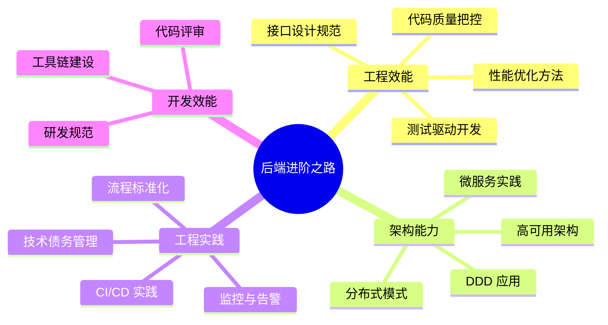
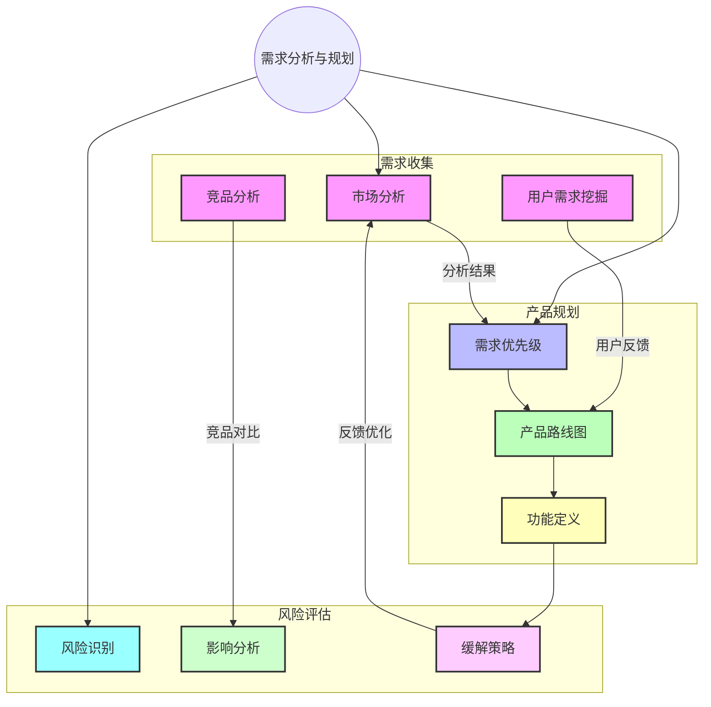
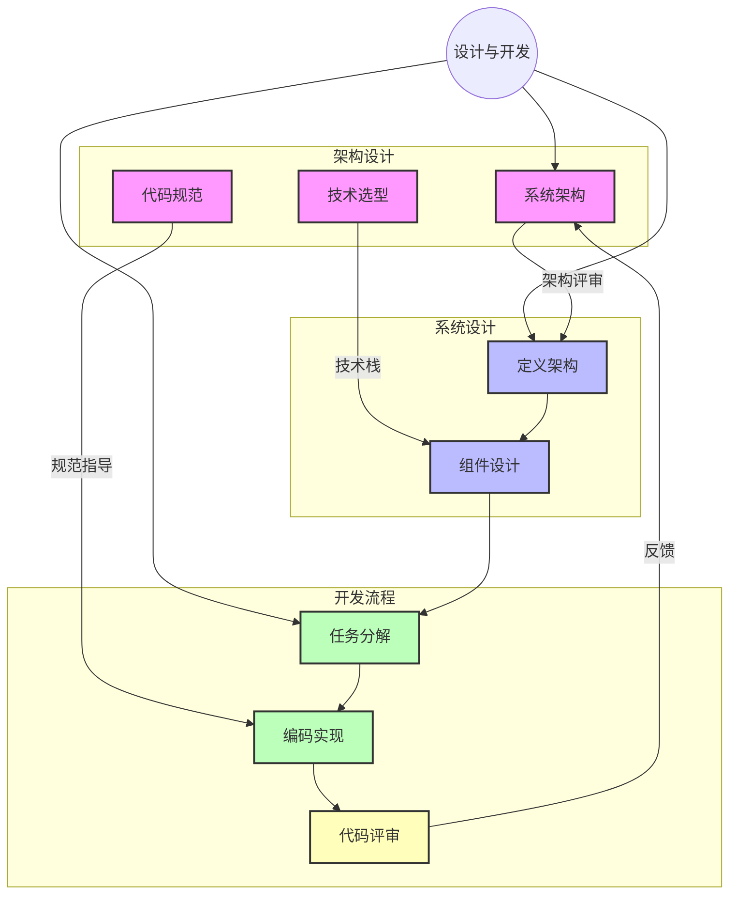
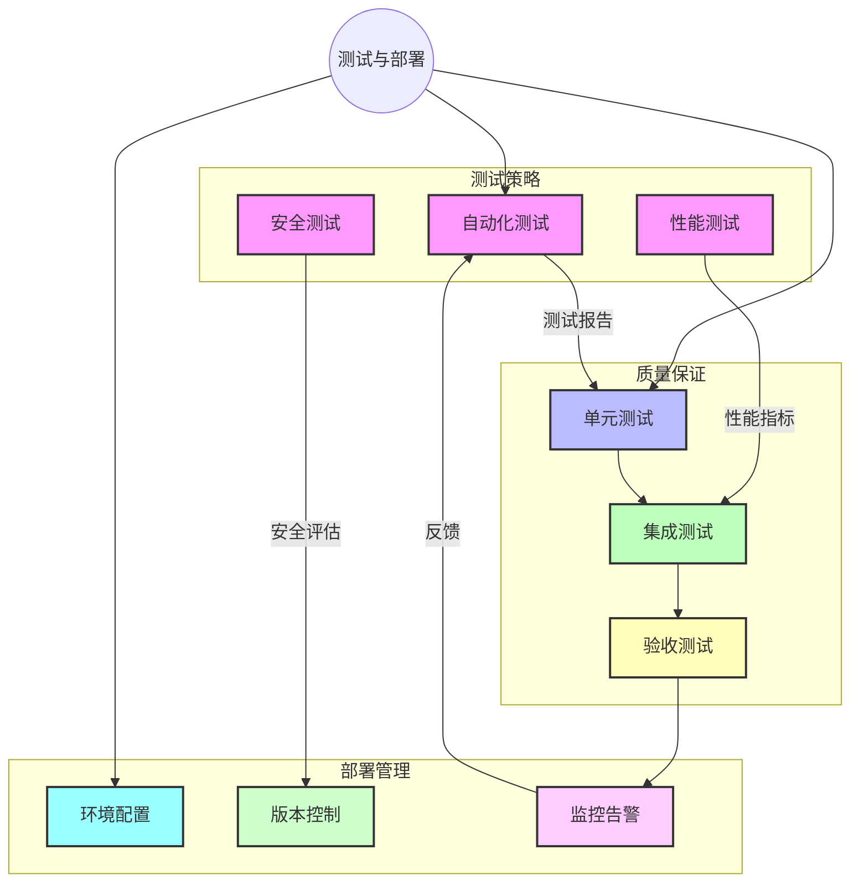

[返回目录](./README.md) | [下一章：通过测试用例引导AI开发](./第一章-通过测试用例引导AI开发.md)

# 写给追求卓越的后端工程师

> 在我十多年的后端开发生涯中，最大的感悟是：真正的技术突破往往来自于方法论的革新，而不仅仅是工具的更迭。

## 为什么需要这门课？

还记得你第一次面对复杂系统架构时的茫然吗？或是在性能优化时绞尽脑汁却收效甚微的沮丧？作为一名经历过从单体应用到微服务架构，从传统开发到 DevOps 转型的老兵，我深知这种感受。

这门课程，就是要帮你突破这些瓶颈。

## 课程与众不同之处

### 🎯 实战为王
不讲空洞理论，每个概念都会配合真实项目案例。比如在微服务架构那一章，我们会完整重构一个电商系统，让你真正理解服务拆分的痛点和解决之道。

### 🔍 深度思维进阶
想象一下：
- 如何用测试用例来指导整个开发流程？
- 为什么说领域驱动设计能够解决复杂业务问题？
- 如何将性能调优变成一门科学而不是玄学？

这些问题的答案，都藏在课程的深度思维训练中。

### 💡 最佳实践提炼
分享我在多个大型项目中总结的经验：
- 从 0 到 1 构建高可用架构的完整思路
- 让代码评审不再流于形式的实操技巧
- 技术债务治理的系统方法论

## 课程体系

### 系统全景图
以下思维导图展示了课程的整体架构：



### 需求分析与规划

在实际项目中，我们经常遇到的第一个挑战就是需求分析。这个阶段的工作质量直接决定了项目的成败。让我们看看一个高效的需求分析流程：



### 设计与开发流程

在我经手的项目中，一个清晰的设计与开发流程往往能让项目事半功倍：



### 测试与部署

记得我在一个金融项目中，就是靠这套测试与部署流程，将系统故障率降低了 80%：



## 你将获得什么？

通过这门课程，你不仅能掌握：
- ✅ 系统化的架构设计方法
- ✅ 工程化的开发流程管理
- ✅ 科学的性能优化方案
- ✅ 可落地的最佳实践

更重要的是，你将建立起自己的技术思维框架，能够从容应对各种复杂的技术挑战。

## 课前准备

### 技术储备
- 3年以上后端开发经验
- 熟悉常用设计模式
- 了解基本架构原理
- 具备 DevOps 基础知识

### 开发环境
```bash
# 推荐的开发环境配置
Java 17+ / Python 3.8+
Docker & Kubernetes
Git & Jenkins
ELK Stack
```

## 写在最后

> "纸上得来终觉浅，绝知此事要躬行。"

十年前，我也是从一个对架构设计一知半解的菜鸟，逐步成长为能够独当一面的架构师。这个过程中，我踩过的坑、经历的失败、总结的经验，都将在这门课程中与你分享。

让我们开始这段提升之旅吧！

---
[下一章：测试驱动开发实践](./01-测试驱动开发实践.md)
