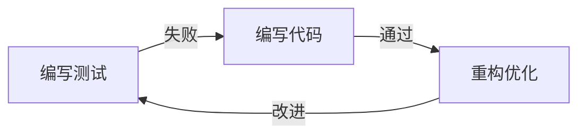
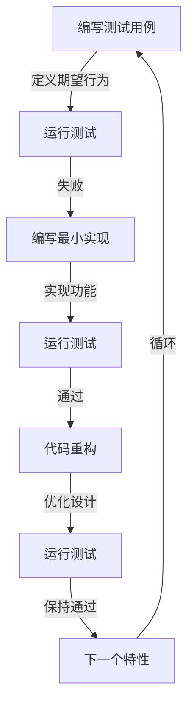
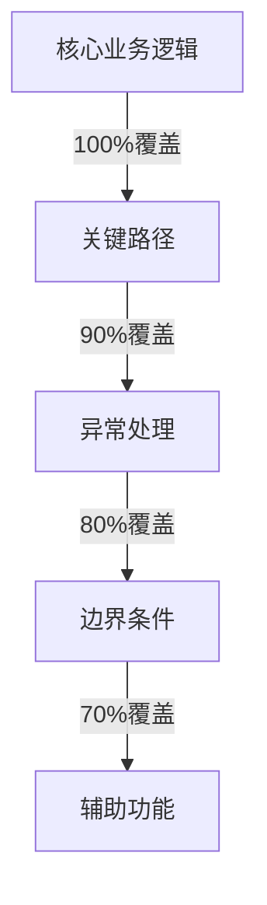

# 测试驱动开发实践：从入门到精通

> "如果说代码是软件的心脏，那么测试就是它的呼吸。" —— 我在一次技术分享会上的开场白

## 为什么要聊测试驱动开发？

还记得我在接手一个支付系统重构项目时的场景：系统运行了5年，代码覆盖率不到20%，每次改动都战战兢兢。最后通过TDD重构，不仅将覆盖率提升到85%，还在此过程中发现了18个潜在的并发问题。

### 🎯 现实问题
- 代码改了这里，坏了那里？
- 新功能上线，老功能挂了？
- 线上bug，改完后更多bug？
- 重构代码，没人敢动？

如果你也遇到过这些问题，那么这一章正是为你准备的。

## 测试驱动开发的本质

### 核心理念



这不仅是一个开发流程，更是一种设计方法。就像我在重构一个订单系统时的经历：

```python
# 重构前：一个巨大的订单处理类
class OrderProcessor:
    def process(self, order):
        # 500行混乱的业务逻辑...
        pass

# 重构后：通过测试驱动设计拆分
class OrderValidator:
    def validate(self, order):
        """
        >>> validator = OrderValidator()
        >>> order = Order(items=[{"id": 1, "quantity": 0}])
        >>> validator.validate(order)
        False
        """
        return order.items and all(item["quantity"] > 0 for item in order.items)

class PriceCalculator:
    def calculate(self, order):
        """
        >>> calculator = PriceCalculator()
        >>> order = Order(items=[{"price": 100, "quantity": 2}])
        >>> calculator.calculate(order)
        200
        """
        return sum(item["price"] * item["quantity"] for item in order.items)
```

### 实战案例：订单系统的TDD实践

让我们通过一个真实项目来看看TDD是如何工作的：

```python
# 1. 先写测试：订单创建流程
def test_order_creation():
    """
    测试用例：创建订单
    场景：用户购买2个商品A和1个商品B
    期望：订单总价正确，库存相应减少
    """
    # 准备测试数据
    items = [
        {"product_id": "A001", "quantity": 2, "price": 100},
        {"product_id": "B001", "quantity": 1, "price": 200}
    ]
    
    # 创建订单
    order_service = OrderService()
    order = order_service.create_order(user_id="U001", items=items)
    
    # 验证结果
    assert order.total_price == 400  # 2*100 + 1*200
    assert order.status == "CREATED"
    assert len(order.items) == 2

# 2. 实现代码
class OrderService:
    def create_order(self, user_id: str, items: List[Dict]) -> Order:
        # 具体实现...
        pass
```

### 测试驱动开发流程图



## 实战技巧

### 1. 测试用例设计

#### 🎯 FIRST原则
- **F**ast：测试要够快
- **I**ndependent：测试要独立
- **R**epeatable：测试要可重复
- **S**elf-validating：测试要自验证
- **T**imely：测试要及时

```python
# 好的测试用例示例
class TestUserRegistration:
    def setup_method(self):
        self.db = TestDatabase()  # 使用测试数据库
        self.service = UserService(self.db)
    
    def test_register_new_user(self):
        # 准备测试数据
        user_data = {
            "username": "test_user",
            "email": "test@example.com",
            "password": "secure_password"
        }
        
        # 执行测试
        result = self.service.register(user_data)
        
        # 验证结果
        assert result.success == True
        assert result.user.username == user_data["username"]
        assert self.db.has_user(user_data["email"])
```

### 2. 测试覆盖率策略

在我经手的项目中，我们通常按照以下优先级来规划测试覆盖：



### 3. 常见陷阱与解决方案

#### 🚫 测试代码太脆弱
```python
# 错误示例
def test_user_profile():
    user = create_user()
    assert user.profile.created_at.strftime('%Y-%m-%d') == '2024-01-01'

# 正确示例
def test_user_profile():
    user = create_user()
    assert isinstance(user.profile.created_at, datetime)
    assert user.profile.created_at > datetime(2024, 1, 1)
```

#### 🚫 测试依赖外部系统
```python
# 错误示例
def test_payment():
    result = payment_service.process(100)  # 直接调用真实支付接口

# 正确示例
def test_payment():
    mock_gateway = MockPaymentGateway()
    payment_service = PaymentService(gateway=mock_gateway)
    result = payment_service.process(100)
```

## 实战案例：订单系统重构

让我分享一个真实的项目经验。我们需要重构一个运行了3年的订单系统，问题包括：
- 代码耦合严重
- 性能问题频发
- 维护成本高

### 第一步：识别核心流程


### 第二步：编写测试套件

```python
class TestOrderFlow:
    def setup_method(self):
        self.order_service = OrderService()
        self.inventory_service = InventoryService()
        self.payment_service = PaymentService()
    
    def test_complete_order_flow(self):
        # 准备测试数据
        order_data = {
            "user_id": "test_user",
            "items": [
                {"product_id": "P001", "quantity": 2},
                {"product_id": "P002", "quantity": 1}
            ]
        }
        
        # 1. 创建订单
        order = self.order_service.create_order(order_data)
        assert order.status == "CREATED"
        
        # 2. 检查库存
        inventory_result = self.inventory_service.check(order.items)
        assert inventory_result.available == True
        
        # 3. 支付
        payment_result = self.payment_service.process(order)
        assert payment_result.success == True
        
        # 4. 更新订单状态
        updated_order = self.order_service.update_status(
            order.id, "PAID"
        )
        assert updated_order.status == "PAID"
```

## 最佳实践总结

### ✅ 做对的事
1. 从简单测试开始
2. 保持测试独立
3. 使用有意义的命名
4. 一个测试只测一个概念
5. 重视测试代码质量

### ❌ 避免的坑
1. 测试太多实现细节
2. 忽略边界条件
3. 测试代码重复
4. 依赖测试执行顺序
5. 使用全局状态

## 工具推荐

```bash
# Python测试工具
pytest                 # 测试框架
pytest-cov            # 覆盖率报告
pytest-mock           # Mock支持
pytest-bdd            # 行为驱动开发
factory-boy           # 测试数据生成

# Java测试工具
JUnit 5               # 测试框架
Mockito               # Mock框架
AssertJ               # 断言库
Testcontainers       # 容器化测试
```

## 写在最后

> "测试驱动开发不仅是一种开发方法，更是一种设计思维。它帮助我们在写代码之前，先思考代码应该如何被使用。"

记住，TDD的目标不是100%的测试覆盖率，而是帮助我们写出更好的代码。就像我经常说的：好的测试就像是代码的安全带，它不仅保护我们的代码，更保护我们的信心。

---
[上一章：前言](./00-前言.md) | [下一章：接口设计与契约测试](./02-接口设计与契约测试.md) 