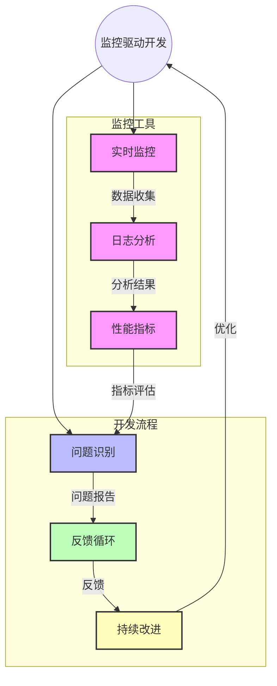

[返回目录](./README.md) | [上一章：原型图驱动开发](./第十章-原型图驱动开发.md) | [下一章：部署配置驱动开发](./第十二章-部署配置驱动开发.md)

# 第十一章：监控驱动开发

## 11.1 监控驱动开发基础

监控驱动开发（Monitoring Driven Development, MDD）是一种通过定义监控指标和告警规则来指导系统开发的方法。这种方法确保系统的可观测性、可维护性和可靠性。

## 11.2 核心概念

### 11.2.1 监控维度
1. **系统指标（System Metrics）**
   - CPU使用率
   - 内存占用
   - 磁盘I/O
   - 网络流量

2. **业务指标（Business Metrics）**
   - 交易量
   - 转化率
   - 活跃用户
   - 业务异常

3. **性能指标（Performance Metrics）**
   - 响应时间
   - 吞吐量
   - 错误率
   - 资源利用率

4. **错误追踪（Error Tracking）**
   - 异常日志
   - 调用链路
   - 错误分布
   - 影响范围

### 11.2.2 监控层次
1. **基础设施监控**
   - 服务器状态
   - 网络连接
   - 存储容量
   - 负载均衡

2. **应用监控**
   - 服务健康度
   - API性能
   - 资源消耗
   - 依赖状态

3. **业务监控**
   - 业务流程
   - 数据质量
   - 用户行为
   - 安全风险

4. **用户体验监控**
   - 页面加载
   - 操作响应
   - 错误反馈
   - 会话分析

## 11.3 监控驱动开发流程图



通过这个流程图，您可以看到监控驱动开发如何通过实时监控、日志分析和性能指标来识别问题，并通过反馈循环和持续改进来优化开发流程。

## 11.4 实战案例：电商平台监控系统

### 11.4.1 性能指标收集

```python
from functools import wraps
from time import time
from typing import Optional, Dict, Any
from prometheus_client import Counter, Histogram, Gauge, Summary
import logging
import threading
from datetime import datetime

# 定义监控指标
REQUEST_COUNT = Counter(
    'request_total',
    'Total request count',
    ['method', 'endpoint', 'status']
)

REQUEST_LATENCY = Histogram(
    'request_latency_seconds',
    'Request latency in seconds',
    ['method', 'endpoint'],
    buckets=(0.1, 0.25, 0.5, 1.0, 2.5, 5.0, 10.0)
)

ACTIVE_REQUESTS = Gauge(
    'active_requests',
    'Number of active requests',
    ['method', 'endpoint']
)

REQUEST_SIZE = Summary(
    'request_size_bytes',
    'Request size in bytes',
    ['method', 'endpoint']
)

class PerformanceMonitor:
    """性能监控管理器"""
    _instance = None
    _lock = threading.Lock()
    
    def __new__(cls):
        if cls._instance is None:
            with cls._lock:
                if cls._instance is None:
                    cls._instance = super().__new__(cls)
        return cls._instance
    
    def __init__(self):
        self.logger = logging.getLogger(__name__)
        self.metrics_buffer = []
        self.buffer_size = 100
        self.buffer_lock = threading.Lock()
    
    def monitor(self, endpoint: str = None):
        """性能监控装饰器"""
        def decorator(func):
            @wraps(func)
            def wrapper(*args, **kwargs):
                method = func.__name__
                ep = endpoint or func.__module__
                
                # 增加活跃请求计数
                ACTIVE_REQUESTS.labels(
                    method=method,
                    endpoint=ep
                ).inc()
                
                start_time = time()
                try:
                    result = func(*args, **kwargs)
                    status = 'success'
                    return result
                except Exception as e:
                    status = 'error'
                    self.logger.error(
                        f"Error in {method}({ep}): {str(e)}",
                        exc_info=True
                    )
                    raise
                finally:
                    duration = time() - start_time
                    
                    # 记录请求计数
                    REQUEST_COUNT.labels(
                        method=method,
                        endpoint=ep,
                        status=status
                    ).inc()
                    
                    # 记录请求延迟
                    REQUEST_LATENCY.labels(
                        method=method,
                        endpoint=ep
                    ).observe(duration)
                    
                    # 记录请求大小（如果有请求体）
                    if kwargs.get('data'):
                        REQUEST_SIZE.labels(
                            method=method,
                            endpoint=ep
                        ).observe(len(str(kwargs['data'])))
                    
                    # 减少活跃请求计数
                    ACTIVE_REQUESTS.labels(
                        method=method,
                        endpoint=ep
                    ).dec()
                    
                    # 缓存详细指标
                    self._buffer_metric({
                        'timestamp': datetime.now().isoformat(),
                        'method': method,
                        'endpoint': ep,
                        'duration': duration,
                        'status': status
                    })
            
            return wrapper
        return decorator
    
    def _buffer_metric(self, metric: Dict[str, Any]):
        """缓存指标数据"""
        with self.buffer_lock:
            self.metrics_buffer.append(metric)
            if len(self.metrics_buffer) >= self.buffer_size:
                self._flush_metrics()
    
    def _flush_metrics(self):
        """将缓存的指标写入存储"""
        with self.buffer_lock:
            if not self.metrics_buffer:
                return
            
            try:
                # 这里可以将指标写入时序数据库或其他存储
                # 示例中仅打印日志
                self.logger.info(
                    f"Flushing {len(self.metrics_buffer)} metrics"
                )
                self.metrics_buffer.clear()
            except Exception as e:
                self.logger.error(
                    f"Error flushing metrics: {str(e)}",
                    exc_info=True
                )

# 使用示例
monitor = PerformanceMonitor()

class OrderService:
    @monitor.monitor(endpoint="/api/orders")
    def create_order(self, user_id: int, items: list) -> dict:
        # 订单创建逻辑
        return {"order_id": "123", "status": "created"}

    @monitor.monitor(endpoint="/api/payments")
    def process_payment(self, order_id: str) -> dict:
        # 支付处理逻辑
        return {"payment_id": "456", "status": "success"}
```

### 11.4.2 业务指标监控

```python
from dataclasses import dataclass
from datetime import datetime
from typing import List, Optional, Dict, Any
from enum import Enum
import json
import threading
from prometheus_client import Gauge

class MetricType(Enum):
    """指标类型"""
    COUNTER = "counter"
    GAUGE = "gauge"
    HISTOGRAM = "histogram"

@dataclass
class BusinessMetric:
    """业务指标数据模型"""
    name: str
    value: float
    type: MetricType
    timestamp: datetime
    labels: Dict[str, str]
    description: Optional[str] = None

class AlertRule:
    """告警规则"""
    def __init__(
        self,
        metric_name: str,
        operator: str,
        threshold: float,
        duration: Optional[int] = None,
        message_template: str = None,
        severity: str = "warning"
    ):
        self.metric_name = metric_name
        self.operator = operator
        self.threshold = threshold
        self.duration = duration
        self.message_template = message_template
        self.severity = severity
    
    def evaluate(self, value: float, history: List[float] = None) -> bool:
        """评估告警规则"""
        if self.duration and history:
            # 持续时间告警逻辑
            if len(history) < self.duration:
                return False
            recent_values = history[-self.duration:]
            return all(self._compare(v) for v in recent_values)
        return self._compare(value)
    
    def _compare(self, value: float) -> bool:
        """比较单个值"""
        if self.operator == '>':
            return value > self.threshold
        elif self.operator == '<':
            return value < self.threshold
        elif self.operator == '>=':
            return value >= self.threshold
        elif self.operator == '<=':
            return value <= self.threshold
        elif self.operator == '==':
            return value == self.threshold
        return False
    
    def format_message(self, value: float) -> str:
        """格式化告警消息"""
        if self.message_template:
            return self.message_template.format(
                metric=self.metric_name,
                value=value,
                threshold=self.threshold
            )
        return (
            f"{self.metric_name} value {value} "
            f"{self.operator} {self.threshold}"
        )

class BusinessMonitor:
    """业务监控管理器"""
    def __init__(self):
        self.metrics: Dict[str, List[BusinessMetric]] = {}
        self.alert_rules: Dict[str, List[AlertRule]] = {}
        self.gauges: Dict[str, Gauge] = {}
        self._lock = threading.Lock()
        
    def add_alert_rule(self, rule: AlertRule):
        """添加告警规则"""
        with self._lock:
            if rule.metric_name not in self.alert_rules:
                self.alert_rules[rule.metric_name] = []
            self.alert_rules[rule.metric_name].append(rule)
    
    def record_metric(
        self,
        name: str,
        value: float,
        metric_type: MetricType,
        labels: Optional[Dict[str, str]] = None,
        description: Optional[str] = None
    ):
        """记录业务指标"""
        metric = BusinessMetric(
            name=name,
            value=value,
            type=metric_type,
            timestamp=datetime.now(),
            labels=labels or {},
            description=description
        )
        
        with self._lock:
            # 更新Prometheus指标
            gauge = self.gauges.get(name)
            if not gauge:
                gauge = Gauge(
                    name.replace('.', '_'),
                    description or name,
                    labelnames=list(metric.labels.keys())
                )
                self.gauges[name] = gauge
            gauge.labels(**metric.labels).set(value)
            
            # 存储指标历史
            if name not in self.metrics:
                self.metrics[name] = []
            self.metrics[name].append(metric)
            
            # 检查告警
            self._check_alerts(metric)
    
    def _check_alerts(self, metric: BusinessMetric):
        """检查是否需要触发告警"""
        if metric.name not in self.alert_rules:
            return
            
        history = [m.value for m in self.metrics[metric.name]]
        
        for rule in self.alert_rules[metric.name]:
            if rule.evaluate(metric.value, history):
                self._send_alert(metric, rule)
    
    def _send_alert(self, metric: BusinessMetric, rule: AlertRule):
        """发送告警"""
        alert = {
            'metric': metric.name,
            'value': metric.value,
            'threshold': rule.threshold,
            'severity': rule.severity,
            'message': rule.format_message(metric.value),
            'labels': metric.labels,
            'timestamp': metric.timestamp.isoformat()
        }
        # 实际项目中这里会调用告警系统API
        print(f"Alert: {json.dumps(alert, indent=2)}")
    
    def get_metric_history(
        self,
        name: str,
        start_time: Optional[datetime] = None,
        end_time: Optional[datetime] = None
    ) -> List[BusinessMetric]:
        """获取指标历史数据"""
        if name not in self.metrics:
            return []
            
        metrics = self.metrics[name]
        if not start_time and not end_time:
            return metrics
            
        return [
            m for m in metrics
            if (not start_time or m.timestamp >= start_time) and
               (not end_time or m.timestamp <= end_time)
        ]

# 使用示例
monitor = BusinessMonitor()

# 添加告警规则
monitor.add_alert_rule(AlertRule(
    metric_name="order.amount",
    operator="<",
    threshold=1000.0,
    duration=5,
    message_template="订单金额 {value} 低于预期 {threshold}",
    severity="warning"
))

# 记录订单相关指标
monitor.record_metric(
    name="order.count",
    value=100,
    metric_type=MetricType.COUNTER,
    labels={"status": "completed"},
    description="完成订单数量"
)

monitor.record_metric(
    name="order.amount",
    value=5000.0,
    metric_type=MetricType.GAUGE,
    labels={"payment_method": "alipay"},
    description="订单金额"
)

# 记录用户相关指标
monitor.record_metric(
    name="user.active",
    value=1000,
    metric_type=MetricType.GAUGE,
    labels={"platform": "mobile"},
    description="活跃用户数"
)
```

### 11.4.3 Grafana仪表板配置

```json
{
  "dashboard": {
    "id": null,
    "uid": "ecommerce-monitoring",
    "title": "电商平台监控",
    "tags": ["ecommerce", "business"],
    "timezone": "browser",
    "schemaVersion": 21,
    "version": 0,
    "refresh": "5s",
    "panels": [
      {
        "title": "订单总量",
        "type": "graph",
        "datasource": "Prometheus",
        "gridPos": {
          "h": 8,
          "w": 12,
          "x": 0,
          "y": 0
        },
        "targets": [
          {
            "expr": "sum(order_count_total)",
            "legendFormat": "订单数",
            "interval": "",
            "exemplar": true
          }
        ],
        "options": {
          "alertThreshold": true
        },
        "fieldConfig": {
          "defaults": {
            "color": {
              "mode": "palette-classic"
            },
            "custom": {
              "axisLabel": "",
              "axisPlacement": "auto",
              "barAlignment": 0,
              "drawStyle": "line",
              "fillOpacity": 10,
              "gradientMode": "none",
              "hideFrom": {
                "legend": false,
                "tooltip": false,
                "viz": false
              },
              "lineInterpolation": "smooth",
              "lineWidth": 2,
              "pointSize": 5,
              "scaleDistribution": {
                "type": "linear"
              },
              "showPoints": "never",
              "spanNulls": true,
              "stacking": {
                "group": "A",
                "mode": "none"
              },
              "thresholdsStyle": {
                "mode": "off"
              }
            },
            "mappings": [],
            "thresholds": {
              "mode": "absolute",
              "steps": [
                {
                  "color": "green",
                  "value": null
                },
                {
                  "color": "red",
                  "value": 80
                }
              ]
            },
            "unit": "short"
          },
          "overrides": []
        }
      },
      {
        "title": "支付成功率",
        "type": "gauge",
        "datasource": "Prometheus",
        "gridPos": {
          "h": 8,
          "w": 12,
          "x": 12,
          "y": 0
        },
        "targets": [
          {
            "expr": "sum(rate(payment_success_total[5m])) / sum(rate(payment_total[5m])) * 100",
            "legendFormat": "成功率",
            "interval": "",
            "exemplar": true
          }
        ],
        "options": {
          "reduceOptions": {
            "values": false,
            "calcs": ["lastNotNull"],
            "fields": ""
          },
          "orientation": "auto",
          "showThresholdLabels": false,
          "showThresholdMarkers": true
        },
        "fieldConfig": {
          "defaults": {
            "color": {
              "mode": "thresholds"
            },
            "mappings": [],
            "max": 100,
            "min": 0,
            "thresholds": {
              "mode": "absolute",
              "steps": [
                {
                  "color": "red",
                  "value": null
                },
                {
                  "color": "yellow",
                  "value": 95
                },
                {
                  "color": "green",
                  "value": 99
                }
              ]
            },
            "unit": "percent"
          },
          "overrides": []
        }
      }
    ]
  }
}
```

## 11.5 监控系统最佳实践

### 11.5.1 指标设计原则
1. 明确监控目标
2. 选择关键指标
3. 合理采样频率
4. 优化存储策略

### 11.5.2 告警配置
1. 分级告警策略
2. 告警聚合规则
3. 通知渠道管理
4. 告警抑制机制

### 11.5.3 可视化展示
1. 仪表板布局
2. 图表类型选择
3. 交互设计
4. 主题定制

## 11.6 常见问题和解决方案

### 11.6.1 性能问题
1. 数据采集开销
   - 问题：频繁采集影响系统性能
   - 解决：采样策略和批量处理
   - 预防：合理配置采集间隔

2. 存储压力
   - 问题：历史数据占用大量空间
   - 解决：数据压缩和清理策略
   - 预防：评估存储需求

3. 查询性能
   - 问题：复杂查询响应慢
   - 解决：优化查询和索引
   - 预防：合理设计数据模型

### 11.6.2 实践建议
1. 监控覆盖度量
2. 告警阈值调优
3. 监控工具选型
4. 团队响应流程

## 11.7 小结

1. 监控驱动开发提升系统可靠性
2. 多维度监控保障系统稳定
3. 及时告警快速发现问题
4. 持续优化改进监控体系

---

[返回目录](./README.md) | [上一章：原型图驱动开发](./第十章-原型图驱动开发.md) | [下一章：部署配置驱动开发](./第十二章-部署配置驱动开发.md)
