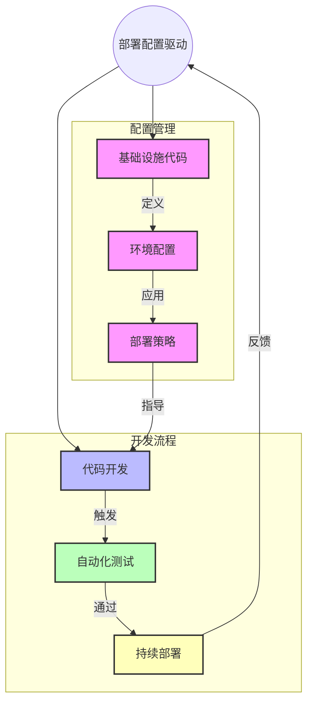

[返回目录](./README.md) | [上一章：监控驱动开发](./第十一章-监控驱动开发.md) | [下一章：AI提示工程高级技巧](./第十三章-AI提示工程高级技巧.md)

# 第十二章：部署配置驱动开发

## 12.1 部署配置驱动开发基础

部署配置驱动开发（Deployment Configuration Driven Development, DCDD）是一种通过定义清晰的部署配置和基础设施代码来指导系统开发的方法。这种方法确保应用程序能够可靠地部署和运行在不同环境中。

## 12.2 核心概念

### 12.2.1 基础设施即代码（IaC）
1. **容器化配置**
   - Dockerfile定义
   - 镜像构建优化
   - 多阶段构建
   - 安全基线配置

2. **编排配置**
   - Kubernetes资源定义
   - 服务编排策略
   - 扩缩容规则
   - 资源限制

3. **网络配置**
   - 服务发现
   - 负载均衡
   - 网络策略
   - 流量控制

4. **存储配置**
   - 持久化存储
   - 数据备份
   - 存储类型
   - 访问控制

### 12.2.2 环境管理
1. **开发环境**
   - 本地开发配置
   - 依赖管理
   - 调试工具
   - 热重载

2. **测试环境**
   - 自动化测试
   - 性能测试
   - 安全测试
   - 集成测试

3. **预生产环境**
   - 生产数据验证
   - 性能基准测试
   - 容灾演练
   - 监控验证

4. **生产环境**
   - 高可用配置
   - 安全加固
   - 监控告警
   - 应急预案

## 12.3 部署配置驱动开发流程图



通过这个流程图，您可以看到部署配置驱动开发如何通过基础设施代码、环境配置和部署策略来指导开发流程，并通过自动化测试和持续部署来保证系统的可靠性。

## 12.4 实战案例：微服务应用部署

### 12.4.1 Docker容器配置

```dockerfile
# 构建阶段
FROM python:3.9-slim as builder

WORKDIR /app

# 安装构建依赖
COPY requirements.txt .
RUN pip install --user -r requirements.txt

# 运行阶段
FROM python:3.9-slim

WORKDIR /app

# 复制依赖
COPY --from=builder /root/.local /root/.local
ENV PATH=/root/.local/bin:$PATH

# 复制应用代码
COPY . .

# 安全配置
RUN useradd -m appuser && \
    chown -R appuser:appuser /app
USER appuser

# 健康检查
HEALTHCHECK --interval=30s --timeout=3s \
    CMD curl -f http://localhost:8000/health || exit 1

# 启动应用
CMD ["uvicorn", "main:app", "--host", "0.0.0.0", "--port", "8000"]
```

### 12.4.2 Kubernetes部署配置

```yaml
# deployment.yaml
apiVersion: apps/v1
kind: Deployment
metadata:
  name: myapp
  namespace: production
spec:
  replicas: 3
  selector:
    matchLabels:
      app: myapp
  template:
    metadata:
      labels:
        app: myapp
    spec:
      containers:
      - name: myapp
        image: myapp:1.0.0
        ports:
        - containerPort: 8000
        resources:
          requests:
            cpu: "100m"
            memory: "128Mi"
          limits:
            cpu: "500m"
            memory: "512Mi"
        livenessProbe:
          httpGet:
            path: /health
            port: 8000
          initialDelaySeconds: 30
          periodSeconds: 10
        readinessProbe:
          httpGet:
            path: /ready
            port: 8000
          initialDelaySeconds: 5
          periodSeconds: 5
        env:
        - name: DATABASE_URL
          valueFrom:
            secretKeyRef:
              name: db-secret
              key: url
        - name: REDIS_HOST
          valueFrom:
            configMapKeyRef:
              name: redis-config
              key: host

---
# service.yaml
apiVersion: v1
kind: Service
metadata:
  name: myapp-service
spec:
  selector:
    app: myapp
  ports:
  - port: 80
    targetPort: 8000
  type: LoadBalancer

---
# configmap.yaml
apiVersion: v1
kind: ConfigMap
metadata:
  name: app-config
data:
  ENVIRONMENT: "production"
  LOG_LEVEL: "info"
  REDIS_HOST: "redis-master"
```

### 12.4.3 CI/CD配置

```yaml
# .github/workflows/main.yml
name: CI/CD Pipeline

on:
  push:
    branches: [ main ]
  pull_request:
    branches: [ main ]

jobs:
  test:
    runs-on: ubuntu-latest
    steps:
    - uses: actions/checkout@v2
    
    - name: Set up Python
      uses: actions/setup-python@v2
      with:
        python-version: '3.9'
        
    - name: Install dependencies
      run: |
        python -m pip install --upgrade pip
        pip install -r requirements.txt
        
    - name: Run tests
      run: |
        pytest tests/
        
    - name: Run security scan
      uses: snyk/actions/python@master
      env:
        SNYK_TOKEN: ${{ secrets.SNYK_TOKEN }}

  build:
    needs: test
    runs-on: ubuntu-latest
    steps:
    - uses: actions/checkout@v2
    
    - name: Build Docker image
      run: |
        docker build -t myapp:${{ github.sha }} .
        
    - name: Run Trivy vulnerability scanner
      uses: aquasecurity/trivy-action@master
      with:
        image-ref: 'myapp:${{ github.sha }}'
        format: 'table'
        exit-code: '1'
        severity: 'CRITICAL'

  deploy:
    needs: build
    runs-on: ubuntu-latest
    if: github.ref == 'refs/heads/main'
    steps:
    - name: Configure AWS credentials
      uses: aws-actions/configure-aws-credentials@v1
      with:
        aws-access-key-id: ${{ secrets.AWS_ACCESS_KEY_ID }}
        aws-secret-access-key: ${{ secrets.AWS_SECRET_ACCESS_KEY }}
        aws-region: us-west-2
        
    - name: Deploy to EKS
      run: |
        aws eks update-kubeconfig --name my-cluster
        kubectl apply -f k8s/
```

## 12.5 部署配置最佳实践

### 12.5.1 环境配置管理
1. **配置分离**
   - 使用环境变量
   - 配置文件管理
   - 密钥管理
   - 版本控制

2. **配置验证**
   - 语法检查
   - 环境一致性
   - 安全审计
   - 依赖分析

### 12.5.2 容器化最佳实践
1. **镜像构建**
   - 多阶段构建
   - 基础镜像选择
   - 层优化
   - 缓存利用

2. **安全加固**
   - 最小权限
   - 漏洞扫描
   - 镜像签名
   - 运行时保护

### 12.5.3 自动化部署流程
1. **持续集成**
   - 代码检查
   - 单元测试
   - 集成测试
   - 性能测试

2. **持续部署**
   - 自动化发布
   - 回滚机制
   - 灰度发布
   - 监控集成

## 12.6 常见问题和解决方案

### 12.6.1 配置管理问题
1. **配置漂移**
   - 问题：环境配置不一致
   - 解决：配置版本控制
   - 预防：自动化配置检查

2. **密钥泄露**
   - 问题：敏感信息暴露
   - 解决：密钥管理系统
   - 预防：访问控制审计

3. **依赖冲突**
   - 问题：版本不兼容
   - 解决：依赖锁定
   - 预防：依赖分析工具

### 12.6.2 部署问题
1. **部署失败**
   - 问题：服务启动异常
   - 解决：自动回滚
   - 预防：预发布验证

2. **性能劣化**
   - 问题：服务响应慢
   - 解决：资源优化
   - 预防：性能基准测试

3. **服务依赖**
   - 问题：级联故障
   - 解决：熔断降级
   - 预防：依赖健康检查

## 12.7 小结

1. 部署配置驱动提升系统可靠性
2. 自动化流程保障部署质量
3. 最佳实践指导实施过程
4. 持续优化改进部署体系

---

[返回目录](./README.md) | [上一章：监控驱动开发](./第十一章-监控驱动开发.md) | [下一章：AI提示工程高级技巧](./第十三章-AI提示工程高级技巧.md)
