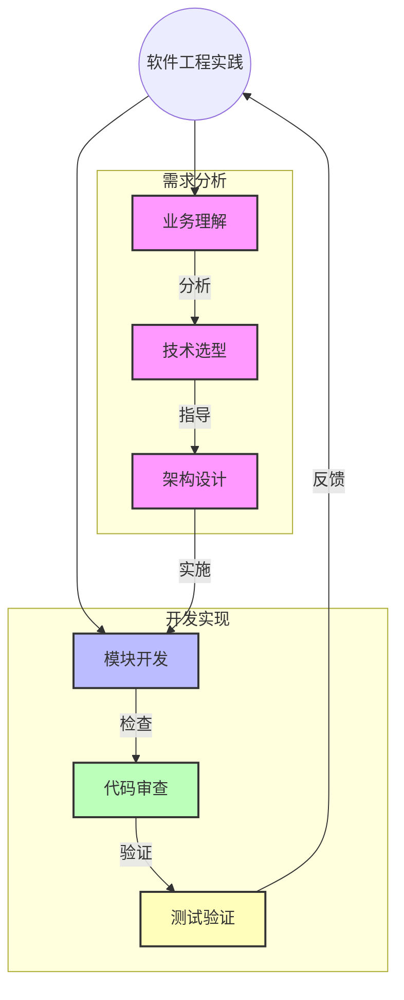

[返回目录](./README.md) | [上一章：部署配置驱动开发](./第十二章-部署配置驱动开发.md) | [下一章：总结-AI辅助开发高级实践](./总结-AI辅助开发高级实践.md)

# 第十三章：软件工程高级实践

## 13.1 软件工程实践基础

软件工程实践是一门将业务需求准确转化为技术实现的方法论。掌握高级工程实践技巧可以显著提高开发效率和代码质量。

## 13.2 核心概念

### 13.2.1 工程实践要素
1. **上下文管理**
   - 业务场景
   - 技术栈选择
   - 架构约束
   - 性能要求

2. **开发策略**
   - 模块化设计
   - 分层架构
   - 接口设计
   - 数据流转

3. **质量保证**
   - 代码审查
   - 自动化测试
   - 性能测试
   - 安全审计

4. **文档规范**
   - 架构文档
   - 接口文档
   - 部署文档
   - 运维手册

## 13.3 软件工程实践流程图



通过这个流程图，您可以看到软件工程实践如何通过需求分析、技术选型和架构设计来指导开发流程，并通过代码审查和测试验证来保证系统质量。

## 13.4 实战案例：复杂功能开发

### 13.4.1 文件处理服务实现

```python
from abc import ABC, abstractmethod
from typing import Dict, Any
import logging
from pathlib import Path

# 1. 定义文件处理器接口
class FileProcessor(ABC):
    @abstractmethod
    def process(self, file_path: Path) -> Dict[str, Any]:
        """处理文件并返回提取的数据"""
        pass

# 2. 实现具体的处理器
class PDFProcessor(FileProcessor):
    def process(self, file_path: Path) -> Dict[str, Any]:
        try:
            logging.info(f"开始处理PDF文件: {file_path}")
            # PDF处理逻辑
            return {"status": "success", "data": {...}}
        except Exception as e:
            logging.error(f"PDF处理错误: {str(e)}")
            raise

class ExcelProcessor(FileProcessor):
    def process(self, file_path: Path) -> Dict[str, Any]:
        try:
            logging.info(f"开始处理Excel文件: {file_path}")
            # Excel处理逻辑
            return {"status": "success", "data": {...}}
        except Exception as e:
            logging.error(f"Excel处理错误: {str(e)}")
            raise

# 3. 文件处理服务
class FileProcessingService:
    def __init__(self):
        self.processors = {
            ".pdf": PDFProcessor(),
            ".xlsx": ExcelProcessor(),
            # 添加更多处理器
        }
        self._setup_logging()
    
    def _setup_logging(self):
        logging.basicConfig(
            level=logging.INFO,
            format='%(asctime)s - %(name)s - %(levelname)s - %(message)s'
        )
    
    def process_file(self, file_path: str) -> Dict[str, Any]:
        path = Path(file_path)
        if not path.exists():
            raise FileNotFoundError(f"文件不存在: {file_path}")
            
        processor = self.processors.get(path.suffix.lower())
        if not processor:
            raise ValueError(f"不支持的文件类型: {path.suffix}")
            
        return processor.process(path)
```

### 13.4.2 系统重构实践

```python
from abc import ABC, abstractmethod
from typing import List

# 1. 定义接口
class OrderProcessor(ABC):
    @abstractmethod
    def process(self, order: Order) -> bool:
        pass

class PaymentProcessor(ABC):
    @abstractmethod
    def process_payment(self, order: Order) -> bool:
        pass

class InventoryManager(ABC):
    @abstractmethod
    def update_inventory(self, order: Order) -> bool:
        pass

# 2. 实现具体类
class OrderService:
    def __init__(
        self,
        payment_processor: PaymentProcessor,
        inventory_manager: InventoryManager,
        notification_service: NotificationService
    ):
        self.payment_processor = payment_processor
        self.inventory_manager = inventory_manager
        self.notification_service = notification_service
    
    def process_order(self, order: Order) -> bool:
        try:
            # 使用事务管理器确保操作的原子性
            with TransactionManager() as tx:
                if not self.payment_processor.process_payment(order):
                    return False
                    
                if not self.inventory_manager.update_inventory(order):
                    return False
                    
                self.notification_service.notify_customer(order)
                return True
                
        except Exception as e:
            logging.error(f"订单处理失败: {str(e)}")
            return False
```

### 13.4.3 性能优化实践

```python
from typing import Iterator, List
from concurrent.futures import ThreadPoolExecutor
from functools import lru_cache
import pandas as pd

class DataProcessor:
    def __init__(self, batch_size: int = 1000):
        self.batch_size = batch_size
        self.cache = {}
    
    def process_data(self, data_iterator: Iterator) -> List[dict]:
        # 1. 批量处理
        batches = self._create_batches(data_iterator)
        
        # 2. 并行处理
        with ThreadPoolExecutor() as executor:
            results = list(executor.map(self._process_batch, batches))
            
        # 3. 合并结果
        return [item for batch in results for item in batch]
    
    def _create_batches(self, iterator: Iterator) -> List[List]:
        """将数据分批处理，减少内存使用"""
        batch = []
        for item in iterator:
            batch.append(item)
            if len(batch) >= self.batch_size:
                yield batch
                batch = []
        if batch:
            yield batch
    
    @lru_cache(maxsize=1000)
    def _process_item(self, item: dict) -> dict:
        """处理单个数据项，使用缓存避免重复计算"""
        # 处理逻辑
        return processed_item
    
    def _process_batch(self, batch: List) -> List[dict]:
        """处理数据批次"""
        return [self._process_item(item) for item in batch]
```

## 13.5 工程实践最佳实践

### 13.5.1 架构设计原则
1. **模块化设计**
   - 高内聚低耦合
   - 接口隔离
   - 依赖倒置
   - 单一职责

2. **可扩展性设计**
   - 插件机制
   - 配置驱动
   - 服务发现
   - 负载均衡

### 13.5.2 代码质量保证
1. **代码规范**
   - 命名规范
   - 注释规范
   - 格式规范
   - 异常处理

2. **测试策略**
   - 单元测试
   - 集成测试
   - 性能测试
   - 安全测试

### 13.5.3 持续改进
1. **代码重构**
   - 消除重复
   - 提高可读性
   - 优化性能
   - 增强安全性

2. **技术债务**
   - 识别债务
   - 评估影响
   - 制定计划
   - 逐步改进

## 13.6 常见问题和解决方案

### 13.6.1 架构问题
1. **扩展性问题**
   - 问题：系统难以扩展
   - 解决：模块化设计
   - 预防：预留扩展点

2. **性能问题**
   - 问题：系统响应慢
   - 解决：性能优化
   - 预防：性能测试

3. **维护问题**
   - 问题：代码难以维护
   - 解决：重构改进
   - 预防：代码审查

### 13.6.2 开发问题
1. **质量问题**
   - 问题：代码质量差
   - 解决：规范执行
   - 预防：自动化检查

2. **协作问题**
   - 问题：团队配合差
   - 解决：流程优化
   - 预防：制定规范

3. **进度问题**
   - 问题：开发进度慢
   - 解决：任务分解
   - 预防：合理规划

## 13.7 小结

1. 工程实践提升开发效率
2. 规范流程保障代码质量
3. 持续优化改进系统
4. 团队协作促进发展

---

[返回目录](./README.md) | [上一章：部署配置驱动开发](./第十二章-部署配置驱动开发.md) | [下一章：总结-AI辅助开发高级实践](./总结-AI辅助开发高级实践.md)
