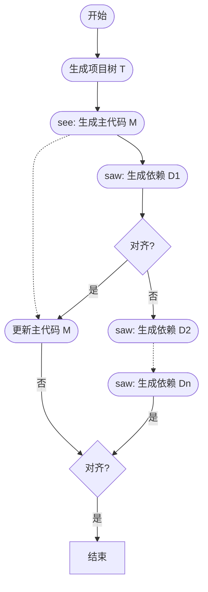
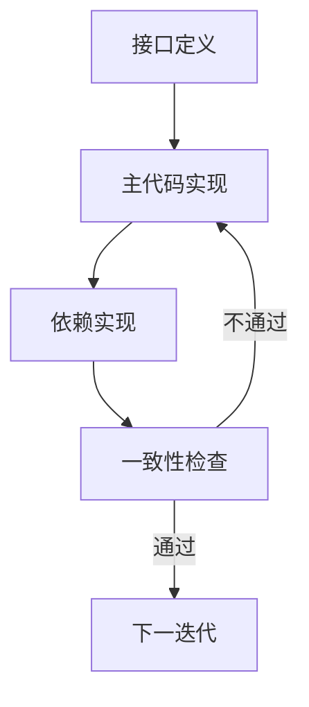

[回到目录](README.md)

上一章：[第十七章-AI辅助开发注意事项](17-AI辅助开发注意事项.md)

下一章：[第十九章-Cursor结合CodeTree的智能编程实践](19-Cursor结合CodeTree智能编程实践.md)

# IBM跷跷板机制分析与实践指南

## 现状与挑战

在深入探讨跷跷板机制之前，我们需要清晰地认识到当前生成式AI在处理大规模代码项目时面临的三大根本性挑战：

1. Token处理能力的天花板
大语言模型（LLMs）的token处理上限成为了制约其应用的首要瓶颈。这一限制使得模型无法同时生成或验证包含数百个文件的完整代码库，严重影响了其在大型项目中的实用性。这不仅仅是简单的规模问题，更涉及到如何在有限的计算资源下实现高效的代码生成。

2. 项目整体性的割裂
传统的生成方法往往将每个文件作为独立单元处理，这种"孤岛式"的生成策略导致：
- 缺乏对项目整体结构的认知
- 依赖关系错配和不兼容
- 代码组件间的协调性差
这种割裂不仅影响了代码质量，还大大增加了后期的维护成本。

3. 迭代优化的效率困境
在发现不一致性后，开发者不得不反复修改主代码和依赖文件。这种频繁的迭代不仅：
- 显著增加了计算资源消耗
- 延长了项目完成周期
- 影响了开发团队的工作效率

## 研究意义

在这样的背景下，一个能够有效处理大规模代码生成的新机制变得尤为重要。跷跷板生成机制的提出，不仅是对现有技术的改进，更代表了一种全新的思维方式：

1. 突破规模限制：通过创新的动态管理方法，有效突破了传统token限制的瓶颈
2. 保持整体一致：引入了系统性的项目结构感知，确保了代码组件间的协调性
3. 提升生成效率：采用智能的迭代优化策略，大幅降低了计算资源消耗

这项研究的重要性不仅体现在技术层面，更在于它为软件工程领域提供了一个可能的发展方向，为解决大规模代码生成的难题提供了新的思路。

## 跷跷板机制：创新性的解决方案

跷跷板生成机制通过其独特的设计理念和系统化的方法论，为大规模代码生成提供了一个全新的解决方案。这个机制不仅解决了现有技术的局限性，更开创了一种新的代码生成范式。



### 核心设计理念

1. 动态平衡的生成策略
跷跷板机制采用了类似跷跷板运动的动态平衡原理：
- See阶段：生成或优化主代码，融入依赖状态信息
- Saw阶段：基于更新后的主代码生成相应依赖
- 交替进行：通过不断的平衡调节，确保代码质量和一致性

2. 层次化项目结构
系统通过构建层次化的项目树T来管理代码生成：
```
T = (M, {Di}ni=1)
```
其中：
- M：代表主代码（根节点）
- {Di}：表示依赖文件（子节点）
- n：依赖文件的数量

3. 数学化的生成过程
生成过程由两个核心函数驱动：
```
M(t+1) = f(T, {D(t)i}ni=1)
D(t+1)i = g(M(t+1), {D(t)j}nj≠i)
```
这种数学化的表达确保了生成过程的严谨性和可控性。

### 创新性工作流程

1. 智能初始化
- 基于项目结构确定主文件
- 识别关键依赖关系
- 建立项目组件间的层次关系

2. 动态生成循环
系统采用创新的"跷跷板"式交替生成方式：
- 主代码生成（See）
  * 整合当前依赖状态
  * 优化代码结构
  * 确保接口一致性
- 依赖生成（Saw）
  * 基于主代码更新依赖
  * 保持组件间同步
  * 处理交叉依赖

3. 验证与对齐机制
系统引入了强大的验证函数h：
```
h(M, {Di}ni=1) = True/False
```
- 实时监控代码一致性
- 提供精确的错误反馈
- 指导优化方向

### 突破性创新点

1. 解决Token限制
- 通过动态分配管理token使用
- 实现大规模项目的有效处理
- 保持代码质量的同时提升效率

2. 智能依赖管理
- 建立系统化的项目结构感知
- 自动协调组件间关系
- 降低维护成本

3. 高效迭代优化
- 采用递归优化策略
- 快速收敛到最优解
- 显著减少计算资源消耗

## 收敛保证

跷跷板机制通过严格的数学条件保证了生成过程的收敛：

1. 压缩映射条件
```
∥M(t+1) - M(t)∥ + Σ∥D(t+1)i - D(t)i∥ < ϵ
```

2. 验证稳定性
```
h(M(t+1), {D(t+1)i}ni=1) = True
```

3. 依赖独立性
当依赖间关系简化时，优化过程可以更快收敛。这些条件共同确保了生成过程能够稳定收敛到理想的解决方案。

## 软件工程师实践指南

跷跷板机制不仅是一个理论框架，更为工程师提供了一套实用的代码生成方法论。基于研究团队的实验结果和实践经验，我们可以总结出以下关键启示。

### 项目结构设计

1. 模块化分解策略
在处理大型项目时，建议采用以下分解方法：
- 核心功能识别：明确区分主要功能模块
- 依赖关系梳理：建立清晰的组件依赖图
- 接口定义优先：先确定模块间的交互接口

2. 层次化设计策略
针对不同层次的代码生成任务，设计相应的模块：
- 项目级设计：
  * 整体架构定义
  * 技术栈选择
  * 核心功能列表
- 模块级设计：
  * 具体功能实现
  * 接口规范
  * 依赖要求
- 组件级设计：
  * 实现细节
  * 测试用例
  * 文档要求

### 实践技巧与策略

1. 迭代生成策略
采用渐进式的代码生成方法：
- 框架搭建
  * 先生成项目骨架
  * 定义关键接口
  * 建立基础配置
- 功能实现
  * 逐步添加核心功能
  * 确保模块间协调
  * 及时验证一致性
- 优化完善
  * 代码质量提升
  * 性能优化
  * 文档补充

2. 质量控制机制
建立多层次的代码质量保障体系：
- 静态检查
  * 代码风格一致性
  * 接口规范性
  * 依赖完整性
- 动态验证
  * 功能测试
  * 集成测试
  * 性能评估

## 实战案例：Chat模块开发

### 项目概述

Chat模块是我团队的一个核心功能，负责处理实时通讯、智能对话和客户服务。基于IBM研究团队提出的跷跷板生成机制（See-Saw Generative Mechanism），我们采用创新的开发方法来提升开发效率和代码质量。

### 核心功能

1. 实时通讯
- WebSocket实时消息传输
- 多渠道集成(Web、Mobile、API)
- 消息队列与异步处理
- 在线状态管理

2. 智能客服
- 集成Dialogflow自然语言处理
- ChatGPT智能对话
- 知识库问答
- 自动回复与路由

3. 会话管理
- 多渠道会话统一
- 会话分配与转接
- 会话状态追踪
- 历史记录管理

4. 用户系统
- 访客识别
- 用户画像
- 权限管理
- 客服分组

5. 数据分析
- 会话数据统计
- 性能监控
- 客服效率分析
- 用户满意度追踪

### 技术架构

1. 后端服务
- Flask 2.2框架
- Python 3.10+
- WebSocket服务器
- Redis消息队列

2. 数据存储
- MySQL主数据库
- Redis缓存层
- MongoDB日志存储
- ElasticSearch全文检索

3. 外部集成
- Dialogflow API
- OpenAI API
- 各社交平台API
- 邮件服务

4. 部署环境
- Docker容器化
- CI/CD自动化
- 负载均衡
- 监控告警

## 跷跷板机制应用实践

### 主代码与依赖识别

#### 主代码(M)定位

1. 控制器层
```python
Controllers/
    - chat_controller.py      # 核心会话控制
    - message_controller.py   # 消息处理
    - user_controller.py      # 用户管理
    - dialogflow_controller.py # AI集成
```

2. 服务层
```python
Services/
    - chat_service.py        # 会话核心服务
    - message_service.py     # 消息处理服务
    - user_service.py        # 用户管理服务
    - dialogflow_service.py  # AI对话服务
```

3. 领域层
```python
Domain/
    - entities/             # 领域实体
    - repositories/         # 数据仓储
    - services/            # 领域服务
    - events/              # 领域事件
```

#### 依赖(Di)识别

1. 基础设施
```python
Infrastructure/
    - websocket/           # WebSocket服务
    - queue/              # 消息队列
    - cache/              # 缓存服务
    - search/             # 搜索服务
```

2. 外部服务
```python
External/
    - dialogflow/         # Dialogflow集成
    - openai/            # ChatGPT集成
    - email/             # 邮件服务
    - sms/               # 短信服务
```

### 生成策略应用

#### See阶段（主代码生成）

1. 控制器层生成
```python
from dataclasses import dataclass
from typing import Any

class ChatController:
    def __init__(self, chat_service, user_service):
        self.chat_service = chat_service
        self.user_service = user_service
    
    def handle_message(self, request: Any) -> None:
        # 消息处理逻辑
        pass
```

2. 服务层生成
```python
class ChatService:
    def __init__(self, message_repo, dialogflow):
        self.message_repo = message_repo
        self.dialogflow = dialogflow
    
    def process_message(self, message: 'Message') -> None:
        # 消息处理核心逻辑
        pass
```

#### Saw阶段（依赖生成）

1. 仓储层生成
```python
from abc import ABC, abstractmethod

class MessageRepositoryInterface(ABC):
    @abstractmethod
    def save(self, message: 'Message') -> None:
        pass

class MessageRepository(MessageRepositoryInterface):
    def save(self, message: 'Message') -> None:
        # 数据持久化逻辑
        pass
```

2. 外部服务集成
```python
@dataclass
class Message:
    id: str
    content: str
    type: str
    status: str
```

### 实践建议

#### 分层生成顺序

1. 领域层（Domain Layer）
- 实体定义
- 值对象
- 领域服务

2. 应用层（Application Layer）
- 应用服务
- 命令处理器
- 事件处理器

3. 基础设施层（Infrastructure Layer）
- 数据访问
- 缓存实现
- 消息队列

#### 代码一致性检查



#### 依赖注入管理

```python
# 服务提供者
class ChatServiceProvider:
    def register(self):
        # 注册服务
        pass
```

### 优化建议

#### 接口定义优先

1. 定义清晰的服务接口
```python
interface MessageServiceInterface:
    def send_message(self, content: str, user_id: int) -> 'Message':
        pass
    def process_incoming(self, payload: dict) -> None:
        pass
```

2. 设计稳定的数据契约
```python
interface MessageRepositoryInterface:
    def find_by_id(self, id: int) -> 'Message':
        pass
    def save(self, message: 'Message') -> None:
        pass
```

#### 测试驱动开发

1. 单元测试
```python
class MessageServiceTest:
    def test_can_send_message(self):
        # 测试消息发送逻辑
        pass
```

2. 集成测试
```python
class ChatControllerTest:
    def test_can_handle_incoming_message(self):
        # 测试消息处理流程
        pass
```

## 开发流程

### 1. 初始化阶段

基于跷跷板机制的See阶段：

1. 项目结构初始化
- 遵循Flask模块化规范
- 建立领域驱动的目录结构
- 配置基础依赖

2. 核心服务开发
- 消息处理服务
- 会话管理服务
- 用户管理服务
- AI集成服务

### 2. 依赖生成阶段（Saw阶段）

1. 数据层
- 数据模型
- 数据仓储
- 缓存服务

2. 外部服务
- AI服务集成
- 消息推送服务
- 第三方平台集成

3. 基础设施
- WebSocket服务
- 消息队列
- 日志服务

### 3. 迭代优化

在See-Saw机制的指导下，进行循环优化：

1. 性能优化
- 缓存策略
- 数据库索引
- 查询优化

2. 可靠性提升
- 异常处理
- 日志记录
- 监控告警

## 最佳实践

### 开发建议

1. 模块化开发
- 保持服务的单一职责
- 使用接口定义服务边界
- 避免循环依赖

2. 测试驱动
- 编写单元测试
- 进行集成测试
- 性能测试

3. 文档维护
- 及时更新API文档
- 记录关键决策
- 维护变更日志

## 常见问题

### 1. 性能优化

Q: 消息处理延迟较高怎么办？
A: 
- 使用队列处理非实时消息
- 优化数据库查询
- 实现多级缓存

### 2. 可扩展性

Q: 如何支持新的消息类型？
A:
- 使用策略模式处理不同消息
- 实现消息处理器接口
- 注册新的处理器

### 3. 稳定性

Q: 如何处理第三方服务异常？
A:
- 实现熔断机制
- 添加重试策略
- 完善日志记录

## Prompt 设计和实现

### Prompt 设计原则

1. 明确性
- 清晰定义输入和输出
- 提供具体的约束条件
- 说明上下文关系

2. 完整性
- 包含所有必要信息
- 考虑异常情况
- 提供验证条件

3. 可维护性
- 模块化设计
- 版本控制
- 文档完善

### Prompt 应用实践

#### 生成领域模型示例

```plaintext
请基于以下领域模型定义生成实现代码：

实体：Message
属性：
- id: 消息ID
- content: 消息内容
- type: 消息类型
- status: 消息状态
- sender: 发送者
- conversation: 所属会话
- createdAt: 创建时间

行为：
- send(): 发送消息
- recall(): 撤回消息
- delete(): 删除消息

约束：
1. 消息内容不能为空
2. 消息类型必须有效
3. 发送者必须存在
```

生成的代码示例：

```python
from dataclasses import dataclass
from typing import Any

@dataclass
class Message:
    id: str
    content: str
    type: str
    status: str
    sender: str
    conversation: str
    created_at: str
    
    def send(self) -> None:
        # 发送消息逻辑
        pass
    
    def recall(self) -> None:
        # 撤回消息逻辑
        pass
    
    def delete(self) -> None:
        # 删除消息逻辑
        pass
```
跷跷板生成机制的提出，标志着软件工程领域的一个重要突破。这一创新性的解决方案不仅从理论和实践两个层面解决了大规模代码生成的核心痛点，更为未来的技术发展指明了方向。

#### 生成应用服务示例

```plaintext
请基于以下应用场景生成应用服务实现：

场景：聊天消息处理
功能要求：
1. 消息发送和接收
2. 实时通知
3. 消息持久化
4. 离线消息处理

请生成：
1. 应用服务接口
2. 命令和查询对象
3. 事件处理器
4. 外部服务集成
```

生成的代码示例：

```python
from abc import ABC, abstractmethod
from dataclasses import dataclass
from typing import Any

interface MessageServiceInterface:
    @abstractmethod
    def send_message(self, content: str, user_id: int) -> 'Message':
        pass
    @abstractmethod
    def process_incoming(self, payload: dict) -> None:
        pass

@dataclass
class SendMessageCommand:
    content: str
    user_id: int

class MessageService(MessageServiceInterface):
    def __init__(self, message_repo, notification_service):
        self.message_repo = message_repo
        self.notification_service = notification_service
    
    def send_message(self, content: str, user_id: int) -> 'Message':
        # 发送消息逻辑
        pass
    
    def process_incoming(self, payload: dict) -> None:
        # 处理实时通知逻辑
        pass
```

### Prompt 优化策略

#### 代码质量优化

```plaintext
请对以下代码进行质量优化：

优化方向：
1. 代码可读性
2. 性能优化
3. 安全性增强
4. 可维护性提升

关注点：
1. 命名规范
2. 代码结构
3. 错误处理
4. 性能瓶颈
```

#### 测试覆盖优化

```plaintext
请生成以下组件的完整测试用例：

测试类型：
1. 单元测试
2. 集成测试
3. 性能测试

覆盖要求：
1. 核心业务逻辑
2. 异常处理
3. 边界条件
4. 并发场景
```

### 实践经验总结

#### Prompt 设计原则

1. 明确性
- 清晰定义输入和输出
- 提供具体的约束条件
- 说明上下文关系

2. 完整性
- 包含所有必要信息
- 考虑异常情况
- 提供验证条件

3. 可维护性
- 模块化设计
- 版本控制
- 文档完善

#### 最佳实践建议

1. 开发流程
- 先设计后实现
- 迭代优化
- 及时重构

2. 质量控制
- 代码审查
- 自动化测试
- 性能监控

3. 团队协作
- 知识共享
- 经验总结
- 持续改进


### Prompt 分层设计

#### 1. 架构层 Prompt

用于生成整体架构和核心组件：

```plaintext
作为一个 Chat 模块的架构设计专家，请设计一个基于 Flask 的实时聊天系统：

要求：
1. 使用领域驱动设计（DDD）思想
2. 支持实时通讯和 AI 对话
3. 包含以下核心功能：
   - 实时消息处理
   - 会话管理
   - 用户管理
   - AI 集成

输出格式：
1. 目录结构
2. 核心组件
3. 依赖关系
4. 数据流图
```

#### 2. 领域层 Prompt

用于生成领域模型和业务逻辑：

```plaintext
基于以下领域模型定义，生成相应的代码实现：

领域：Chat 聊天系统
核心实体：
- Conversation（会话）
- Message（消息）
- User（用户）

业务规则：
1. 会话必须包含至少两个参与者
2. 消息必须属于某个会话
3. 支持多种消息类型（文本、图片、文件）

请生成：
1. 实体类定义
2. 值对象定义
3. 领域服务接口
4. 领域事件定义
```

#### 3. 应用层 Prompt

用于生成应用服务和接口：

```plaintext
基于以下应用场景，生成应用服务实现：

场景：聊天消息处理
功能要求：
1. 消息发送和接收
2. 实时通知
3. 消息持久化
4. 离线消息处理

请生成：
1. 应用服务接口
2. 命令和查询对象
3. 事件处理器
4. 外部服务集成
```

#### 4. 基础设施层 Prompt

用于生成技术实现：

```plaintext
基于以下技术要求，生成基础设施实现：

技术栈：
- Flask 2.2
- Python 3.10+
- WebSocket
- Redis

要求：
1. 实现仓储接口
2. 配置消息队列
3. 设置缓存策略
4. 实现日志记录

请生成：
1. 仓储实现类
2. 消息队列配置
3. 缓存服务实现
4. 日志记录实现

```
## 结论

跷跷板生成机制的提出，标志着AI辅助编程领域的一个重要突破。这一创新性的解决方案不仅从理论和实践两个层面解决了大规模代码生成的核心痛点，更为未来的技术发展指明了方向。
### 核心贡献
1. 理论突破
- 提出了创新的递归自适应框架
- 建立了严谨的数学模型
- 证明了方法的收敛性和可靠性

2. 技术创新
- 解决了token限制的瓶颈问题
- 实现了智能的依赖管理
- 提供了高效的迭代优化方案

3. 实践价值
- 显著提升了代码生成效率
- 保证了生成代码的质量
- 降低了开发维护成本

### 重要意义

跷跷板机制的发展仍然面临着挑战，但其潜力和价值是显而易见的。未来，随着技术的不断进步和实践的深入，我们有理由相信：

1. 技术演进
- 技术的持续进步将进一步增强机制的能力
- 新的优化方法将提升系统的性能
- 更多创新应用将不断涌现

2. 应用拓展
- 更多领域将采用这一机制
- 企业级应用将更加普及
- 生态系统将更加完善

3. 行业影响
- 软件开发模式将发生深刻变革
- 开发效率将大幅提升
- 代码质量将持续改善

## 参考资源

1. IBM Research Blog (2024) - "See-Saw Mechanism: A New Paradigm for Large-Scale Code Generation"
2. IEEE Software Engineering Conference (2024) - "Dynamic Context Management in AI-Assisted Programming"
3. ACM SIGPLAN (2024) - "Dependency Graph Optimization for Large-Scale Software Projects"
4. GitHub - IBM See-Saw Mechanism Reference Implementation
5. IBM Developer Documentation - See-Saw Mechanism Integration Guide
6. 示例代码仓库：github.com/ibm/see-saw-examples
7. [用AI工具生成代码，Token不够，项目割裂，看一下IBM最新的跷跷板机制](https://mp.weixin.qq.com/s/sVB9pbbSjvPl-wu6_eSA1A) - AI修猫Prompt

[回到目录](README.md)

上一章：[第十七章-AI辅助开发注意事项](17-AI辅助开发注意事项.md)

下一章：[第十九章-Cursor结合CodeTree的智能编程实践](19-Cursor结合CodeTree智能编程实践.md)