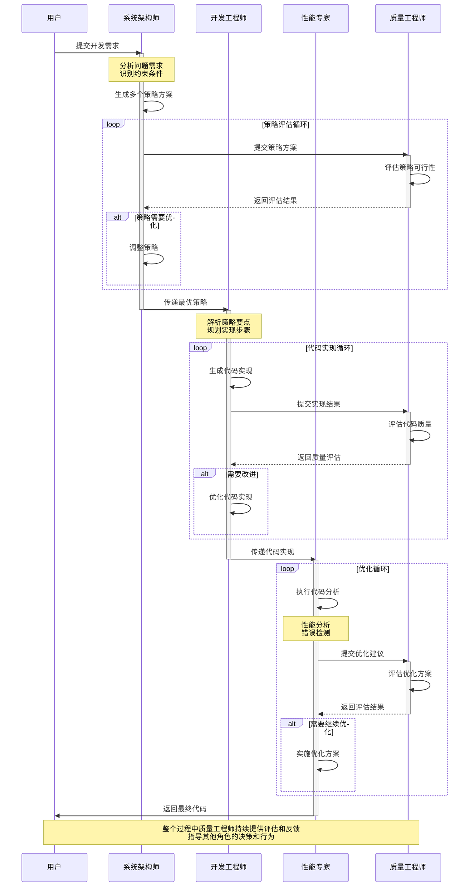
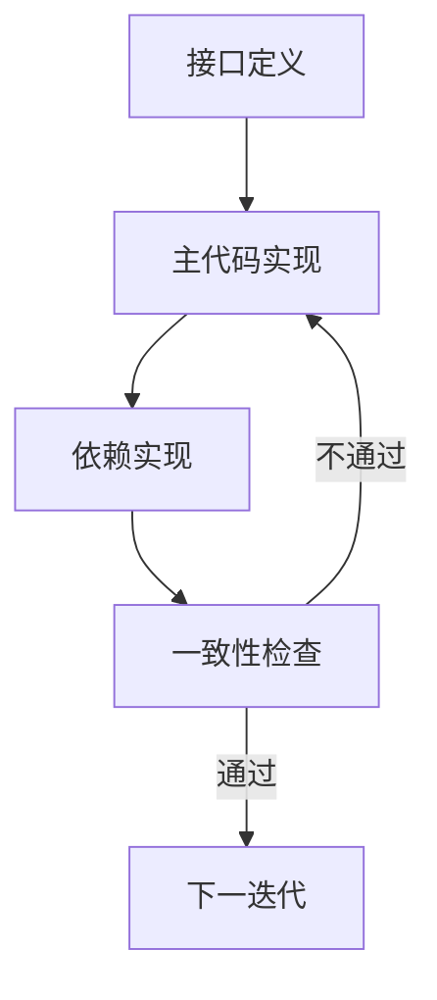

[回到目录](README.md)

上一章：[第十八章-IBM跷跷板机制分析](第十八章-IBM跷跷板机制分析.md)

下一章：[第二十章-Cursor结合Devin的智能编程实践](第二十章-Cursor结合Devin的智能编程实践.md)

# 第十九章 CodeTree智能编程实践

## 引言

在当今的软件开发领域，我们经常面临着一个共同的挑战：如何让AI更好地理解和实现我们的编程需求？虽然像如今2024年末 GPT-o1,Claude 3.5 sonat, Google gemini 2 等大语言模型在代码生成方面表现出色，但在处理复杂项目时，往往会遇到以下问题：

1. 代码生成缺乏系统性思考
2. 难以保持多个模块之间的一致性
3. 优化过程不够透明和可控
4. 难以平衡质量和效率

最近，Devin AI公司推出的智能程序员Devin引起了广泛关注。通过深入研究其背后的技术，我们发现CodeTree这个核心方案为解决上述问题提供了一个优雅的答案。

那么，CodeTree究竟是如何解决这些问题的？它的核心理念是什么？我们又该如何在实际项目中运用这个方案呢？

## 19.1 认识CodeTree：一个革新性的方案

想象一下，如果我们能像专业的软件开发团队那样，让不同的角色各司其职，会是什么样的情况？CodeTree正是基于这样的思路，提出了一个多角色协作的框架。

在传统的开发方案中，我们往往是把所有任务都交给一个开发者来处理。这就像让一个全栈工程师独自完成整个项目 - 虽然可行，但并非最优解。CodeTree另辟蹊径，引入了专门的角色分工：

- 系统架构师：负责思考整体策略
- 开发工程师：专注于代码实现
- 性能专家：专门进行优化和调试
- 质量工程师：负责质量控制

这种分工不仅让每个环节都能得到专门的关注，更重要的是，它为整个开发过程带来了前所未有的可控性和透明度。

### 19.1.1 多角色协作机制：让团队协作更高效

在软件开发团队中,不同角色的分工合作是一种经过实践检验的高效模式。这是因为复杂的软件开发过程需要不同视角和专业知识的配合。CodeTree正是将这种团队协作模式系统化,形成了一套完整的开发框架。

让我们来看看这个专业开发团队是如何工作的：

#### 团队协作时序图



#### 1. 系统架构师：项目的顶层设计者

就像优秀的技术架构师会在动手编码前先进行深入的思考和规划,系统架构师肩负着项目的顶层设计职责。他们需要:
- 全局性思考：从系统层面分析问题
- 战略性规划：设计多个可行的解决方案
- 预见性判断：评估每个方案的优劣势
- 迭代性改进：根据反馈调整策略

这种深思熟虑的方式,让我们避免了"想到哪写到哪"的随意性,为整个开发过程奠定了坚实的基础。

#### 2. 开发工程师：代码实现专家

有了清晰的策略后,接下来就是将想法转化为代码。开发工程师作为代码实现的专家,他们知道：
- 如何将抽象的策略转化为具体的实现
- 在编码时需要注意哪些细节
- 如何确保代码的质量和可维护性
- 何时需要寻求其他团队成员的帮助

#### 3. 性能专家：优化调试工程师

在软件开发中,写代码只是第一步,让代码高效稳定地运行才是真正的挑战。性能专家作为优化调试的工程师,他们会：
- 仔细分析代码中的问题
- 提出有针对性的优化方案
- 验证优化的效果
- 确保不会引入新的问题

#### 4. 质量工程师：代码质量把关人

要确保整个开发过程的质量,我们需要专业的质量工程师。他们扮演着质量把关的关键角色：
- 评估每个决策的合理性
- 审查代码的质量
- 提供建设性的反馈
- 指导其他团队成员改进

### 19.1.2 树形结构：让开发过程可控可追溯

在理解了团队协作机制后,你可能会问：如何组织和管理团队的工作成果？这就要说到CodeTree的另一个创新 - 树形结构的开发过程管理。

想象一下专业的项目管理流程：它会提前规划多个可能的实现路径,并对每种方案的可行性进行评估。CodeTree采用了类似的思路,将整个开发过程组织成一个动态生长的决策树。

### 19.1.2 树结构设计原理

CodeTree的核心创新在于引入了统一的树结构来组织和管理开发过程。这种设计模拟了专业软件团队解决问题的思维过程：

1. **分层策略设计**
   - **根节点**：
     - 完整的问题描述
     - 功能需求列表
     - 性能要求指标
     - 测试用例集合
   
   - **第一层策略节点**：
     - 多个解决方案建议
     - 每个策略的优劣分析
     - 资源需求评估
     - 实现难度评级
   
   - **第二层实现节点**：
     - 具体的代码实现
     - 单元测试代码
     - 接口文档
     - 部署配置
   
   - **优化层节点**：
     - 性能优化版本
     - 代码重构方案
     - 安全加固措施
     - 可维护性改进

2. **节点属性设计**
   - **代码内容**：
     - 源代码文件
     - 配置文件
     - 文档说明
   
   - **评估指标**：
     - 测试覆盖率
     - 性能指标
     - 代码质量分数
     - 安全扫描结果
   
   - **优化建议**：
     - 性能改进点
     - 代码异味
     - 最佳实践建议
     - 安全漏洞修复

### 19.1.3 团队协作实现

1. **系统架构师**
   ```python
   class SystemArchitect:
       def analyze_problem(self, problem_description):
           # 问题分析
           key_points = self._extract_key_points(problem_description)
           constraints = self._identify_constraints(problem_description)
           
           # 策略生成
           strategies = []
           for approach in self._generate_approaches(key_points, constraints):
               strategy = {
                   'name': approach.name,
                   'description': approach.description,
                   'pros': approach.advantages,
                   'cons': approach.disadvantages,
                   'complexity': approach.estimate_complexity(),
                   'resources': approach.required_resources
               }
               strategies.append(strategy)
           
           return strategies
   ```

2. **开发工程师**
   ```python
   class Developer:
       def implement_strategy(self, strategy, requirements):
           # 代码框架生成
           code_structure = self._generate_structure(strategy)
           
           # 核心逻辑实现
           implementation = self._implement_core_logic(code_structure, requirements)
           
           # 测试代码生成
           tests = self._generate_tests(implementation, requirements)
           
           return {
               'implementation': implementation,
               'tests': tests,
               'docs': self._generate_docs(implementation)
           }
   ```

3. **性能专家**
   ```python
   class PerformanceExpert:
       def optimize_code(self, code_implementation, feedback):
           # 性能分析
           performance_issues = self._analyze_performance(code_implementation)
           
           # 代码优化
           optimized_code = self._apply_optimizations(
               code_implementation,
               performance_issues
           )
           
           # 验证优化效果
           optimization_metrics = self._validate_optimizations(
               optimized_code,
               feedback
           )
           
           return {
               'optimized_code': optimized_code,
               'metrics': optimization_metrics,
               'changes': self._document_changes()
           }
   ```

4. **质量工程师**
   ```python
   class QualityEngineer:
       def evaluate_solution(self, implementation, requirements):
           # 质量评估
           quality_score = self._assess_code_quality(implementation)
           
           # 性能评估
           performance_score = self._measure_performance(implementation)
           
           # 安全评估
           security_score = self._security_audit(implementation)
           
           # 综合评分
           overall_score = self._calculate_overall_score(
               quality_score,
               performance_score,
               security_score
           )
           
           return {
               'overall_score': overall_score,
               'quality_details': quality_score,
               'performance_details': performance_score,
               'security_details': security_score,
               'recommendations': self._generate_recommendations()
           }
   ```

## 19.2 CodeTree方案的工程实现

### 19.2.1 开发环境准备

1. **开发工具配置**
   ```bash
   # 1. 配置开发环境
   python -m venv venv
   source venv/bin/activate
   
   # 2. 安装必要依赖
   pip install -r requirements.txt
   
   # 3. 安装开发工具
   pip install pytest black mypy
   ```

2. **项目结构设计**
   ```
   codetree/
   ├── core/               # 核心功能
   │   ├── architect/     # 架构设计
   │   ├── developer/     # 开发实现
   │   ├── expert/        # 性能优化
   │   └── qa/           # 质量保证
   │
   ├── utils/             # 工具函数
   │   ├── logger.py      # 日志工具
   │   ├── metrics.py     # 度量工具
   │   └── validators.py  # 验证工具
   │
   ├── tests/             # 测试用例
       ├── unit/          # 单元测试
       ├── integration/   # 集成测试
       └── performance/   # 性能测试
   ```

### 19.2.2 核心组件实现

1. **树结构实现**
```python
from dataclasses import dataclass
from typing import List, Optional, Dict, Any

@dataclass
class TreeNode:
    """代码生成树节点"""
    content: Dict[str, Any]  # 节点内容
    score: float = 0.0       # 节点评分
    parent: Optional['TreeNode'] = None
    children: List['TreeNode'] = None
    
    def __post_init__(self):
        self.children = self.children or []
    
    def add_child(self, node: 'TreeNode'):
        node.parent = self
        self.children.append(node)
    
    def get_path(self) -> List['TreeNode']:
        """获取从根节点到当前节点的路径"""
        path = []
        current = self
        while current:
            path.append(current)
            current = current.parent
        return list(reversed(path))

class CodeTree:
    """代码生成树实现"""
    def __init__(self):
        self.root = None
        self.current_node = None
    
    def initialize(self, problem_description: Dict[str, Any]):
        """初始化代码生成树"""
        self.root = TreeNode(content=problem_description)
        self.current_node = self.root
    
    def expand_node(self, node: TreeNode, strategies: List[Dict[str, Any]]):
        """扩展节点"""
        for strategy in strategies:
            child = TreeNode(content=strategy)
            node.add_child(child)
    
    def select_best_node(self, nodes: List[TreeNode]) -> TreeNode:
        """选择最佳节点"""
        return max(nodes, key=lambda x: x.score)
```

2. **搜索算法实现**
```python
class TreeSearch:
    """树搜索算法实现"""
    def __init__(self, tree: CodeTree, evaluator: 'NodeEvaluator'):
        self.tree = tree
        self.evaluator = evaluator
        self.visited_nodes = set()
    
    def breadth_first_search(self, max_width: int = 5):
        """广度优先搜索"""
        queue = [self.tree.root]
        while queue:
            level_nodes = []
            for _ in range(min(len(queue), max_width)):
                node = queue.pop(0)
                if node not in self.visited_nodes:
                    self.visited_nodes.add(node)
                    score = self.evaluator.evaluate(node)
                    node.score = score
                    level_nodes.append(node)
                queue.extend(node.children)
            
            if level_nodes:
                best_node = self.tree.select_best_node(level_nodes)
                yield best_node
    
    def depth_first_search(self, max_depth: int = 5):
        """深度优先搜索"""
        def dfs(node: TreeNode, depth: int):
            if depth > max_depth or node in self.visited_nodes:
                return
            
            self.visited_nodes.add(node)
            score = self.evaluator.evaluate(node)
            node.score = score
            yield node
            
            for child in sorted(node.children, key=lambda x: x.score, reverse=True):
                yield from dfs(child, depth + 1)
        
        yield from dfs(self.tree.root, 0)
```

3. **评估器实现**
```python
class NodeEvaluator:
    """节点评估器实现"""
    def evaluate(self, node: TreeNode) -> float:
        """评估节点质量"""
        # 功能性评分
        functional_score = self._evaluate_functional(node)
        
        # 质量性评分
        quality_score = self._evaluate_quality(node)
        
        # 策略匹配度评分
        strategy_score = self._evaluate_strategy_match(node)
        
        # 综合评分
        weights = {
            'functional': 0.4,
            'quality': 0.3,
            'strategy': 0.3
        }
        
        return (
            weights['functional'] * functional_score +
            weights['quality'] * quality_score +
            weights['strategy'] * strategy_score
        )
    
    def _evaluate_functional(self, node: TreeNode) -> float:
        """评估功能实现"""
        metrics = {
            'test_coverage': self._calculate_test_coverage(node),
            'error_rate': self._calculate_error_rate(node),
            'boundary_cases': self._check_boundary_cases(node)
        }
        return sum(metrics.values()) / len(metrics)
    
    def _evaluate_quality(self, node: TreeNode) -> float:
        """评估代码质量"""
        metrics = {
            'complexity': self._calculate_complexity(node),
            'maintainability': self._calculate_maintainability(node),
            'readability': self._calculate_readability(node)
        }
        return sum(metrics.values()) / len(metrics)
    
    def _evaluate_strategy_match(self, node: TreeNode) -> float:
        """评估策略匹配度"""
        metrics = {
            'consistency': self._check_strategy_consistency(node),
            'completeness': self._check_implementation_completeness(node),
            'innovation': self._evaluate_innovation_level(node)
        }
        return sum(metrics.values()) / len(metrics)
```

## 19.3 实战案例：智能待办事项系统

### 项目概述

待办事项系统是一个典型的企业级应用,需要处理实时任务管理、优先级排序和团队协作等复杂需求。基于CodeTree的开发框架,我们可以更高效地构建这个系统。

### 核心功能

1. 任务分类管理
- 自动分类系统
- 多渠道集成
- 任务队列处理
- 状态追踪

2. 优先级管理
- 集成业务规则引擎
- 智能任务排序
- 资源分配优化
- 自动任务调度

3. 会话管理
- 多渠道会话统一
- 会话分配与转接
- 会话状态追踪
- 历史记录管理

4. 用户系统
- 用户识别
- 用户画像
- 权限管理
- 团队分组

5. 数据分析
- 任务数据统计
- 性能监控
- 效率分析
- 满意度追踪

### 技术架构

1. 后端服务
- Flask 2.2框架
- Python 3.10+
- WebSocket服务器
- Redis消息队列

2. 数据存储
- MySQL主数据库
- Redis缓存层
- MongoDB日志存储
- ElasticSearch全文检索

3. 外部集成
- 规则引擎API
- 业务流程引擎
- 各平台API
- 邮件服务

4. 部署环境
- Docker容器化
- CI/CD自动化
- 负载均衡
- 监控告警

## 19.4 CodeTree框架应用实践

### 主代码与依赖识别

#### 主代码定位

1. 控制器层
```python
Controllers/
    - task_controller.py      # 核心任务控制
    - message_controller.py   # 消息处理
    - user_controller.py      # 用户管理
    - workflow_controller.py  # 工作流集成
```

2. 服务层
```python
Services/
    - task_service.py        # 任务核心服务
    - message_service.py     # 消息处理服务
    - user_service.py        # 用户管理服务
    - workflow_service.py    # 工作流服务
```

3. 领域层
```python
Domain/
    - entities/             # 领域实体
    - repositories/         # 数据仓储
    - services/            # 领域服务
    - events/              # 领域事件
```

#### 依赖识别

1. 基础设施
```python
Infrastructure/
    - websocket/           # WebSocket服务
    - queue/              # 消息队列
    - cache/              # 缓存服务
    - search/             # 搜索服务
```

2. 外部服务
```python
External/
    - workflow/           # 工作流集成
    - rules/             # 规则引擎
    - email/             # 邮件服务
    - sms/               # 短信服务
```

### 开发策略应用

#### 架构设计阶段

1. 控制器层设计
```python
from dataclasses import dataclass
from typing import Any

class TaskController:
    def __init__(self, task_service, user_service):
        self.task_service = task_service
        self.user_service = user_service
    
    def handle_task(self, request: Any) -> None:
        # 任务处理逻辑
        pass
```

2. 服务层设计
```python
class TaskService:
    def __init__(self, task_repo, workflow):
        self.task_repo = task_repo
        self.workflow = workflow
    
    def process_task(self, task: 'Task') -> None:
        # 任务处理核心逻辑
        pass
```

#### 实现阶段

1. 仓储层实现
```python
from abc import ABC, abstractmethod

class TaskRepositoryInterface(ABC):
    @abstractmethod
    def save(self, task: 'Task') -> None:
        pass

class TaskRepository(TaskRepositoryInterface):
    def save(self, task: 'Task') -> None:
        # 数据持久化逻辑
        pass
```

2. 外部服务集成
```python
@dataclass
class Task:
    id: str
    content: str
    type: str
    status: str
```

### 实践建议

#### 分层开发顺序

1. 领域层（Domain Layer）
- 实体定义
- 值对象
- 领域服务

2. 应用层（Application Layer）
- 应用服务
- 命令处理器
- 事件处理器

3. 基础设施层（Infrastructure Layer）
- 数据访问
- 缓存实现
- 消息队列

#### 代码一致性检查



#### 依赖注入管理

```python
# 服务提供者
class TaskServiceProvider:
    def register(self):
        # 注册服务
        pass
```

### 优化建议

#### 接口定义优先

1. 定义清晰的服务接口
```python
interface TaskServiceInterface:
    def create_task(self, content: str, user_id: int) -> 'Task':
        pass
    def process_incoming(self, payload: dict) -> None:
        pass
```

2. 设计稳定的数据契约
```python
interface TaskRepositoryInterface:
    def find_by_id(self, id: int) -> 'Task':
        pass
    def save(self, task: 'Task') -> None:
        pass
```

#### 测试驱动开发

1. 单元测试
```python
class TaskServiceTest:
    def test_can_create_task(self):
        # 测试任务创建逻辑
        pass
```

2. 集成测试
```python
class TaskControllerTest:
    def test_can_handle_incoming_task(self):
        # 测试任务处理流程
        pass
```

## 开发流程

### 1. 初始化阶段

基于CodeTree框架的设计阶段：

1. 项目结构初始化
- 遵循Flask模块化规范
- 建立领域驱动的目录结构
- 配置基础依赖

2. 核心服务开发
- 任务处理服务
- 会话管理服务
- 用户管理服务
- 工作流集成服务

### 2. 依赖生成阶段

1. 数据层
- 数据模型
- 数据仓储
- 缓存服务

2. 外部服务
- 工作流集成
- 消息推送服务
- 第三方平台集成

3. 基础设施
- WebSocket服务
- 消息队列
- 日志服务

### 3. 迭代优化

在CodeTree框架的指导下,进行循环优化：

1. 性能优化
- 缓存策略
- 数据库索引
- 查询优化

2. 可靠性提升
- 异常处理
- 日志记录
- 监控告警

## 最佳实践

### 开发建议

1. 模块化开发
- 保持服务的单一职责
- 使用接口定义服务边界
- 避免循环依赖

2. 测试驱动
- 编写单元测试
- 进行集成测试
- 性能测试

3. 文档维护
- 及时更新API文档
- 记录关键决策
- 维护变更日志

## 常见问题

### 1. 性能优化

Q: 任务处理延迟较高怎么办？
A: 
- 使用队列处理非实时任务
- 优化数据库查询
- 实现多级缓存

### 2. 可扩展性

Q: 如何支持新的任务类型？
A:
- 使用策略模式处理不同任务
- 实现任务处理器接口
- 注册新的处理器

### 3. 稳定性

Q: 如何处理第三方服务异常？
A:
- 实现熔断机制
- 添加重试策略
- 完善日志记录

## 结论

CodeTree框架的提出标志着软件工程领域的一个重要突破。这一创新性的解决方案不仅从理论和实践两个层面解决了大规模项目开发的核心痛点，更为现代软件工程实践指明了方向。

### 核心贡献

1. 方法论创新
- 提出了系统化的团队协作框架
- 建立了完整的项目管理模型
- 实现了高效的开发流程体系

2. 工程实践创新
- 解决了复杂项目的协作问题
- 优化了依赖关系管理
- 提供了可靠的质量保证机制

3. 实践价值
- 显著提升了团队开发效率
- 保证了软件工程质量
- 降低了项目维护成本

### 发展前景

CodeTree框架虽然在实践中仍面临一些挑战，但其在软件工程领域的价值已得到充分验证。随着软件开发技术的不断进步和工程实践的深入，我们有理由相信：

1. 技术演进
- 框架能力将不断增强
- 性能优化方法持续改进
- 更多创新实践不断涌现

2. 应用拓展
- 更多领域采用该框架
- 企业级实践日益普及
- 生态系统日趋完善

3. 行业影响
- 软件开发模式持续优化
- 工程效率大幅提升
- 代码质量稳步提高

## 参考资源

1. 《Clean Code: A Handbook of Agile Software Craftsmanship》
2. 《Design Patterns: Elements of Reusable Object-Oriented Software》
3. 《Continuous Delivery: Reliable Software Releases through Build, Test, and Deployment Automation》
4. 《High Performance Python: Practical Performant Programming for Humans》
5. 《Architecture Patterns with Python: Enabling Test-Driven Development, Domain-Driven Design, and Event-Driven Microservices》
6. 《Team Topologies: Organizing Business and Technology Teams for Fast Flow》
7. 《Accelerate: The Science of Lean Software and DevOps》

[回到目录](README.md)

上一章：[第十八章-IBM跷跷板机制分析](18-IBM跷跷板机制分析.md)

下一章：[第二十章-Cursor结合Devin的智能编程实践](19-Cursor结合CodeTree的智能编程实践.md)