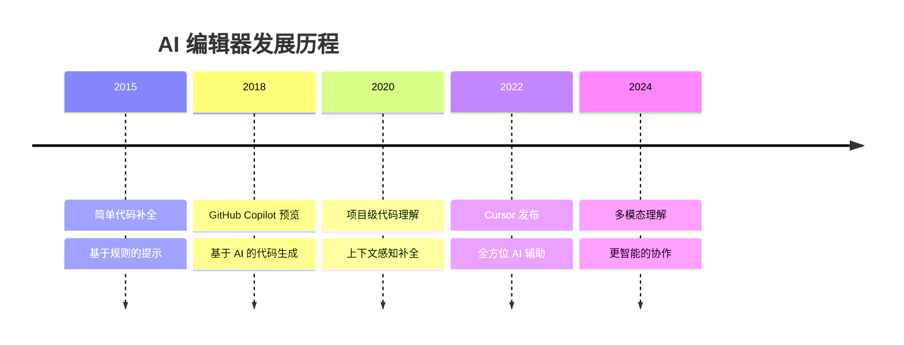
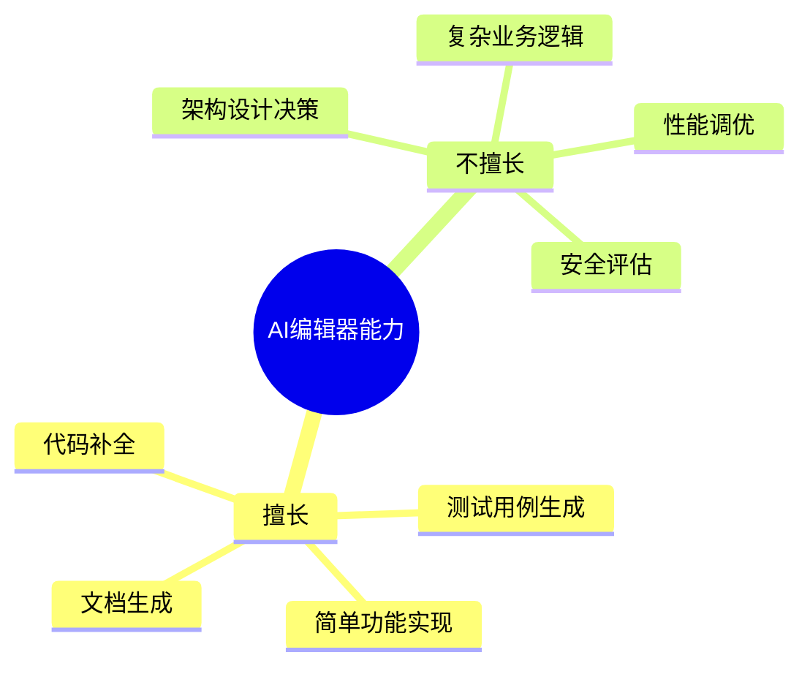
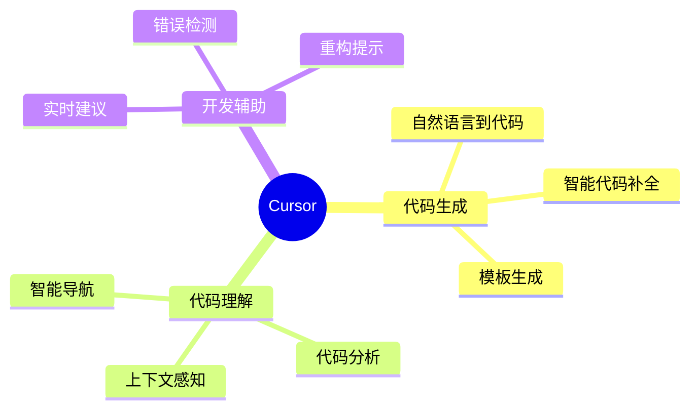
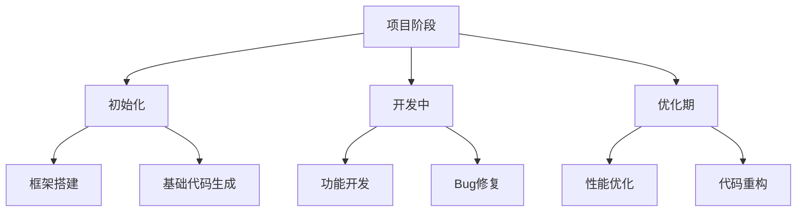
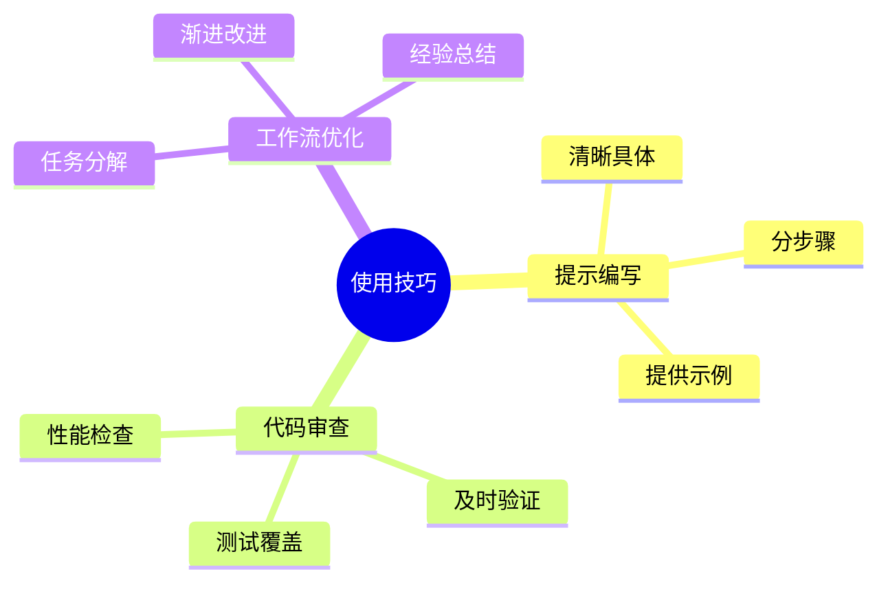

# 第二章 AI 编辑器简介

> "工具不是万能的，但没有工具是万万不能的。" —— 让我们深入了解 AI 编辑器这个强大的开发伙伴。

## 本章目标
- ✅ 理解 AI 编辑器的本质和局限
- ✅ 掌握 Cursor 的核心特性
- ✅ 学会在实际项目中合理使用 AI 能力
- ✅ 建立正确的 AI 辅助开发认知

## 2.1 认识 AI 编辑器

### 2.1.1 什么是 AI 编辑器
AI 编辑器是在传统代码编辑器基础上，集成了人工智能能力的新一代开发工具。它不仅具备代码编辑、语法高亮等基本功能，还能提供智能代码补全、代码理解、自动重构等高级特性。

### 2.1.2 发展历程与现状



### 2.1.3 核心价值
1. **提升开发效率**
   - 减少重复性工作
   - 加快编码速度
   - 自动化日常任务

2. **增强代码质量**
   - 智能代码审查
   - 自动化测试生成
   - 代码优化建议

3. **辅助学习成长**
   - 代码示例学习
   - 最佳实践建议
   - 实时编程指导

## 2.2 正确认知：期望与现实

### 2.2.1 AI 编辑器的能力边界



### 2.2.2 实际项目中的应用差异

| 场景 | 示例项目 | 实际项目 |
|------|---------|----------|
| 代码量 | < 1000 行 | > 100,000 行 |
| 业务复杂度 | 简单 | 高度复杂 |
| 依赖关系 | 较少 | 错综复杂 |
| 团队协作 | 个人 | 多团队 |
| 维护周期 | 短期 | 长期 |

### 2.2.3 合理使用建议
1. **明确分工**
   - AI 负责：重复性工作、代码生成、简单功能实现
   - 人工负责：架构设计、业务逻辑、关键决策

2. **循序渐进**
   - 从小功能开始尝试
   - 逐步扩大应用范围
   - 建立最佳实践

## 2.3 Cursor 特色功能

### 2.3.1 核心功能概览



### 2.3.2 实战应用示例

1. **代码生成**
```python
# 示例：使用自然语言生成代码
# 提示：创建一个带有缓存的斐波那契函数

def fibonacci(n, cache=None):
    if cache is None:
        cache = {}
    if n in cache:
        return cache[n]
    if n <= 1:
        return n
    cache[n] = fibonacci(n-1, cache) + fibonacci(n-2, cache)
    return cache[n]
```

2. **代码理解**
```python
# 示例：AI 分析并优化代码
def process_data(data):
    # AI 会分析代码结构和性能
    result = []
    for item in data:
        if item > 0:
            result.append(item * 2)
    return result

# AI 优化建议：使用列表推导式
def process_data_optimized(data):
    return [item * 2 for item in data if item > 0]
```

3. **智能重构**
```python
# 示例：AI 辅助重构
# 原代码：功能分散的类
class UserManager:
    def __init__(self):
        self.users = []
        self.db = Database()
        self.logger = Logger()
    
    def create_user(self, data):
        # 混合了多个职责
        self.logger.log("Creating user")
        user = User(data)
        self.db.save(user)
        self.users.append(user)
        self.logger.log("User created")
        return user

# AI 重构建议：职责分离
class UserRepository:
    def __init__(self, db):
        self.db = db
    
    def save(self, user):
        return self.db.save(user)

class UserService:
    def __init__(self, repository, logger):
        self.repository = repository
        self.logger = logger
    
    def create_user(self, data):
        self.logger.log("Creating user")
        user = User(data)
        self.repository.save(user)
        self.logger.log("User created")
        return user
```

## 2.4 实战应用策略

### 2.4.1 项目生命周期中的应用



### 2.4.2 最佳实践

1. **项目初期**
   - 使用 AI 生成项目骨架
   - 创建基础配置文件
   - 生成初始化代码

2. **开发阶段**
   - 编写单元测试
   - 实现具体功能
   - 代码审查和优化

3. **维护阶段**
   - 性能优化
   - 代码重构
   - 文档更新

## 2.5 实战练习

### 练习 1：项目初始化
使用 Cursor 创建一个新的 Web 项目：
1. 生成项目结构
2. 配置开发环境
3. 实现基础功能

### 练习 2：代码优化
选择一个现有项目：
1. 使用 AI 分析代码质量
2. 获取优化建议
3. 实施改进方案

### 练习 3：重构实践
对一个复杂的类进行重构：
1. 分析当前问题
2. 使用 AI 辅助重构
3. 验证重构结果

## 2.6 常见问题与解决方案

### 2.6.1 功能相关

1. **代码生成质量不高**
   - 提供更详细的上下文
   - 分步骤生成和验证
   - 结合人工审查

2. **性能问题**
   - 合理设置缓存
   - 优化项目大小
   - 使用代理加速

### 2.6.2 使用技巧



## 本章小结

✨ 核心要点：
1. 理解 AI 编辑器的能力边界
2. 掌握 Cursor 的核心特性
3. 建立合理的使用策略
4. 培养正确的开发习惯

📚 下一步学习：
- 深入学习 Prompt 编写技巧
- 探索更多实际应用场景
- 建立个人最佳实践

## 扩展资源

### 推荐阅读
- [AI 辅助开发实践指南](https://cursor.sh/blog)
- [Cursor 最佳实践](https://cursor.sh/docs/best-practices)
- [现代开发工具链](https://modern.dev)

### 示例项目
- [AI 驱动的 Web 应用](https://github.com/examples)
- [Cursor 实战案例](https://github.com/cursor-samples)

---
[下一章：Prompt创建技巧](第三章-Prompt创建技巧.md)
