# 第一章 基础入门

> "工欲善其事，必先利其器。" —— 让我们从最基础的环境搭建开始，为 AI 辅助开发打好基础。

## 本章目标
- ✅ 搭建完整的 AI 开发环境
- ✅ 掌握 Cursor 的基本操作
- ✅ 理解 AI 辅助功能的使用
- ✅ 完成第一个 AI 辅助开发项目

## 1.1 开发环境准备

### 为什么环境配置这么重要？
在开始 AI 辅助开发之前，我们需要搭建一个稳定高效的开发环境。好的开发环境能让你：
- 提升开发效率
- 减少环境问题带来的困扰
- 更好地发挥 AI 助手的能力

### 1.1.1 系统要求
- 操作系统：
  - Windows 10/11（64位）
  - macOS 10.15+（支持 Intel 和 Apple Silicon）
  - Linux（Ubuntu 20.04+, Debian 10+）
- 硬件要求：
  - CPU：推荐 4核及以上
  - 内存：最低 8GB，推荐 16GB 以上
  - 硬盘空间：至少 1GB 可用空间（建议 SSD）
  - 显示器：推荐 1920x1080 及以上分辨率
- 网络要求：
  - 稳定的互联网连接（最低 5Mbps）
  - 能够访问 OpenAI API 服务器
  - 推荐使用代理以提升连接稳定性

### 1.1.2 前置软件环境
1. 必需软件
   - Git（版本控制）
   - Node.js（v14+，推荐使用 LTS 版本）
   - Python（3.7+，用于某些扩展功能）

2. 推荐软件
   - nvm（Node.js 版本管理器）
   - pyenv（Python 版本管理器）
   - Docker（容器化环境）

### 1.1.3 快速安装指南

```bash
# 第一步：安装必要的开发工具
# Windows（使用 PowerShell）
winget install Git.Git
winget install OpenJS.NodeJS.LTS
winget install Python.Python.3.11

# macOS（使用 Homebrew）
brew install git node python@3.11

# Linux（Ubuntu/Debian）
sudo apt update
sudo apt install git nodejs python3.11
```

### 1.1.4 Cursor 安装配置

1. 下载安装
```bash
# 访问官网下载
open https://cursor.sh

# 根据你的操作系统选择对应版本
# Windows: .exe
# macOS: .dmg
# Linux: .AppImage 或 .deb
```

2. API 配置（重要！）
```bash
# 1. 访问 OpenAI 获取 API Key
open https://platform.openai.com/api-keys

# 2. 在 Cursor 中配置
# 设置 -> API Keys -> 粘贴你的 Key
```

### 1.1.5 环境验证
```bash
# 一键验证脚本
curl -s https://raw.githubusercontent.com/cursor-ai/verify/main/verify.sh | bash

# 或手动验证
git --version
node --version
python --version
cursor --version
```

## 1.2 界面功能详解

### 1.2.1 Cursor 界面布局

```mermaid
graph TD
    A[Cursor主界面] --> B[侧边栏区域]
    A --> C[编辑器区域]
    A --> D[面板区域]
    
    B --> B1[文件资源管理器]
    B --> B2[搜索面板]
    B --> B3[Git版本控制]
    B --> B4[扩展管理器]
    
    C --> C1[编辑器标签页]
    C --> C2[代码编辑区]
    C --> C3[小地图]
    
    D --> D1[集成终端]
    D --> D2[问题面板]
    D --> D3[输出面板]
    D --> D4[调试控制台]
```



### 1.2.2 核心功能区介绍

1. 侧边栏功能
   - 文件资源管理器
     * 文件树视图
     * 文件操作菜单
     * 文件过滤器
   - 搜索功能
     * 全局搜索
     * 正则表达式搜索
     * 替换功能
   - Git 集成
     * 分支管理
     * 文件状态
     * 提交历史
   - 扩展管理
     * 插件浏览
     * 插件配置
     * 更新管理

2. 编辑器功能
   - 智能代码补全
   - 语法高亮
   - 错误提示
   - 代码格式化
   - 多光标编辑
   - 代码折叠
   - 参数提示
   - 定义跳转

3. 面板区功能
   - 终端集成
   - 问题追踪
   - 输出监控
   - 调试工具

### 1.2.3 快捷键一览

| 功能 | Windows/Linux | macOS |
|------|--------------|-------|
| 命令面板 | Ctrl+Shift+P | Cmd+Shift+P |
| 快速打开 | Ctrl+P | Cmd+P |
| 转到定义 | F12 | F12 |
| 格式化代码 | Alt+Shift+F | Option+Shift+F |
| AI 补全 | Alt+\\ | Option+\\ |
| 文件搜索 | Ctrl+F | Cmd+F |
| 全局搜索 | Ctrl+Shift+F | Cmd+Shift+F |

## 1.3 AI 辅助功能详解

### 1.3.1 代码补全
1. 基础补全
   - 变量补全
   - 函数补全
   - 导入补全
   - 语法补全

2. AI 智能补全
   - 上下文感知补全
   - 函数实现补全
   - 代码块补全
   - 注释生成

### 1.3.2 代码生成
1. 功能实现
```python
# 示例：生成一个简单的 REST API
# 提示：创建一个用户管理的 REST API
from fastapi import FastAPI, HTTPException
from pydantic import BaseModel
from typing import List, Optional

app = FastAPI()

class User(BaseModel):
    id: Optional[int] = None
    name: str
    email: str

users = []
counter = 1

@app.post("/users/", response_model=User)
def create_user(user: User):
    global counter
    user.id = counter
    counter += 1
    users.append(user)
    return user

@app.get("/users/", response_model=List[User])
def get_users():
    return users

@app.get("/users/{user_id}", response_model=User)
def get_user(user_id: int):
    for user in users:
        if user.id == user_id:
            return user
    raise HTTPException(status_code=404, detail="User not found")
```

2. 测试用例生成
```python
# 示例：为上述 API 生成测试
import pytest
from fastapi.testclient import TestClient

client = TestClient(app)

def test_create_user():
    response = client.post(
        "/users/",
        json={"name": "Test User", "email": "test@example.com"}
    )
    assert response.status_code == 200
    assert response.json()["name"] == "Test User"

def test_get_users():
    response = client.get("/users/")
    assert response.status_code == 200
    assert isinstance(response.json(), list)
```

### 1.3.3 代码优化
1. 性能优化
```python
# 优化前
def find_duplicates(arr):
    result = []
    for i in range(len(arr)):
        for j in range(i + 1, len(arr)):
            if arr[i] == arr[j] and arr[i] not in result:
                result.append(arr[i])
    return result

# 优化后
def find_duplicates(arr):
    seen = set()
    duplicates = set()
    for num in arr:
        if num in seen:
            duplicates.add(num)
        seen.add(num)
    return list(duplicates)
```

2. 代码质量优化
   - 代码风格规范化
   - 命名优化
   - 结构优化
   - 注释完善

## 1.4 实战练习

### 练习 1：环境配置
1. 完成所有必要软件的安装
2. 配置 Cursor 和 API Key
3. 运行环境验证脚本

### 练习 2：AI 助手初体验
1. 创建一个新项目
2. 使用 AI 生成一个简单的 Web API
3. 尝试不同的代码补全功能

### 练习 3：实战项目
创建一个简单的博客 API，要求：
1. 使用 FastAPI 框架
2. 实现文章的 CRUD 操作
3. 添加简单的用户认证
4. 使用 AI 助手生成测试用例

## 1.5 常见问题与解决方案

### 环境配置问题
1. API Key 配置失败
   - 检查 API Key 是否正确复制
   - 确认网络连接是否正常
   - 验证 API Key 的可用额度

2. 代码补全不工作
   - 检查 Cursor 版本是否最新
   - 验证 API Key 配置
   - 确认文件类型是否受支持

3. 生成的代码有错误
   - 提供更详细的上下文
   - 检查依赖是否安装完整
   - 参考错误信息进行调整

### 性能优化建议
1. 编辑器性能
   - 关闭不必要的插件
   - 定期清理缓存
   - 限制打开的文件数量

2. AI 响应速度
   - 使用稳定的网络连接
   - 优化 Prompt 长度
   - 合理设置超时时间

## 本章小结

✨ 核心要点：
1. 完整的开发环境是基础
2. AI 辅助功能需要正确配置
3. 掌握界面布局和快捷键
4. 理解 AI 辅助功能的使用方法
5. 从简单项目开始实践
6. 注意性能优化和问题排查

📚 下一步学习：
- 深入了解 AI 编辑器的高级功能
- 探索更多的 Prompt 编写技巧
- 尝试在实际项目中应用
- 学习团队协作最佳实践

## 扩展资源

### 官方资源
- [Cursor 官方文档](https://cursor.sh/docs)
- [GitHub 仓库](https://github.com/getcursor/cursor)
- [问题反馈](https://github.com/getcursor/cursor/issues)

### 社区资源
- Stack Overflow 标签
- Reddit 社区
- Discord 讨论组

### 推荐阅读
- AI 辅助开发最佳实践
- Prompt 工程指南
- 现代开发工具链

---
[下一章：AI编辑器简介](第二章-AI编辑器简介.md)
