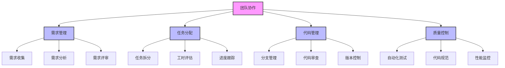
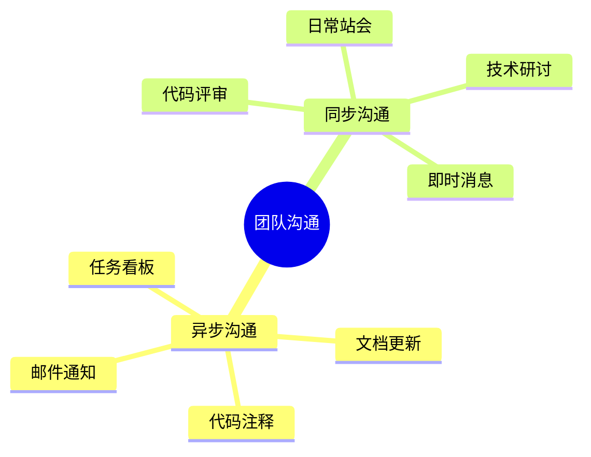
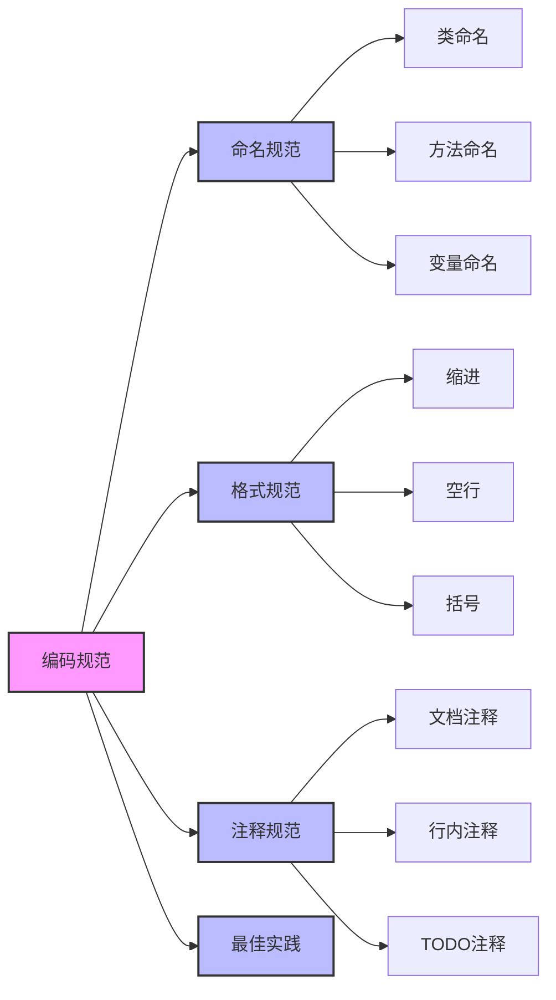
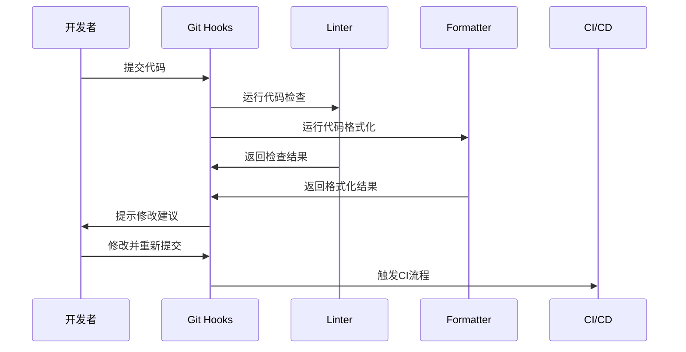
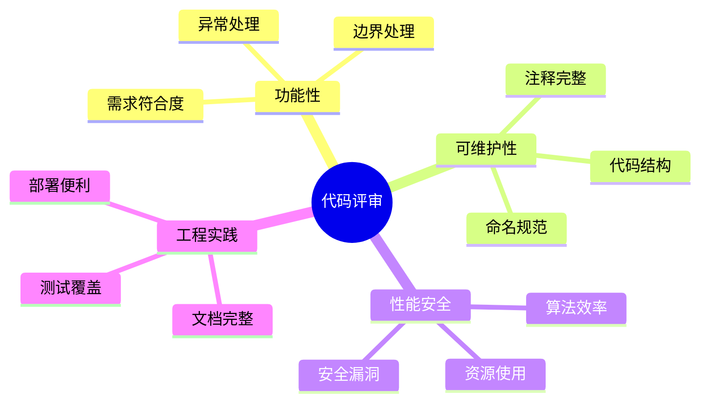
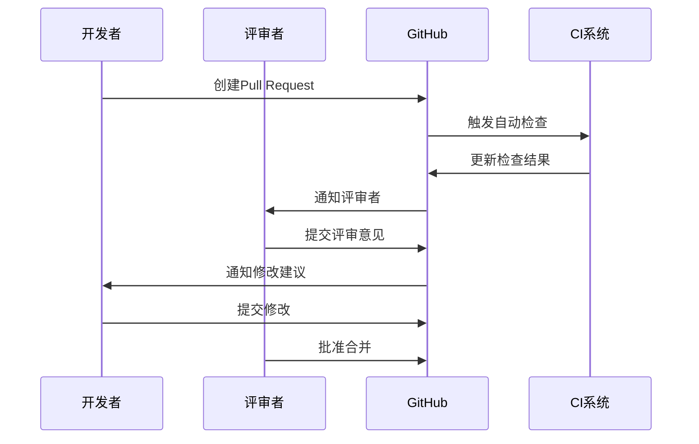
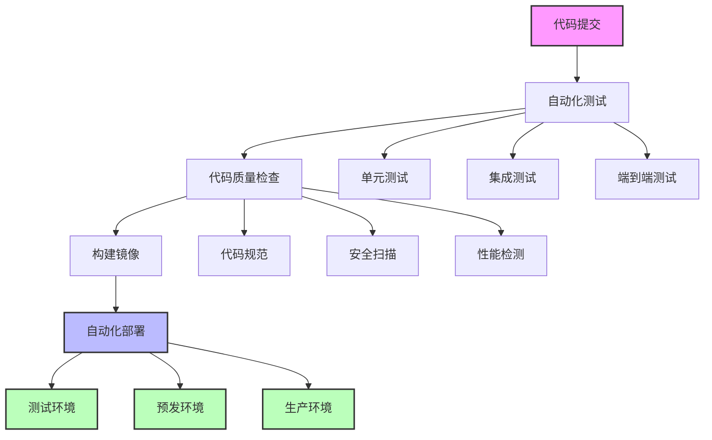
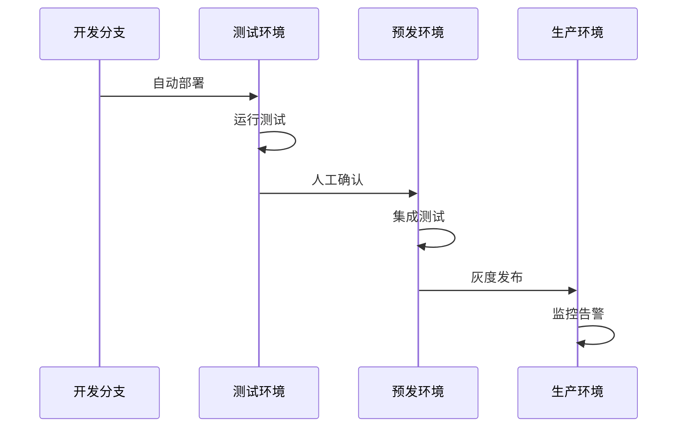
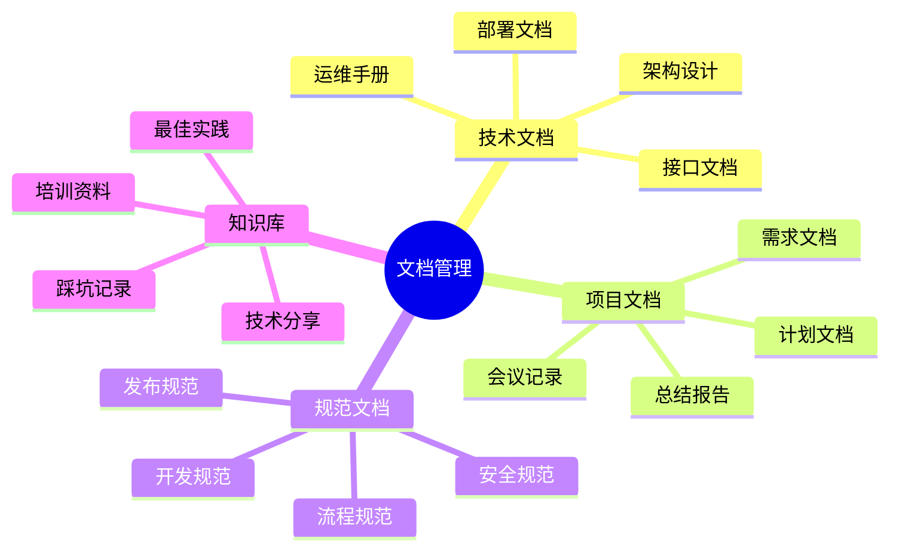
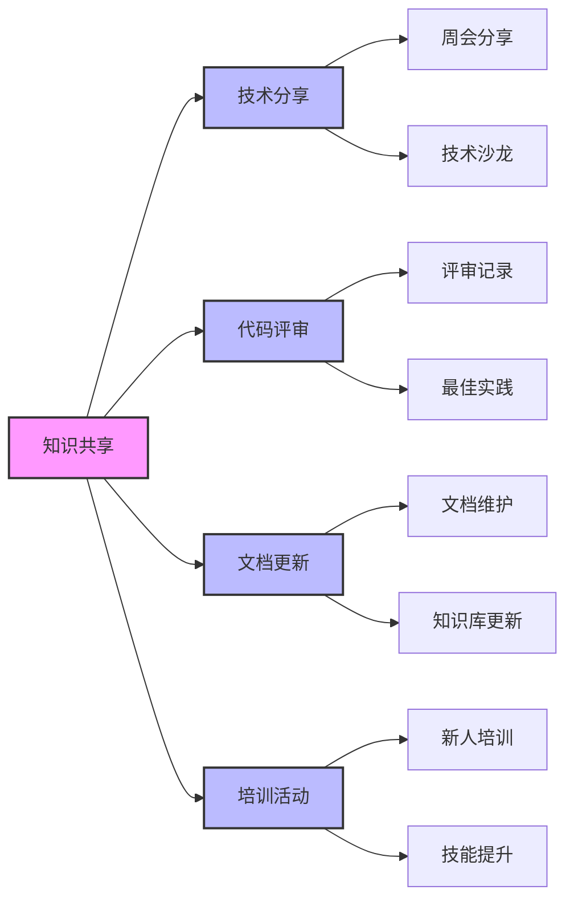

# 第七章 团队协作与代码标准化

> 在一个拥有 50 人的研发团队中，如何确保代码质量和开发效率？让我分享一个真实的团队协作经历，看看 AI 是如何帮助我们建立和维护高效的开发流程。

## 7.1 团队协作基础

### 7.1.1 协作流程设计



🔄 **敏捷开发流程**：

```yaml
# 团队工作流程配置
sprint:
  duration: 2周
  events:
    - name: 站会
      frequency: 每日
      duration: 15分钟
      focus: 
        - 昨日完成
        - 今日计划
        - 遇到的阻碍
    
    - name: 迭代计划会
      frequency: 每两周
      duration: 4小时
      focus:
        - 需求评审
        - 任务分解
        - 工时评估
        - 团队分工
    
    - name: 迭代回顾会
      frequency: 每两周
      duration: 2小时
      focus:
        - 目标完成度
        - 过程改进点
        - 团队建设
```

### 7.1.2 团队沟通规范



📝 **文档规范示例**：

```markdown
# 技术文档模板

## 1. 概述
- 背景说明
- 目标用户
- 核心功能

## 2. 架构设计
- 系统架构
- 数据流程
- 核心模块

## 3. 接口文档
- 接口清单
- 请求/响应格式
- 错误码说明

## 4. 部署指南
- 环境要求
- 部署步骤
- 配置说明

## 5. 开发指南
- 开发环境
- 关键流程
- 注意事项
```

## 7.2 代码标准化

### 7.2.1 编码规范



📋 **Python 编码规范示例**：

```python
# 1. 命名规范
class UserService:  # 类名使用大驼峰
    def get_user_by_id(self, user_id: str) -> Dict:  # 方法名使用小写下划线
        """
        根据用户ID获取用户信息
        
        Args:
            user_id: 用户ID
            
        Returns:
            用户信息字典
            
        Raises:
            ValueError: 用户ID无效时
        """
        # 常量使用大写下划线
        MAX_RETRY_COUNT = 3
        
        # 变量使用小写下划线
        retry_count = 0
        
        while retry_count < MAX_RETRY_COUNT:
            try:
                return self._fetch_user(user_id)
            except Exception as e:
                retry_count += 1
                if retry_count == MAX_RETRY_COUNT:
                    raise ValueError(f"获取用户信息失败: {e}")

# 2. 导入规范
# 标准库导入
import os
import sys
from typing import Dict, List

# 第三方库导入
import pandas as pd
import numpy as np
from fastapi import FastAPI

# 本地模块导入
from .models import User
from .services import UserService
from .utils import logger

# 3. 类结构规范
class OrderService:
    """订单服务类"""
    
    def __init__(self, db_session):
        """初始化订单服务"""
        self.db = db_session
        self.logger = logger.get_logger(__name__)
    
    def create_order(self, user_id: str, items: List[Dict]) -> Dict:
        """创建订单"""
        pass
    
    def _validate_items(self, items: List[Dict]) -> None:
        """验证订单项（私有方法）"""
        pass
```

### 7.2.2 自动化工具配置



⚙️ **工具配置示例**：

```ini
# 1. pyproject.toml
[tool.black]
line-length = 88
target-version = ['py37']
include = '\.pyi?$'
extend-exclude = '''
# A regex preceded with ^/ will apply only to files and directories
# in the root of the project.
^/foo.py  # exclude a file named foo.py in the root of the project
'''

[tool.isort]
profile = "black"
multi_line_output = 3
include_trailing_comma = true
force_grid_wrap = 0
use_parentheses = true
ensure_newline_before_comments = true
line_length = 88

# 2. setup.cfg
[flake8]
max-line-length = 88
extend-ignore = E203
exclude = .git,__pycache__,build,dist

[mypy]
python_version = 3.7
warn_return_any = true
warn_unused_configs = true
disallow_untyped_defs = true

# 3. .pre-commit-config.yaml
repos:
-   repo: https://github.com/pre-commit/pre-commit-hooks
    rev: v3.4.0
    hooks:
    -   id: trailing-whitespace
    -   id: end-of-file-fixer
    -   id: check-yaml
    -   id: check-added-large-files

-   repo: https://github.com/psf/black
    rev: 21.5b2
    hooks:
    -   id: black

-   repo: https://github.com/pycqa/isort
    rev: 5.8.0
    hooks:
    -   id: isort

-   repo: https://github.com/pre-commit/mirrors-mypy
    rev: v0.910
    hooks:
    -   id: mypy
        additional_dependencies: [types-all]
```

## 7.3 代码评审流程

### 7.3.1 评审标准



🔍 **评审清单示例**：

```python
class CodeReviewStandard:
    """代码评审标准"""
    
    @staticmethod
    def general_checks():
        return [
            "代码是否遵循项目规范？",
            "变量和函数命名是否清晰？",
            "是否有充分的注释和文档？",
            "是否处理了所有边界情况？"
        ]
    
    @staticmethod
    def security_checks():
        return [
            "是否有安全漏洞？",
            "敏感信息是否加密？",
            "是否进行了输入验证？",
            "是否有权限控制？"
        ]
    
    @staticmethod
    def performance_checks():
        return [
            "是否有性能瓶颈？",
            "是否合理使用缓存？",
            "是否有资源泄露？",
            "是否考虑并发情况？"
        ]
```

### 7.3.2 评审工具集成



🛠️ **GitHub Actions 配置示例**：

```yaml
# .github/workflows/code-review.yml
name: Code Review

on:
  pull_request:
    branches: [ main, develop ]

jobs:
  review:
    runs-on: ubuntu-latest
    steps:
    - uses: actions/checkout@v2
    
    - name: Set up Python
      uses: actions/setup-python@v2
      with:
        python-version: '3.9'
    
    - name: Install dependencies
      run: |
        python -m pip install --upgrade pip
        pip install -r requirements-dev.txt
    
    - name: Run linters
      run: |
        flake8 .
        black --check .
        isort --check-only .
        mypy .
    
    - name: Run tests
      run: |
        pytest --cov=./ --cov-report=xml
    
    - name: Upload coverage
      uses: codecov/codecov-action@v2
      with:
        file: ./coverage.xml
        fail_ci_if_error: true
```

## 7.4 持续集成与部署

### 7.4.1 CI/CD 流程设计



📦 **Docker 配置示例**：

```dockerfile
# Dockerfile
FROM python:3.9-slim

# 设置工作目录
WORKDIR /app

# 复制依赖文件
COPY requirements.txt .

# 安装依赖
RUN pip install --no-cache-dir -r requirements.txt

# 复制应用代码
COPY . .

# 暴露端口
EXPOSE 8000

# 启动命令
CMD ["uvicorn", "main:app", "--host", "0.0.0.0", "--port", "8000"]
```

### 7.4.2 自动化部署配置



🚀 **Kubernetes 配置示例**：

```yaml
# deployment.yaml
apiVersion: apps/v1
kind: Deployment
metadata:
  name: myapp
  labels:
    app: myapp
spec:
  replicas: 3
  selector:
    matchLabels:
      app: myapp
  template:
    metadata:
      labels:
        app: myapp
    spec:
      containers:
      - name: myapp
        image: myapp:latest
        ports:
        - containerPort: 8000
        resources:
          limits:
            cpu: "1"
            memory: "1Gi"
          requests:
            cpu: "0.5"
            memory: "512Mi"
        livenessProbe:
          httpGet:
            path: /health
            port: 8000
          initialDelaySeconds: 30
          periodSeconds: 10
        readinessProbe:
          httpGet:
            path: /ready
            port: 8000
          initialDelaySeconds: 5
          periodSeconds: 5

---
# service.yaml
apiVersion: v1
kind: Service
metadata:
  name: myapp-service
spec:
  selector:
    app: myapp
  ports:
    - protocol: TCP
      port: 80
      targetPort: 8000
  type: LoadBalancer
```

## 7.5 团队知识管理

### 7.5.1 文档管理系统



📚 **文档结构示例**：

```markdown
# 团队知识库

## 1. 技术栈文档
- 后端技术
  - Python/FastAPI
  - PostgreSQL
  - Redis
- 前端技术
  - React
  - TypeScript
  - TailwindCSS
- 运维技术
  - Docker
  - Kubernetes
  - CI/CD

## 2. 开发流程
- 需求分析
- 技术方案
- 开发规范
- 测试规范
- 发布流程

## 3. 最佳实践
- 代码规范
- 安全指南
- 性能优化
- 问题排查

## 4. 培训资料
- 新人指南
- 技术培训
- 工具使用
- 案例分析
```

### 7.5.2 知识共享机制



🎓 **技术分享计划示例**：

```python
class TechSharePlan:
    """技术分享计划"""
    
    @staticmethod
    def weekly_share():
        return {
            "周期": "每周五",
            "时长": "1小时",
            "形式": [
                "技术分享",
                "项目复盘",
                "新技术探讨",
                "最佳实践分享"
            ],
            "要求": [
                "准备PPT或文档",
                "提供示例代码",
                "录制分享视频",
                "更新知识库"
            ]
        }
    
    @staticmethod
    def monthly_workshop():
        return {
            "周期": "每月最后一周",
            "时长": "4小时",
            "主题": [
                "新技术工作坊",
                "项目经验分享",
                "技术难题攻关",
                "创新方案探讨"
            ],
            "产出": [
                "技术方案文档",
                "示例代码库",
                "最佳实践指南",
                "培训视频资料"
            ]
        }
```

## 7.6 小结

通过本章的实战经验分享，我们学习了如何在团队中建立高效的协作机制和代码标准化流程。记住，好的团队文化和规范是提高团队效率的关键。

💡 **核心要点**：
- 建立清晰的团队协作流程
- 制定并执行代码规范
- 重视代码评审质量
- 实施自动化的 CI/CD
- 建立完善的知识管理体系

---

> 思考题：
> 1. 你的团队是如何保证代码质量的？
> 2. 在代码评审中，你最看重哪些方面？
> 3. 你有什么好的知识共享经验可以分享？

[回到目录](Readme.md)

上一章：[第六章-代码重构与工具实战](第六章-代码重构与工具实战.md)

下一章：[第八章-AI辅助测试实践](第八章-AI辅助测试实践.md)
