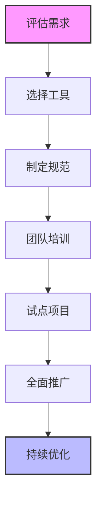
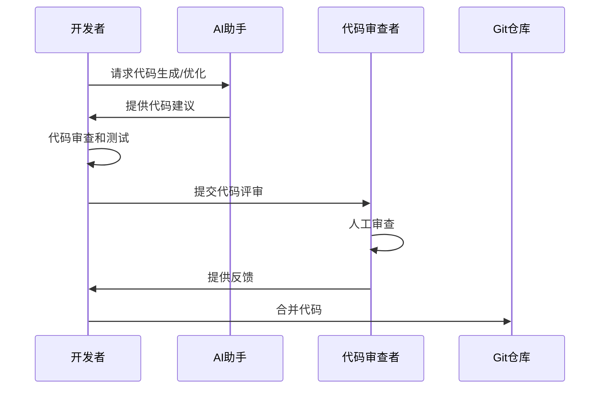
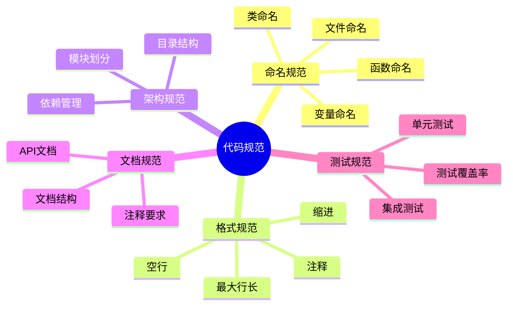
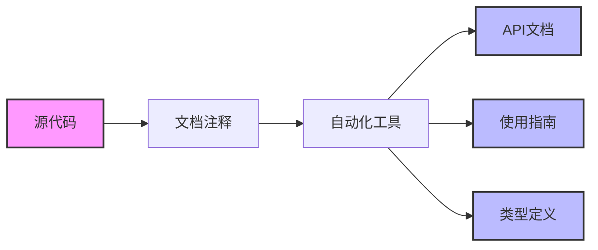
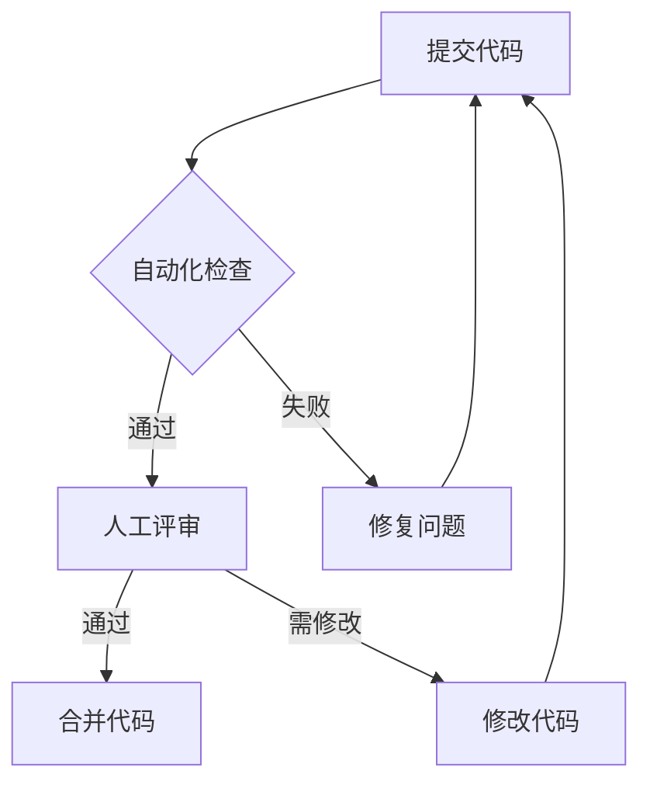
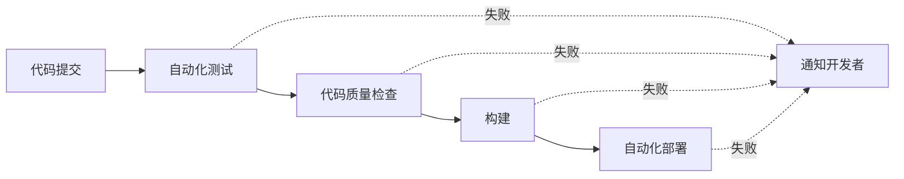

# 第七章 团队协作与代码标准化

## 7.1 在团队中使用 AI 辅助工具

### 7.1.1 AI 工具的团队应用策略

在团队开发中合理使用 AI 工具可以显著提升开发效率。以下是一个团队引入 AI 工具的流程：



#### 关键考虑因素：

1. **工具选择标准**
   - 安全性与数据隐私
   - 集成便利性
   - 许可证类型
   - 成本效益

2. **使用规范**
   - 明确使用场景
   - 代码审查要求
   - 安全准则
   - 最佳实践

### 7.1.2 AI 辅助开发工作流



## 7.2 保持代码一致性与标准化

### 7.2.1 代码规范体系

建立完整的代码规范体系对于保证团队代码质量至关重要：



### 7.2.2 自动化规范检查

示例：使用 ESLint 配置文件

```javascript
// .eslintrc.js
module.exports = {
  root: true,
  env: {
    node: true,
    browser: true,
  },
  extends: [
    'eslint:recommended',
    'plugin:@typescript-eslint/recommended'
  ],
  rules: {
    'no-console': process.env.NODE_ENV === 'production' ? 'warn' : 'off',
    'no-debugger': process.env.NODE_ENV === 'production' ? 'warn' : 'off',
    '@typescript-eslint/explicit-module-boundary-types': 'off',
    'max-len': ['error', { 'code': 100 }]
  }
}
```

## 7.3 自动化文档生成

### 7.3.1 文档自动化流程



### 7.3.2 文档示例

```python
class UserManager:
    """用户管理类
    
    负责处理用户相关的所有操作，包括创建、更新、删除等。
    
    Attributes:
        db_connection: 数据库连接实例
        cache_client: 缓存客户端实例
    """
    
    def create_user(self, user_data: dict) -> User:
        """创建新用户
        
        Args:
            user_data: 包含用户信息的字典，必须包含 username 和 email
            
        Returns:
            User: 新创建的用户实例
            
        Raises:
            ValidationError: 当用户数据验证失败时
            DatabaseError: 当数据库操作失败时
        """
        pass
```

## 7.4 代码评审和反馈机制

### 7.4.1 代码评审流程



### 7.4.2 评审清单

✅ 代码风格符合规范
✅ 适当的错误处理
✅ 充分的测试覆盖
✅ 代码可维护性
✅ 性能考虑
✅ 安全性检查
✅ 文档完整性

### 7.4.3 反馈模板

```markdown
## 代码评审反馈

### 总体评价
- [ ] 通过
- [ ] 需要修改
- [ ] 需要重构

### 具体反馈
1. 代码质量
   - 优点：
   - 待改进：

2. 测试覆盖
   - 优点：
   - 待改进：

3. 文档完整性
   - 优点：
   - 待改进：

### 其他建议
```

## 7.5 持续集成与部署

### 7.5.1 CI/CD 流程



### 7.5.2 GitHub Actions 配置示例

```yaml
name: CI/CD Pipeline

on:
  push:
    branches: [ main ]
  pull_request:
    branches: [ main ]

jobs:
  test-and-deploy:
    runs-on: ubuntu-latest
    
    steps:
    - uses: actions/checkout@v2
    
    - name: Set up Python
      uses: actions/setup-python@v2
      with:
        python-version: '3.9'
    
    - name: Install dependencies
      run: |
        python -m pip install --upgrade pip
        pip install -r requirements.txt
    
    - name: Run tests
      run: |
        python -m pytest
    
    - name: Run linter
      run: |
        pylint src/
    
    - name: Deploy
      if: github.ref == 'refs/heads/main'
      run: |
        echo "部署步骤"
```

## 7.6 最佳实践与注意事项

### 7.6.1 团队协作准则

1. **沟通优先**
   - 及时反馈
   - 清晰表达
   - 积极讨论

2. **知识共享**
   - 技术文档
   - 经验分享
   - 团队培训

3. **流程优化**
   - 定期回顾
   - 持续改进
   - 工具升级

### 7.6.2 常见问题与解决方案

| 问题类型 | 常见原因 | 解决方案 |
|---------|---------|---------|
| 代码冲突 | 多人同时修改 | 使用功能分支，及时同步主分支 |
| 规范执行不一致 | 规范不明确或过于复杂 | 简化规范，增加自动化检查 |
| 文档更新滞后 | 忽视文档重要性 | 将文档更新纳入评审流程 |
| 测试覆盖不足 | 时间压力，测试意识不足 | 制定测试标准，增加自动化测试 |

## 7.7 总结

团队协作和代码标准化是确保项目成功的关键因素。通过建立完善的工作流程、规范体系和自动化工具，可以显著提高团队的开发效率和代码质量。同时，持续的改进和优化也是保持团队竞争力的重要保障。

要点回顾：
1. AI 工具的团队应用需要制定清晰的规范和流程
2. 代码标准化需要从多个维度建立规范体系
3. 自动化工具可以大大提高规范执行的效率
4. 代码评审和反馈机制是提高代码质量的重要手段
5. 持续集成与部署是现代开发流程的重要组成部分

---
[回到目录](Readme.md)

上一章：[第六章-代码重构与工具实战](第六章-代码重构与工具实战.md)

下一章：[第八章-完整项目开发：用户管理系统](第八章-完整项目开发：用户管理系统.md)
