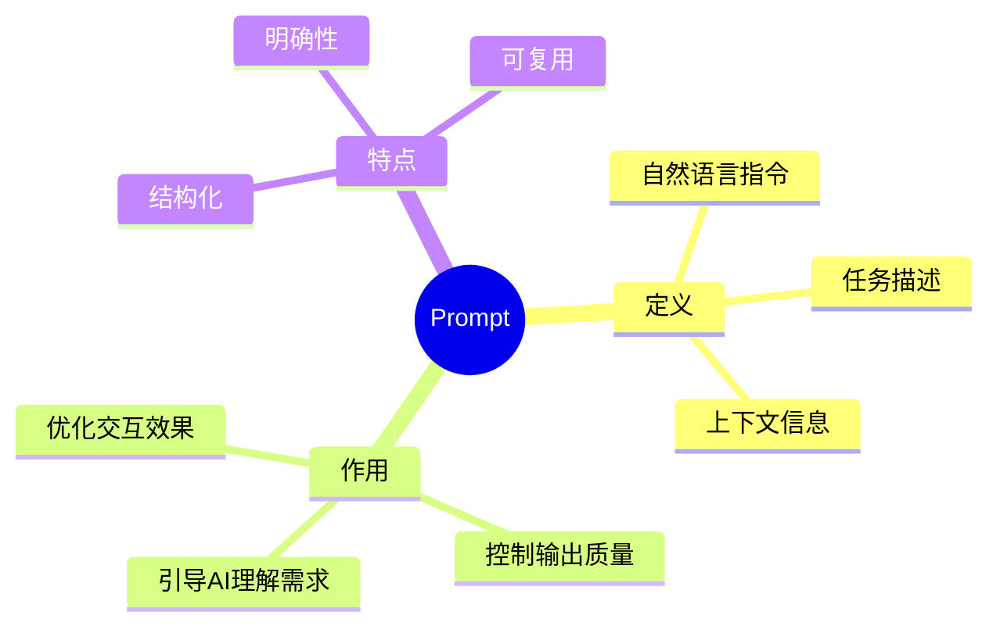
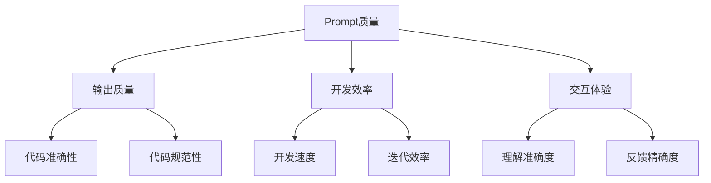
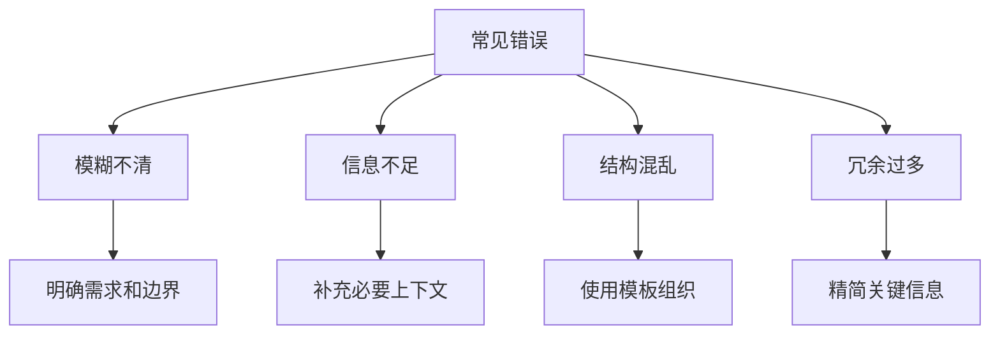
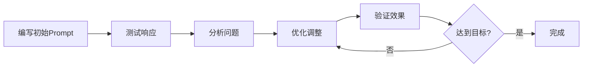
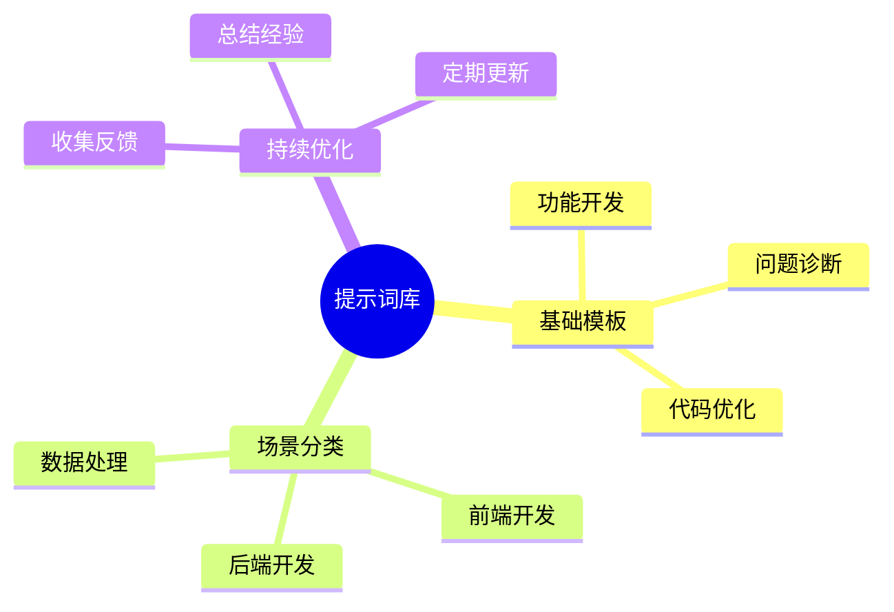

# 第三章 Prompt 创建技巧

> "巧匠精于工，匠心源于术。" —— 让我们掌握 AI 编程的核心技巧：Prompt 工程。

## 本章目标
- ✅ 掌握 Prompt 的本质和原理
- ✅ 学会创建高质量的 Prompt
- ✅ 熟练运用各种 Prompt 模式
- ✅ 建立个人的 Prompt 最佳实践

## 3.1 Prompt 基础概念

### 3.1.1 什么是 Prompt



### 3.1.2 Prompt 的重要性



## 3.2 Prompt 设计原则

### 3.2.1 核心原则

1. **明确性**
   - 清晰的目标描述
   - 具体的要求说明
   - 明确的约束条件
   - 预期输出格式

2. **完整性**
   - 必要的上下文信息
   - 相关的业务规则
   - 技术要求和限制
   - 错误处理预期

3. **结构化**
   - 逻辑层次分明
   - 信息组织有序
   - 重点突出
   - 易于理解和修改

### 3.2.2 常见错误与解决方案



## 3.3 Prompt 模式与实战

### 3.3.1 基础模式示例

1. **任务描述模式**
```plaintext
# 功能实现请求
任务类型：实现用户注册功能
技术栈：Node.js + Express + MongoDB
安全要求：
- 密码需要加密存储
- 邮箱验证
- 防止SQL注入

输出要求：
1. 完整的接口实现
2. 数据验证逻辑
3. 错误处理机制
4. API文档
```

2. **角色扮演模式**
```plaintext
# 代码审查场景
角色：高级后端工程师
任务：审查用户认证模块
关注点：
- 代码质量和规范
- 安全性问题
- 性能优化空间
- 可维护性建议

输出格式：
1. 问题清单
2. 改进建议
3. 代码示例
```

### 3.3.2 高级模式实践

1. **迭代优化模式**
```python
# 第一轮：基础功能实现
def process_data(data):
    result = []
    for item in data:
        if item > 0:
            result.append(item * 2)
    return result

# 优化提示：
"""
请优化上述代码，要求：
1. 使用列表推导式提高简洁性
2. 添加类型提示增强可读性
3. 加入参数验证提高健壮性
4. 补充文档字符串
"""

# 优化后的代码
from typing import List, Union
from numbers import Number

def process_data(data: List[Union[int, float]]) -> List[Union[int, float]]:
    """
    处理数值列表，将大于0的元素翻倍。
    
    Args:
        data: 输入的数值列表
        
    Returns:
        处理后的数值列表
        
    Raises:
        TypeError: 当输入的不是数值列表时
    """
    if not all(isinstance(x, Number) for x in data):
        raise TypeError("所有元素必须是数值类型")
    return [item * 2 for item in data if item > 0]
```

2. **问题诊断模式**
```python
# 问题场景：内存泄漏
"""
问题描述：
- Web服务器运行48小时后内存占用持续增长
- 重启后恢复正常
- 日志中无错误信息

环境信息：
- Python 3.8
- Django 3.2
- Redis 作为缓存
- Ubuntu 20.04

诊断需求：
1. 可能的原因分析
2. 排查方案建议
3. 解决方案建议
4. 预防措施建议
"""

# 解决方案示例
import gc
import weakref
from typing import Dict, Any

class CacheManager:
    def __init__(self):
        self._cache: Dict[str, Any] = {}
        self._ref_count = weakref.WeakValueDictionary()
    
    def set(self, key: str, value: Any) -> None:
        self._cache[key] = value
        self._ref_count[key] = value
    
    def cleanup(self) -> None:
        # 手动触发垃圾回收
        gc.collect()
        # 清理无引用的缓存
        for key in list(self._cache.keys()):
            if key not in self._ref_count:
                del self._cache[key]
```

## 3.4 实战场景示例

### 3.4.1 代码生成场景

1. **RESTful API 实现**
```plaintext
任务：实现用户管理 API
要求：
- CRUD 操作
- JWT 认证
- 参数验证
- 错误处理
- Swagger 文档

技术栈：
- FastAPI
- PostgreSQL
- Pydantic

输出要求：
1. 路由定义
2. 模型设计
3. 业务逻辑
4. 中间件配置
```

2. **前端组件开发**
```plaintext
任务：实现数据表格组件
要求：
- 支持排序和筛选
- 分页功能
- 自定义列渲染
- 主题定制
- 响应式设计

技术栈：
- React + TypeScript
- Ant Design
- CSS Modules

输出要求：
1. 组件代码
2. 类型定义
3. 样式文件
4. 使用示例
```

### 3.4.2 代码优化场景

1. **性能优化**
```typescript
// 优化前的代码
function processLargeArray(data: number[]): number[] {
    const result = [];
    for (let i = 0; i < data.length; i++) {
        if (data[i] > 0) {
            const processed = data[i] * 2;
            result.push(processed);
        }
    }
    return result;
}

// 优化提示
"""
请优化上述代码，目标：
1. 提高执行效率
2. 减少内存占用
3. 优化可读性
4. 添加性能监控
"""

// 优化后的代码
interface PerformanceMetrics {
    executionTime: number;
    memoryUsage: number;
}

function processLargeArray(
    data: number[],
    options: { withMetrics?: boolean } = {}
): number[] | [number[], PerformanceMetrics] {
    const startTime = performance.now();
    const startMemory = process.memoryUsage().heapUsed;
    
    // 使用 filter 和 map 优化性能
    const result = data
        .filter(num => num > 0)
        .map(num => num * 2);
    
    if (options.withMetrics) {
        const metrics: PerformanceMetrics = {
            executionTime: performance.now() - startTime,
            memoryUsage: process.memoryUsage().heapUsed - startMemory
        };
        return [result, metrics];
    }
    
    return result;
}
```

## 3.5 Prompt 优化技巧

### 3.5.1 迭代优化流程



### 3.5.2 上下文管理最佳实践

1. **信息分层**
```plaintext
# 项目背景
- 业务领域：电商
- 项目规模：中型
- 开发阶段：迭代中

# 技术栈
- 前端：React + TS
- 后端：Node.js
- 数据库：MongoDB

# 具体需求
[详细描述]

# 约束条件
[具体限制]
```

2. **状态追踪**
```plaintext
# 当前进展
- 已完成：用户认证
- 进行中：购物车功能
- 待开始：订单管理

# 问题记录
- 性能瓶颈：[描述]
- 待优化点：[列表]

# 下一步计划
[具体安排]
```

## 3.6 实践建议

### 3.6.1 个人提示词库建设



### 3.6.2 效果评估与优化

1. **评估维度**
- 代码质量（可读性、可维护性）
- 执行效率（性能、资源占用）
- 安全性（漏洞、风险）
- 可扩展性（架构设计）

2. **优化方向**
- 提示词精确度
- 上下文完整性
- 输出规范性
- 交互效率

## 本章小结

✨ **核心要点**：
1. 掌握 Prompt 设计原则
2. 熟练运用各种模式
3. 建立个人最佳实践
4. 持续优化和改进

📚 **下一步学习**：
- 深入研究特定场景
- 积累实战经验
- 建立个人知识库

## 扩展资源

### 推荐阅读
- [Prompt Engineering Guide](https://www.promptingguide.ai/)
- [Cursor Prompt 最佳实践](https://cursor.sh/docs/prompts)
- [AI 编程模式](https://patterns.ai)

### 练习项目
- [Prompt 训练营](https://github.com/prompt-engineering)
- [AI 编程实战](https://github.com/ai-programming)

---
[下一章：AI辅助重构实践](第四章-AI辅助重构实践.md)
