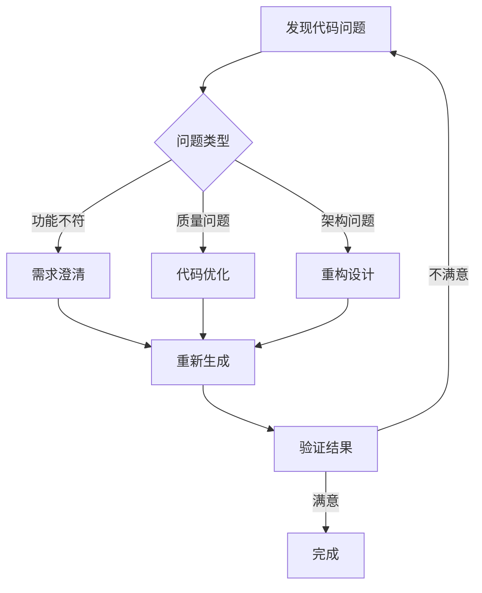
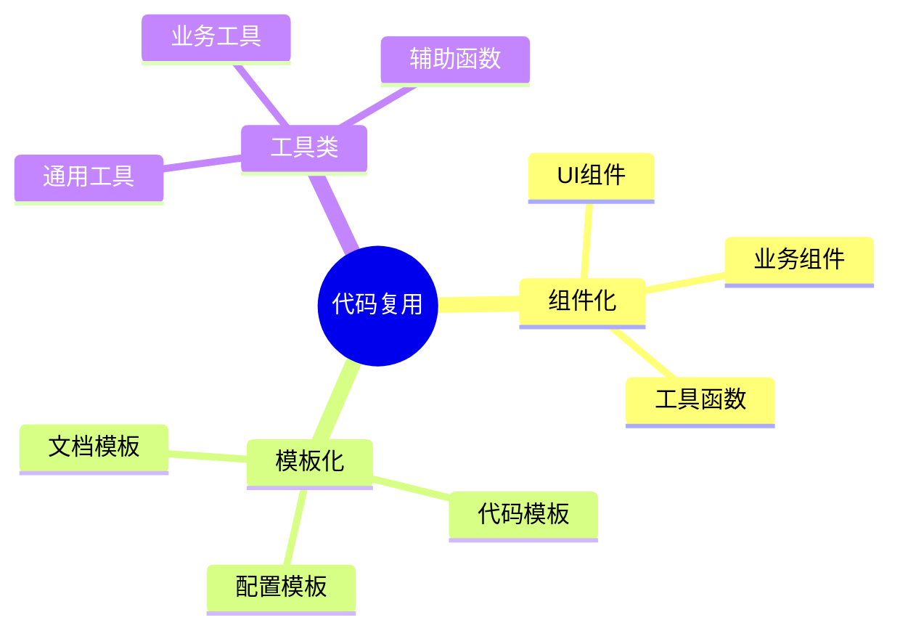
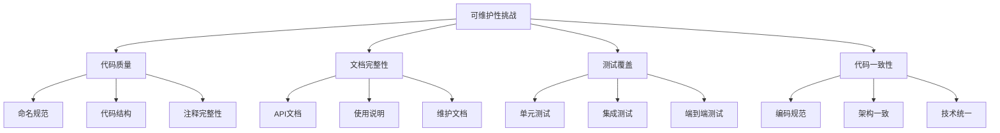
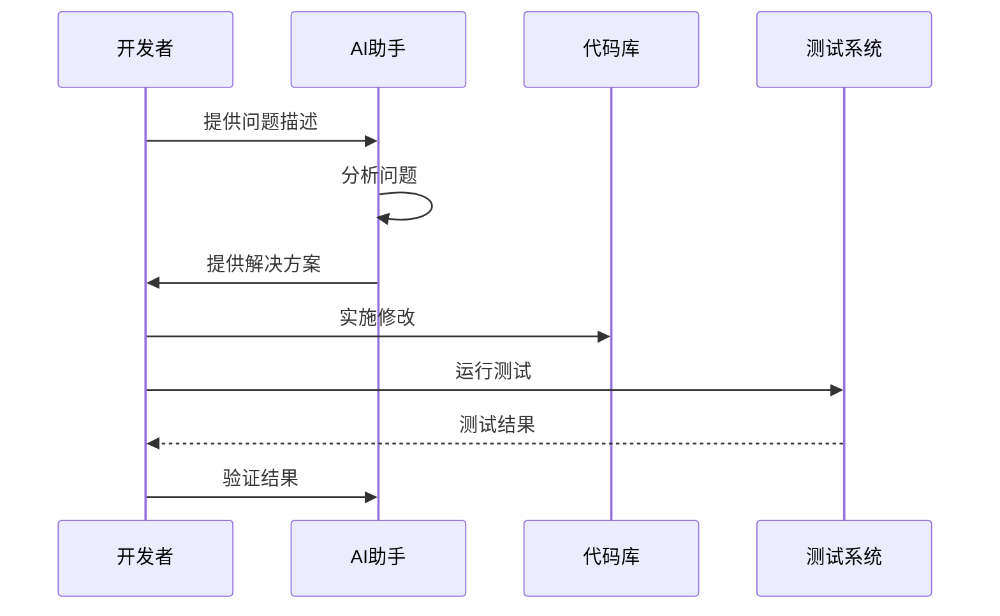

# 第九章 常见问题与解决方案

还记得我刚开始使用 AI 辅助开发时的场景吗？就像是拿到了一把瑞士军刀，却不知道该用哪个刀片。有时候生成的代码像是一块半熟的牛排，外表看起来不错，但里面还需要进一步处理。今天，让我分享一些在使用 AI 工具时遇到的典型问题和解决方案。

## 9.1 生成的代码不符合需求怎么办？

### 9.1.1 问题分析流程

就像医生看病一样，我们需要先诊断问题，再开具处方。这里是一个实用的问题分析流程：



### 9.1.2 优化 Prompt 的策略

就像和一个外国朋友交流，如果你说得太笼统，对方可能会一头雾水。这里分享一些实战经验：

1. **明确需求**
```markdown
❌ 模糊的提示：
"生成一个用户管理系统"

✅ 清晰的提示：
"生成一个用户管理系统，需要包含：
- 用户注册和登录功能（支持邮箱和手机号）
- JWT认证（过期时间2小时）
- 密码加密存储（使用 bcrypt）
- 邮箱验证（支持重发验证邮件）
使用 FastAPI 框架，PostgreSQL 数据库，需要包含完整的错误处理"
```

2. **分步骤引导**
想象你在教一个聪明但经验不足的初级开发者，你会怎么引导他？这是我的方法：
```markdown
第一步：先设计数据模型，包含用户表、角色表和权限表
第二步：实现基础的认证逻辑，确保安全性
第三步：添加核心业务逻辑，如用户管理功能
第四步：设计并实现 API 接口，包含参数验证
第五步：完善错误处理和日志记录
```

### 9.1.3 代码修正示例

有时候 AI 生成的代码就像是一个半成品，需要我们进行"精加工"：

```python
# ❌ AI 最初生成的代码
def create_user(username: str, password: str):
    user = User(username=username, password=password)
    db.add(user)
    db.commit()
    return user

# ✅ 优化后的代码
from passlib.hash import bcrypt
from typing import Optional
from datetime import datetime
from app.core.security import validate_password
from app.core.exceptions import UserExistsError, DatabaseError

async def create_user(
    username: str,
    password: str,
    email: str,
    full_name: Optional[str] = None
) -> User:
    """创建新用户
    
    Args:
        username: 用户名，必须唯一
        password: 原始密码，将被加密存储
        email: 邮箱地址，用于验证和通知
        full_name: 用户全名（可选）
        
    Returns:
        创建成功的用户对象
        
    Raises:
        UserExistsError: 用户名已存在
        ValidationError: 密码不符合要求
        DatabaseError: 数据库操作失败
    """
    # 参数验证
    if await get_user_by_username(username):
        raise UserExistsError("用户名已被使用")
    
    # 密码强度检查
    validate_password(password)
    
    # 密码加密
    hashed_password = bcrypt.hash(password)
    
    # 创建用户
    user = User(
        username=username,
        hashed_password=hashed_password,
        email=email,
        full_name=full_name,
        created_at=datetime.utcnow()
    )
    
    try:
        db.add(user)
        await db.commit()
        await db.refresh(user)
        
        # 发送验证邮件
        await send_verification_email(user.email)
        return user
    except Exception as e:
        await db.rollback()
        raise DatabaseError(f"创建用户失败: {str(e)}")
```

## 9.2 如何有效避免重复生成代码？

### 9.2.1 代码复用策略

就像搭积木一样，我们需要把常用的部件组织好，方便随时取用：



### 9.2.2 模块化示例

这是我在实际项目中常用的一个 HTTP 客户端封装，它解决了很多重复代码的问题：

```typescript
// api/http.ts
import axios, { AxiosResponse, AxiosError } from 'axios';
import { refreshToken } from './auth';
import { logger } from './logger';

export class HttpClient {
    private static instance: HttpClient;
    private baseURL: string;
    private retryCount: number = 0;
    private maxRetries: number = 3;

    private constructor() {
        this.baseURL = process.env.API_BASE_URL || '';
        this.setupInterceptors();
    }

    public static getInstance(): HttpClient {
        if (!HttpClient.instance) {
            HttpClient.instance = new HttpClient();
        }
        return HttpClient.instance;
    }

    private setupInterceptors(): void {
        axios.interceptors.response.use(
            this.handleSuccess,
            this.handleError.bind(this)
        );
    }

    private handleSuccess(response: AxiosResponse): AxiosResponse {
        logger.debug('API调用成功', {
            url: response.config.url,
            status: response.status
        });
        return response;
    }

    private async handleError(error: AxiosError): Promise<any> {
        if (error.response?.status === 401 && this.retryCount < this.maxRetries) {
            this.retryCount++;
            try {
                const newToken = await refreshToken();
                error.config.headers.Authorization = `Bearer ${newToken}`;
                return axios.request(error.config);
            } catch (e) {
                logger.error('Token刷新失败', e);
                window.location.href = '/login';
                return Promise.reject(e);
            }
        }
        
        logger.error('API调用失败', {
            url: error.config?.url,
            status: error.response?.status,
            error: error.message
        });
        return Promise.reject(error);
    }

    public async get<T>(url: string, params?: object): Promise<T> {
        const response = await axios.get(`${this.baseURL}${url}`, { params });
        return response.data;
    }

    public async post<T>(url: string, data?: object): Promise<T> {
        const response = await axios.post(`${this.baseURL}${url}`, data);
        return response.data;
    }
}

// 使用示例
// services/userService.ts
import { HttpClient } from '../api/http';
import { User, UserCreateData } from '../types';

export class UserService {
    private http = HttpClient.getInstance();

    async getUsers(): Promise<User[]> {
        return this.http.get('/users');
    }

    async createUser(userData: UserCreateData): Promise<User> {
        return this.http.post('/users', userData);
    }
}
```

### 9.2.3 代码生成模板

有了这些基础设施，我们就可以更高效地使用 AI 工具了。这里是一个通用的 CRUD 操作模板：

   ```python
# 通用的 CRUD 操作基类
from typing import Generic, TypeVar, Type, Optional, List
from pydantic import BaseModel
from sqlalchemy.orm import Session
from fastapi import HTTPException
from app.core.logger import logger

ModelType = TypeVar("ModelType")
CreateSchemaType = TypeVar("CreateSchemaType", bound=BaseModel)
UpdateSchemaType = TypeVar("UpdateSchemaType", bound=BaseModel)

class CRUDBase(Generic[ModelType, CreateSchemaType, UpdateSchemaType]):
    """通用 CRUD 操作基类
    
    使用示例：
    ```python
    class UserCRUD(CRUDBase[User, UserCreate, UserUpdate]):
        async def get_by_email(self, email: str) -> Optional[User]:
            return await self.db.query(self.model).filter(
                self.model.email == email
            ).first()
    ```
    """
    
    def __init__(self, model: Type[ModelType]):
        self.model = model

    async def get(
        self,
        db: Session,
        id: int
    ) -> Optional[ModelType]:
        try:
            return await db.query(self.model).filter(
                self.model.id == id
            ).first()
        except Exception as e:
            logger.error(f"获取记录失败: {str(e)}")
            raise HTTPException(
                status_code=500,
                detail="数据库查询错误"
            )

    async def get_multi(
        self,
        db: Session,
        *,
        skip: int = 0,
        limit: int = 100
    ) -> List[ModelType]:
        try:
            return await db.query(self.model).offset(skip).limit(limit).all()
        except Exception as e:
            logger.error(f"获取多条记录失败: {str(e)}")
            raise HTTPException(
                status_code=500,
                detail="数据库查询错误"
            )

    async def create(
        self,
        db: Session,
        *,
        obj_in: CreateSchemaType
    ) -> ModelType:
        try:
            obj_in_data = obj_in.dict()
            db_obj = self.model(**obj_in_data)
            db.add(db_obj)
            await db.commit()
            await db.refresh(db_obj)
            return db_obj
        except Exception as e:
            await db.rollback()
            logger.error(f"创建记录失败: {str(e)}")
            raise HTTPException(
                status_code=500,
                detail="创建记录失败"
            )

    async def update(
        self,
        db: Session,
        *,
        db_obj: ModelType,
        obj_in: UpdateSchemaType
    ) -> ModelType:
        try:
            obj_data = obj_in.dict(exclude_unset=True)
            for field in obj_data:
                setattr(db_obj, field, obj_data[field])
            db.add(db_obj)
            await db.commit()
            await db.refresh(db_obj)
            return db_obj
        except Exception as e:
            await db.rollback()
            logger.error(f"更新记录失败: {str(e)}")
            raise HTTPException(
                status_code=500,
                detail="更新记录失败"
            )

    async def remove(
        self,
        db: Session,
        *,
        id: int
    ) -> ModelType:
        try:
            obj = await db.query(self.model).get(id)
            await db.delete(obj)
            await db.commit()
            return obj
        except Exception as e:
            await db.rollback()
            logger.error(f"删除记录失败: {str(e)}")
            raise HTTPException(
                status_code=500,
                detail="删除记录失败"
            )
```

## 9.3 AI 生成代码的可维护性问题

### 9.3.1 可维护性挑战

就像装修房子一样，不仅要看表面效果，更要关注内部结构：



### 9.3.2 最佳实践

在实际项目中，我总结了一些提高代码可维护性的关键点：

1. **代码规范化**
   ```python
# ❌ 随意的代码风格
def do_stuff(x,y):
    z=x+y
    return z

# ✅ 规范的代码风格
from typing import Union, Number
from logging import getLogger

logger = getLogger(__name__)

def calculate_sum(
    first_number: Union[int, float],
    second_number: Union[int, float]
) -> Number:
    """计算两个数字的和
       
       Args:
        first_number: 第一个数字
        second_number: 第二个数字
           
       Returns:
        两个数字的和
           
       Raises:
        TypeError: 当输入参数类型不正确时
    """
    try:
        result = first_number + second_number
        logger.debug(f"计算结果: {result}")
        return result
    except TypeError as e:
        logger.error(f"计算失败: {str(e)}")
        raise
```

2. **测试驱动开发**
```python
# tests/test_calculator.py
import pytest
from app.calculator import calculate_sum

def test_calculate_sum_with_integers():
    # 测试整数相加
    assert calculate_sum(1, 2) == 3
    assert calculate_sum(-1, 1) == 0
    assert calculate_sum(0, 0) == 0

def test_calculate_sum_with_floats():
    # 测试浮点数相加
    assert abs(calculate_sum(1.1, 2.2) - 3.3) < 0.0001
    assert abs(calculate_sum(-1.5, 1.5)) < 0.0001

def test_calculate_sum_with_invalid_types():
    # 测试错误输入
    with pytest.raises(TypeError):
        calculate_sum("1", 2)
    with pytest.raises(TypeError):
        calculate_sum([], {})
```

### 9.3.3 维护清单

每次提交代码前，我都会检查这个清单：

✅ 代码风格检查（使用 pylint/eslint）
✅ 自动化测试（单元测试 + 集成测试）
✅ 文档更新（包括 API 文档和注释）
✅ 依赖管理（检查并更新依赖版本）
✅ 版本控制（清晰的提交信息）
✅ 持续集成（确保 CI 流程通过）
✅ 代码评审（至少一个同事的 review）
✅ 性能监控（关键指标正常）

## 9.4 问题预防与解决方案

### 9.4.1 常见问题分类

在我的开发生涯中，遇到过各种各样的问题，这里是一个总结：

| 问题类型 | 典型症状 | 解决方案 | 预防措施 |
|---------|---------|---------|---------|
| 代码质量 | 难以理解和维护 | 重构和优化 | 制定编码规范 |
| 性能问题 | 响应慢、资源占用高 | 性能优化 | 性能测试 |
| 安全漏洞 | 数据泄露、未授权访问 | 安全加固 | 安全审计 |
| 可扩展性 | 难以添加新功能 | 架构重构 | 模块化设计 |

### 9.4.2 问题解决流程

就像医生看病一样，我们需要一个标准的诊断和治疗流程：



## 9.5 总结与建议

### 9.5.1 关键要点

在使用 AI 工具的过程中，我学到了这些重要的经验：

1. **提高代码质量**
   - 代码就像写文章，要有清晰的结构和优美的表达
   - 命名要见名知意，注释要简洁有效
   - 保持代码的简单性，复杂的代码往往隐藏着 bug

2. **加强测试覆盖**
   - 测试就像是代码的保险栓
   - 单元测试保证局部正确
   - 集成测试验证整体功能
   - 性能测试预防性能问题

3. **完善文档体系**
   - 文档就像是代码的说明书
   - API 文档要详尽准确
   - 使用说明要简单易懂
   - 维护文档要及时更新

### 9.5.2 持续改进

记住，使用 AI 工具是一个持续学习和改进的过程：

1. **定期代码审查**
   - 检查代码质量
   - 发现潜在问题
   - 优化性能瓶颈

2. **技术栈更新**
   - 跟进新特性
   - 更新依赖版本
   - 优化架构设计

3. **团队协作**
   - 分享经验心得
   - 总结最佳实践
   - 建立知识库

最后要说的是，AI 工具确实强大，但它更像是一个经验丰富的搭档，而不是万能的解决方案。真正的提升还是要靠我们自己不断学习和实践。

---
[回到目录](Readme.md)

上一章：[第八章-完整项目开发：用户管理系统](第八章-完整项目开发：用户管理系统.md)

下一章：[第十章-AI编程的未来展望](第十章-AI编程的未来展望.md)
