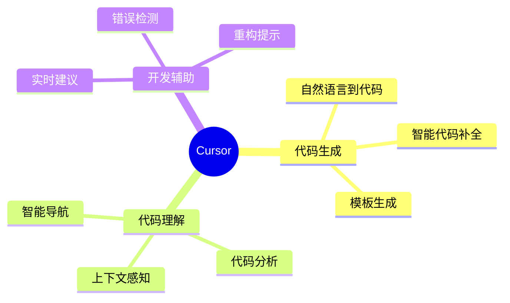
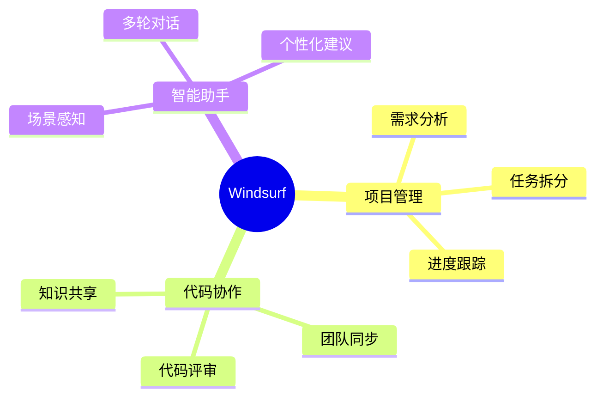
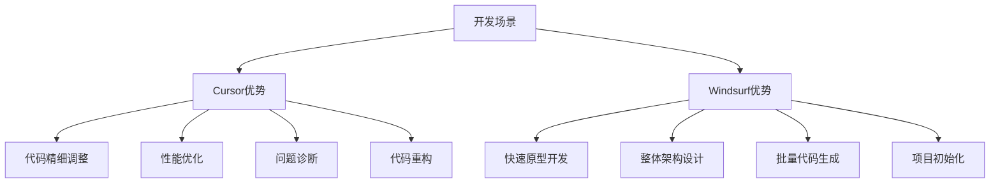
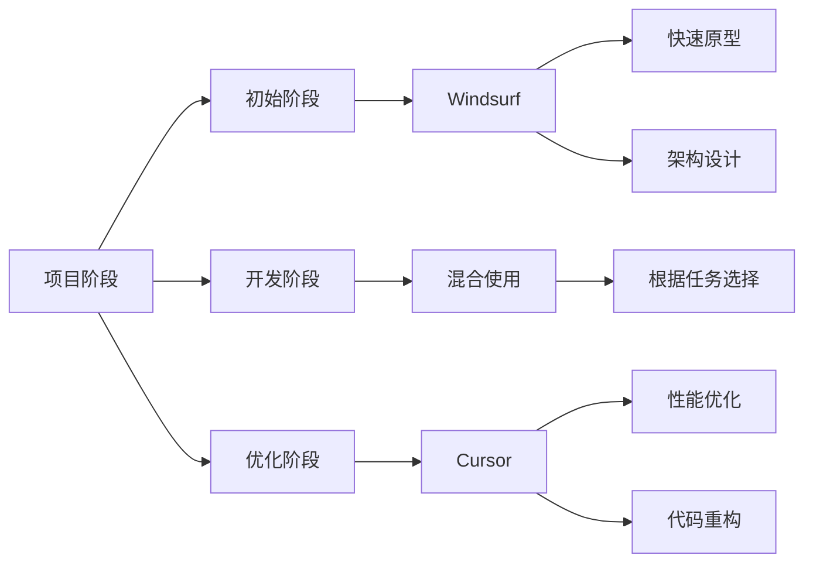
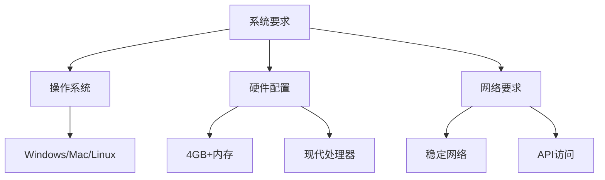
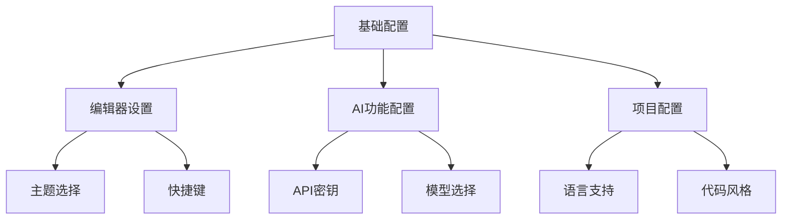
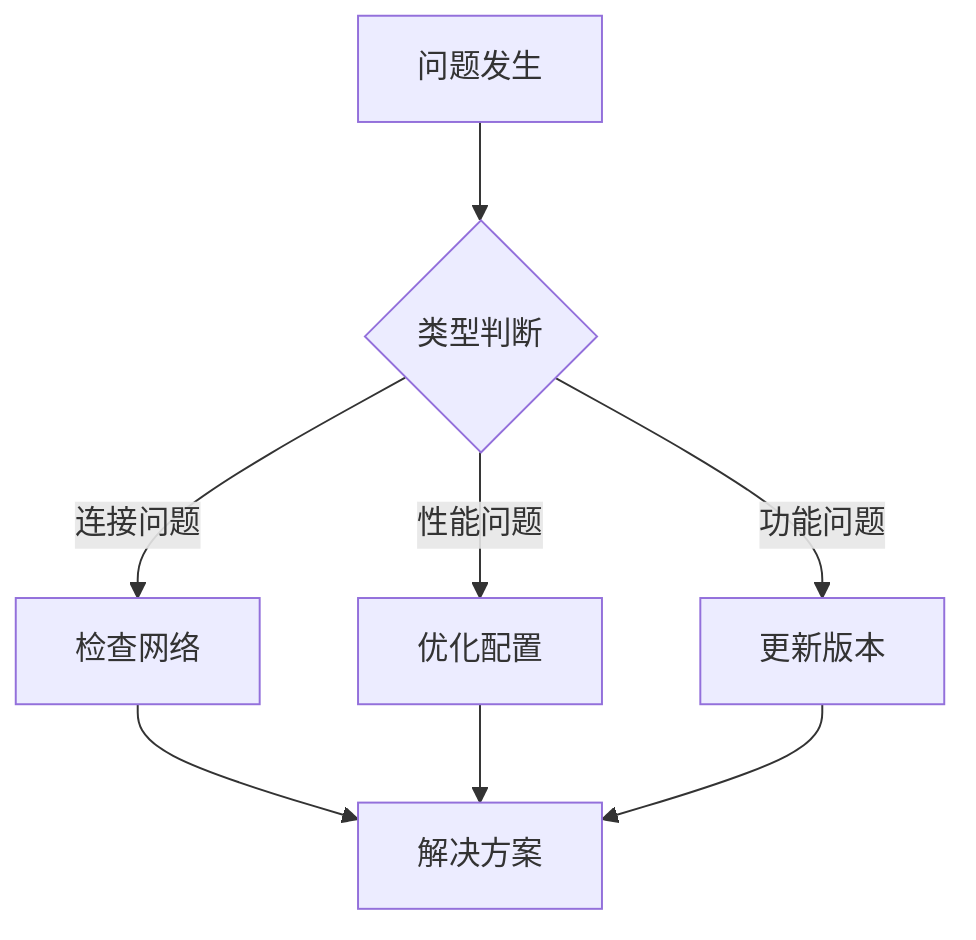

# 第二章 AI 编辑器简介

## 2.1 AI 编辑器的定义与发展

### 2.1.1 什么是 AI 编辑器
AI 编辑器是在传统代码编辑器基础上，集成了人工智能能力的新一代开发工具。它不仅具备代码编辑、语法高亮等基本功能，还能提供智能代码补全、代码理解、自动重构等高级特性。

### 2.1.2 发展历程
- 从简单的代码补全到上下文理解
- 从单文件分析到项目级理解
- 从简单提示到主动建议

## 2.2 认知与实践

### 2.2.1 常见误区

1. **过度依赖**
   - AI 不是万能的
   - 代码质量仍需人工把控
   - 业务理解至关重要

2. **期望值过高**
   - AI 不能完全替代开发者
   - 复杂业务逻辑需要人工梳理
   - 架构设计需要经验积累

### 2.2.2 项目规模的现实差距

1. **常见案例的局限性**
   - 大多数展示项目代码量不超过 1000 行
   - 功能相对简单，缺乏复杂业务逻辑
   - 很少涉及多模块协作

2. **实际项目的规模**
以企业级 CMS 系统为例：
   - 初期开发（约 20% 功能）：
     * 600+ 源代码文件
     * 接近 20000 行代码
     * 仅包含基础功能
   - 完整项目规模：
     * 3000+ 源代码文件
     * 超过 100000 行代码
     * 完整功能模块
     * 复杂的业务逻辑和模块交互
     * 多个微服务组件

### 2.2.3 AI 编辑器的实际价值

1. **代码理解与导航**
   - 快速定位相关代码
   - 理解代码结构和依赖
   - 智能代码搜索

2. **代码生成与补全**
   - 上下文感知的代码补全
   - 智能代码生成
   - 测试用例生成

3. **代码重构与优化**
   - 智能重构建议
   - 代码质量改进
   - 性能优化提示

## 2.3 Cursor 与 Windsurf 的特点

### 2.3.1 Cursor 的主要特性



### 2.3.2 Windsurf 的创新之处



## 2.4 不同场景下的工具选择

### 2.4.1 场景分析



### 2.4.2 选择建议

1. Cursor 优势场景
```plaintext
- 代码精细化调整和优化
- 特定功能的性能优化
- 复杂问题的诊断和修复
- 局部代码的重构和改进
- 具体算法的实现和优化
- 代码质量提升
- 单元测试编写
```

2. Windsurf 优势场景
```plaintext
- 快速原型开发和验证
- 项目整体架构设计
- 大规模代码生成
- 项目框架搭建
- 完整功能模块生成
- API 接口设计和实现
- 数据模型设计
```

### 2.4.3 实际应用策略



### 2.4.4 使用建议

1. 项目初期
```plaintext
优先选择 Windsurf：
- 快速搭建项目框架
- 生成基础代码结构
- 设计整体架构
- 实现核心功能原型
```

2. 开发过程中
```plaintext
根据具体任务选择：
- 新功能模块开发：Windsurf
- 代码优化和调整：Cursor
- 问题修复：Cursor
- 功能扩展：视复杂度选择
```

3. 优化阶段
```plaintext
优先选择 Cursor：
- 性能调优
- 代码重构
- 问题诊断
- 测试用例补充
```

## 2.5 安装与配置

### 2.5.1 环境要求



### 2.5.2 安装步骤

1. Cursor 安装
```plaintext
1. 访问官网下载安装包
2. 运行安装程序
3. 配置开发环境
4. 设置 AI 功能
```

2. Windsurf 安装
```plaintext
1. 获取安装权限
2. 下载安装包
3. 完成安装
4. 团队配置
```

### 2.5.3 基础配置



## 2.6 使用技巧

### 2.6.1 通用技巧

1. 环境准备
```plaintext
- 确保网络稳定
- 配置代理（如需）
- 更新到最新版本
```

2. 性能优化
```plaintext
- 合理设置缓存
- 管理项目大小
- 优化响应时间
```

### 2.6.2 常见问题解决



## 2.7 小结

本章详细介绍了 AI 编辑器的基本概念和特点：

1. AI 编辑器概述
   - 核心功能和技术特点
   - 相比传统 IDE 的优势

2. 工具特点比较
   - Cursor 的主要特性
   - Windsurf 的主要特性

3. 场景选择指南
   - 不同场景的工具选择
   - 具体应用建议

4. 安装配置指南
   - 环境要求
   - 安装步骤
   - 基础配置

通过本章的学习，您应该能够：
- 理解 AI 编辑器的基本概念
- 了解不同工具的特点
- 根据场景选择合适的工具
- 完成工具的安装和配置

在下一章中，我们将深入探讨如何创建有效的 Prompt，这是充分利用 AI 编辑器的关键技能。

---
[回到目录](Readme.md)

上一章：[第一章-基础入门](第一章-基础入门.md)

下一章：[第三章-Prompt创建技巧](第三章-Prompt创建技巧.md)
