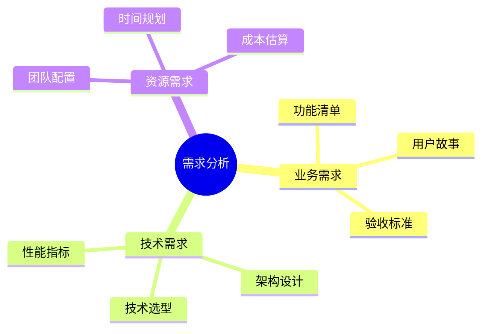
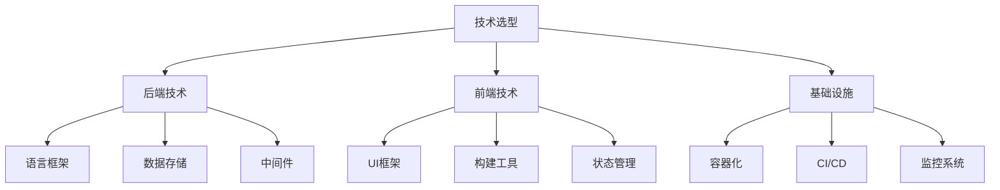
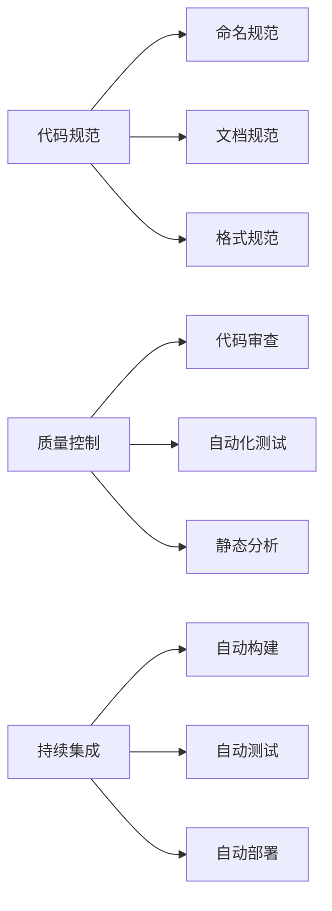
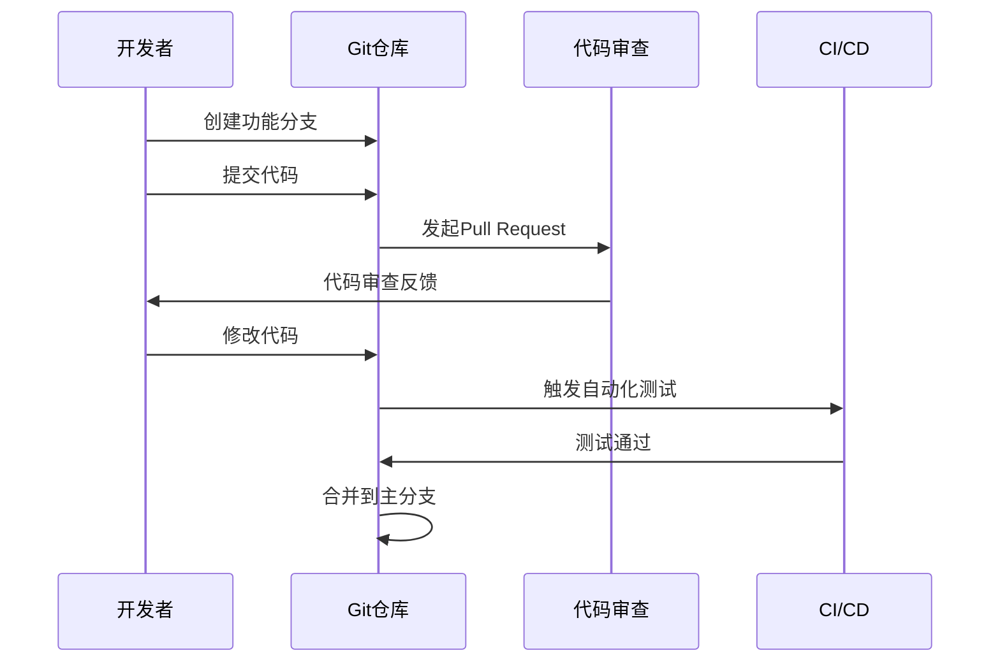
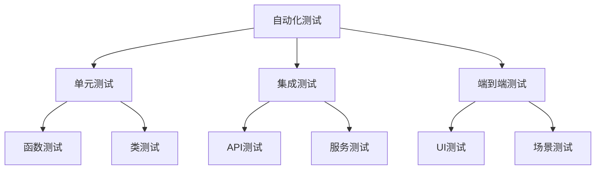
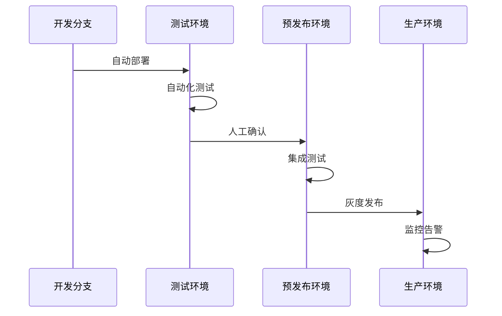
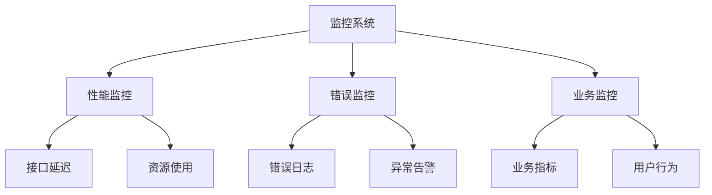
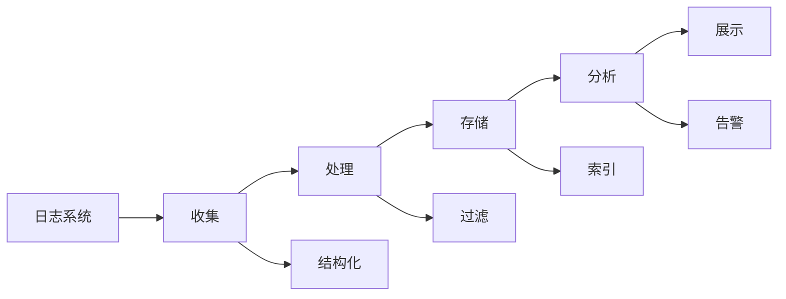

# 第五章 开发流程与实践指南

> 在一个繁忙的开发团队中，如何高效地运用 AI 助手？让我分享一个真实的项目经历，看看 AI 是如何帮助我们将开发效率提升了 50% 的。

## 5.1 项目启动阶段

### 5.1.1 需求分析与规划



🎯 **最佳实践**：在项目开始前，我习惯用 AI 来帮助分析需求文档，它能快速识别出潜在的技术难点和风险。

```python
# 示例：将需求转化为技术任务
需求文档：
"""
开发一个在线课程系统
- 支持视频课程上传和播放
- 学习进度追踪
- 课程评价和互动
- 支付系统集成
"""

技术任务分解：
1. 存储方案：
   - 视频文件：对象存储
   - 用户数据：关系型数据库
   - 缓存：Redis

2. 核心功能：
   - 视频转码服务
   - 进度跟踪系统
   - 评价互动模块
   - 支付集成接口
```

### 5.1.2 技术选型



在选择技术栈时，AI 可以帮我们评估各种方案的优劣。以下是一个真实案例：

💡 **实际案例**：
```yaml
项目需求：
  - 高并发视频播放
  - 实时互动
  - 快速开发迭代

技术选型：
  后端:
    - FastAPI（高性能异步）
    - PostgreSQL（强大的JSON支持）
    - Redis（缓存和实时数据）
  
  前端:
    - Next.js（SEO友好）
    - TailwindCSS（快速开发）
    - WebSocket（实时通讯）
```

## 5.2 开发阶段

### 5.2.1 代码规范与质量控制



记得在一个团队项目中，代码风格不统一导致的问题让我们头疼不已。现在，我们这样解决：

📝 **团队规范示例**：
```python
# 1. 命名规范
class UserService:  # 类名用大驼峰
    def get_user_by_id(self):  # 方法名用小写下划线
        pass

# 2. 文档规范
def process_order(order_id: str) -> Dict:
    """
    处理订单信息
    
    Args:
        order_id: 订单ID
        
    Returns:
        处理后的订单信息
        
    Raises:
        OrderNotFound: 订单不存在时
    """
    pass

# 3. 错误处理规范
try:
    result = process_data()
except ValidationError as e:
    logger.error(f"数据验证失败: {e}")
    raise
```

### 5.2.2 协作开发流程



🤝 **最佳实践**：

1. 分支管理
```bash
# 功能开发
git checkout -b feature/user-auth

# 提交规范
git commit -m "feat: 添加用户认证功能
- 实现JWT认证
- 添加密码加密
- 集成邮箱验证"
```

2. 代码审查
```python
# 审查清单
def review_checklist():
    """
    - 代码是否符合规范
    - 是否包含测试
    - 文档是否更新
    - 性能是否优化
    - 安全是否考虑
    """
    pass
```

## 5.3 测试阶段

### 5.3.1 自动化测试



在一个电商项目中，我们是这样构建测试体系的：

```python
# 1. 单元测试
def test_calculate_order_total():
    """测试订单金额计算"""
    order = Order(items=[
        {"product_id": "1", "quantity": 2, "price": 100},
        {"product_id": "2", "quantity": 1, "price": 50}
    ])
    assert order.calculate_total() == 250

# 2. 集成测试
def test_order_workflow():
    """测试完整订单流程"""
    # 创建订单
    order = create_order(user_id="123", items=[...])
    # 支付
    payment = process_payment(order.id)
    # 确认订单状态
    assert order.status == "PAID"
```

### 5.3.2 性能测试

🚀 **性能优化案例**：

```python
# 1. 接口性能测试
from locust import HttpUser, task

class UserBehavior(HttpUser):
    @task
    def get_product_list(self):
        self.client.get("/api/products")

# 2. 数据库性能优化
def optimize_query():
    # 优化前
    users = User.objects.filter(
        status="active"
    ).select_related("profile")
    
    # 优化后
    users = User.objects.filter(
        status="active"
    ).select_related("profile").only(
        "id", "name", "profile__avatar"
    )
```

## 5.4 部署阶段

### 5.4.1 自动化部署



CI/CD 流程示例：

```yaml
# .github/workflows/deploy.yml
name: Deploy Application

on:
  push:
    branches: [ main ]

jobs:
  deploy:
    runs-on: ubuntu-latest
    steps:
      - uses: actions/checkout@v2
      
      - name: Build
        run: docker build -t myapp .
      
      - name: Test
        run: |
          python -m pytest
          python -m coverage report
      
      - name: Deploy
        if: success()
        run: |
          echo "部署到生产环境"
```

### 5.4.2 监控与告警



📊 **监控系统示例**：

```python
# 1. 性能监控
from prometheus_client import Counter, Histogram

REQUEST_COUNT = Counter(
    'request_count', 
    'App Request Count'
)

REQUEST_LATENCY = Histogram(
    'request_latency_seconds', 
    'Request latency'
)

# 2. 错误告警
def alert_on_error(error: Exception):
    """
    发送错误告警
    
    - 钉钉通知
    - 邮件通知
    - 短信通知
    """
    pass
```

## 5.5 维护阶段

### 5.5.1 日志管理



```python
# 结构化日志示例
import structlog

logger = structlog.get_logger()

def process_order(order_id: str):
    logger.info(
        "开始处理订单",
        order_id=order_id,
        timestamp=datetime.now()
    )
    try:
        # 处理逻辑
        pass
    except Exception as e:
        logger.error(
            "订单处理失败",
            order_id=order_id,
            error=str(e),
            traceback=traceback.format_exc()
        )

### 5.5.2 性能优化

🔍 **性能优化实践**：

```python
# 1. 缓存优化
from functools import lru_cache

@lru_cache(maxsize=1000)
def get_user_preferences(user_id: str) -> Dict:
    """获取用户偏好设置（使用缓存）"""
    return db.query(...)

# 2. 异步处理
async def process_large_data():
    """处理大量数据"""
    tasks = [
        process_chunk(chunk)
        for chunk in split_data(data)
    ]
    results = await asyncio.gather(*tasks)
    return combine_results(results)
```

## 5.6 小结

通过这一章的实战经验分享，我们看到了如何在实际项目中运用 AI 助手提升开发效率。记住，工具是辅助，关键在于如何巧妙地运用它们。

💡 **核心要点**：
- 在项目初期就建立好规范
- 善用 AI 进行代码审查
- 重视自动化测试
- 建立完善的监控系统
- 持续优化性能

---

> 思考题：
> 1. 在你的项目中，哪些环节最适合引入 AI 助手？
> 2. 如何平衡开发速度和代码质量？
> 3. 你有什么独特的项目管理经验可以分享？

[回到目录](Readme.md)

上一章：[第四章-基本操作与实践](第四章-基本操作与实践.md)

下一章：[第六章-代码重构与工具实战](第六章-代码重构与工具实战.md)
