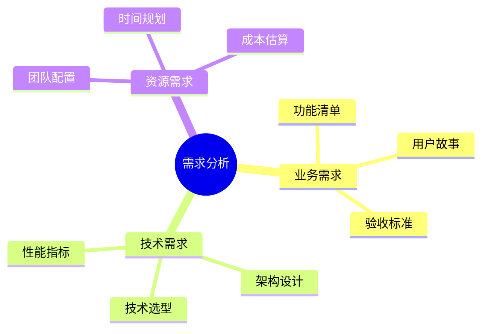
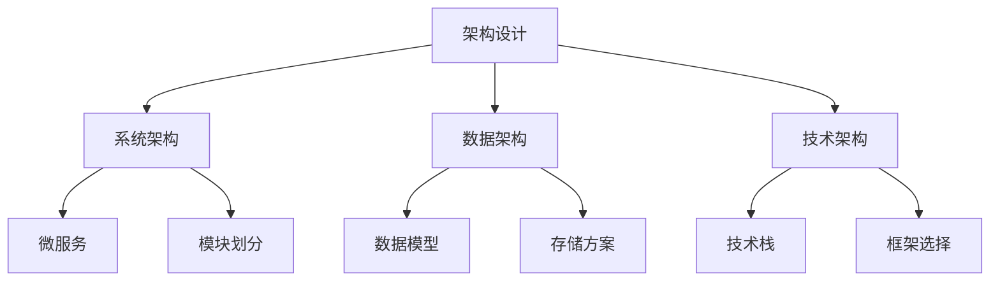

# 第五章 开发流程与实践指南

## 5.1 项目启动阶段

### 5.1.1 需求分析



1. 需求收集工具
```plaintext
使用 AI 辅助：
- 需求模板生成
- 用户故事编写
- 需求完整性检查
- 需求优先级分析
```

2. 需求文档示例
```markdown
# 项目需求文档

## 1. 项目概述
- 项目背景
- 目标用户
- 核心价值

## 2. 功能需求
- 用户管理
- 订单处理
- 支付系统
- 数据分析

## 3. 非功能需求
- 性能指标
- 安全要求
- 可扩展性
```

### 5.1.2 架构设计



## 5.2 现代开发实践

### 5.2.1 从零开始的误区

在实际开发中，我们很少真正从零开始写代码。这种做法不仅效率低下，而且容易错过业界最佳实践。以下是一个更实用的开发策略：

### 5.2.2 脚手架工具的价值
   
以企业级 CMS 系统为例，我们选择使用 FastAPI + Vue3 + Element Plus + TypeScript + AMIS 的技术栈：

- 使用 FastAPI 官方模板初始化后端：
```bash
# 创建项目目录
mkdir cms-project && cd cms-project
# 创建虚拟环境
python -m venv venv
source venv/bin/activate
# 安装依赖
pip install fastapi[all] uvicorn sqlalchemy alembic pydantic python-jose[cryptography] passlib[bcrypt] python-multipart
```

- 初始化前端项目：
```bash
# 使用 Vite 创建 Vue3 + TS 项目
npm create vite@latest frontend -- --template vue-ts
cd frontend
# 安装核心依赖
npm install element-plus @element-plus/icons-vue
# 添加 AMIS 支持
npm install amis amis-editor amis-core
```

### 5.2.3 脚手架带来的基础设施

使用脚手架，我们直接获得：
- 完整的前后端项目结构
- FastAPI 的异步支持
- OpenAPI 文档自动生成
- TypeScript 类型支持（前后端一致）
- 数据库迁移框架（Alembic）
- 现代化前端构建系统
- UI 组件库和低代码引擎

## 5.3 开源资源的利用

### 5.3.1 模板资源
- 在 GitHub 上搜索 "FastAPI Vue CMS template"
- 参考 FastAPI 官方的全栈示例
- 使用 FastAPI Admin 等成熟的管理面板框架
- 借鉴 Tiangolo 的 Full Stack FastAPI 项目模板

### 5.3.2 为什么要使用模板
1. **避免重复工作**
   - 基础架构已经搭建
   - 常用功能已经实现
   - 最佳实践已经集成

2. **提高开发效率**
   - 快速启动项目
   - 减少配置时间
   - 专注业务逻辑

## 5.4 AI 辅助开发流程

### 5.4.1 代码库分析

有了基础代码后，我们可以这样使用 AI 助手：
```
分析整个代码库，特别关注：
- FastAPI 的路由和依赖注入系统
- Pydantic 模型定义
- Vue3 组件结构
- AMIS 低代码编辑器集成
- TypeScript 类型定义
- Element Plus 组件使用
```

### 5.4.2 AI 理解上下文的重要性

1. **框架限定的价值**
   - 避免重复造轮子
   - 确保遵循最佳实践
   - 提供清晰的技术边界
   - 加快开发速度

2. **提升 AI 建议质量**
   - 基于已有代码生成更合适的建议
   - 更准确的代码补全
   - 更有针对性的重构建议

3. **提高开发效率**
   - 从业务逻辑开始，而不是基础架构
   - 利用成熟的组件和模式
   - 专注于系统特有的功能

## 5.5 开发阶段最佳实践

### 5.5.1 代码质量控制
1. **代码规范**
   - 使用 ESLint 和 Prettier
   - 遵循 PEP8 规范
   - 团队代码风格统一

2. **测试策略**
   - 单元测试覆盖
   - 集成测试
   - E2E 测试

3. **性能优化**
   - 代码分析工具
   - 性能监控
   - 持续优化

### 5.5.2 协作与部署
1. **版本控制**
   - Git 工作流
   - 分支管理策略
   - 代码审查流程

2. **CI/CD**
   - 自动化构建
   - 自动化测试
   - 自动化部署

3. **监控与维护**
   - 日志系统
   - 性能监控
   - 错误追踪

## 5.6 总结与最佳实践

1. **项目启动**
   - 充分利用脚手架工具
   - 选择合适的技术栈
   - 建立完善的项目结构

2. **开发过程**
   - 遵循最佳实践
   - 保持代码质量
   - 重视测试和文档

3. **持续改进**
   - 定期代码审查
   - 性能优化
   - 技术栈更新

---

上一章：[第四章-基本操作与实践](第四章-基本操作与实践.md)

下一章：[第六章-代码重构与工具实战](第六章-代码重构与工具实战.md)
