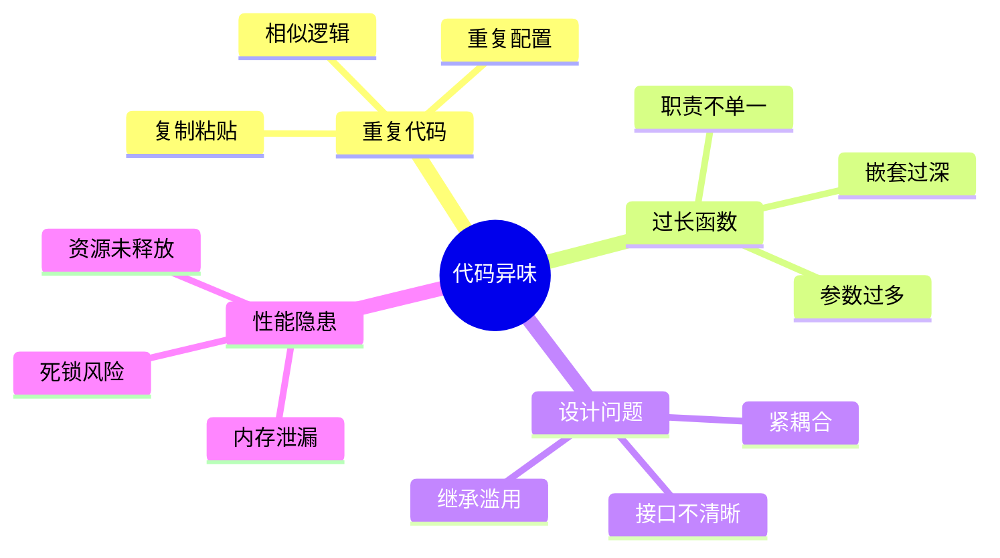
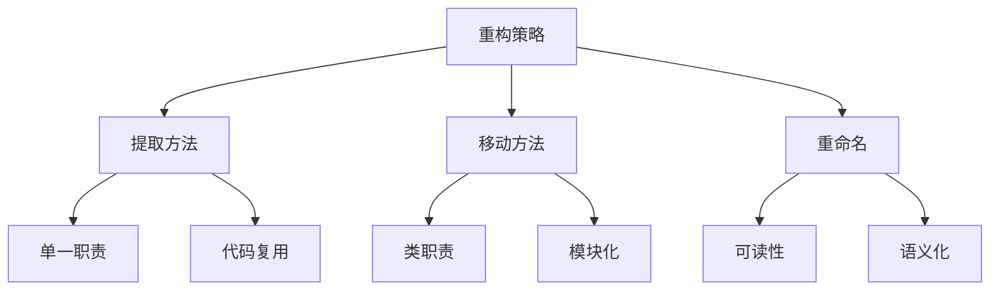
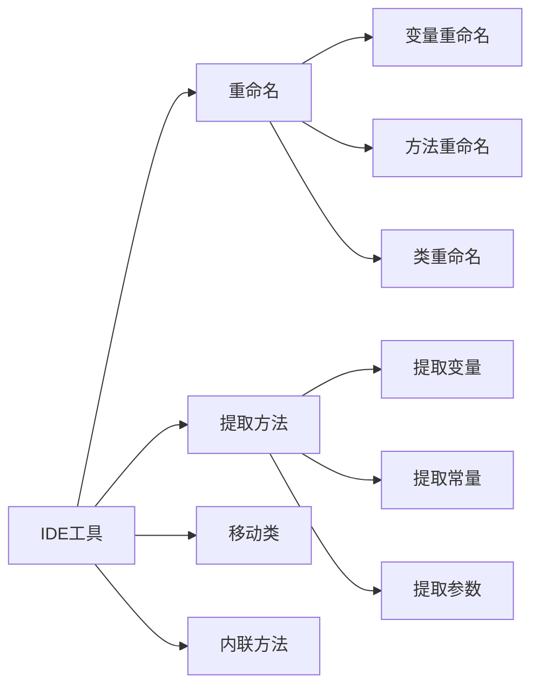
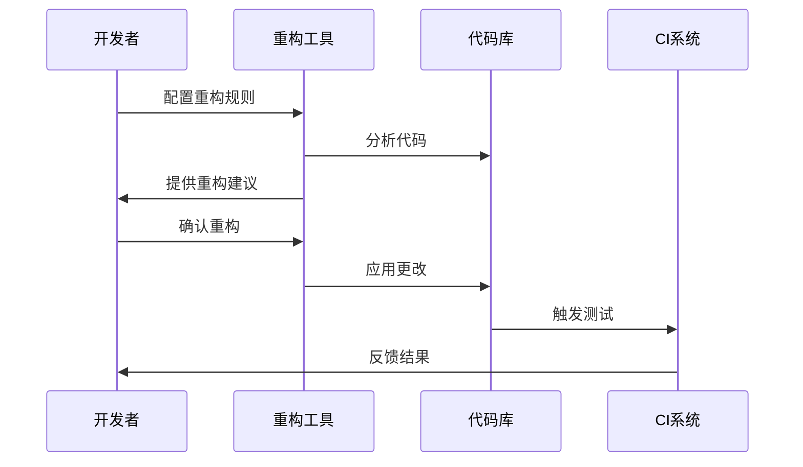
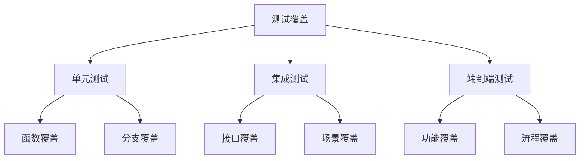
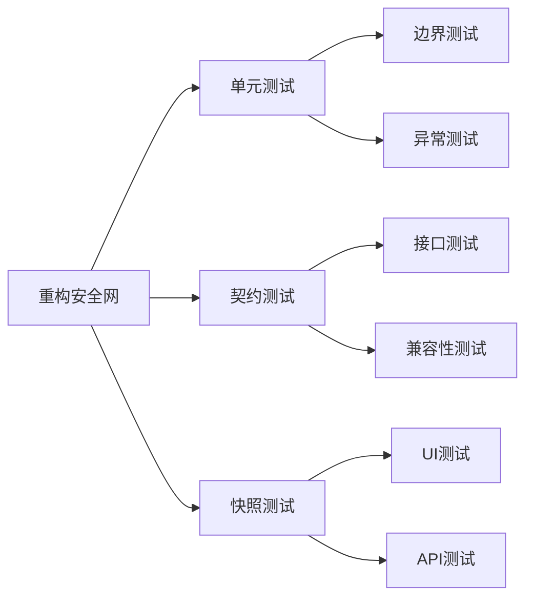
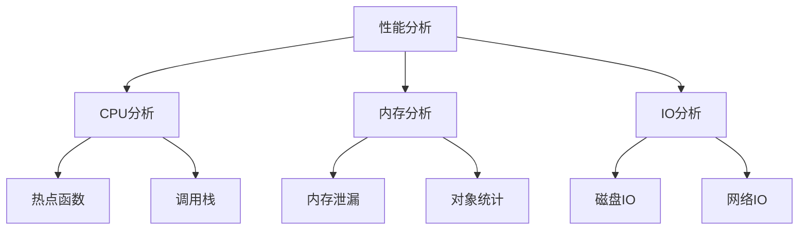
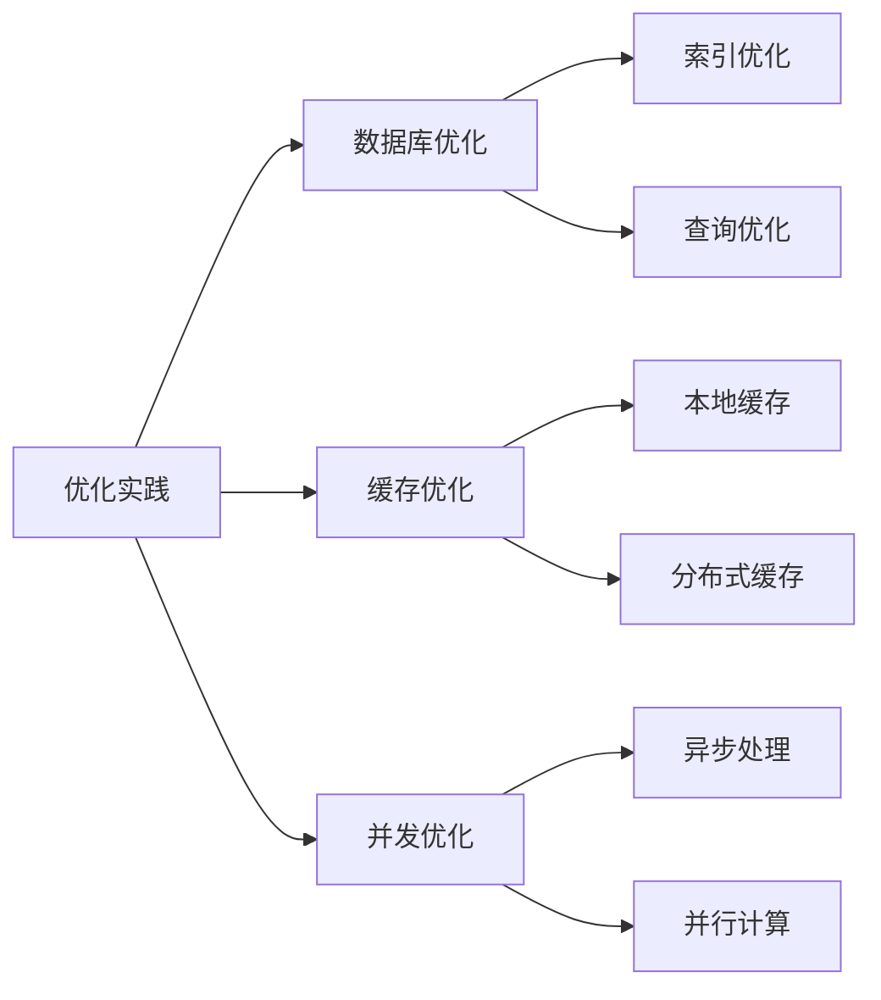
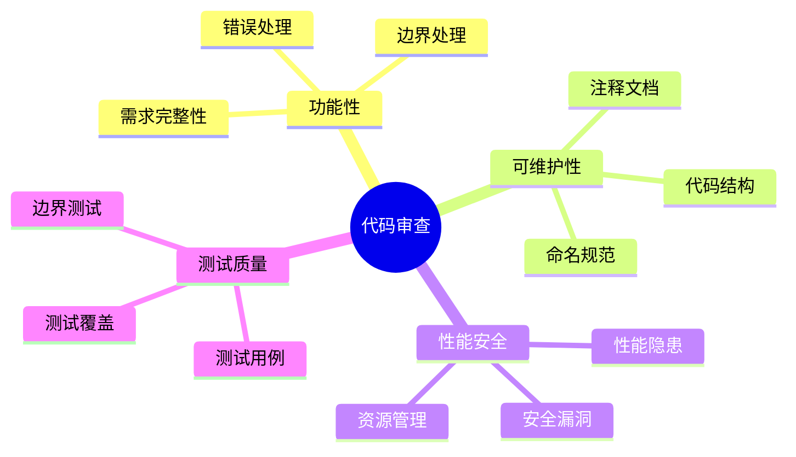
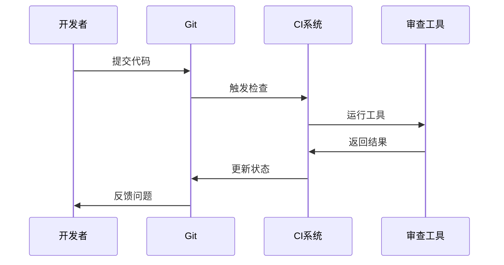

# 第六章 代码重构与工具实战

> 在一个有着十万行代码的遗留系统中，如何优雅地进行重构？让我分享一个真实的重构经历，看看 AI 是如何帮助我们在不影响现有功能的情况下，将代码质量提升了一个层级。

## 6.1 重构基础

### 6.1.1 代码异味识别



🔍 **常见代码异味示例**：

```python
# 1. 过长函数
def process_order(order_data: Dict) -> Dict:
    # 验证订单数据
    if not order_data.get('user_id'):
        raise ValueError("用户ID不能为空")
    if not order_data.get('items'):
        raise ValueError("订单项不能为空")
    
    # 计算订单金额
    total_amount = 0
    for item in order_data['items']:
        if not item.get('product_id'):
            raise ValueError("商品ID不能为空")
        if not item.get('quantity'):
            raise ValueError("商品数量不能为空")
        product = db.query(Product).get(item['product_id'])
        if not product:
            raise ValueError(f"商品不存在: {item['product_id']}")
        total_amount += product.price * item['quantity']
    
    # 检查库存
    for item in order_data['items']:
        product = db.query(Product).get(item['product_id'])
        if product.stock < item['quantity']:
            raise ValueError(f"商品库存不足: {product.name}")
    
    # 创建订单
    order = Order(
        user_id=order_data['user_id'],
        total_amount=total_amount,
        status='pending'
    )
    db.add(order)
    
    # 创建订单项
    for item in order_data['items']:
        order_item = OrderItem(
            order_id=order.id,
            product_id=item['product_id'],
            quantity=item['quantity']
        )
        db.add(order_item)
    
    # 更新库存
    for item in order_data['items']:
        product = db.query(Product).get(item['product_id'])
        product.stock -= item['quantity']
    
    db.commit()
    return {"order_id": order.id, "total_amount": total_amount}
```

### 6.1.2 重构策略



📝 **重构后的代码**：

```python
class OrderValidator:
    @staticmethod
    def validate_order_data(order_data: Dict) -> None:
        """验证订单数据"""
        if not order_data.get('user_id'):
            raise ValueError("用户ID不能为空")
        if not order_data.get('items'):
            raise ValueError("订单项不能为空")
        
        for item in order_data['items']:
            OrderValidator.validate_order_item(item)
    
    @staticmethod
    def validate_order_item(item: Dict) -> None:
        """验证订单项"""
        if not item.get('product_id'):
            raise ValueError("商品ID不能为空")
        if not item.get('quantity'):
            raise ValueError("商品数量不能为空")

class OrderCalculator:
    @staticmethod
    def calculate_total_amount(items: List[Dict], products: Dict[str, Product]) -> Decimal:
        """计算订单总金额"""
        return sum(
            products[item['product_id']].price * item['quantity']
            for item in items
        )

class InventoryManager:
    @staticmethod
    def check_stock(items: List[Dict], products: Dict[str, Product]) -> None:
        """检查库存"""
        for item in items:
            product = products[item['product_id']]
            if product.stock < item['quantity']:
                raise ValueError(f"商品库存不足: {product.name}")
    
    @staticmethod
    def update_stock(items: List[Dict], products: Dict[str, Product]) -> None:
        """更新库存"""
        for item in items:
            product = products[item['product_id']]
            product.stock -= item['quantity']

class OrderService:
    def __init__(self, db_session):
        self.db = db_session
    
    def create_order(self, order_data: Dict) -> Dict:
        """创建订单"""
        # 验证数据
        OrderValidator.validate_order_data(order_data)
        
        # 获取商品信息
        products = self._get_products(order_data['items'])
        
        # 检查库存
        InventoryManager.check_stock(order_data['items'], products)
        
        # 计算金额
        total_amount = OrderCalculator.calculate_total_amount(
            order_data['items'], 
            products
        )
        
        # 创建订单
        order = self._create_order_record(order_data, total_amount)
        
        # 创建订单项
        self._create_order_items(order.id, order_data['items'])
        
        # 更新库存
        InventoryManager.update_stock(order_data['items'], products)
        
        self.db.commit()
        return {"order_id": order.id, "total_amount": total_amount}
    
    def _get_products(self, items: List[Dict]) -> Dict[str, Product]:
        """获取商品信息"""
        product_ids = {item['product_id'] for item in items}
        products = self.db.query(Product).filter(
            Product.id.in_(product_ids)
        ).all()
        return {str(p.id): p for p in products}
    
    def _create_order_record(self, order_data: Dict, total_amount: Decimal) -> Order:
        """创建订单记录"""
        order = Order(
            user_id=order_data['user_id'],
            total_amount=total_amount,
            status='pending'
        )
        self.db.add(order)
        return order
    
    def _create_order_items(self, order_id: int, items: List[Dict]) -> None:
        """创建订单项记录"""
        order_items = [
            OrderItem(
                order_id=order_id,
                product_id=item['product_id'],
                quantity=item['quantity']
            )
            for item in items
        ]
        self.db.bulk_save_objects(order_items)
```

## 6.2 重构工具实战

### 6.2.1 IDE 重构工具



🛠️ **常用重构快捷键**：

```python
# VS Code 重构示例

# 1. 重命名 (F2)
old_variable = 1  # 选中 old_variable，按 F2

# 2. 提取方法 (Cmd+Shift+R)
def complex_function():
    # 选中要提取的代码块
    result = perform_calculation()
    process_result(result)
    # 使用快捷键提取为新方法

# 3. 移动文件 (拖拽或右键菜单)
# user_service.py -> services/user_service.py
```

### 6.2.2 自动化重构工具



📊 **工具示例**：

```python
# 1. pylint 代码分析
# .pylintrc
[MESSAGES CONTROL]
disable=C0111,C0103
max-line-length=100

# 2. black 代码格式化
# pyproject.toml
[tool.black]
line-length = 88
target-version = ['py37']
include = '\.pyi?$'

# 3. isort 导入排序
# setup.cfg
[isort]
multi_line_output=3
include_trailing_comma=True
force_grid_wrap=0
combine_as_imports=True
```

## 6.3 测试驱动重构

### 6.3.1 测试覆盖率分析



```python
# pytest 测试示例
import pytest
from decimal import Decimal

def test_order_calculator():
    # 准备测试数据
    items = [
        {"product_id": "1", "quantity": 2},
        {"product_id": "2", "quantity": 1}
    ]
    products = {
        "1": Product(id="1", price=Decimal("100")),
        "2": Product(id="2", price=Decimal("50"))
    }
    
    # 执行计算
    total = OrderCalculator.calculate_total_amount(items, products)
    
    # 验证结果
    assert total == Decimal("250")

def test_inventory_manager():
    # 准备测试数据
    items = [{"product_id": "1", "quantity": 5}]
    products = {
        "1": Product(id="1", stock=3, name="测试商品")
    }
    
    # 验证库存不足时抛出异常
    with pytest.raises(ValueError) as exc:
        InventoryManager.check_stock(items, products)
    assert "商品库存不足: 测试商品" in str(exc.value)
```

### 6.3.2 重构安全网



```python
# 1. 契约测试
from pytest_bdd import scenario, given, when, then

@scenario('features/order.feature', '创建订单')
def test_create_order():
    pass

@given('用户已登录')
def user_logged_in():
    return create_test_user()

@when('提交有效的订单数据')
def submit_valid_order(user):
    return create_order(user_id=user.id, items=[...])

@then('订单创建成功')
def order_created(response):
    assert response.status_code == 200
    assert response.json()['order_id']

# 2. 快照测试
def test_order_response(snapshot):
    order_service = OrderService(db_session)
    response = order_service.create_order({...})
    snapshot.assert_match(response)
```

## 6.4 性能优化

### 6.4.1 性能分析工具



```python
# 1. cProfile 性能分析
import cProfile
import pstats

def profile_order_creation():
    profiler = cProfile.Profile()
    profiler.enable()
    
    # 执行要分析的代码
    order_service = OrderService(db_session)
    order_service.create_order({...})
    
    profiler.disable()
    stats = pstats.Stats(profiler).sort_stats('cumulative')
    stats.print_stats()

# 2. memory_profiler 内存分析
from memory_profiler import profile

@profile
def memory_intensive_operation():
    large_list = [i * i for i in range(1000000)]
    process_list(large_list)
    return sum(large_list)
```

### 6.4.2 性能优化实践



```python
# 1. 数据库查询优化
from sqlalchemy import create_index

# 创建索引
create_index('idx_order_user_id', 'orders', ['user_id'])

# 优化查询
def get_user_orders(user_id: int) -> List[Order]:
    return (
        db.query(Order)
        .filter(Order.user_id == user_id)
        .options(
            joinedload(Order.items),
            joinedload(Order.items).joinedload(OrderItem.product)
        )
        .all()
    )

# 2. 缓存优化
from functools import lru_cache
from redis import Redis

# 本地缓存
@lru_cache(maxsize=1000)
def get_product_details(product_id: str) -> Dict:
    return db.query(Product).get(product_id).to_dict()

# Redis缓存
redis_client = Redis(host='localhost', port=6379)

def get_cached_order(order_id: str) -> Dict:
    # 尝试从缓存获取
    cached = redis_client.get(f"order:{order_id}")
    if cached:
        return json.loads(cached)
    
    # 缓存未命中，从数据库获取
    order = db.query(Order).get(order_id)
    if order:
        # 写入缓存
        redis_client.setex(
            f"order:{order_id}",
            3600,  # 1小时过期
            json.dumps(order.to_dict())
        )
        return order.to_dict()
    return None
```

## 6.5 代码审查

### 6.5.1 代码审查清单



📋 **审查清单示例**：

```python
class CodeReviewChecklist:
    """代码审查清单"""
    
    @staticmethod
    def functionality_checks():
        return [
            "是否完全实现了需求？",
            "是否处理了所有边界情况？",
            "是否有适当的错误处理？",
            "是否有日志记录？"
        ]
    
    @staticmethod
    def maintainability_checks():
        return [
            "代码是否遵循项目规范？",
            "变量和函数命名是否清晰？",
            "是否有必要的注释和文档？",
            "是否避免了代码重复？"
        ]
    
    @staticmethod
    def performance_checks():
        return [
            "是否有性能隐患？",
            "是否正确释放资源？",
            "是否有内存泄漏风险？",
            "是否有并发问题？"
        ]
    
    @staticmethod
    def security_checks():
        return [
            "是否进行了输入验证？",
            "是否有安全漏洞？",
            "敏感数据是否加密？",
            "是否有权限控制？"
        ]
```

### 6.5.2 自动化代码审查



```python
# 1. pre-commit 配置
# .pre-commit-config.yaml
repos:
-   repo: https://github.com/pre-commit/pre-commit-hooks
    rev: v3.4.0
    hooks:
    -   id: trailing-whitespace
    -   id: end-of-file-fixer
    -   id: check-yaml
    -   id: check-added-large-files

-   repo: https://github.com/psf/black
    rev: 21.5b2
    hooks:
    -   id: black

-   repo: https://github.com/pycqa/isort
    rev: 5.8.0
    hooks:
    -   id: isort

# 2. GitHub Actions 配置
# .github/workflows/code-review.yml
name: Code Review

on: [pull_request]

jobs:
  review:
    runs-on: ubuntu-latest
    steps:
    - uses: actions/checkout@v2
    
    - name: Set up Python
      uses: actions/setup-python@v2
      with:
        python-version: '3.9'
    
    - name: Install dependencies
      run: |
        pip install pylint black isort mypy
    
    - name: Run checks
      run: |
        pylint src/
        black --check src/
        isort --check-only src/
        mypy src/
```

## 6.6 小结

通过本章的实战经验分享，我们学习了如何系统地进行代码重构，以及如何利用各种工具提高重构效率。记住，重构是一个持续的过程，需要在保证系统稳定性的前提下渐进式地进行。

💡 **核心要点**：
- 重构前必须有充分的测试覆盖
- 小步重构，频繁提交
- 善用工具，提高效率
- 保持代码审查的习惯
- 持续关注性能优化

---

> 思考题：
> 1. 在你的项目中，最常见的代码异味是什么？
> 2. 你是如何平衡重构和功能开发的？
> 3. 你有什么独特的重构经验可以分享？

[回到目录](Readme.md)

上一章：[第五章-开发流程与实践指南](第五章-开发流程与实践指南.md)

下一章：[第七章-团队协作与代码标准化](第七章-团队协作与代码标准化.md)
