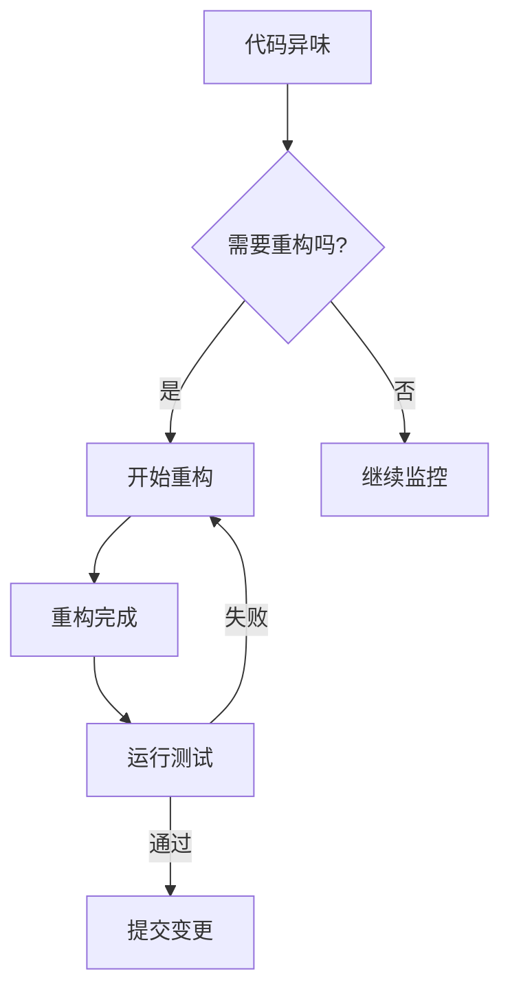
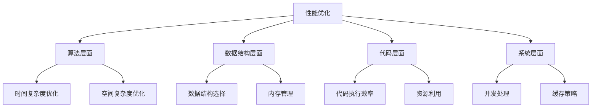

# 第六章 代码重构与工具实战

## 6.1 代码重构的必要性

### 6.1.1 什么是代码重构？

代码重构是在不改变代码外部行为的前提下，对代码进行重新构造的过程。这个过程主要目的是：
- 提高代码的可读性
- 降低代码的复杂度
- 改善代码的结构
- 消除技术债务

### 6.1.2 重构的时机

常见的需要重构的场景：
1. 代码重复度高
2. 方法过长
3. 类职责不清
4. 过度耦合
5. 难以测试的代码

## 6.2 AI 工具应用策略

### 6.2.1 场景分析
- 代码优化场景
- 重构场景
- 性能优化场景
- 测试场景

### 6.2.2 工具优势
- 智能代码分析
- 自动重构建议
- 性能优化提示
- 测试用例生成

## 6.3 项目阶段与工具应用

### 6.3.1 开发流程策略
- 需求分析阶段
- 开发实现阶段
- 测试优化阶段
- 维护更新阶段

### 6.3.2 阶段性工具选择
- 代码生成工具
- 重构辅助工具
- 测试工具
- 性能分析工具

## 6.4 AI 辅助重构实践

### 6.4.1 重构流程
1. 代码分析
2. 问题识别
3. 重构方案
4. 实施重构
5. 验证测试

### 6.4.2 最佳实践
- 循序渐进
- 保持简单
- 频繁测试
- 及时提交

## 6.5 性能优化技巧

### 6.5.1 性能优化的层次

### 6.5.2 常见性能优化方法

1. **算法优化**
   - 选择适当的算法
   - 优化时间复杂度
   - 优化空间复杂度
   - 使用缓存策略

2. **代码层面优化**
   - 避免重复计算
   - 减少循环嵌套
   - 使用适当的数据结构
   - 优化条件判断

3. **系统层面优化**
   - 并发处理
   - 资源池化
   - 负载均衡
   - 分布式处理

## 6.6 工具实战技巧

### 6.6.1 有效利用 AI 编辑器

1. **上下文理解**
   - 让 AI 理解整个项目结构
   - 提供足够的业务背景
   - 明确开发目标和约束

2. **代码质量控制**
   - 人工审查生成的代码
   - 确保代码风格一致性
   - 维护代码可维护性

3. **效率优化**
   - 使用模板和代码片段
   - 批量处理相似任务
   - 自动化重复工作

### 6.6.2 常见陷阱避免

1. **过度依赖**
   - 保持独立思考能力
   - 理解生成代码的原理
   - 验证关键算法和逻辑

2. **盲目接受**
   - 审查生成的代码质量
   - 确保符合项目规范
   - 考虑性能和安全性

3. **忽视文档**
   - 及时更新文档
   - 记录关键决策
   - 维护知识库

## 6.7 总结与最佳实践

1. **重构原则**
   - 保持代码行为不变
   - 小步快跑
   - 持续集成
   - 完整测试

2. **工具选择**
   - 根据场景选择合适的工具
   - 合理分配任务
   - 优化工作流程

3. **持续改进**
   - 定期代码审查
   - 性能监控
   - 及时优化

---

上一章：[第五章-开发流程与实践指南](第五章-开发流程与实践指南.md)

下一章：[第七章-团队协作与代码标准化](第七章-团队协作与代码标准化.md)
