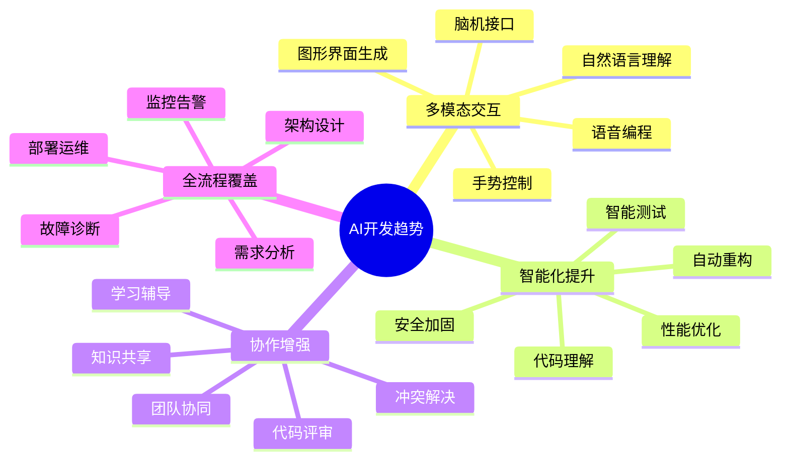
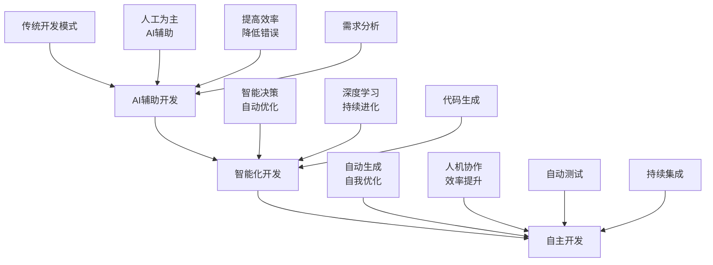
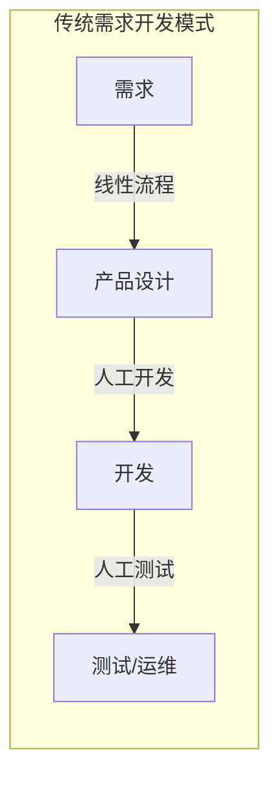
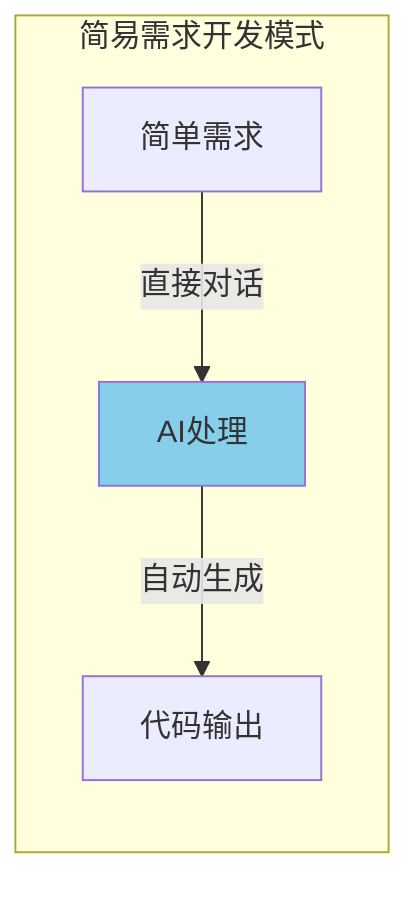
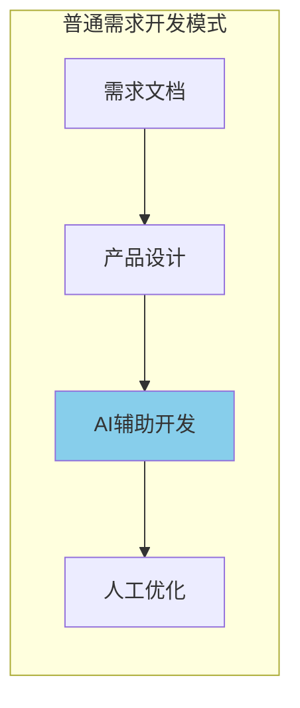
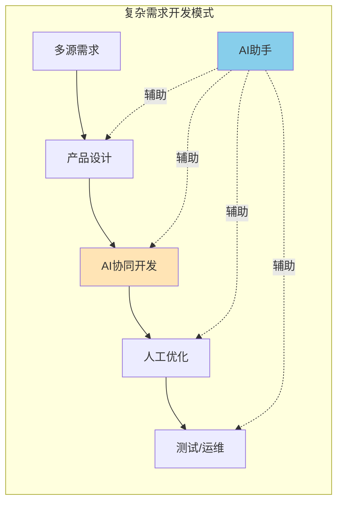
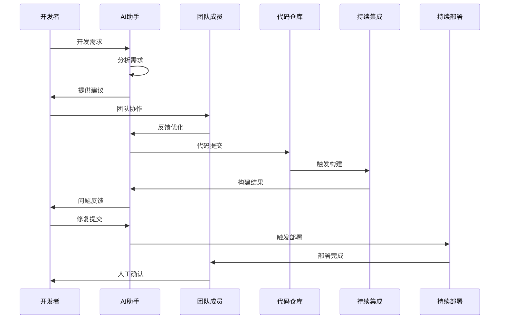
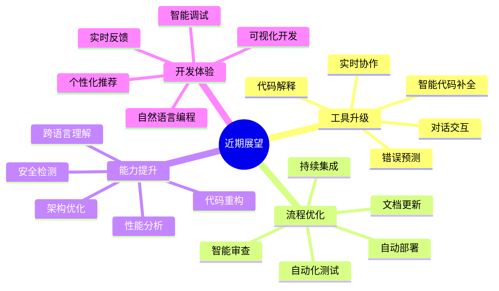
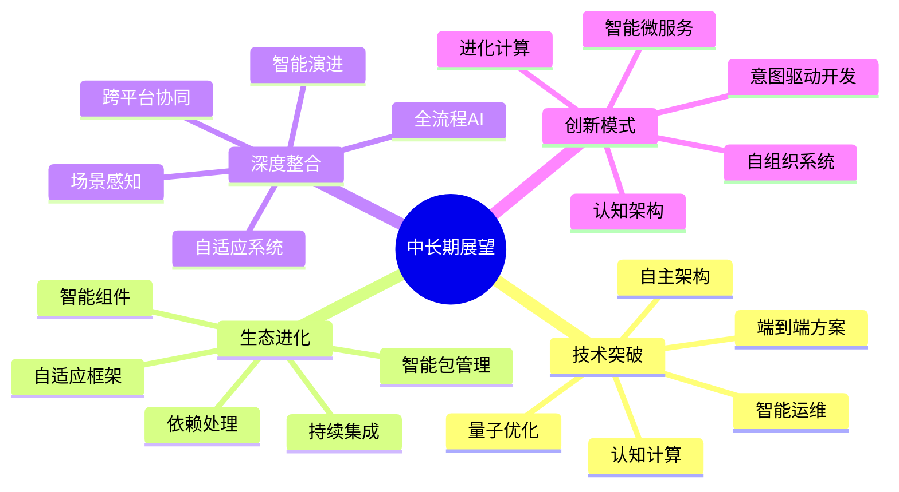

# 第十章 AI 编程的未来展望

还记得十年前我们是怎么写代码的吗？那时的 IDE 最多也就是帮我们自动补全一下变量名，现在的 AI 助手却能直接生成完整的功能模块。站在这个时间点回望，不禁让人对未来充满期待。让我们一起来探讨 AI 编程的未来发展趋势。

回想一下我们的编程之路：从最初的手动编写每一行代码，到使用简单的代码片段工具，再到现在的 AI 辅助编程。这个演变过程不仅改变了我们的工作方式，更重要的是，它让我们能够将更多精力投入到真正需要人类智慧的地方：系统设计、业务理解和创新思维。

## 10.1 AI 编程的发展趋势

就像婴儿学习说话一样，AI 编程工具也经历了一个渐进的过程。从最初的简单代码补全，到现在的智能对话和代码生成，AI 的能力正在以惊人的速度提升。让我们来看看这个激动人心的发展历程。

### 10.1.1 技术发展趋势

在过去的几年里，AI 编程工具突破了一个又一个的限制。从最初只能处理单个函数的局限，到现在可以理解整个项目的全局视角；从被动等待指令执行，到主动提供建议和优化；从固定的模板生成，到灵活的上下文感知。这些进步勾勒出了一幅令人振奋的发展蓝图：



这些趋势不仅仅是技术的进步，更代表着开发模式的革新。例如，在多模态交互方面，现代 AI 编程助手(如 Cursor)已经能够通过自然语言描述直接生成代码。开发者只需要用自然语言描述需求:"我需要一个支持多语言的用户注册系统，包含邮箱验证和手机号验证",AI 就能立即生成符合要求的代码框架。这种通过自然语言生成代码的能力正在不断提升和完善，让编程变得更加直观和高效。

### 10.1.2 应用场景扩展

随着技术的不断进步，AI 在软件开发中的应用场景也在不断扩展。从最初的辅助工具，到现在的开发伙伴，AI 正在重新定义开发流程：



这种演进不是简单的工具替换，而是<font color="red">开发范式</font>的根本转变。从图中我们可以看到，AI 辅助开发已经形成了多种成熟的模式：



1. **传统需求开发模式**
   - 遵循"需求->产品设计->开发->测试/运维"的标准流程
   - 各环节人工参与度高
   - 开发流程相对固定和线性



2. **简易需求开发模式**
   - 直接通过 AI（如 ChatGPT/Claude 等）处理需求
   - AI 能够理解项目结构、图片和文字
   - 自动进行翻译、写作和重构等任务
   - 大幅提升开发效率



3. **普通需求开发模式**
   - 结合产品文档（如 PRD）和现有代码
   - 人工设计与 AI 协作配合
   - 开发人员对 AI 输出进行优化和调整



4. **复杂需求开发模式**
   - 整合多种信息源（如 OnlyFans、TikTok 等平台特性）
   - 产品设计、开发和 AI 三方协同
   - 全流程 AI 辅助，包括测试和运维
   - 实现更高效的迭代和创新

这些开发模式展示了 AI 如何在不同复杂度的项目中发挥作用，从简单的代码生成到复杂的全流程协作，AI 正在重塑软件开发的每个环节。

## 10.2 工具功能的演进方向

在这个快速发展的时代，AI 工具的功能也在不断进化。从简单的代码补全到复杂的架构设计，每一步的进步都在改变着我们的开发方式。让我们来看看这些令人兴奋的变化。

### 10.2.1 智能化提升

想象一下，当你在编写代码时，AI 助手不仅能理解你的意图，还能主动提供优化建议，这不再是科幻小说，而是正在发生的现实：

1. **代码理解与重构**
```python
class AICodeAnalyzer:
    def analyze_code_structure(self, code: str) -> Dict[str, Any]:
        """分析代码结构并提供优化建议
        
        特点：
        1. 深度理解代码语义
        2. 识别设计模式
        3. 提供重构建议
        4. 性能优化分析
        """
        pass

    def suggest_improvements(self, analysis: Dict[str, Any]) -> List[Suggestion]:
        """基于分析结果提供改进建议"""
        pass

    def auto_refactor(self, code: str, suggestions: List[Suggestion]) -> str:
        """自动执行代码重构"""
        pass

    def analyze_dependencies(self) -> DependencyGraph:
        """分析代码依赖关系"""
        pass

    def predict_impact(self, changes: List[Change]) -> ImpactAnalysis:
        """预测代码变更影响范围"""
        pass

    def optimize_performance(self, code: str) -> Tuple[str, PerformanceMetrics]:
        """优化代码性能"""
        pass
```

2. **智能测试生成**
```python
class AITestGenerator:
    def generate_test_cases(self, code: str) -> List[TestCase]:
        """自动生成全面的测试用例
        
        特点：
        1. 边界条件覆盖
        2. 异常场景测试
        3. 性能测试用例
        4. 安全测试场景
        """
        pass

    def maintain_test_suite(self, code_changes: List[Change]) -> List[TestUpdate]:
        """智能更新测试套件"""
        pass

    def generate_mock_data(self, schema: Dict) -> MockData:
        """生成测试数据"""
        pass

    def analyze_test_coverage(self, tests: List[TestCase]) -> CoverageReport:
        """分析测试覆盖率"""
        pass

    def suggest_test_improvements(self, coverage: CoverageReport) -> List[TestSuggestion]:
        """提供测试改进建议"""
        pass
```

3. **代码优化助手**
```python
class CodeOptimizer:
    def __init__(self):
        self.performance_analyzer = PerformanceAnalyzer()
        self.memory_profiler = MemoryProfiler()
        self.complexity_analyzer = ComplexityAnalyzer()

    async def optimize_code(self, code: str) -> OptimizedCode:
        """全方位代码优化
        
        优化维度：
        1. 时间复杂度
        2. 空间复杂度
        3. 代码可读性
        4. 内存使用
        5. CPU利用率
        """
        # 性能分析
        perf_issues = await self.performance_analyzer.analyze(code)
        
        # 内存分析
        memory_issues = await self.memory_profiler.analyze(code)
        
        # 复杂度分析
        complexity_issues = await self.complexity_analyzer.analyze(code)
        
        # 生成优化建议
        optimization_plan = await self.generate_optimization_plan(
            perf_issues, memory_issues, complexity_issues
        )
        
        # 应用优化
        optimized_code = await self.apply_optimizations(code, optimization_plan)
        
        return OptimizedCode(
            code=optimized_code,
            metrics=self.calculate_improvement_metrics(code, optimized_code)
        )
```

### 10.2.2 协作增强

在未来的开发团队中，AI 不仅是个人助手，更是团队协作的重要纽带。它能够理解团队的开发规范，协调不同成员的工作，提供及时的反馈：



这种协作模式带来的好处是多方面的：

1. **知识共享**
   - 自动记录和整理团队的开发经验
   - 智能推荐相关的技术文档和最佳实践
   - 生成项目文档和技术文档

2. **代码评审**
   - 自动检查代码规范和最佳实践
   - 识别潜在的性能问题和安全漏洞
   - 提供改进建议和示例代码

3. **团队协同**
   - 智能分配任务和工作负载
   - 预测项目风险和进度问题
   - 协调团队成员的工作内容

## 10.3 代码质量与安全保障

在 AI 时代，代码质量和安全性变得前所未有的重要。AI 不仅能帮助我们写出更好的代码，还能主动发现和预防潜在的问题。

### 10.3.1 代码质量保证

试想一下，当你提交代码时，AI 能够自动进行全方位的质量检查，就像有一个经验丰富的高级工程师在为你做代码审查：

```python
class CodeQualityChecker:
    def __init__(self):
        self.metrics = {
            'complexity': ComplexityAnalyzer(),
            'maintainability': MaintainabilityAnalyzer(),
            'performance': PerformanceAnalyzer(),
            'security': SecurityAnalyzer(),
            'reliability': ReliabilityAnalyzer(),
            'testability': TestabilityAnalyzer()
        }
    
    async def check_code_quality(self, code: str) -> QualityReport:
        """全方位的代码质量检查
        
        检查项目：
        1. 代码复杂度
        2. 可维护性指标
        3. 性能分析
        4. 安全漏洞检测
        5. 可靠性评估
        6. 可测试性分析
        """
        results = await asyncio.gather(*[
            analyzer.analyze(code)
            for analyzer in self.metrics.values()
        ])
        
        # 深度分析结果
        insights = await self.analyze_results(results)
        
        # 生成改进建议
        recommendations = await self.generate_recommendations(insights)
        
        # 创建详细报告
        return self.generate_detailed_report(results, insights, recommendations)

    async def analyze_results(self, results: List[AnalysisResult]) -> List[Insight]:
        """深入分析检查结果，发现潜在问题"""
        insights = []
        for result in results:
            # 模式识别
            patterns = await self.pattern_recognizer.analyze(result)
            
            # 问题关联分析
            correlations = await self.correlation_analyzer.analyze(patterns)
            
            # 根本原因分析
            root_causes = await self.root_cause_analyzer.analyze(correlations)
            
            insights.extend(root_causes)
        
        return insights

    async def generate_recommendations(self, insights: List[Insight]) -> List[Recommendation]:
        """基于分析洞察生成改进建议"""
        recommendations = []
        for insight in insights:
            # 生成解决方案
            solutions = await self.solution_generator.generate(insight)
            
            # 评估解决方案
            evaluated_solutions = await self.solution_evaluator.evaluate(solutions)
            
            # 优先级排序
            prioritized_solutions = self.solution_prioritizer.prioritize(evaluated_solutions)
            
            recommendations.extend(prioritized_solutions)
        
        return recommendations
```

### 10.3.2 安全性保障

在网络安全日益重要的今天，AI 在代码安全性方面的作用变得尤为关键：

```python
class SecurityGuard:
    async def protect(self, code: str) -> SecureCode:
        """代码安全保护
        
        功能：
        1. 代码净化
        2. 漏洞检测
        3. 安全增强
        4. 合规检查
        5. 安全基准评估
        6. 威胁建模
        """
        # 代码净化
        sanitized = await self.sanitize_code(code)
        
        # 漏洞检测
        vulnerabilities = await self.detect_vulnerabilities(sanitized)
        
        # 安全增强
        hardened = await self.apply_security_hardening(sanitized)
        
        # 合规检查
        compliant = await self.check_compliance(hardened)
        
        # 安全基准评估
        security_baseline = await self.assess_security_baseline(hardened)
        
        # 威胁建模
        threat_model = await self.generate_threat_model(hardened)
        
        # 生成安全报告
        security_report = await self.generate_security_report(
            vulnerabilities,
            security_baseline,
            threat_model
        )
        
        return SecureCode(
            code=hardened,
            security_report=security_report,
            compliance_report=compliant
        )

    async def detect_vulnerabilities(self, code: str) -> List[Vulnerability]:
        """检测代码中的安全漏洞"""
        scanners = [
            SQLInjectionScanner(),
            XSSScanner(),
            CSRFScanner(),
            AuthenticationScanner(),
            AuthorizationScanner(),
            CryptographicScanner()
        ]
        
        results = await asyncio.gather(*[
            scanner.scan(code)
            for scanner in scanners
        ])
        
        return self.aggregate_vulnerabilities(results)

    async def apply_security_hardening(self, code: str) -> str:
        """应用安全加固措施"""
        hardening_steps = [
            InputValidation(),
            OutputEncoding(),
            AccessControl(),
            SecureConfiguration(),
            ErrorHandling(),
            Logging()
        ]
        
        hardened_code = code
        for step in hardening_steps:
            hardened_code = await step.apply(hardened_code)
        
        return hardened_code
```

### 10.3.3 性能优化

AI 不仅关注代码的质量和安全性，还能帮助我们优化代码性能：

```python
class PerformanceOptimizer:
    def __init__(self):
        self.analyzers = {
            'cpu': CPUProfiler(),
            'memory': MemoryProfiler(),
            'io': IOProfiler(),
            'network': NetworkProfiler(),
            'database': DatabaseProfiler()
        }
    
    async def optimize_performance(self, code: str) -> OptimizedCode:
        """全方位的性能优化
        
        优化维度：
        1. CPU使用效率
        2. 内存使用优化
        3. IO操作优化
        4. 网络请求优化
        5. 数据库查询优化
        """
        # 性能分析
        profile_results = await self.profile_code(code)
        
        # 瓶颈识别
        bottlenecks = await self.identify_bottlenecks(profile_results)
        
        # 优化策略生成
        optimization_strategies = await self.generate_optimization_strategies(bottlenecks)
        
        # 应用优化
        optimized_code = await self.apply_optimizations(code, optimization_strategies)
        
        # 验证优化效果
        performance_improvement = await self.measure_improvement(
            original_code=code,
            optimized_code=optimized_code
        )
        
        return OptimizedCode(
            code=optimized_code,
            performance_metrics=performance_improvement,
            optimization_report=self.generate_optimization_report(
                bottlenecks,
                optimization_strategies,
                performance_improvement
            )
        )
```

## 10.4 未来展望

站在现在这个时间点，我们既为已经实现的进步感到惊叹，又对即将到来的变革充满期待。让我们一起展望这个激动人心的未来。

### 10.4.1 近期展望（1-3年）

在可预见的未来，我们将看到这些令人兴奋的变化：



这些近期展望不仅仅是技术的进步，更是开发方式的革新：

1. **智能编程助手**
   - 更准确的代码补全和生成
   - 基于上下文的智能建议
   - 自然语言到代码的转换
   - 代码到自然语言的解释

2. **自动化工具链**
   - 智能化的持续集成/持续部署
   - 自动化的测试生成和执行
   - 智能化的代码审查
   - 自动化的文档生成和维护

3. **开发体验提升**
   - 更自然的编程交互方式
   - 更智能的错误诊断
   - 更直观的可视化开发
   - 更个性化的工具定制

### 10.4.2 中长期展望（3-5年）

放眼更远的未来，AI 编程工具将带来更多革命性的改变：



中长期的发展将带来更深层次的变革：

1. **技术范式转变**
   - 从代码驱动到意图驱动
   - 从静态架构到动态演进
   - 从人工优化到智能优化
   - 从被动防御到主动免疫

2. **开发模式创新**
   - 智能化的需求理解和转换
   - 自动化的架构设计和演进
   - 智能化的资源调度和优化
   - 自适应的系统监控和维护

3. **生态系统进化**
   - 智能化的组件市场
   - 自组织的服务网络
   - 进化式的框架体系
   - 认知型的开发平台

## 10.5 开发者的机遇与挑战

在这个充满机遇与挑战的时代，作为开发者，我们既要保持热情，又要保持清醒。让我们来看看如何在这个新时代更好地发展。

### 10.5.1 核心能力提升

在 AI 时代，开发者需要重新思考自己的定位和价值。技术能力固然重要，但更重要的是如何与 AI 协同工作，发挥各自的优势：

1. **技术能力**
   - AI 工具应用
     * 掌握主流 AI 编程工具
     * 理解 AI 能力边界
     * 优化 AI 输出结果
   - 系统架构设计
     * 微服务架构设计
     * 分布式系统设计
     * 高可用架构设计
   - 问题分析能力
     * 复杂问题分解
     * 性能瓶颈分析
     * 故障根因分析

2. **软技能提升**
   - 团队协作
     * 跨团队沟通
     * 知识分享
     * 冲突处理
   - 项目管理
     * 进度把控
     * 风险管理
     * 资源调度
   - 沟通能力
     * 需求理解
     * 方案表达
     * 技术传播

3. **领域知识**
   - 业务理解
     * 领域模型设计
     * 业务流程优化
     * 价值驱动开发
   - 技术趋势
     * 新技术评估
     * 技术选型
     * 架构演进
   - 最佳实践
     * 设计模式应用
     * 编码规范
     * 安全实践

### 10.5.2 职业发展建议

面对 AI 带来的变革，我们需要制定清晰的职业发展规划：

1. **短期目标**
   - 掌握 AI 工具
     * 学习主流 AI 编程助手
     * 实践 AI 辅助开发
     * 建立工具使用体系
   - 提高开发效率
     * 优化开发流程
     * 自动化工具链
     * 最佳实践积累
   - 积累项目经验
     * 参与实际项目
     * 解决复杂问题
     * 总结经验教训

2. **长期规划**
   - 技术创新能力
     * 技术前瞻性研究
     * 创新方案设计
     * 技术专利申请
   - 架构设计能力
     * 系统架构设计
     * 性能优化
     * 可扩展性设计
   - 团队领导能力
     * 团队建设
     * 技术决策
     * 人才培养

3. **持续学习**
   - 技术深度
     * 底层原理研究
     * 源码分析
     * 性能优化
   - 技术广度
     * 跨领域学习
     * 新技术跟踪
     * 技术整合
   - 软技能发展
     * 领导力培养
     * 沟通技巧
     * 项目管理

## 10.6 结语

站在 AI 编程的风口浪尖，我们既要对未来充满期待，也要保持清醒的认识。AI 不会取代程序员，但会改变我们的工作方式。未来的程序员可能更像是一个指挥家，通过与 AI 的协作来创造更优秀的软件。

关键是要主动拥抱变化，提升自己的核心竞争力。正如达尔文所说："适者生存"，在 AI 时代，最重要的是保持学习的能力和创新的思维。让我们一起期待这个激动人心的未来！

在这个快速变革的时代，保持开放和学习的心态至关重要。AI 工具的发展不是威胁，而是机遇。它能让我们从繁琐的编码工作中解放出来，专注于更有创造性的工作。未来的开发者将更多地扮演设计师、架构师和创新者的角色，而 AI 则是我们得力的助手和合作伙伴。

让我们携手并进，在这个 AI 编程的新时代创造更多的可能！

---
[回到目录](Readme.md)

上一章：[第九章-常见问题与解决方案](第九章-常见问题与解决方案.md)

下一章：[第十一章-高效开发实践](第十一章-高效开发实践.md) 