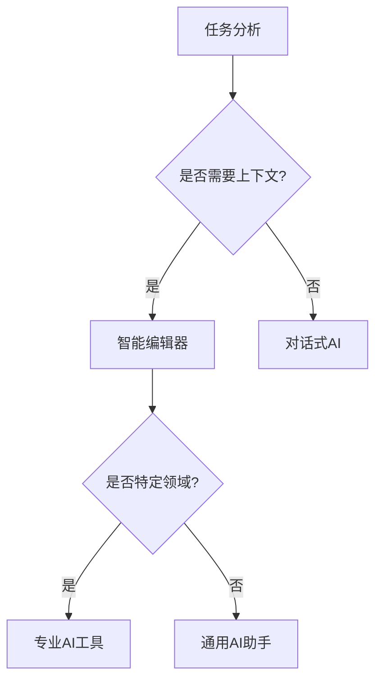
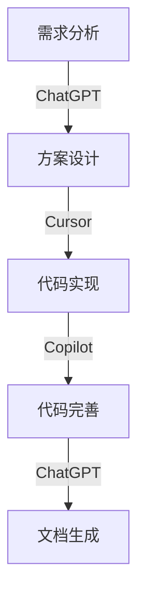

# 第一章：AI 工具基础

> 🎯 "工欲善其事，必先利其器。" 在 AI 时代，掌握正确的工具使用方法，就像为自己配备了一支得力的智能助手团队。

## 引言：AI 工具的变革之力

还记得第一次使用搜索引擎的感觉吗？那种获取信息的便捷让人惊叹。而今天，AI 工具带来的变革比那更加深远。它不仅能搜索，还能理解、创造、优化，就像拥有了一个 24/7 不知疲倦的全能助手。

### 你将获得什么？

- ⚡ 工作效率提升 300%+
- 🎯 更智能的决策支持
- 🚀 创意与执行力的双重提升
- 💡 建立 AI 思维模式

## 1.1 AI 工具生态概览

### 1.1.1 主流 AI 工具分类

想象一下你的工作台：

- **智能编辑器** - 就像一个经验丰富的搭档，实时为你提供建议
  - Cursor
  - VS Code + Copilot
  - JetBrains + AI Assistant

- **对话式 AI** - 如同一位随时待命的顾问
  - ChatGPT
  - Claude
  - Bard

- **专业领域 AI** - 各个领域的专家顾问
  - Midjourney（设计）
  - GitHub Copilot（编程）
  - Jasper（写作）

### 1.1.2 工具选择策略

就像选择厨师刀具一样，不同的任务需要不同的工具：



## 1.2 Cursor：你的智能开发伙伴

### 1.2.1 为什么选择 Cursor？

曾经有个开发者跟我说："用了 Cursor 后，感觉多了一个懂我意图的助手。" 确实，Cursor 不仅仅是编辑器，更是理解你意图的智能伙伴。

#### 核心优势

| 特性 | 描述 | 应用场景 |
|------|------|----------|
| 智能补全 | 实时的代码建议 | 日常编码 |
| 自然语言交互 | 用对话的方式编程 | 复杂需求实现 |
| 代码解释 | 深入浅出的注释生成 | 代码理解与维护 |
| 重构建议 | 智能的代码优化 | 质量改进 |

### 1.2.2 基础功能详解

#### 智能命令面板

```bash
# 快速启动命令面板
Mac: Cmd + Shift + P
Windows: Ctrl + Shift + P

# 常用命令示例
/explain - 解释选中的代码
/edit - 修改选中的代码
/test - 生成测试用例
/doc - 生成文档注释
```

#### 实战案例：需求转代码

假设你收到这样一个需求：
> "需要一个函数，能够解析 Excel 文件中的用户数据，并转换为 JSON 格式"

传统方式：
1. 搜索 Python Excel 处理库
2. 查看文档示例
3. 编写代码
4. 调试修改

使用 Cursor：
```python
# 只需要用自然语言描述需求
"""
创建一个函数，将Excel文件中的用户数据转换为JSON格式
要求：
1. 支持.xlsx格式
2. 第一行为表头
3. 处理异常情况
"""

# Cursor 会生成完整的实现
import pandas as pd
from typing import Dict, List
import json

def excel_to_json(file_path: str) -> List[Dict]:
    """
    将Excel文件转换为JSON格式
    
    Args:
        file_path: Excel文件路径
        
    Returns:
        List[Dict]: 转换后的JSON数据
        
    Raises:
        FileNotFoundError: 文件不存在
        ValueError: 文件格式错误
    """
    try:
        # 读取Excel文件
        df = pd.read_excel(file_path)
        
        # 转换为JSON字符串，然后解析为Python对象
        json_str = df.to_json(orient='records')
        return json.loads(json_str)
        
    except FileNotFoundError:
        raise FileNotFoundError(f"文件不存在: {file_path}")
    except Exception as e:
        raise ValueError(f"处理文件时出错: {str(e)}")
```

## 1.3 ChatGPT：你的智能助手

### 1.3.1 高效使用指南

就像训练一个新助手，使用 ChatGPT 也需要正确的"沟通技巧"：

#### 提示工程基础

```markdown
# 好的提示示例
任务：优化性能
背景：Python Web应用
具体：用户列表页面加载慢
现状：当前使用简单的循环处理
期望：提供优化方案和示例代码

# 不好的提示示例
❌ "代码很慢，帮我优化"
❌ "怎么让Python更快"
```

#### 对话管理技巧

1. **上下文维护**
   ```markdown
   1. 设定角色："你是一个资深Python开发者"
   2. 提供背景："这是一个Flask项目"
   3. 明确目标："需要优化数据库查询"
   ```

2. **迭代优化**
   ```markdown
   第一轮：获取基本方案
   第二轮：提出具体问题
   第三轮：细节完善
   ```

## 1.4 Copilot：协作开发利器

### 1.4.1 Copilot vs Cursor

两者就像两种不同风格的助手：
- Copilot：专注于代码补全，像一个安静的跟随者
- Cursor：提供全方位支持，像一个主动的合作者

### 1.4.2 最佳实践

1. **注释驱动开发**
   ```python
   # 创建一个函数，接收用户ID列表，返回他们的在线状态
   # 要求：使用Redis缓存，设置1分钟过期时间
   def get_users_online_status(user_ids: List[str]) -> Dict[str, bool]:
       # Copilot 会根据注释生成实现
       pass
   ```

2. **测试驱动开发**
   ```python
   def test_user_status():
       # 准备测试数据
       user_ids = ["user1", "user2", "user3"]
       # 调用函数
       result = get_users_online_status(user_ids)
       # 验证结果
       assert isinstance(result, dict)
       assert all(isinstance(v, bool) for v in result.values())
   ```

## 1.5 工具协同：打造完整工作流

### 1.5.1 场景化工具选择



### 1.5.2 效率提升实践

1. **项目启动阶段**
   - 用 ChatGPT 分析需求
   - 用 Cursor 生成项目骨架
   - 用 Copilot 补充细节实现

2. **开发迭代阶段**
   - Cursor 处理复杂逻辑
   - Copilot 辅助日常编码
   - ChatGPT 解决技术难题

3. **维护优化阶段**
   - AI 工具分析性能瓶颈
   - 自动生成优化建议
   - 智能重构代码

## 课后练习

1. **工具熟悉**
   - 使用 Cursor 完成一个简单的 CRUD 应用
   - 用 ChatGPT 优化现有代码
   - 体验 Copilot 的代码补全

2. **流程优化**
   - 设计个人的 AI 工具使用流程
   - 记录效率提升数据
   - 总结最佳实践

3. **实战项目**
   - 选择一个实际项目
   - 应用所学的工具和方法
   - 对比提升效果

## 参考资源

- [Cursor 官方文档](https://cursor.sh/docs)
- [ChatGPT 最佳实践](https://platform.openai.com/docs/guides/gpt-best-practices)
- [GitHub Copilot 文档](https://docs.github.com/en/copilot)
- [AI 工具效率研究](https://example.com/ai-tools-study)

## 小贴士

> 💡 记住，AI 工具是助手而非替代品。培养与 AI 工具协同工作的能力，才是提升效率的关键。

> 🎯 持续学习和实践是掌握 AI 工具的不二法门。每天抽出一点时间来尝试新的用法，你会发现效率提升是逐步累积的过程。 