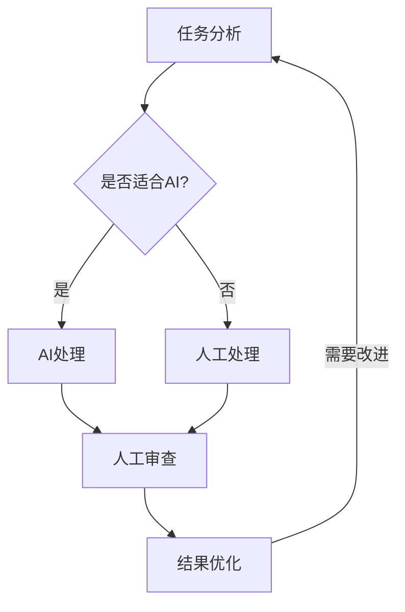
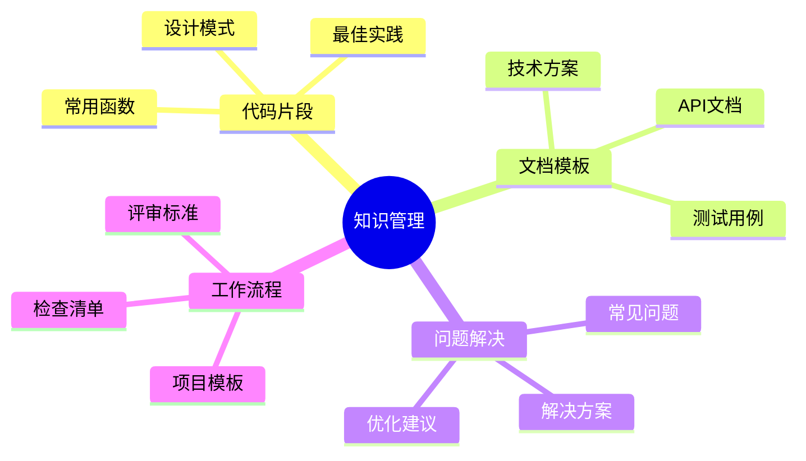
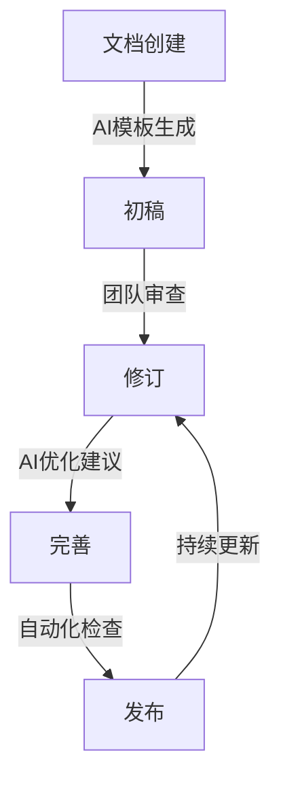

# 第三章：效率提升方法论

> 🚀 "磨刀不误砍柴工。" 在 AI 时代，建立正确的工作方法论，就像为自己装备了一台效率倍增器。

## 引言：重新定义工作方式

还记得从手工计算切换到计算器的那一刻吗？效率的提升不仅仅来自工具本身，更来自于使用工具的方法。在 AI 时代，掌握正确的方法论，就像获得了一个"效率倍增器"。

### 本章收获

- 🎯 建立 AI 驱动的工作流程
- 🚀 提升工作效率 300%+
- 💡 掌握知识管理方法
- ⚡ 打造个人效能体系

## 3.1 AI 工作流程设计

### 3.1.1 工作流程再造

想象你是一位指挥家，需要指挥一支由人类和 AI 组成的交响乐团：



### 3.1.2 任务分类与分配

| 任务类型 | 适合度 | 处理方式 | 示例 |
|---------|--------|----------|------|
| 创意发想 | 🌟🌟🌟 | AI + 人工 | 头脑风暴、方案设计 |
| 数据处理 | 🌟🌟🌟🌟🌟 | AI 主导 | 数据分析、报表生成 |
| 内容创作 | 🌟🌟🌟🌟 | AI + 人工 | 文档编写、代码生成 |
| 决策制定 | 🌟🌟 | 人工为主 | 战略规划、风险评估 |

## 3.2 智能化任务管理

### 3.2.1 任务分解模型

```python
class Task:
    def __init__(self, name: str, complexity: int, ai_suitability: float):
        self.name = name
        self.complexity = complexity  # 1-5
        self.ai_suitability = ai_suitability  # 0-1

    def get_processing_strategy(self) -> str:
        if self.complexity <= 2 and self.ai_suitability >= 0.8:
            return "AI自动处理"
        elif self.complexity <= 4 and self.ai_suitability >= 0.6:
            return "AI辅助人工"
        else:
            return "人工为主"

# 使用示例
tasks = [
    Task("代码生成", 3, 0.9),
    Task("架构设计", 5, 0.4),
    Task("Bug修复", 2, 0.7),
    Task("性能优化", 4, 0.6)
]

for task in tasks:
    print(f"{task.name}: {task.get_processing_strategy()}")
```

### 3.2.2 任务执行模板

```yaml
# task_template.yaml
task:
  name: "性能优化任务"
  steps:
    1. 问题分析:
      - 使用 AI 分析性能日志
      - 生成性能瓶颈报告
      - 人工确认关键问题
    
    2. 方案设计:
      - AI 生成优化建议
      - 人工评估可行性
      - 确定优化方案
    
    3. 实施优化:
      - AI 辅助代码重构
      - 人工代码审查
      - 执行优化方案
    
    4. 效果验证:
      - 自动化性能测试
      - AI 分析优化效果
      - 生成优化报告
```

## 3.3 知识管理与复用

### 3.3.1 知识库构建



### 3.3.2 智能检索系统

```python
from typing import List, Dict
import numpy as np

class KnowledgeBase:
    def __init__(self):
        self.documents: List[Dict] = []
        self.embeddings = []
    
    def add_document(self, content: str, tags: List[str], category: str):
        """添加文档到知识库"""
        doc = {
            'content': content,
            'tags': tags,
            'category': category,
            'embedding': self.get_embedding(content)
        }
        self.documents.append(doc)
        self.embeddings.append(doc['embedding'])
    
    def search(self, query: str, top_k: int = 5) -> List[Dict]:
        """智能搜索相关文档"""
        query_embedding = self.get_embedding(query)
        scores = [self.cosine_similarity(query_embedding, doc['embedding']) 
                 for doc in self.documents]
        
        top_indices = np.argsort(scores)[-top_k:]
        return [self.documents[i] for i in top_indices]
    
    @staticmethod
    def get_embedding(text: str) -> List[float]:
        """使用AI模型获取文本的向量表示"""
        # 实际实现需要调用AI模型
        pass
    
    @staticmethod
    def cosine_similarity(v1: List[float], v2: List[float]) -> float:
        """计算余弦相似度"""
        return np.dot(v1, v2) / (np.linalg.norm(v1) * np.linalg.norm(v2))
```

## 3.4 团队协作实践

### 3.4.1 AI 辅助代码审查

```python
# 代码审查自动化流程
class CodeReview:
    def __init__(self, repo_url: str):
        self.repo_url = repo_url
        self.ai_assistant = AICodeReviewer()
    
    def review_pull_request(self, pr_id: str):
        """自动化代码审查流程"""
        # 1. 获取变更代码
        changes = self.get_changes(pr_id)
        
        # 2. AI 分析
        for file in changes:
            issues = self.ai_assistant.analyze(file)
            suggestions = self.ai_assistant.suggest_improvements(file)
            
            # 3. 生成审查评论
            self.create_review_comments(pr_id, file, issues, suggestions)
        
        # 4. 生成总结报告
        summary = self.generate_review_summary(pr_id)
        self.submit_review(pr_id, summary)
```

### 3.4.2 智能化文档协作



## 3.5 效率度量与优化

### 3.5.1 效率指标体系

```yaml
# efficiency_metrics.yaml
metrics:
  time_saving:
    - 任务完成时间
    - AI辅助时间占比
    - 返工率
  
  quality_metrics:
    - 代码质量分
    - 文档完整度
    - 测试覆盖率
  
  collaboration_metrics:
    - 沟通效率
    - 知识共享度
    - 团队协作度
```

### 3.5.2 持续优化流程

```python
class EfficiencyOptimizer:
    def __init__(self):
        self.metrics = MetricsCollector()
        self.baseline = self.get_baseline_metrics()
    
    def optimize_workflow(self, workflow_id: str):
        """工作流程优化"""
        # 1. 收集当前指标
        current_metrics = self.metrics.collect(workflow_id)
        
        # 2. 对比基准线
        gaps = self.analyze_gaps(current_metrics, self.baseline)
        
        # 3. AI生成优化建议
        suggestions = self.generate_suggestions(gaps)
        
        # 4. 实施优化
        self.apply_optimizations(workflow_id, suggestions)
        
        # 5. 跟踪效果
        self.track_improvements(workflow_id)
```

## 课后练习

1. **工作流程优化**
   - 分析当前工作流程
   - 识别 AI 切入点
   - 设计新的工作流程
   - 进行对比测试

2. **知识库建设**
   - 整理个人知识库
   - 建立智能检索系统
   - 实践知识复用
   - 优化管理流程

3. **效率度量**
   - 建立效率指标
   - 收集基础数据
   - 进行效率分析
   - 制定优化计划

## 实战项目

### 项目一：工作流程自动化

目标：将日常重复工作自动化
步骤：
1. 识别重复任务
2. 设计自动化流程
3. 实现自动化脚本
4. 测试和优化

### 项目二：智能知识库

目标：建立团队智能知识库
步骤：
1. 收集知识资源
2. 设计知识结构
3. 实现智能检索
4. 持续维护更新

## 参考资源

- [效率工程](https://efficiency.guide)
- [知识管理最佳实践](https://km-best-practices.com)
- [团队协作指南](https://collaboration-guide.dev)
- [AI效能提升实践](https://ai-efficiency.com)

## 小贴士

> 💡 效率提升是一个持续的过程，关键是建立可持续的工作方法。

> 🎯 不要追求完美，而是追求持续改进。每天进步1%，一年后就是37倍的提升。 