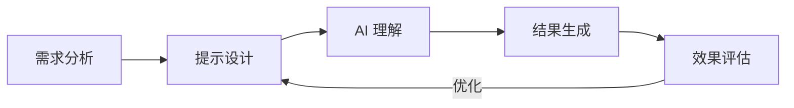
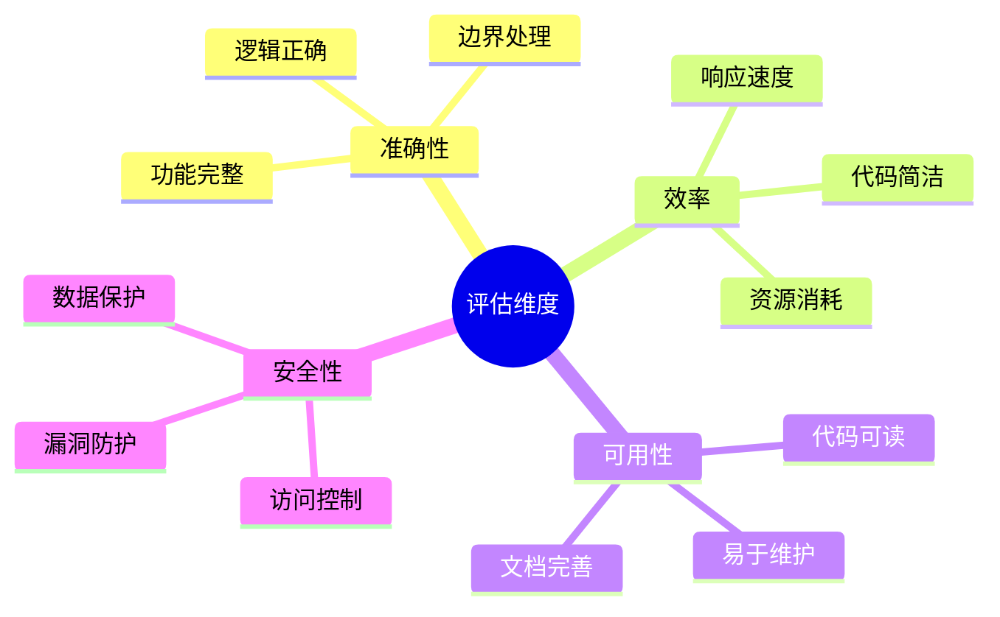

# 第二章：提示工程技巧

> 🎯 "知己知彼，百战不殆。" 掌握提示工程，就像学会了与 AI 的"心灵沟通"。

## 引言：提示工程的艺术

还记得第一次和外国友人交流时的窘境吗？即使懂得基本语法，但要表达准确的意思仍然很困难。与 AI 交流也是如此，掌握提示工程，就像掌握了一门新的沟通艺术。

### 本章收获

- 🎯 掌握提示工程的核心原则
- 🚀 提高 AI 输出质量 80%
- 💡 建立个人提示词库
- ⚡ 提升沟通效率 200%

## 2.1 提示工程基础理论

### 2.1.1 什么是提示工程？

想象你在指导一个聪明但经验不足的新人，提示工程就是：
- 清晰地表达需求
- 提供必要的上下文
- 设定合适的约束
- 引导输出方向



### 2.1.2 核心原则

| 原则 | 说明 | 示例 |
|------|------|------|
| 明确性 | 清晰表达意图 | "生成一个 REST API 文档" |
| 完整性 | 提供充分上下文 | "这是一个用户管理系统的 API" |
| 结构化 | 组织良好的信息 | "使用 OpenAPI 3.0 格式" |
| 迭代性 | 渐进式优化 | "基于反馈调整输出" |

## 2.2 场景化提示模板

### 2.2.1 角色设定模板

```markdown
你是一位[角色]，具有[特点]的专业背景。
我需要你帮我[任务]，要求[具体要求]。
输出格式：[格式说明]

示例：
你是一位资深前端工程师，具有 5 年以上 React 开发经验。
我需要你帮我优化一个购物车组件的性能，要求兼顾用户体验和加载速度。
输出格式：
1. 问题分析
2. 优化方案
3. 代码示例
4. 性能对比
```

### 2.2.2 任务类型模板

#### 1. 代码生成

```markdown
任务类型：代码生成
语言/框架：[指定技术栈]
功能描述：[详细说明]
特殊要求：
- 性能要求
- 兼容性要求
- 代码规范
输出格式：
- 完整代码
- 注释说明
- 使用示例

示例：
任务类型：代码生成
语言/框架：Python/FastAPI
功能描述：实现用户注册 API
特殊要求：
- 响应时间 < 100ms
- 支持数据验证
- 遵循 PEP8 规范
输出格式：
- API 实现代码
- Swagger 文档
- 单元测试
```

#### 2. 文档生成

```markdown
文档类型：[技术文档/API文档/使用手册]
目标读者：[开发者/用户/管理员]
文档结构：
1. [章节1]
2. [章节2]
3. [章节3]
包含要素：
- 概述
- 示例
- 注意事项
```

### 2.2.3 提示优化技巧

1. **添加约束条件**
```markdown
❌ "生成一个登录页面"
✅ "生成一个登录页面，要求：
   - 使用 React + TypeScript
   - 支持表单验证
   - 包含记住密码功能
   - 响应式设计
   - 遵循 Material Design"
```

2. **使用引导性问题**
```markdown
设计数据库架构时：
1. 需要考虑哪些性能因素？
2. 如何处理高并发访问？
3. 数据备份策略是什么？
4. 如何确保数据安全？
```

## 2.3 提示管理与复用

### 2.3.1 建立提示词库

```yaml
# prompts.yaml
code_review:
  template: |
    请以资深开发者的角度审查以下代码：
    ```${language}
    ${code}
    ```
    关注点：
    1. 代码质量
    2. 性能优化
    3. 安全隐患
    4. 最佳实践

api_doc:
  template: |
    为以下 API 生成文档：
    Endpoint: ${endpoint}
    Method: ${method}
    请包含：
    - 接口描述
    - 请求参数
    - 响应格式
    - 示例调用
```

### 2.3.2 提示词版本控制

```markdown
# v1.0 基础版本
生成用户注册 API

# v1.1 添加参数验证
生成用户注册 API，包含邮箱和密码强度验证

# v1.2 添加安全特性
生成用户注册 API，包含：
- 邮箱和密码强度验证
- CSRF 防护
- 速率限制
- 日志记录
```

## 2.4 效果评估与优化

### 2.4.1 评估维度



### 2.4.2 优化策略

1. **迭代优化流程**
```python
def optimize_prompt(initial_prompt: str) -> str:
    """
    提示词优化流程
    """
    current_prompt = initial_prompt
    while True:
        # 1. 测试当前提示词
        result = test_prompt(current_prompt)
        
        # 2. 评估结果
        score = evaluate_result(result)
        
        # 3. 达到目标则返回
        if score >= TARGET_SCORE:
            return current_prompt
            
        # 4. 否则优化提示词
        current_prompt = improve_prompt(current_prompt, score)
```

2. **常见优化模式**

```markdown
# 原始提示词
创建用户注册功能

# 优化方向 1：添加具体要求
创建用户注册功能，包含：
- 字段：用户名、邮箱、密码
- 验证：字段格式、唯一性
- 响应：成功/失败消息

# 优化方向 2：添加技术约束
使用 TypeScript + Express 创建用户注册功能，包含：
- 类型定义
- 中间件
- 错误处理
- 单元测试

# 优化方向 3：添加场景约束
创建适用于电商平台的用户注册功能，考虑：
- 用户角色
- 注册流程
- 安全措施
- 性能优化
```

## 课后练习

1. **基础练习**
   - 为不同场景创建提示词模板
   - 优化现有提示词
   - 建立个人提示词库

2. **进阶任务**
   - 设计提示词评估体系
   - 进行 A/B 测试
   - 总结优化经验

3. **实战项目**
   - 选择一个实际项目
   - 应用提示工程原则
   - 记录效果提升

## 参考资源

- [OpenAI GPT 最佳实践](https://platform.openai.com/docs/guides/gpt-best-practices)
- [提示工程指南](https://www.promptingguide.ai/)
- [Anthropic Claude 文档](https://www.anthropic.com/index/claude-tips-prompting)
- [提示工程模式](https://arxiv.org/abs/2102.09690)

## 小贴士

> 💡 提示工程是一门实践的艺术。多尝试、多总结，你会发现每个场景都有其最佳实践。

> 🎯 建立自己的提示词库，就像打造个人的工具箱，让工作事半功倍。 