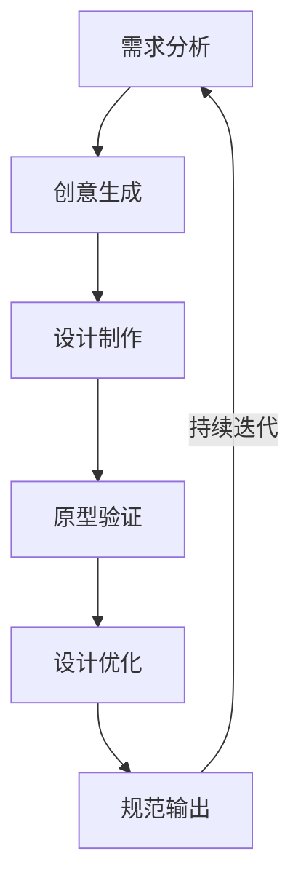
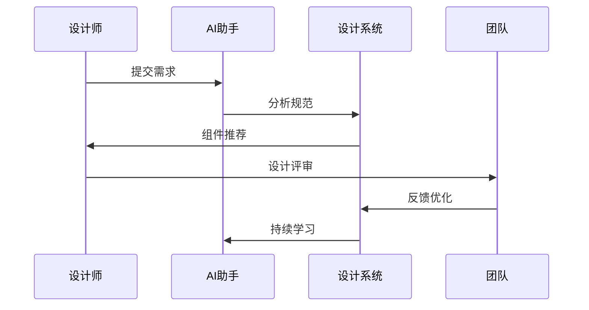
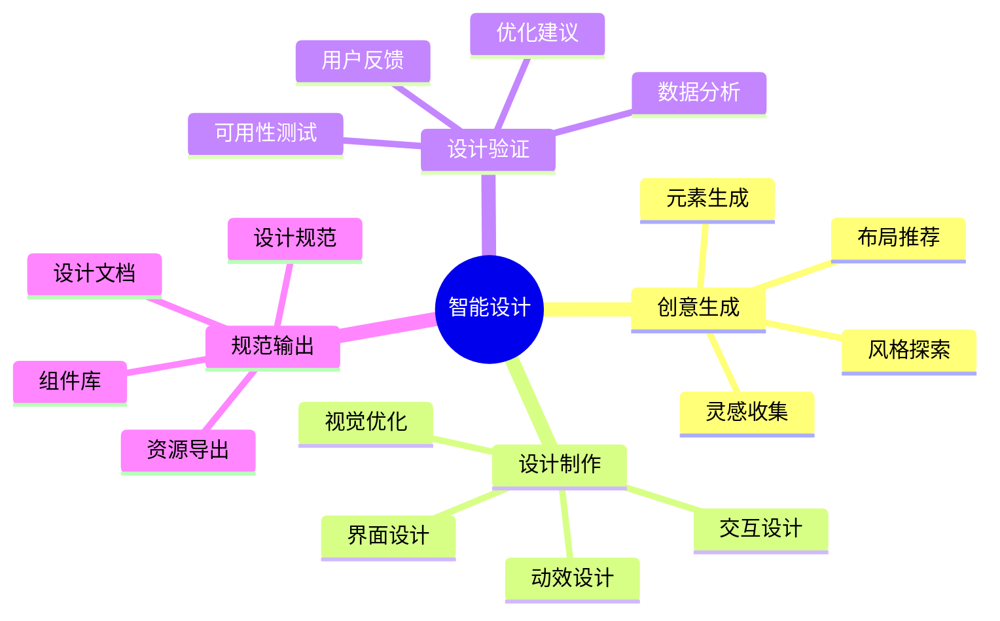
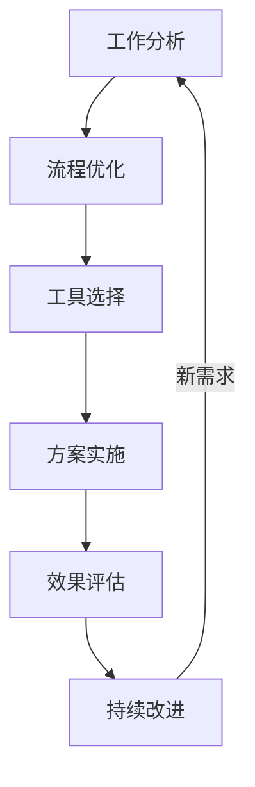

# 第一章：AI辅助设计基础

> 🎨 "设计不只是看起来漂亮，更要解决问题。" 在设计中，AI 就像一位经验丰富的设计助手，帮助你更快地实现创意。

## 引言：设计的智能时代

还记得反复修改设计稿的烦恼吗？现在，借助 AI 工具，我们可以更智能地进行设计，让创意快速落地。

### 本章收获

- 🎯 掌握 AI 辅助设计方法
- 🚀 提升设计效率 300%
- 💡 建立智能化设计流程
- ⚡ 实现创意突破

## 1.1 设计工具链

### 1.1.1 工具流程

### 1.1.2 智能工具应用

工具特点分析：

1. 设计工具
   - Figma：协同设计
   - Sketch：界面设计
   - Adobe XD：交互设计
   - Photoshop：图像处理

2. AI辅助工具
   - Midjourney：图像生成
   - DALL-E：创意设计
   - Stable Diffusion：风格迁移
   - Runway：视觉创意

3. 协作工具
   - Cursor：代码生成
   - ChatGPT：创意激发
   - Copilot：设计辅助
   - Notion：知识管理

## 1.2 设计系统

### 1.2.1 系统架构

### 1.2.2 系统工具

工具清单：

1. 设计系统工具
   - Storybook：组件开发
   - Zeroheight：文档管理
   - Abstract：版本控制
   - InVision DSM：设计系统

2. AI辅助工具
   - 组件生成
   - 样式推荐
   - 规范检查
   - 一致性验证

## 1.3 智能设计

### 1.3.1 设计流程

### 1.3.2 设计工具

1. 智能设计工具
   - Uizard：AI设计
   - Galileo AI：界面生成
   - Visily：布局优化
   - Remove.bg：背景处理

2. 辅助工具
   - 色彩推荐
   - 字体匹配
   - 布局优化
   - 组件生成

## 1.4 效率提升

### 1.4.1 效率流程

### 1.4.2 效率工具

推荐工具：
1. 效率工具
   - Automate：自动化
   - Shortcuts：快捷操作
   - Actions：工作流
   - Plugins：插件扩展

2. AI效率工具
   - 批量处理
   - 智能切图
   - 代码生成
   - 资源管理

## 课后练习

1. **工具链练习**
   - 工具选择
   - 流程搭建
   - 效率测试
   - 优化改进

2. **设计系统练习**
   - 系统规划
   - 组件开发
   - 规范制定
   - 团队协作

3. **效率提升练习**
   - 流程分析
   - 工具应用
   - 效果评估
   - 持续优化

## 实战项目

### 项目一：智能设计系统

目标：构建AI驱动的设计系统

步骤：
1. 需求分析
2. 系统设计
3. 组件开发
4. 规范制定

### 项目二：效率工具集

目标：开发设计效率工具集

步骤：
1. 需求收集
2. 工具开发
3. 流程优化
4. 效果验证

## 参考资源

- [AI设计工具](https://ai-design-tools.dev)
- [设计系统指南](https://design-system-guide.dev)
- [效率提升方法](https://efficiency-improvement.dev)
- [智能设计实践](https://intelligent-design-practice.dev)

## 小贴士

> 💡 AI 能够提升设计效率，但创意思维和设计素养仍然是核心。

> 🎯 在设计实践中，保持对设计本质的关注，让 AI 工具帮助你更好地实现创意。 