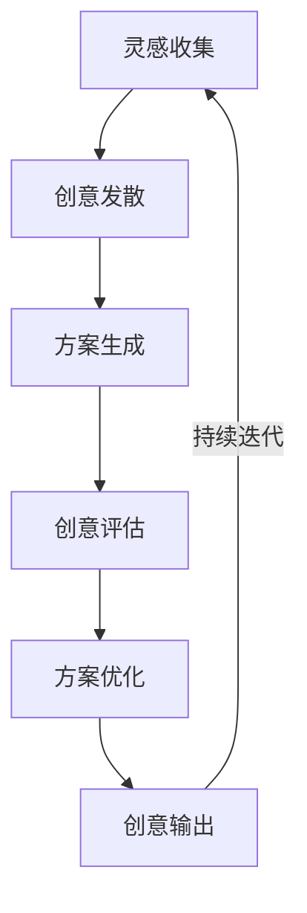
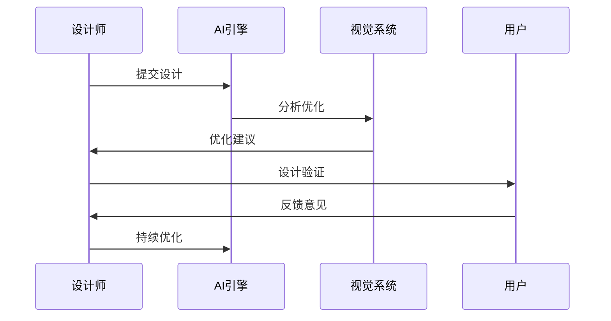
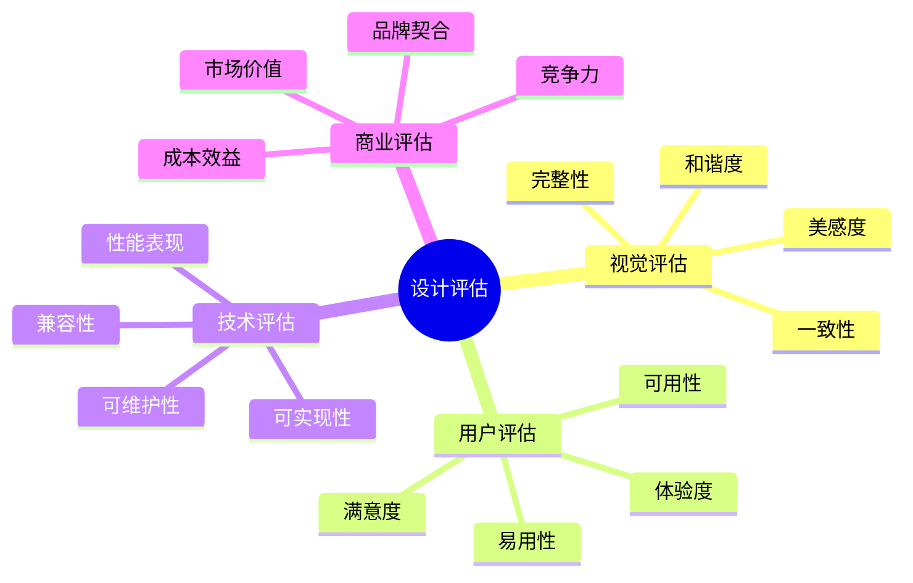
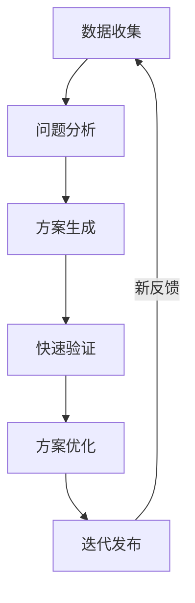

# 第三章：创意与表现

> 💡 "创意是设计的灵魂，表现是设计的形式。" 在创意设计中，AI 就像一位经验丰富的创意导师，帮助你突破创意瓶颈。

## 引言：创意设计的智能时代

还记得绞尽脑汁寻找灵感的困扰吗？现在，借助 AI 工具，我们可以更智能地进行创意设计，让灵感源源不断。

### 本章收获

- 🎯 掌握 AI 辅助创意方法
- 🚀 提升创意效率 400%
- 💡 建立创意设计体系
- ⚡ 实现表现突破

## 3.1 创意生成

### 3.1.1 创意流程

### 3.1.2 智能工具应用

工具特点分析：

1. 创意工具
   - Midjourney：图像生成
   - DALL-E：创意设计
   - Stable Diffusion：风格迁移
   - Runway：视觉创意

2. AI辅助工具
   - Leonardo.ai：艺术创作
   - Firefly：创意生成
   - Canva：设计创作
   - Photoshop AI：智能编辑

3. 灵感工具
   - Pinterest：灵感收集
   - Behance：创意展示
   - Dribbble：设计灵感
   - ArtStation：艺术作品

## 3.2 视觉优化

### 3.2.1 优化模型

### 3.2.2 优化工具

工具清单：

1. 视觉优化工具
   - Adobe Sensei：智能优化
   - Remove.bg：背景处理
   - Upscale：图像增强
   - TinyPNG：图像压缩

2. AI辅助工具
   - 色彩优化
   - 构图调整
   - 风格迁移
   - 细节增强

## 3.3 设计评估

### 3.3.1 评估体系

### 3.3.2 评估工具

1. 评估工具
   - Maze：用户测试
   - Hotjar：行为分析
   - UserTesting：用户研究
   - Optimal Workshop：可用性测试

2. 分析工具
   - 数据分析
   - 行为跟踪
   - 热力图
   - A/B测试

## 3.4 设计迭代

### 3.4.1 迭代流程

### 3.4.2 迭代工具

推荐工具：
1. 迭代管理
   - Abstract：版本控制
   - Zeplin：设计交付
   - Plant：设计同步
   - Avocode：设计协作

2. AI迭代工具
   - 版本管理
   - 变更跟踪
   - 自动同步
   - 协作优化

## 课后练习

1. **创意练习**
   - 灵感收集
   - 创意发散
   - 方案生成
   - 创意优化

2. **视觉练习**
   - 视觉优化
   - 风格设计
   - 细节处理
   - 效果提升

3. **迭代练习**
   - 问题分析
   - 方案优化
   - 快速验证
   - 持续改进

## 实战项目

### 项目一：创意设计系统

目标：构建AI驱动的创意设计系统

步骤：
1. 需求分析
2. 系统设计
3. 创意开发
4. 效果验证

### 项目二：视觉优化平台

目标：开发智能视觉优化平台

步骤：
1. 平台规划
2. 功能开发
3. 算法优化
4. 效果测试

## 参考资源

- [创意设计指南](https://creative-design-guide.dev)
- [视觉优化实践](https://visual-optimization-practice.dev)
- [设计评估工具](https://design-evaluation-tools.dev)
- [迭代优化方法](https://iteration-optimization-methods.dev)

## 小贴士

> 💡 AI 能够激发创意灵感，但独特的创意视角和审美能力仍然是核心。

> 🎯 在创意设计中，保持对创新的追求，让 AI 工具帮助你更好地实现创意表现。 