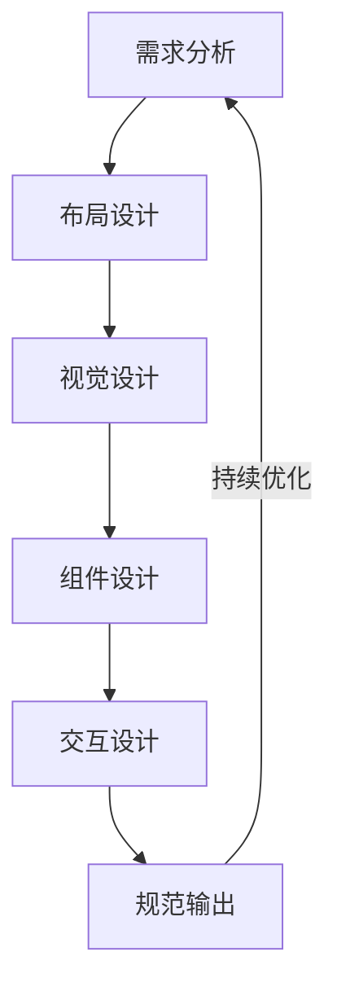
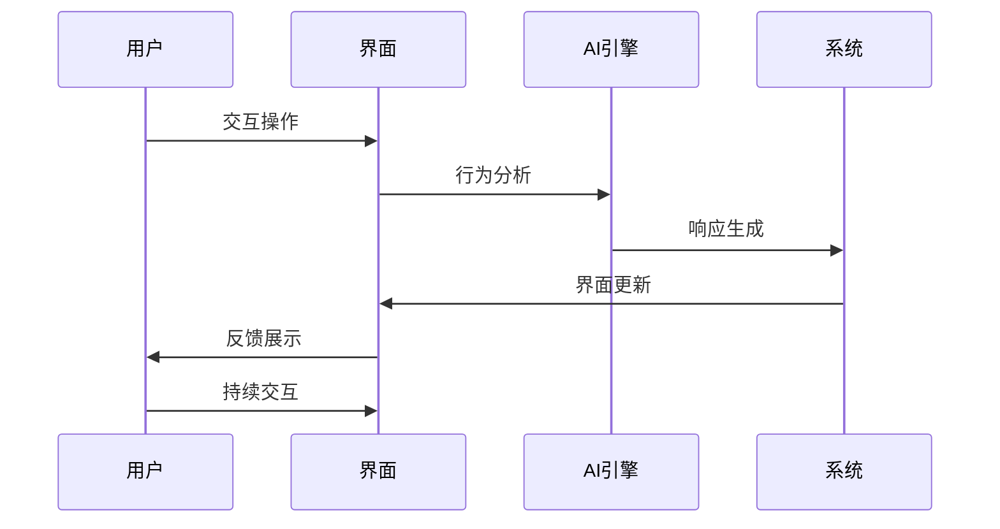
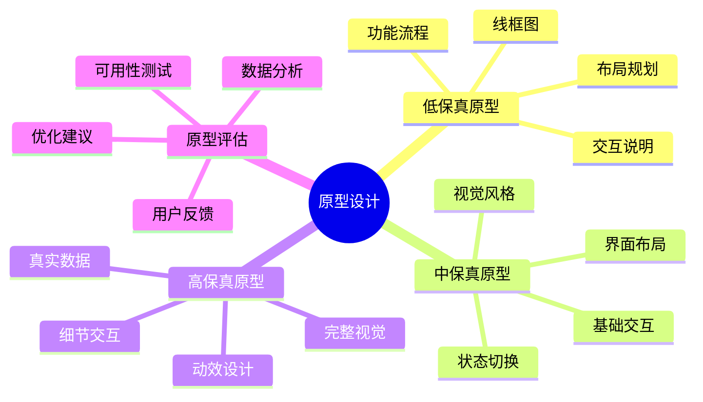
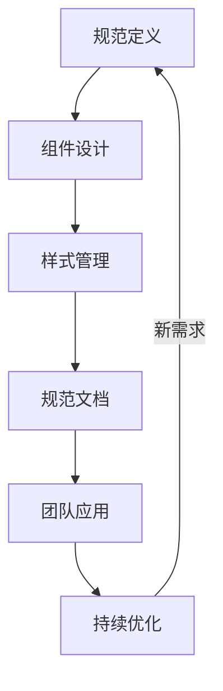

# 第二章：智能化UI设计

> 🎨 "优秀的设计是用户体验的基石。" 在UI设计中，AI 就像一位经验丰富的设计顾问，帮助你更快地创造优秀的用户界面。

## 引言：UI设计的智能时代

还记得反复调整界面细节的烦恼吗？现在，借助 AI 工具，我们可以更智能地进行UI设计，让界面设计更加高效精准。

### 本章收获

- 🎯 掌握 AI 辅助UI设计方法
- 🚀 提升设计效率 350%
- 💡 建立智能化设计流程
- ⚡ 实现设计突破

## 2.1 界面设计

### 2.1.1 设计流程

### 2.1.2 智能工具应用

工具特点分析：

1. UI设计工具
   - Figma：协同设计
   - Sketch：界面设计
   - Adobe XD：交互设计
   - Penpot：开源设计

2. AI辅助工具
   - V.One：界面生成
   - Galileo AI：布局优化
   - Visily：组件设计
   - Uizard：原型生成

3. 设计资源
   - UI8：设计资源
   - Dribbble：设计灵感
   - Behance：创意展示
   - Material Design：设计系统

## 2.2 交互设计

### 2.2.1 交互模型

### 2.2.2 交互工具

工具清单：

1. 交互设计工具
   - Principle：动效设计
   - Framer：交互原型
   - ProtoPie：高保真原型
   - Flinto：手势交互

2. AI辅助工具
   - 动效生成
   - 手势识别
   - 交互推荐
   - 用户行为分析

## 2.3 原型设计

### 2.3.1 原型体系

### 2.3.2 原型工具

1. 原型设计工具
   - Axure：专业原型
   - Figma：协同原型
   - Marvel：快速原型
   - InVision：团队协作

2. 辅助工具
   - 流程图生成
   - 组件推荐
   - 交互模板
   - 评估分析

## 2.4 设计规范

### 2.4.1 规范流程

### 2.4.2 规范工具

推荐工具：
1. 规范管理
   - Zeroheight：规范文档
   - Storybook：组件展示
   - Abstract：版本控制
   - Lingo：资源管理

2. AI辅助工具
   - 规范检查
   - 组件生成
   - 文档生成
   - 一致性验证

## 课后练习

1. **界面设计练习**
   - 布局设计
   - 视觉优化
   - 组件开发
   - 规范应用

2. **交互设计练习**
   - 流程设计
   - 动效制作
   - 原型开发
   - 用户测试

3. **规范制定练习**
   - 规范定义
   - 组件设计
   - 文档编写
   - 团队推广

## 实战项目

### 项目一：智能UI系统

目标：构建AI驱动的UI设计系统

步骤：
1. 需求分析
2. 系统设计
3. 组件开发
4. 规范制定

### 项目二：交互原型库

目标：开发智能交互原型库

步骤：
1. 原型设计
2. 交互开发
3. 组件封装
4. 文档完善

## 参考资源

- [UI设计指南](https://ui-design-guide.dev)
- [交互设计实践](https://interaction-design-practice.dev)
- [原型设计工具](https://prototype-design-tools.dev)
- [设计规范系统](https://design-specification-system.dev)

## 小贴士

> 💡 AI 能够提升UI设计效率，但用户体验和设计思维仍然是核心。

> 🎯 在UI设计中，保持对用户需求的关注，让 AI 工具帮助你更好地实现设计目标。 