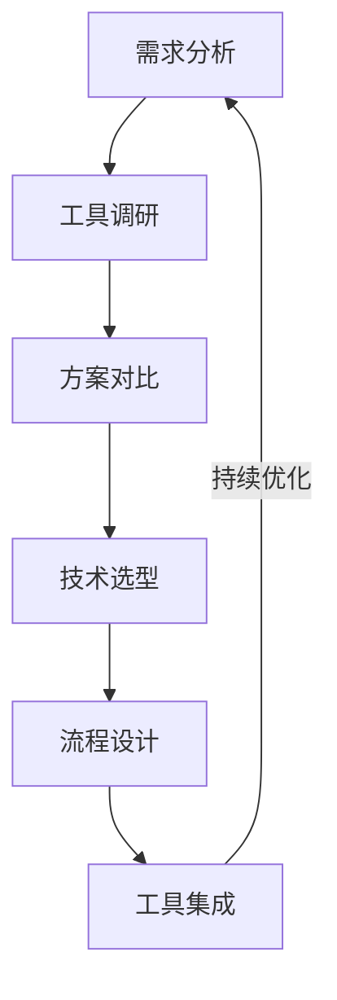
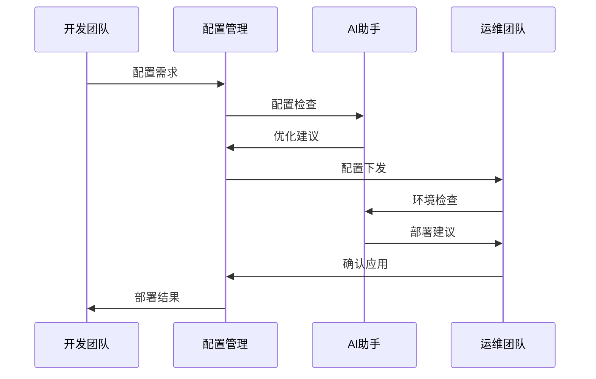
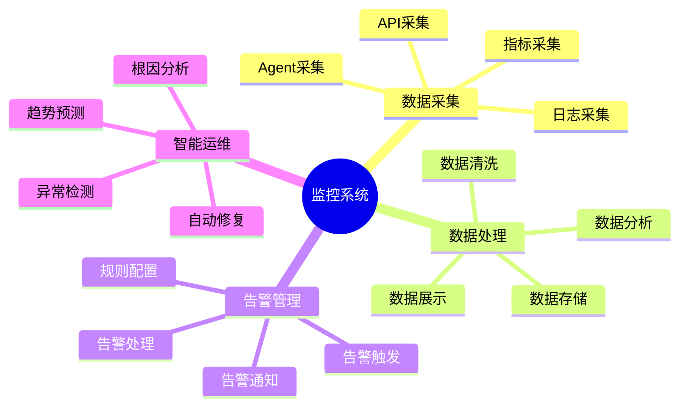
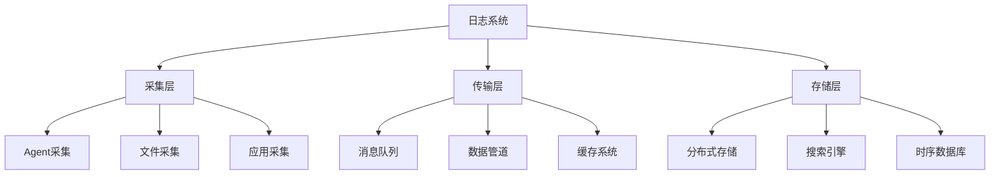

# 第一章：自动化运维基础

> 🔄 "工欲善其事，必先利其器。" 在自动化运维中，AI 就像一位经验丰富的运维专家，帮助你更高效地实现自动化管理。

## 引言：自动化运维的智能时代

还记得手动配置服务器和管理系统的繁琐吗？就像要不断重复相同的操作步骤。现在，借助 AI 工具，我们可以更智能地进行自动化运维，实现真正的智能化管理。

### 本章收获

- 🎯 掌握 AI 辅助自动化运维方法
- 🚀 提升运维效率 400%
- 💡 建立自动化工具链
- ⚡ 实现智能化监控管理

## 1.1 自动化工具链

### 1.1.1 工具选型流程

### 1.1.2 主流工具对比

工具特点分析：

1. 配置管理工具
   - Ansible：自动化配置
   - Puppet：配置管理
   - Chef：基础设施
   - SaltStack：远程执行

2. 基础设施工具
   - Terraform：基础设施即代码
   - CloudFormation：AWS基础设施
   - Pulumi：现代基础设施
   - Vagrant：开发环境

3. 自动化工具
   - Jenkins：自动化构建
   - GitLab CI：集成部署
   - GitHub Actions：工作流
   - ArgoCD：GitOps工具

推荐工具：
- Cursor：智能运维
- ChatGPT：问题诊断
- Ansible：自动化配置
- Terraform：基础设施即代码

## 1.2 配置管理

### 1.2.1 配置管理流程

### 1.2.2 配置管理工具

工具清单：

1. 版本控制
   - Git：代码版本控制
   - SVN：集中式版本控制
   - Mercurial：分布式版本控制
   - Perforce：企业版本控制

2. 配置中心
   - Consul
   - etcd
   - ZooKeeper
   - Apollo

## 1.3 监控告警

### 1.3.1 监控体系

### 1.3.2 监控工具链

1. 监控平台
   - Prometheus
   - Zabbix
   - Nagios
   - Grafana

2. 日志分析
   - ELK Stack
   - Loki
   - Splunk
   - Graylog

## 1.4 日志管理

### 1.4.1 日志架构

### 1.4.2 日志工具

推荐工具：
1. 日志采集
   - Filebeat
   - Fluentd
   - Logstash
   - Vector

2. 日志分析
   - Elasticsearch
   - Kibana
   - Grafana Loki
   - OpenSearch

## 课后练习

1. **工具链搭建练习**
   - 选择工具集
   - 环境搭建
   - 工具集成
   - 流程测试

2. **配置管理练习**
   - 编写配置脚本
   - 实现自动化配置
   - 版本控制管理
   - 配置回滚测试

3. **监控系统练习**
   - 搭建监控平台
   - 配置告警规则
   - 实现日志采集
   - 优化告警策略

## 实战项目

### 项目一：自动化配置平台

目标：实现服务器配置的自动化管理

步骤：
1. 环境准备
2. 工具配置
3. 流程实现
4. 测试验证

### 项目二：智能监控系统

目标：构建智能化监控告警平台

步骤：
1. 需求分析
2. 架构设计
3. 功能开发
4. 系统集成

## 参考资源

- [自动化运维指南](https://automation-ops-guide.dev)
- [配置管理最佳实践](https://config-management-best-practices.dev)
- [监控系统搭建](https://monitoring-system-setup.dev)
- [日志管理教程](https://log-management-tutorial.dev)

## 小贴士

> 💡 AI 能够加速自动化流程，但对系统架构和运维原理的理解仍然至关重要。

> 🎯 在自动化运维实践中，保持对效率和可靠性的追求，让 AI 工具帮助你更好地实现管理目标。 