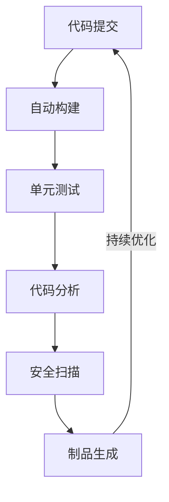
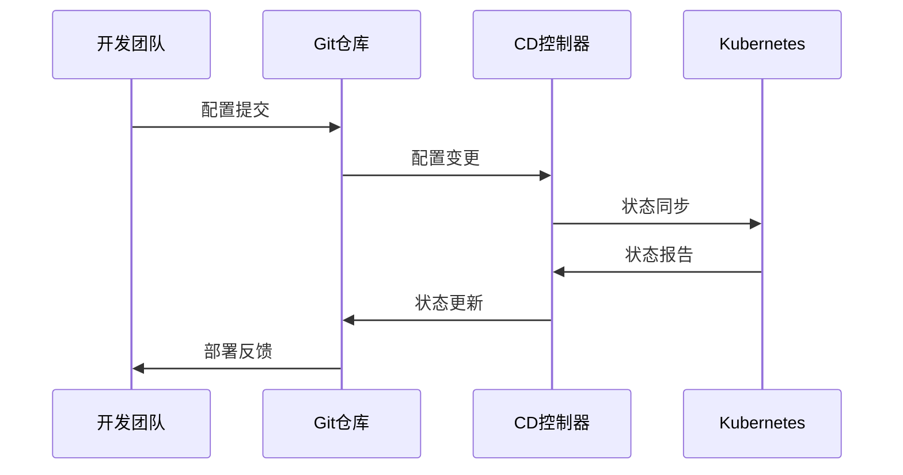
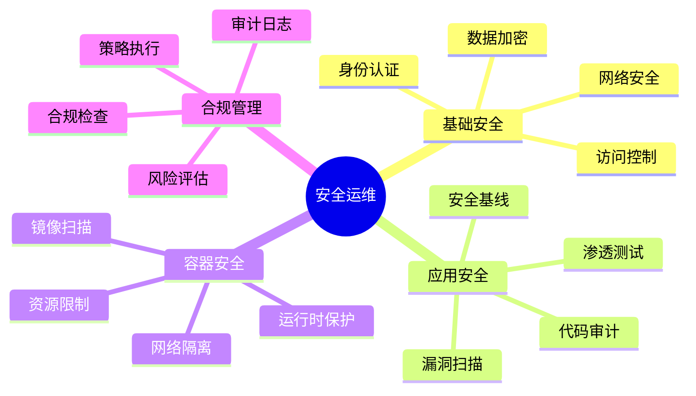
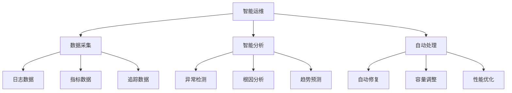

# 第三章：DevOps实践

> 🔄 "持续改进，快速交付。" 在 DevOps 实践中，AI 就像一位经验丰富的流程专家，帮助你更高效地实现持续交付。

## 引言：DevOps的智能时代

还记得开发和运维之间的沟通障碍吗？就像两个团队说着不同的语言。现在，借助 AI 工具和 DevOps 实践，我们可以更智能地打破壁垒，实现真正的协作开发。

### 本章收获

- 🎯 掌握 AI 辅助 DevOps 方法
- 🚀 提升交付效率 350%
- 💡 建立持续交付体系
- ⚡ 实现智能化运维管理

## 3.1 CI/CD流程

### 3.1.1 持续集成流程

### 3.1.2 主流工具对比

工具特点分析：

1. CI工具
   - Jenkins：功能完整
   - GitLab CI：源码集成
   - GitHub Actions：云端CI
   - CircleCI：云服务

2. CD工具
   - ArgoCD：GitOps工具
   - Spinnaker：云原生部署
   - Flux：自动化部署
   - Tekton：云原生流水线

3. 质量工具
   - SonarQube：代码质量
   - JUnit：单元测试
   - Selenium：UI测试
   - Gatling：性能测试

推荐工具：
- Cursor：智能CI/CD
- ChatGPT：流程优化
- Jenkins X：云原生CI/CD
- Harness：智能部署

## 3.2 GitOps工作流

### 3.2.1 GitOps架构

### 3.2.2 GitOps工具

工具清单：

1. 源码管理
   - GitLab：企业级Git
   - GitHub：开源协作
   - Bitbucket：Atlassian生态
   - Gitea：轻量级Git

2. 配置管理
   - Helm：包管理
   - Kustomize：配置叠加
   - ConfigMap：运行时配置
   - Secret：敏感信息

## 3.3 安全运维

### 3.3.1 安全架构

### 3.3.2 安全工具

1. 安全扫描工具
   - Trivy：容器扫描
   - Clair：镜像扫描
   - OWASP ZAP：应用扫描
   - Nessus：漏洞扫描

2. 安全加固工具
   - AppArmor：应用防护
   - SELinux：安全增强
   - Falco：运行时保护
   - Vault：密钥管理

## 3.4 智能运维

### 3.4.1 AIOps架构

### 3.4.2 AIOps工具

推荐工具：
1. 智能监控
   - Dynatrace：全栈监控
   - Datadog：云监控
   - New Relic：应用监控
   - AppDynamics：APM工具

2. 智能分析
   - Elastic：日志分析
   - Splunk：数据分析
   - Grafana：可视化
   - Prometheus：时序数据

## 课后练习

1. **CI/CD练习**
   - 搭建流水线
   - 自动化测试
   - 制品管理
   - 自动部署

2. **GitOps练习**
   - 仓库管理
   - 配置管理
   - 状态同步
   - 版本控制

3. **安全运维练习**
   - 安全扫描
   - 漏洞修复
   - 安全加固
   - 合规检查

## 实战项目

### 项目一：DevOps平台

目标：构建企业级DevOps平台

步骤：
1. 平台设计
2. 工具集成
3. 流程实现
4. 安全加固

### 项目二：智能运维系统

目标：实现AIOps智能运维

步骤：
1. 架构设计
2. 数据采集
3. 智能分析
4. 自动处理

## 参考资源

- [DevOps最佳实践](https://devops-best-practices.dev)
- [GitOps工作流](https://gitops-workflow.dev)
- [安全运维指南](https://security-ops-guide.dev)
- [AIOps实践](https://aiops-practice.dev)

## 小贴士

> 💡 AI 能够加速 DevOps 实践，但对流程和工具的深入理解仍然至关重要。

> 🎯 在 DevOps 实践中，保持对效率和质量的追求，让 AI 工具帮助你更好地实现持续交付。 