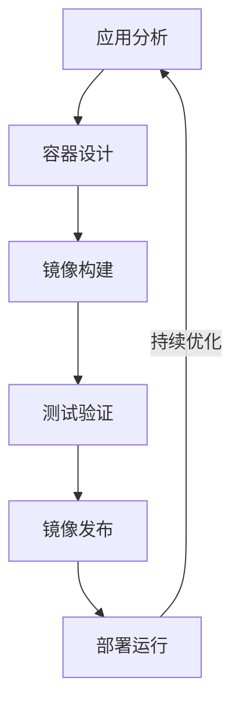
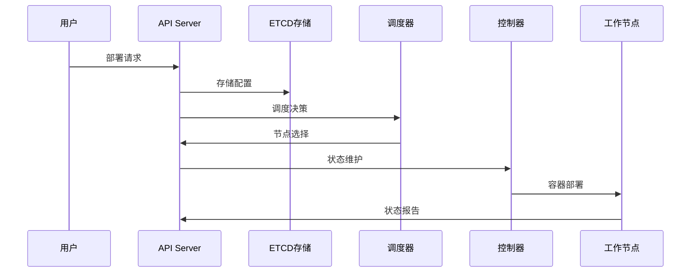
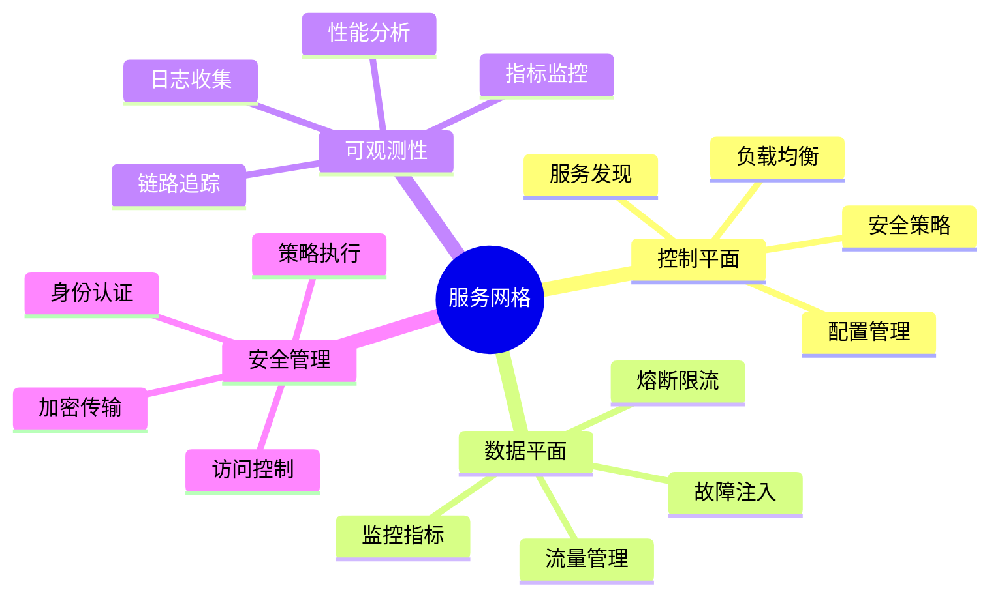
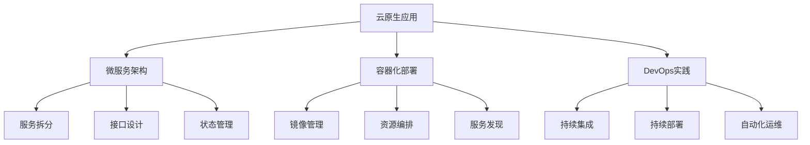

# 第二章：容器化与编排

> 🐳 "以不变应万变。" 在容器化时代，AI 就像一位经验丰富的架构师，帮助你更高效地管理和编排容器服务。

## 引言：容器化技术的智能时代

还记得传统应用部署的环境依赖问题吗？就像要在不同的土壤中种植同一棵树。现在，借助容器技术和 AI 工具，我们可以更智能地进行应用交付，实现真正的一次构建，到处运行。

### 本章收获

- 🎯 掌握 AI 辅助容器化方法
- 🚀 提升部署效率 300%
- 💡 建立容器编排体系
- ⚡ 实现智能化服务治理

## 2.1 容器技术基础

### 2.1.1 容器化流程

### 2.1.2 主流技术对比

容器技术分析：

1. 容器运行时
   - Docker：主流容器引擎
   - Containerd：轻量级容器运行时
   - CRI-O：Kubernetes原生运行时
   - Podman：无守护进程容器引擎

2. 镜像构建工具
   - Dockerfile：传统构建
   - Buildah：无守护进程构建
   - Kaniko：安全构建
   - BuildKit：高效构建

3. 镜像仓库
   - Harbor：企业级仓库
   - Docker Hub：公共仓库
   - Quay：Red Hat仓库
   - ACR：云厂商仓库

推荐工具：
- Cursor：智能构建
- ChatGPT：配置优化
- Dive：镜像分析
- Trivy：安全扫描

## 2.2 Kubernetes实践

### 2.2.1 集群架构

### 2.2.2 核心组件

工具清单：

1. 集群管理
   - kubeadm：集群部署
   - kubespray：生产级部署
   - kind：本地开发
   - minikube：单机测试

2. 包管理
   - Helm：应用打包
   - Kustomize：配置管理
   - Operator：应用运维
   - Chart Museum：包仓库

## 2.3 服务网格

### 2.3.1 网格架构

### 2.3.2 网格工具

1. 服务网格实现
   - Istio：功能完整
   - Linkerd：轻量级
   - Consul Connect：HashiCorp生态
   - AWS App Mesh：云厂商方案

2. 可观测性工具
   - Kiali：服务拓扑
   - Jaeger：链路追踪
   - Prometheus：指标监控
   - Grafana：可视化

## 2.4 云原生应用

### 2.4.1 应用架构

### 2.4.2 开发工具

推荐工具：
1. 开发框架
   - Spring Cloud：Java生态
   - Go Micro：Go语言
   - Dapr：运行时
   - Quarkus：云原生Java

2. 工具链
   - Skaffold：本地开发
   - Telepresence：远程开发
   - Draft：应用打包
   - Tilt：开发工作流

## 课后练习

1. **容器化练习**
   - 应用容器化
   - 镜像优化
   - 安全加固
   - 仓库管理

2. **Kubernetes练习**
   - 集群部署
   - 应用发布
   - 服务配置
   - 运维管理

3. **服务网格练习**
   - 网格部署
   - 流量治理
   - 安全配置
   - 监控管理

## 实战项目

### 项目一：微服务容器化

目标：实现传统应用的容器化改造

步骤：
1. 应用分析
2. 容器设计
3. 服务改造
4. 容器编排

### 项目二：服务网格平台

目标：构建服务网格管理平台

步骤：
1. 架构设计
2. 网格部署
3. 服务接入
4. 治理实践

## 参考资源

- [容器技术指南](https://container-guide.dev)
- [Kubernetes最佳实践](https://kubernetes-best-practices.dev)
- [服务网格教程](https://service-mesh-tutorial.dev)
- [云原生架构](https://cloud-native-arch.dev)

## 小贴士

> 💡 AI 能够加速容器化过程，但对容器技术和云原生架构的理解仍然至关重要。

> 🎯 在容器化实践中，保持对可靠性和可扩展性的追求，让 AI 工具帮助你更好地实现服务治理。 