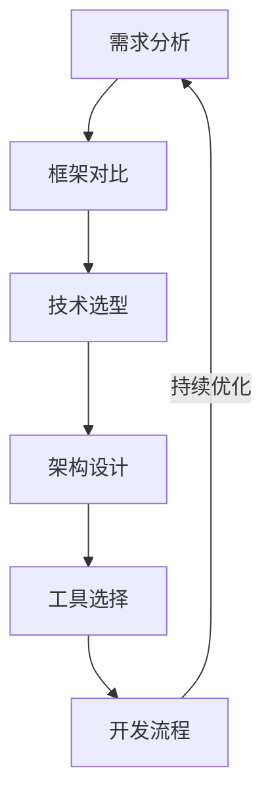
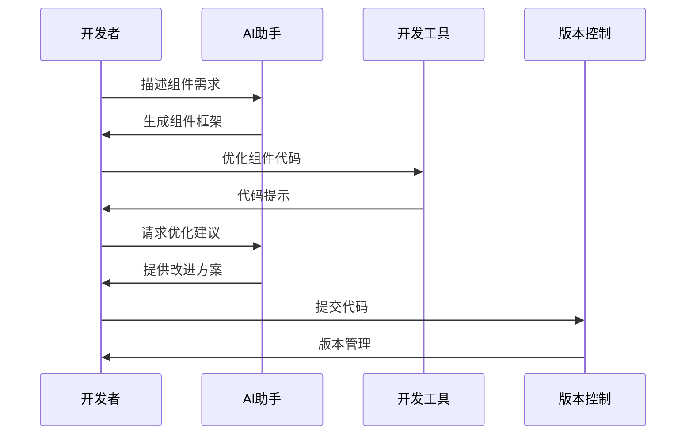
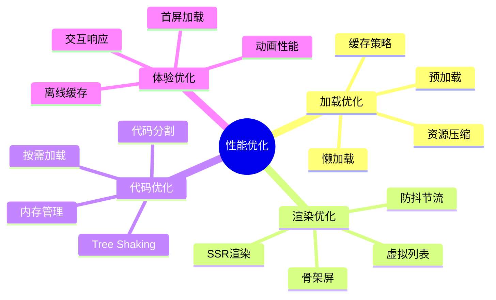
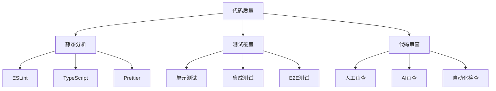

# 第一章：Web开发基础

> 🌐 "工欲善其事，必先利其器。" 在前端开发中，AI 就像一位经验丰富的技术导师，帮助你更高效地编写代码和解决问题。

## 引言：现代前端开发的革新

还记得手动编写大量重复代码的时代吗？就像在写作时一遍遍抄写相同的段落。现在，借助 AI 工具，我们可以更智能地进行开发，让创造力专注在真正需要的地方。

### 本章收获

- 🎯 掌握 AI 辅助前端开发方法
- 🚀 提升开发效率 300%
- 💡 建立智能化开发流程
- ⚡ 实现代码质量提升

## 1.1 现代框架与AI

### 1.1.1 框架选择流程

### 1.1.2 框架应用实践

主流框架特点：

1. React生态
   - 组件化开发
   - 虚拟DOM
   - JSX语法
   - 状态管理

2. Vue.js特性
   - 响应式系统
   - 模板语法
   - 双向绑定
   - 组件通信

3. Angular优势
   - 完整解决方案
   - TypeScript
   - 依赖注入
   - 模块化

推荐工具：
- Cursor：AI代码补全
- GitHub Copilot：智能编程助手
- Tabnine：代码智能提示
- ChatGPT：问题解决

## 1.2 AI辅助组件开发

### 1.2.1 组件开发流程

### 1.2.2 智能开发工具

推荐工具清单：

1. 开发环境
   - VS Code + AI插件
   - WebStorm + AI助手
   - Cursor编辑器
   - Sublime Text + AI

2. 效率工具
   - Storybook：组件开发
   - Bit：组件管理
   - Chromatic：UI测试
   - Figma：设计协作

## 1.3 性能优化技巧

### 1.3.1 性能优化模型

### 1.3.2 优化工具与方法

1. 性能分析工具
   - Lighthouse：性能审计
   - Chrome DevTools：调试分析
   - WebPageTest：性能测试
   - Performance Insights：性能洞察

2. 优化方法
   - 代码压缩
   - 图片优化
   - 缓存策略
   - 延迟加载

## 1.4 AI代码质量控制

### 1.4.1 质量控制体系

### 1.4.2 质量控制工具

推荐工具：
1. 代码检查
   - ESLint + AI规则
   - SonarQube：代码质量
   - DeepScan：深度分析
   - CodeClimate：质量监控

2. 测试工具
   - Jest：单元测试
   - Cypress：E2E测试
   - Testing Library：组件测试
   - Playwright：浏览器测试

## 课后练习

1. **框架实践练习**
   - 选择一个框架
   - 使用AI工具开发
   - 实现基础组件
   - 优化开发流程

2. **性能优化练习**
   - 分析现有项目
   - 识别性能问题
   - 实施优化方案
   - 对比优化效果

3. **代码质量练习**
   - 配置质量工具
   - 执行代码检查
   - 优化问题代码
   - 建立质量标准

## 实战项目

### 项目一：智能组件库

目标：开发一个AI驱动的组件库

步骤：
1. 需求分析
2. 架构设计
3. 组件开发
4. 文档生成

### 项目二：性能优化系统

目标：构建自动化的性能优化流程

步骤：
1. 性能监控
2. 问题诊断
3. 优化执行
4. 效果验证

## 参考资源

- [前端开发工具集](https://frontend-toolkit.dev)
- [性能优化指南](https://performance-guide.web.dev)
- [组件开发最佳实践](https://component-best-practices.com)
- [代码质量标准](https://code-quality-standards.dev)

## 小贴士

> 💡 AI 能够提升开发效率，但良好的代码设计和架构思维仍然是核心竞争力。

> 🎯 保持技术敏感度，让 AI 工具帮助你编写更好的代码。 