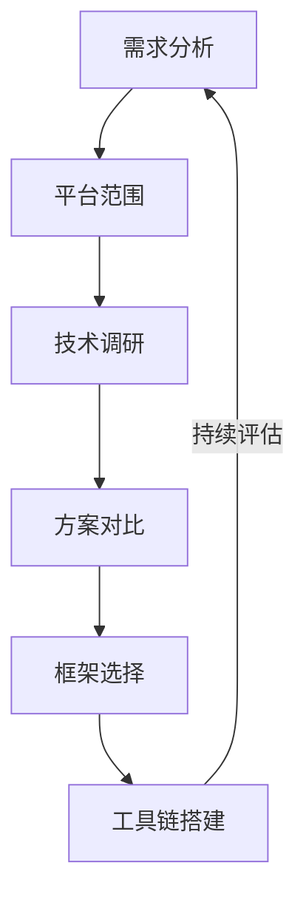
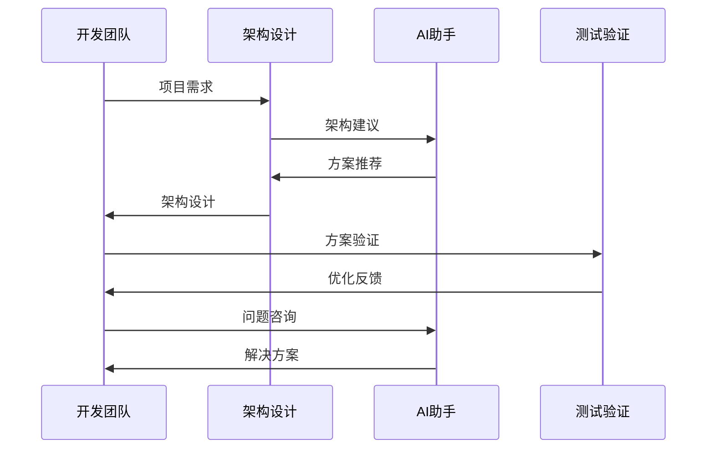
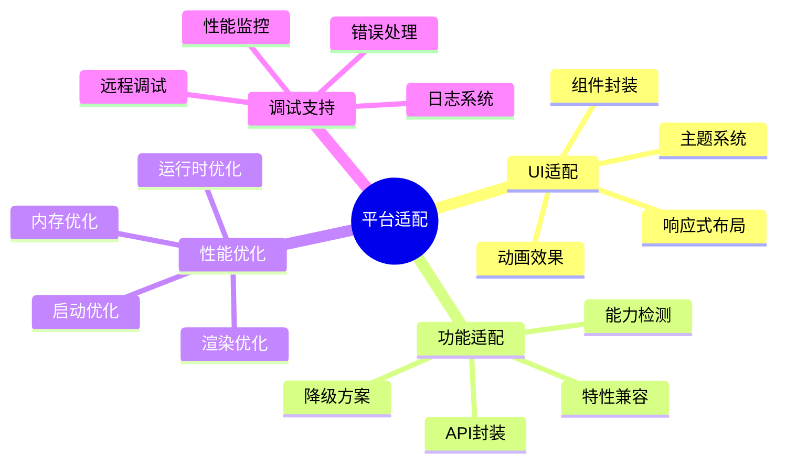
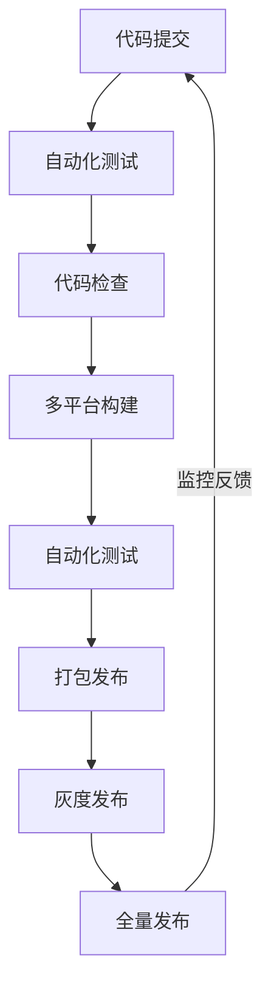

# 第三章：跨平台开发

> 🌈 "一次编写，到处运行。" 在跨平台开发中，AI 就像一位经验丰富的架构师，帮助你更高效地构建适配多端的应用。

## 引言：跨平台开发的新纪元

还记得为每个平台单独开发维护代码的时代吗？就像要用不同的材料建造相同的房子。现在，借助 AI 工具，我们可以更智能地进行跨平台开发，实现真正的一次开发，处处运行。

### 本章收获

- 🎯 掌握 AI 辅助跨平台开发方法
- 🚀 提升开发效率 250%
- 💡 建立统一开发体系
- ⚡ 实现智能化平台适配

## 3.1 跨平台技术选型

### 3.1.1 技术选型流程

### 3.1.2 主流方案对比

技术方案分析：

1. React Native
   - React开发体验
   - 原生性能
   - 热更新支持
   - 社区活跃

2. Flutter
   - 高性能渲染
   - 完整生态
   - 优秀体验
   - 学习曲线

3. Electron
   - Web技术栈
   - 桌面跨平台
   - 开发便捷
   - 资源占用

推荐工具：
- Cursor：智能编码
- Expo：快速开发
- Flutter DevTools
- VS Code + AI插件

## 3.2 统一开发架构

### 3.2.1 架构设计流程

### 3.2.2 开发工具链

工具清单：

1. 开发环境
   - Android Studio
   - Xcode
   - VS Code
   - WebStorm

2. 调试工具
   - React DevTools
   - Flutter Inspector
   - Chrome DevTools
   - 性能监控

## 3.3 平台适配策略

### 3.3.1 适配架构

### 3.3.2 适配工具与方法

1. UI适配工具
   - Responsive Framework
   - FlexLayout
   - 主题引擎
   - 样式转换

2. 功能适配
   - 平台检测
   - 特性探测
   - 桥接封装
   - 降级处理

## 3.4 持续集成与发布

### 3.4.1 CI/CD流程

### 3.4.2 发布工具

推荐工具：
1. CI/CD平台
   - GitHub Actions
   - Jenkins
   - GitLab CI
   - CircleCI

2. 发布工具
   - fastlane
   - CodePush
   - AppCenter
   - Firebase

## 课后练习

1. **架构设计练习**
   - 分析项目需求
   - 设计技术方案
   - 评估可行性
   - 实施验证

2. **平台适配练习**
   - UI框架选择
   - 响应式实现
   - 功能适配
   - 性能优化

3. **发布流程练习**
   - 搭建CI/CD
   - 自动化测试
   - 打包发布
   - 监控反馈

## 实战项目

### 项目一：跨平台社交应用

目标：开发支持多端的社交应用

步骤：
1. 架构设计
2. 框架搭建
3. 功能开发
4. 多端适配

### 项目二：企业级管理系统

目标：构建跨平台的管理系统

步骤：
1. 需求分析
2. 技术选型
3. 系统开发
4. 部署发布

## 参考资源

- [跨平台开发指南](https://cross-platform-guide.dev)
- [React Native最佳实践](https://react-native-best-practices.com)
- [Flutter开发教程](https://flutter-tutorial.dev)
- [Electron应用开发](https://electron-dev-guide.com)

## 小贴士

> 💡 AI 能够加速开发过程，但对不同平台特性的深入理解仍然是核心竞争力。

> 🎯 在跨平台开发中，保持对用户体验的追求，让 AI 工具帮助你更好地处理平台差异。 