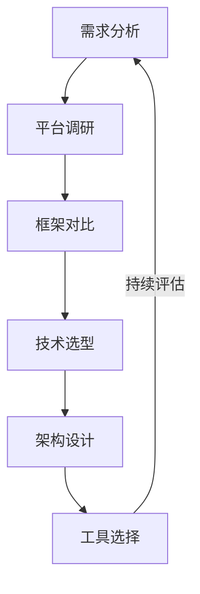
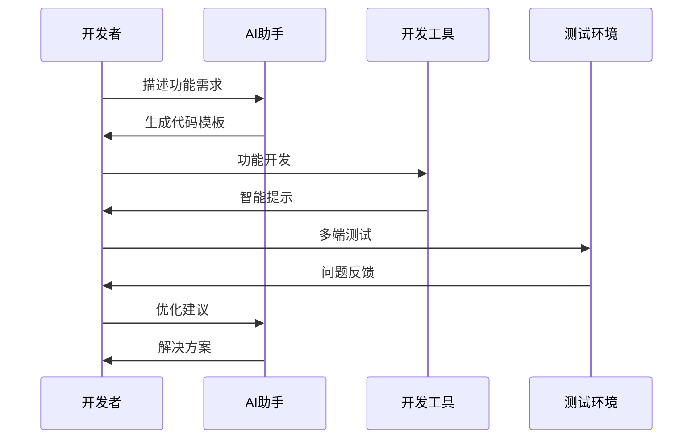
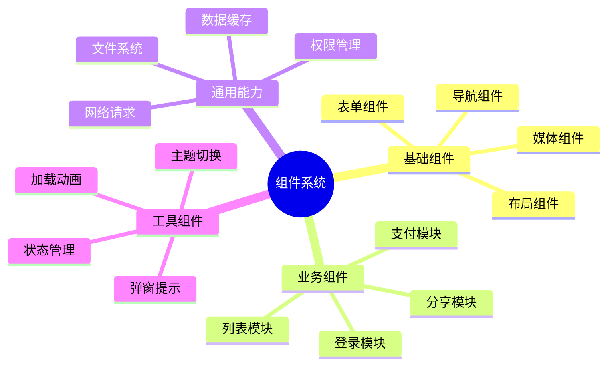
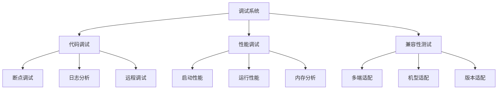

# 第二章：小程序开发

> 📱 "小而美，大有为。" 在小程序开发中，AI 就像一位经验丰富的架构师，帮助你更高效地构建跨平台应用。

## 引言：小程序开发的智能时代

还记得为不同平台重复开发的困扰吗？就像要用不同的语言讲述同一个故事。现在，借助 AI 工具，我们可以更智能地进行跨平台开发，实现一次开发，多端运行。

### 本章收获

- 🎯 掌握 AI 辅助小程序开发方法
- 🚀 提升开发效率 200%
- 💡 建立跨平台开发体系
- ⚡ 实现智能化调试优化

## 2.1 跨平台框架选择

### 2.1.1 框架选型流程

### 2.1.2 主流框架对比

框架特点分析：

1. uni-app
   - Vue语法
   - 跨平台能力
   - 组件丰富
   - 社区活跃

2. Taro
   - React语法
   - 多端转译
   - 生态完善
   - 维护活跃

3. Flutter
   - Dart语言
   - 原生性能
   - 独立渲染
   - 完整生态

推荐工具：
- Cursor：智能编码
- AppMaster：低代码开发
- DevEco：开发套件
- ChatGPT：问题解决

## 2.2 智能化开发流程

### 2.2.1 开发流程设计

### 2.2.2 开发工具推荐

工具清单：

1. 开发环境
   - 微信开发者工具
   - HBuilder X
   - VS Code + 插件
   - Android Studio

2. 效率工具
   - 小程序云开发
   - 云函数工具
   - 测试助手
   - 性能监控

## 2.3 组件化开发

### 2.3.1 组件化架构

### 2.3.2 组件开发工具

1. 组件管理工具
   - npm私有仓库
   - 组件市场
   - 代码片段
   - 模板系统

2. 开发辅助
   - 组件预览
   - 状态调试
   - 版本管理
   - 文档生成

## 2.4 调试与优化

### 2.4.1 调试体系

### 2.4.2 优化工具

推荐工具：
1. 调试工具
   - vConsole：移动调试
   - eruda：页面调试
   - Whistle：网络调试
   - Chrome DevTools

2. 性能优化
   - Lighthouse
   - Performance Monitor
   - Memory Panel
   - Coverage工具

## 课后练习

1. **框架实践练习**
   - 选择开发框架
   - 搭建开发环境
   - 实现基础功能
   - 多端适配测试

2. **组件开发练习**
   - 设计组件结构
   - 实现基础组件
   - 开发业务组件
   - 组件文档编写

3. **性能优化练习**
   - 性能指标采集
   - 问题分析诊断
   - 优化方案实施
   - 效果对比测试

## 实战项目

### 项目一：跨平台商城

目标：开发一个支持多端的商城系统

步骤：
1. 需求分析
2. 架构设计
3. 功能开发
4. 多端适配

### 项目二：组件库开发

目标：构建跨平台组件库

步骤：
1. 组件设计
2. 多端实现
3. 测试优化
4. 文档完善

## 参考资源

- [小程序开发指南](https://miniprogram-guide.dev)
- [跨平台开发实践](https://cross-platform-dev.com)
- [组件化开发教程](https://component-dev-tutorial.com)
- [性能优化手册](https://performance-manual.dev)

## 小贴士

> 💡 AI 能够加速开发过程，但对平台特性的理解和架构设计能力仍然至关重要。

> 🎯 在跨平台开发中，保持对各平台特性的敏感度，让 AI 工具帮助你更好地处理平台差异。 