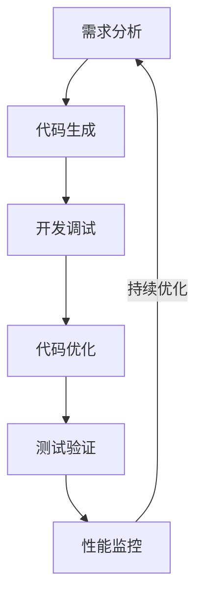
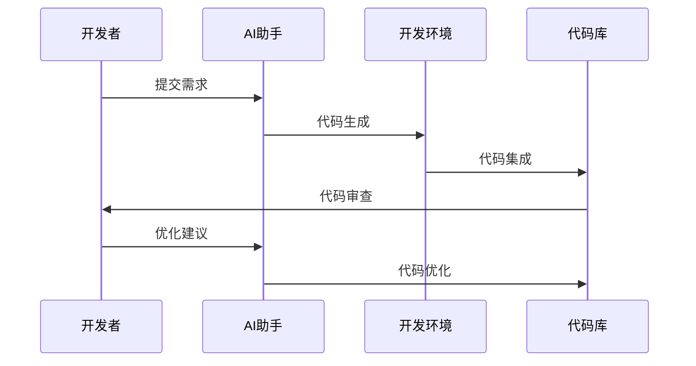
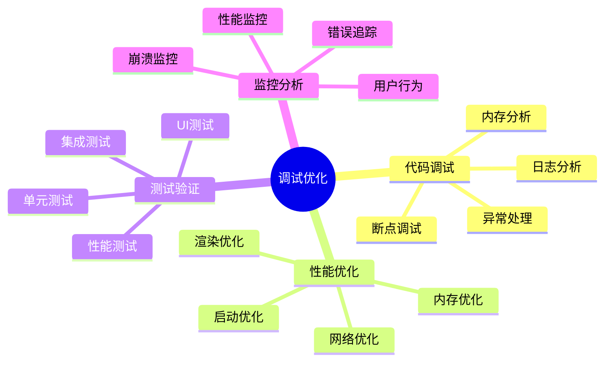
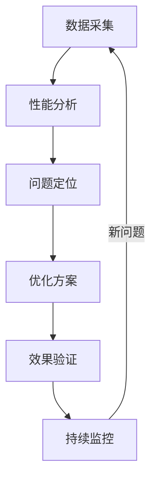

# 第一章：智能化开发基础

> 💡 "工欲善其事，必先利其器。" 在移动开发中，AI 就像一位经验丰富的开发助手，帮助你更快地编写高质量代码。

## 引言：移动开发的智能时代

还记得手动编写大量样板代码的烦恼吗？现在，借助 AI 工具，我们可以更智能地进行移动开发，让编码更加高效。

### 本章收获

- 🎯 掌握 AI 辅助开发方法
- 🚀 提升开发效率 300%
- 💡 建立智能化开发流程
- ⚡ 实现代码质量提升

## 1.1 开发工具链

### 1.1.1 工具流程

### 1.1.2 智能工具应用

工具特点分析：

1. 开发工具
   - Android Studio：Android开发
   - Xcode：iOS开发
   - VS Code：跨平台开发
   - IntelliJ IDEA：Java/Kotlin开发

2. AI辅助工具
   - Cursor：智能编码
   - Copilot：代码补全
   - ChatGPT：问题解答
   - Tabnine：代码智能提示

3. 调试工具
   - Chrome DevTools：Web调试
   - Flutter DevTools：Flutter调试
   - LLDB：iOS调试
   - Android Debug Bridge：Android调试

## 1.2 代码生成

### 1.2.1 生成流程

### 1.2.2 生成工具

工具清单：

1. 代码生成工具
   - Flutter pub：Flutter代码生成
   - SwiftGen：iOS资源生成
   - KAPT：Kotlin注解处理
   - React Native CLI：RN代码生成

2. AI辅助工具
   - 模板生成
   - 组件创建
   - 单元测试
   - 文档生成

## 1.3 调试优化

### 1.3.1 调试体系

### 1.3.2 调试工具

1. 调试工具
   - Flipper：移动调试平台
   - Charles：网络调试
   - LeakCanary：内存泄漏
   - Firebase Performance：性能监控

2. 分析工具
   - 性能分析
   - 内存分析
   - 网络分析
   - 电量分析

## 1.4 性能监控

### 1.4.1 监控流程

### 1.4.2 监控工具

推荐工具：
1. 性能监控
   - Firebase Analytics：数据分析
   - New Relic：应用监控
   - AppDynamics：性能监控
   - Datadog：全栈监控

2. AI分析工具
   - 性能预测
   - 异常检测
   - 趋势分析
   - 优化建议

## 课后练习

1. **工具链练习**
   - 环境搭建
   - 工具配置
   - 流程优化
   - 效率测试

2. **代码生成练习**
   - 模板定义
   - 组件生成
   - 测试生成
   - 文档生成

3. **性能优化练习**
   - 性能分析
   - 问题定位
   - 方案实施
   - 效果验证

## 实战项目

### 项目一：智能开发助手

目标：构建AI驱动的开发辅助工具

步骤：
1. 需求分析
2. 架构设计
3. 功能开发
4. 效果验证

### 项目二：性能监控平台

目标：开发移动应用性能监控平台

步骤：
1. 平台设计
2. 数据采集
3. 分析系统
4. 报警机制

## 参考资源

- [移动开发工具](https://mobile-dev-tools.dev)
- [性能优化指南](https://performance-optimization-guide.dev)
- [调试技巧总结](https://debugging-skills.dev)
- [监控平台搭建](https://monitoring-platform-setup.dev)

## 小贴士

> 💡 AI 能够提升开发效率，但系统设计和架构能力仍然是核心。

> 🎯 在开发实践中，保持对代码质量的关注，让 AI 工具帮助你更好地实现开发目标。 