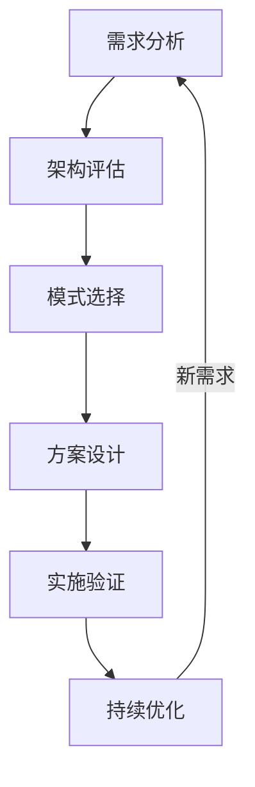
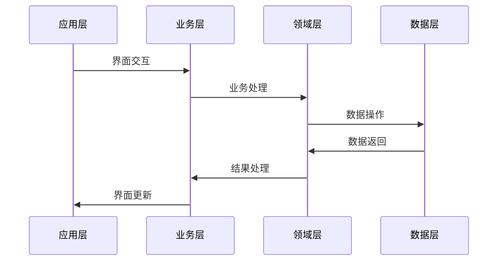
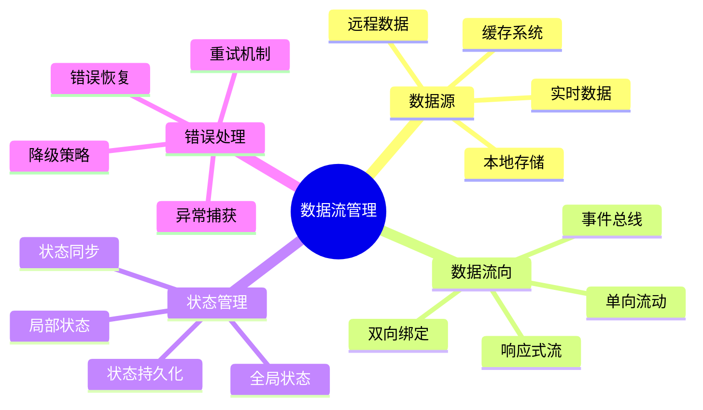
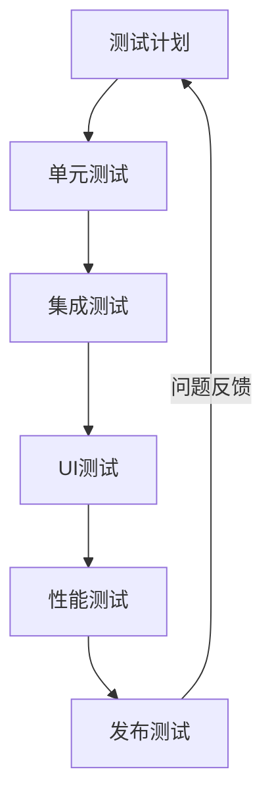

# 第三章：移动端架构设计

> 🏗️ "好的架构是演进的结果，而不是设计的结果。" 在架构设计中，AI 就像一位经验丰富的架构师，帮助你更好地规划系统结构。

## 引言：移动架构的智能时代

还记得处理复杂业务逻辑和代码耦合的烦恼吗？现在，借助 AI 工具，我们可以更智能地进行架构设计，实现清晰的代码组织。

### 本章收获

- 🎯 掌握 AI 辅助架构设计方法
- 🚀 提升架构设计效率 300%
- 💡 建立清晰的架构体系
- ⚡ 实现代码组织最优化

## 3.1 架构模式

### 3.1.1 架构选择

### 3.1.2 主流架构

架构特点分析：

1. MVC
   - 模型层
   - 视图层
   - 控制器层
   - 简单直观

2. MVVM
   - 模型层
   - 视图层
   - 视图模型层
   - 数据绑定

3. Clean Architecture
   - 依赖倒置
   - 关注点分离
   - 边界清晰
   - 可测试性

## 3.2 模块化设计

### 3.2.1 模块流程

### 3.2.2 模块工具

工具清单：

1. 依赖注入
   - Dagger/Hilt：Android
   - Swinject：iOS
   - GetIt：Flutter
   - Inversify：TypeScript

2. AI辅助工具
   - 代码生成
   - 依赖分析
   - 架构检查
   - 文档生成

## 3.3 数据流管理

### 3.3.1 数据架构

### 3.3.2 数据工具

1. 数据框架
   - Room：Android ORM
   - CoreData：iOS存储
   - Hive：Flutter存储
   - Realm：跨平台数据库

2. 开发工具
   - 数据监控
   - 性能分析
   - 调试工具
   - 数据迁移

## 3.4 测试策略

### 3.4.1 测试流程

### 3.4.2 测试工具

推荐工具：
1. 测试框架
   - JUnit：Android测试
   - XCTest：iOS测试
   - Flutter Test：Flutter测试
   - Jest：React Native测试

2. AI测试工具
   - 测试生成
   - 用例分析
   - 覆盖检查
   - 报告生成

## 课后练习

1. **架构实践**
   - 架构选择
   - 方案设计
   - 代码实现
   - 效果验证

2. **模块开发**
   - 模块划分
   - 接口设计
   - 依赖管理
   - 集成测试

3. **测试实践**
   - 测试计划
   - 用例编写
   - 自动化测试
   - 性能测试

## 实战项目

### 项目一：架构脚手架

目标：构建AI驱动的架构脚手架

步骤：
1. 需求分析
2. 架构设计
3. 模板开发
4. 工具集成

### 项目二：测试平台

目标：开发移动端测试平台

步骤：
1. 平台设计
2. 框架开发
3. 工具集成
4. 效果验证

## 参考资源

- [移动架构指南](https://mobile-architecture-guide.dev)
- [模块化最佳实践](https://modularization-practice.dev)
- [测试开发手册](https://test-development-manual.dev)
- [数据流设计模式](https://data-flow-patterns.dev)

## 小贴士

> 💡 AI 能够提供架构建议，但系统设计和工程实践能力仍然是核心。

> 🎯 在架构设计中，保持对可维护性和可扩展性的关注，让 AI 工具帮助你更好地实现架构目标。 