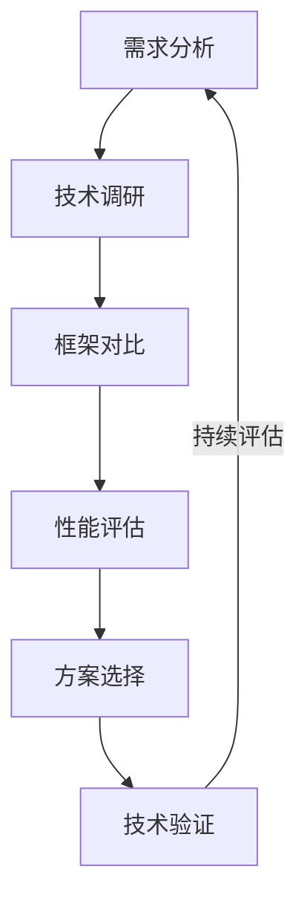
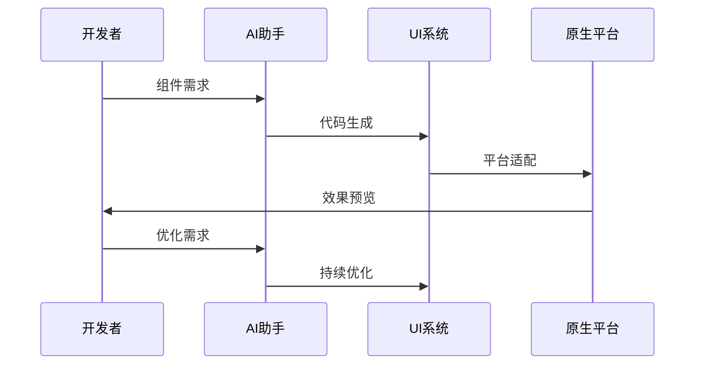
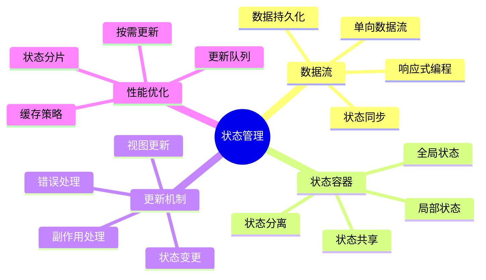
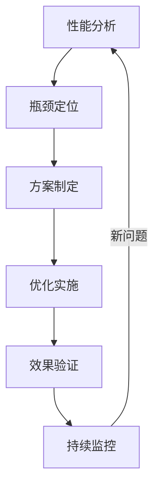

# 第二章：跨平台开发

> 🚀 "一次编写，到处运行。" 在跨平台开发中，AI 就像一位经验丰富的架构师，帮助你更好地处理平台差异。

## 引言：跨平台开发的智能时代

还记得维护多个平台代码的烦恼吗？现在，借助 AI 工具，我们可以更智能地进行跨平台开发，实现高效的代码复用。

### 本章收获

- 🎯 掌握 AI 辅助跨平台开发方法
- 🚀 提升开发效率 350%
- 💡 建立跨平台开发体系
- ⚡ 实现代码复用最大化

## 2.1 框架选择

### 2.1.1 选择流程

### 2.1.2 主流框架

框架特点分析：

1. Flutter
   - Dart语言
   - 自绘引擎
   - 热重载
   - 原生性能

2. React Native
   - JavaScript/TypeScript
   - 原生组件
   - 热更新
   - 生态丰富

3. 其他选择
   - Ionic：Web技术栈
   - Kotlin Multiplatform：Kotlin原生
   - Unity：游戏开发
   - Xamarin：C#技术栈

## 2.2 组件开发

### 2.2.1 开发流程

### 2.2.2 组件工具

工具清单：

1. UI组件库
   - Flutter Material：Material Design
   - React Native Paper：跨平台组件
   - NativeBase：通用组件
   - Ant Design Mobile：企业级组件

2. AI辅助工具
   - 组件生成
   - 样式优化
   - 适配处理
   - 文档生成

## 2.3 状态管理

### 2.3.1 状态架构

### 2.3.2 状态工具

1. 状态管理框架
   - Flutter Provider：依赖注入
   - Redux：可预测状态
   - MobX：响应式状态
   - Riverpod：响应式编程

2. 开发工具
   - 状态调试
   - 性能分析
   - 数据追踪
   - 状态快照

## 2.4 性能优化

### 2.4.1 优化流程

### 2.4.2 优化工具

推荐工具：
1. 性能工具
   - Flutter DevTools：性能分析
   - React Native Debugger：调试工具
   - Chrome Performance：性能分析
   - Xcode Instruments：性能监控

2. AI优化工具
   - 代码优化
   - 性能预测
   - 建议生成
   - 问题诊断

## 课后练习

1. **框架实践**
   - 框架选择
   - 项目搭建
   - 组件开发
   - 性能测试

2. **状态管理**
   - 架构设计
   - 状态定义
   - 数据流处理
   - 性能优化

3. **性能优化**
   - 性能分析
   - 问题定位
   - 优化实施
   - 效果验证

## 实战项目

### 项目一：跨平台组件库

目标：构建AI驱动的跨平台组件库

步骤：
1. 需求分析
2. 架构设计
3. 组件开发
4. 文档生成

### 项目二：性能优化系统

目标：开发跨平台性能优化系统

步骤：
1. 系统设计
2. 数据采集
3. 分析优化
4. 效果验证

## 参考资源

- [跨平台开发指南](https://cross-platform-guide.dev)
- [状态管理最佳实践](https://state-management-practice.dev)
- [性能优化技巧](https://performance-optimization-tips.dev)
- [组件开发规范](https://component-development-spec.dev)

## 小贴士

> 💡 AI 能够提升开发效率，但跨平台架构设计和性能优化能力仍然是核心。

> 🎯 在跨平台开发中，保持对用户体验的关注，让 AI 工具帮助你更好地实现开发目标。 