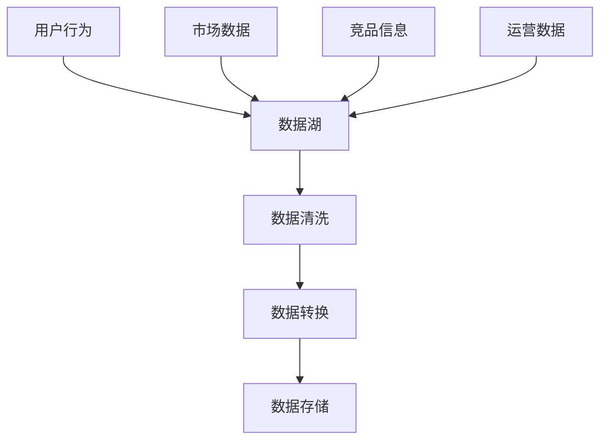
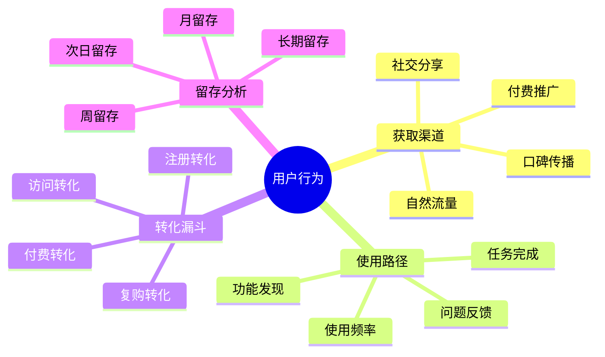
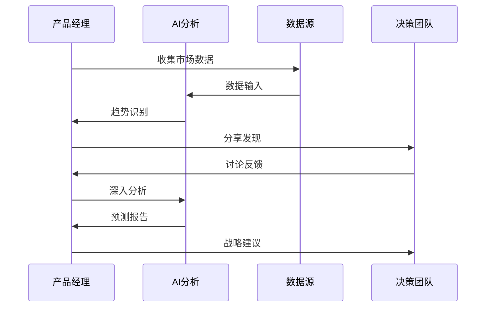
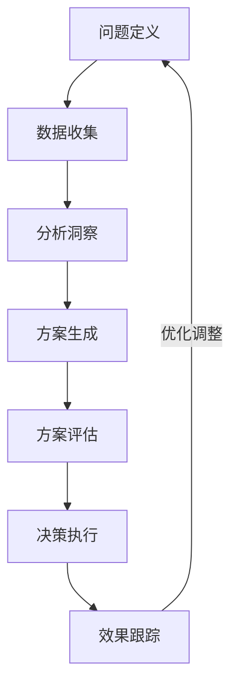

# 第三章：数据分析与决策

> 📊 "数据是新时代的石油。" 在产品决策中，AI 就像一位经验丰富的数据分析师，帮助你从海量数据中发现洞见。

## 引言：数据驱动的决策革命

还记得凭直觉做决策的时代吗？就像在黑暗中摸索前进。现在，借助 AI 工具，我们可以更智能地分析数据，做出更准确的决策，就像在数据的指引下找到正确的方向。

### 本章收获

- 🎯 掌握 AI 辅助数据分析方法
- 🚀 提升决策准确率 50%
- 💡 建立数据驱动的决策体系
- ⚡ 实现智能化市场洞察

## 3.1 数据收集与处理

### 3.1.1 多源数据采集

### 3.1.2 数据处理工具

推荐工具清单：

1. 数据采集工具
   - Google Analytics：用户行为
   - Mixpanel：事件跟踪
   - SimilarWeb：市场数据
   - AppAnnie：竞品分析

2. 数据处理工具
   - Tableau Prep：数据清洗
   - Alteryx：数据转换
   - Power BI：数据集成
   - Cursor AI：智能分析

## 3.2 用户行为分析

### 3.2.1 行为分析框架

### 3.2.2 分析工具与方法

1. 行为分析工具
   - Amplitude：用户行为分析
   - Heap：自动化事件捕捉
   - Hotjar：热力图分析
   - FullStory：用户录屏

2. 分析方法
   - 漏斗分析
   - 路径分析
   - 同期群分析
   - RFM分析

## 3.3 市场趋势预测

### 3.3.1 趋势分析流程

### 3.3.2 趋势分析工具

推荐工具：
1. 市场分析
   - Google Trends：搜索趋势
   - BuzzSumo：内容趋势
   - SensorTower：应用趋势
   - CBInsights：创新趋势

2. 预测工具
   - Cursor AI：趋势预测
   - Prophet：时间序列
   - Tableau：可视化分析
   - Power BI：报表生成

## 3.4 决策支持系统

### 3.4.1 决策框架

### 3.4.2 决策工具

1. 分析工具
   - Airtable：数据管理
   - Notion AI：文档分析
   - Miro：决策框架
   - Cursor：方案生成

2. 评估维度
   - 商业价值
     * 收入影响
     * 成本控制
     * 市场份额
     * 品牌影响

   - 可行性
     * 技术支持
     * 资源需求
     * 时间周期
     * 风险控制

   - 用户价值
     * 需求满足
     * 体验提升
     * 问题解决
     * 用户反馈

## 课后练习

1. **数据分析练习**
   - 选择一个产品功能
   - 收集相关数据
   - 进行数据分析
   - 生成分析报告

2. **趋势预测练习**
   - 选择一个市场领域
   - 收集趋势数据
   - 进行趋势分析
   - 预测发展方向

3. **决策制定练习**
   - 选择一个产品决策
   - 收集决策依据
   - 制定评估标准
   - 完成决策过程

## 实战项目

### 项目一：数据分析平台

目标：搭建个人的数据分析工作台

步骤：
1. 工具选择
2. 数据接入
3. 分析模板
4. 报告生成

### 项目二：决策支持系统

目标：建立团队的决策支持体系

步骤：
1. 框架设计
2. 工具集成
3. 流程优化
4. 团队培训

## 参考资源

- [数据分析工具集](https://data-analysis-toolkit.com)
- [市场趋势分析指南](https://market-trend-guide.dev)
- [决策支持系统实践](https://decision-support-system.net)
- [预测分析最佳实践](https://forecasting-best-practices.com)

## 小贴士

> 💡 AI 能够提供数据支持，但好的决策还需要结合人的经验和判断。

> 🎯 建立数据驱动的决策文化，让 AI 工具帮助你做出更明智的选择。 