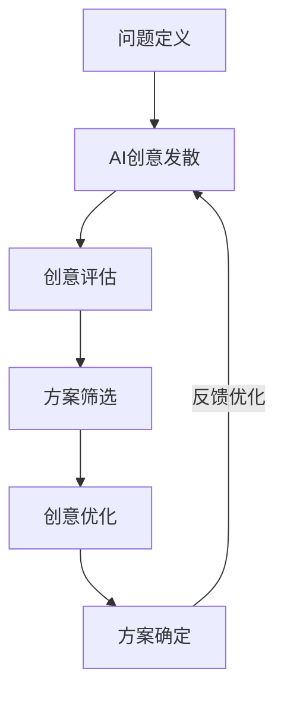
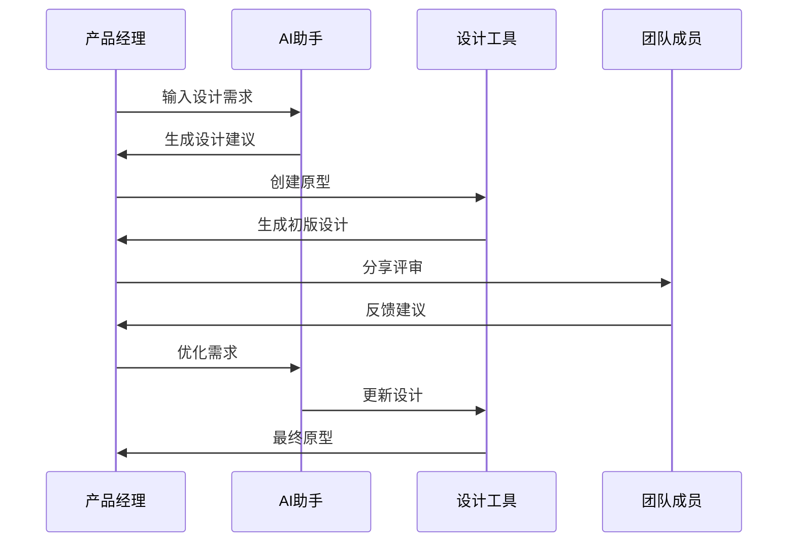
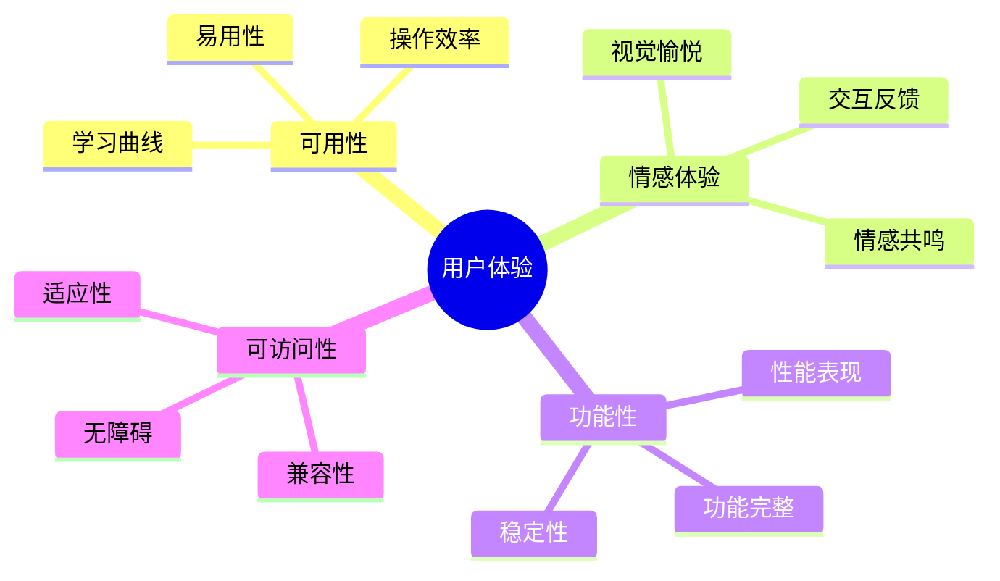
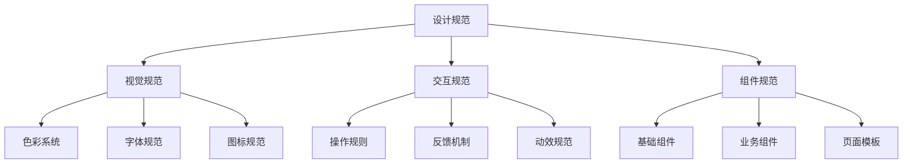

# 第二章：AI 辅助产品设计

> 🎨 "设计是一门艺术，也是一门科学。" 在产品设计中，AI 就像一位经验丰富的设计导师，帮助你在创意与可行性之间找到完美平衡。

## 引言：设计思维的进化

还记得第一次进行产品设计时的迷茫吗？在无数的可能性中寻找最佳方案，就像在迷宫中找寻出路。现在，借助 AI 工具，我们可以更智能地探索设计空间，就像拥有了一个全天候的创意助手。

### 本章收获

- 🎯 掌握 AI 辅助产品构思方法
- 🚀 提升设计效率 200%
- 💡 打造智能化设计流程
- ⚡ 实现高质量原型生成

## 2.1 产品构思与创新

### 2.1.1 创意生成流程

### 2.1.2 创意评估方法

创意评估维度：

1. 市场潜力评估
   - 市场规模
   - 竞品分析
   - 发展趋势
   - 变现能力

2. 技术可行性
   - 实现难度
   - 技术成熟度
   - 维护成本
   - 扩展性

3. 用户价值
   - 需求契合度
   - 使用频率
   - 体验提升
   - 口碑效应

推荐工具：
- Miro：创意头脑风暴
- FigJam：协作设计
- ChatGPT：创意激发
- Cursor：方案优化

## 2.2 原型设计自动化

### 2.2.1 设计流程

### 2.2.2 智能设计工具

推荐工具清单：

1. 原型设计
   - Figma + AI 插件
   - Sketch + AI 助手
   - Adobe XD + AI 功能
   - Framer + AI 生成

2. 设计辅助
   - Midjourney：图像生成
   - Galileo AI：UI 设计
   - Uizard：快速原型
   - Maze：用户测试

## 2.3 用户体验优化

### 2.3.1 体验评估模型

### 2.3.2 体验优化方法

优化流程：

1. 数据收集
   - 用户反馈
   - 行为数据
   - 性能指标
   - 评价记录

2. 问题分析
   - 痛点识别
   - 原因分析
   - 影响评估
   - 优先级排序

3. 方案制定
   - 目标设定
   - 方案设计
   - 资源评估
   - 时间规划

4. 效果验证
   - A/B测试
   - 用户访谈
   - 数据对比
   - 反馈收集

## 2.4 设计规范管理

### 2.4.1 规范体系

### 2.4.2 规范工具

推荐工具：
1. Figma：设计系统管理
2. Zeroheight：规范文档
3. Storybook：组件展示
4. Abstract：设计版本控制

## 课后练习

1. **创意发散练习**
   - 选择一个产品问题
   - 使用 AI 工具头脑风暴
   - 评估创意可行性
   - 制作创意原型

2. **原型设计练习**
   - 使用 AI 工具生成设计
   - 优化交互流程
   - 进行可用性测试
   - 收集用户反馈

3. **规范管理练习**
   - 建立设计规范
   - 创建组件库
   - 编写规范文档
   - 执行规范审查

## 实战项目

### 项目一：AI 设计助手

目标：建立个人的 AI 设计工作流

步骤：
1. 工具集成
2. 流程优化
3. 模板建立
4. 效果验证

### 项目二：智能设计系统

目标：搭建团队的设计规范体系

步骤：
1. 需求分析
2. 规范制定
3. 工具选择
4. 团队培训

## 参考资源

- [AI 设计工具集](https://ai-design-toolkit.com)
- [设计系统最佳实践](https://design-system-guide.dev)
- [用户体验优化指南](https://ux-optimization.net)
- [原型设计模板库](https://prototype-templates.com)

## 小贴士

> 💡 AI 能够加速设计过程，但好的设计仍然需要人的创造力和审美能力。

> 🎯 保持设计的一致性和可用性，让 AI 工具帮助你更好地实现设计目标。 