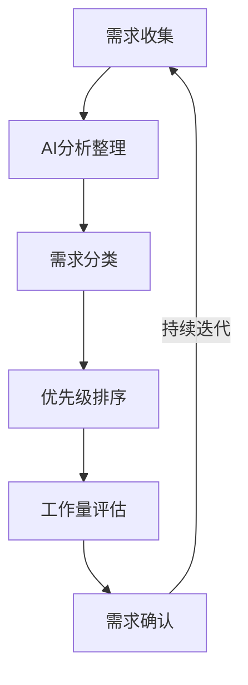
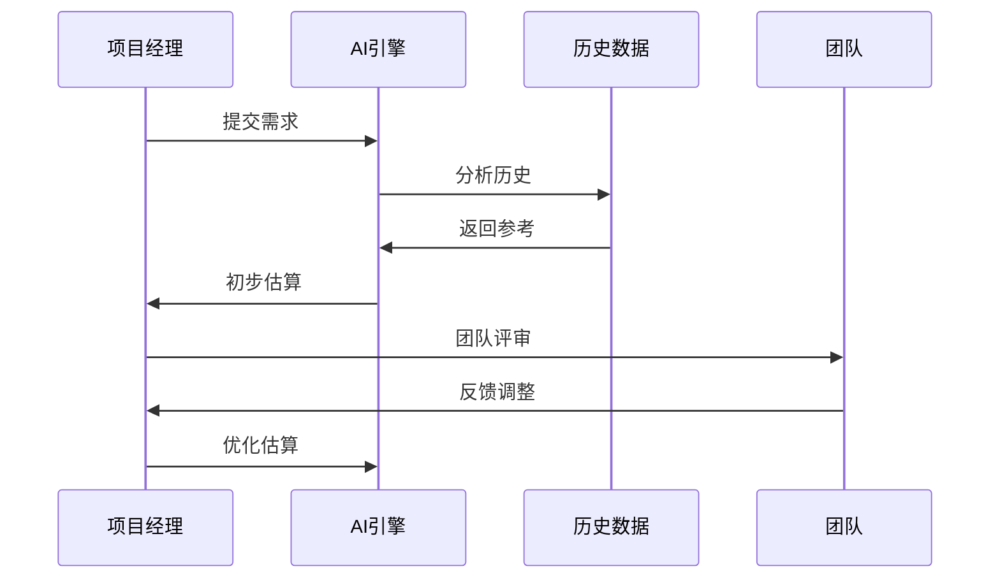
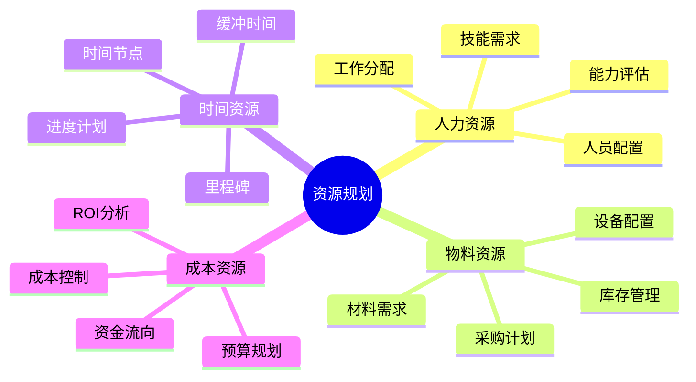
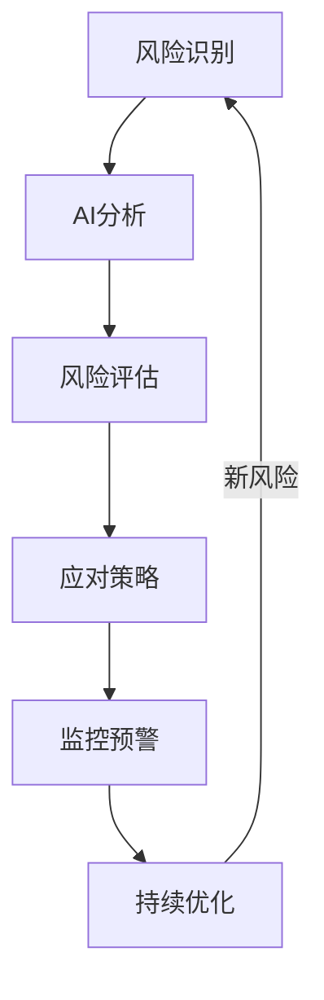

# 第一章：智能化项目规划

> 🎯 "凡事预则立，不预则废。" 在项目规划中，AI 就像一位经验丰富的项目顾问，帮助你更准确地规划和评估项目。

## 引言：项目规划的智能时代

还记得手动评估项目工期的困扰吗？现在，借助 AI 工具，我们可以更智能地进行项目规划，实现精准的资源配置和风险预测。

### 本章收获

- 🎯 掌握 AI 辅助项目规划方法
- 🚀 提升规划效率 300%
- 💡 建立智能化管理体系
- ⚡ 实现数据驱动决策

## 1.1 需求管理

### 1.1.1 需求收集流程

### 1.1.2 智能工具应用

工具特点分析：

1. 需求收集工具
   - JIRA：需求管理
   - Confluence：文档协作
   - Miro：可视化协作
   - Notion：知识管理

2. AI辅助工具
   - Cursor：需求分析
   - ChatGPT：场景设计
   - Copilot：文档生成
   - Claude：需求优化

3. 分析工具
   - PowerBI：数据分析
   - Tableau：可视化
   - Looker：商业智能
   - Metabase：报表生成

## 1.2 项目估算

### 1.2.1 估算模型

### 1.2.2 估算工具

工具清单：

1. 工作量估算
   - MS Project：项目计划
   - Primavera：专业估算
   - Trello：敏捷管理
   - Monday：团队协作

2. AI辅助估算
   - ML模型：历史分析
   - NLP工具：文本分析
   - 预测模型：趋势预测
   - 风险评估：不确定性分析

## 1.3 资源规划

### 1.3.1 资源体系

### 1.3.2 规划工具

1. 资源管理工具
   - Resource Guru：资源调度
   - Float：团队规划
   - 10,000ft：资源优化
   - Hub Planner：容量规划

2. 分析工具
   - 预测分析
   - 资源优化
   - 成本控制
   - 效率分析

## 1.4 风险评估

### 1.4.1 风险管理流程

### 1.4.2 评估工具

推荐工具：
1. 风险管理
   - @Risk：风险分析
   - RiskWatch：风险评估
   - Active Risk：企业风险
   - Risk Cloud：云端管理

2. AI分析工具
   - 预测模型
   - 情景分析
   - 概率评估
   - 影响分析

## 课后练习

1. **需求管理练习**
   - 需求收集
   - AI分析
   - 优先级排序
   - 工作量评估

2. **项目估算练习**
   - 模型建立
   - 数据分析
   - 估算优化
   - 结果验证

3. **风险评估练习**
   - 风险识别
   - 分析评估
   - 策略制定
   - 监控实施

## 实战项目

### 项目一：智能项目规划系统

目标：构建AI驱动的项目规划系统

步骤：
1. 需求分析
2. 系统设计
3. 功能开发
4. 系统部署

### 项目二：风险预警平台

目标：开发项目风险预警平台

步骤：
1. 数据收集
2. 模型构建
3. 平台开发
4. 系统测试

## 参考资源

- [项目规划指南](https://project-planning-guide.dev)
- [资源管理实践](https://resource-management-practice.dev)
- [风险评估工具](https://risk-assessment-tools.dev)
- [AI辅助决策](https://ai-decision-support.dev)

## 小贴士

> 💡 AI 能够提供决策支持，但项目经理的经验判断仍然至关重要。

> 🎯 在项目规划中，保持对项目本质的关注，让 AI 工具帮助你更好地实现管理目标。 