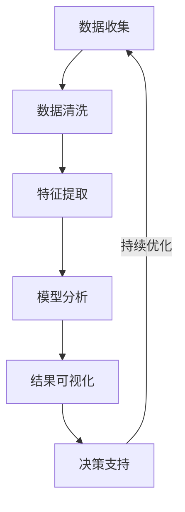
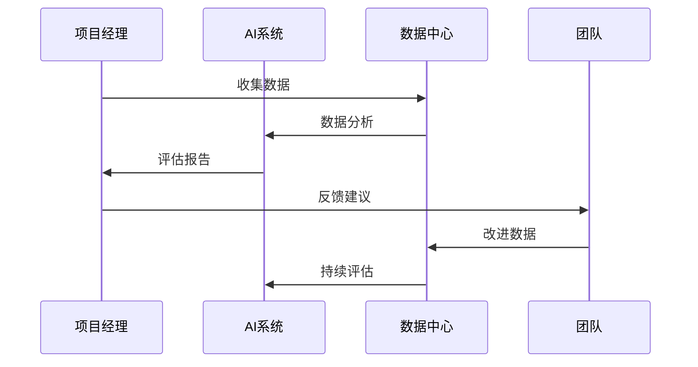
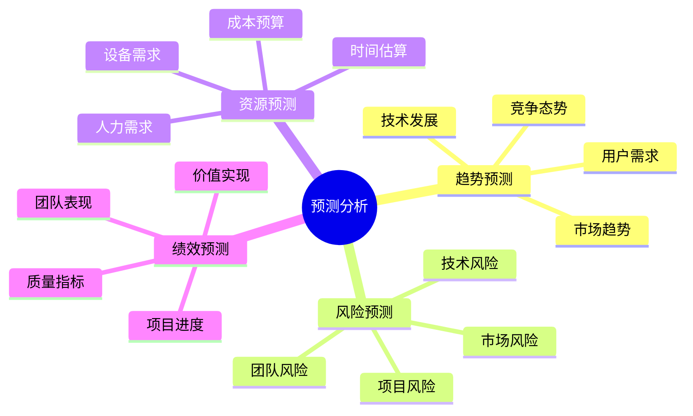
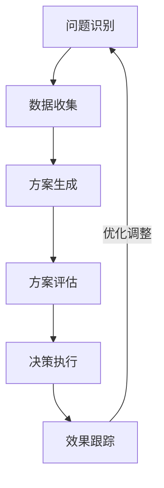

# 第三章：项目分析与决策

> 📊 "数据驱动决策，智能助力管理。" 在项目分析与决策中，AI 就像一位经验丰富的数据分析师，帮助你更准确地把握项目走向。

## 引言：项目决策的智能时代

还记得凭经验做决策的不确定性吗？现在，借助 AI 工具，我们可以基于数据进行分析，实现更科学的项目决策。

### 本章收获

- 🎯 掌握 AI 辅助决策方法
- 🚀 提升决策准确率 200%
- 💡 建立数据驱动体系
- ⚡ 实现智能化决策

## 3.1 数据分析

### 3.1.1 分析流程

### 3.1.2 分析工具应用

工具特点分析：

1. 数据分析工具
   - PowerBI：商业智能
   - Tableau：数据可视化
   - Looker：数据分析
   - Metabase：报表生成

2. AI辅助工具
   - Cursor：数据处理
   - ChatGPT：分析建议
   - Copilot：报告生成
   - Claude：洞察提取

3. 统计工具
   - Python：数据科学
   - R：统计分析
   - SPSS：专业统计
   - SAS：企业分析

## 3.2 绩效评估

### 3.2.1 评估模型

### 3.2.2 评估工具

工具清单：

1. 绩效管理
   - OKR：目标管理
   - KPI：指标评估
   - BSC：平衡计分卡
   - 360度评估：全方位评价

2. AI辅助评估
   - 数据分析：趋势识别
   - 模式识别：行为分析
   - 预测模型：发展预测
   - 建议生成：改进方案

## 3.3 预测模型

### 3.3.1 预测体系

### 3.3.2 预测工具

1. 预测分析工具
   - Prophet：时间序列
   - TensorFlow：深度学习
   - scikit-learn：机器学习
   - H2O：自动化ML

2. 分析工具
   - 趋势分析
   - 模式识别
   - 异常检测
   - 场景模拟

## 3.4 决策支持

### 3.4.1 决策流程

### 3.4.2 决策工具

推荐工具：
1. 决策支持
   - Expert Choice：决策分析
   - D-Sight：多准则决策
   - Palisade：风险分析
   - Analytica：决策建模

2. AI决策工具
   - 智能推荐
   - 风险评估
   - 方案优化
   - 影响分析

## 课后练习

1. **数据分析练习**
   - 数据处理
   - 特征提取
   - 模型分析
   - 结果解读

2. **预测建模练习**
   - 模型选择
   - 参数调优
   - 效果验证
   - 模型应用

3. **决策支持练习**
   - 问题分析
   - 方案生成
   - 决策制定
   - 效果评估

## 实战项目

### 项目一：智能决策平台

目标：构建AI驱动的决策支持平台

步骤：
1. 需求分析
2. 平台设计
3. 模型开发
4. 系统集成

### 项目二：预测分析系统

目标：开发项目预测分析系统

步骤：
1. 数据收集
2. 模型构建
3. 系统开发
4. 效果验证

## 参考资源

- [数据分析指南](https://data-analysis-guide.dev)
- [预测模型实践](https://predictive-modeling-practice.dev)
- [决策支持工具](https://decision-support-tools.dev)
- [AI辅助决策](https://ai-assisted-decision.dev)

## 小贴士

> 💡 AI 能够提供决策支持，但最终决策仍需要项目经理的专业判断。

> 🎯 在项目决策中，平衡数据分析和经验判断，让 AI 工具帮助你做出更明智的选择。 