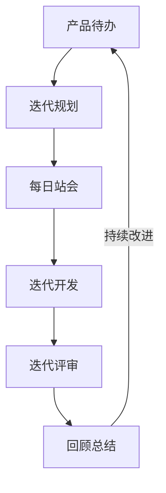
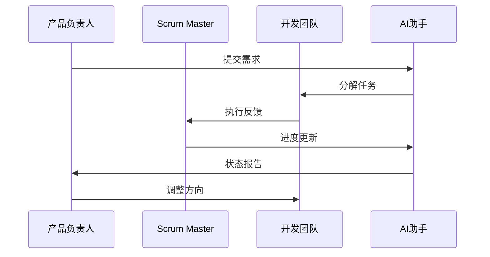
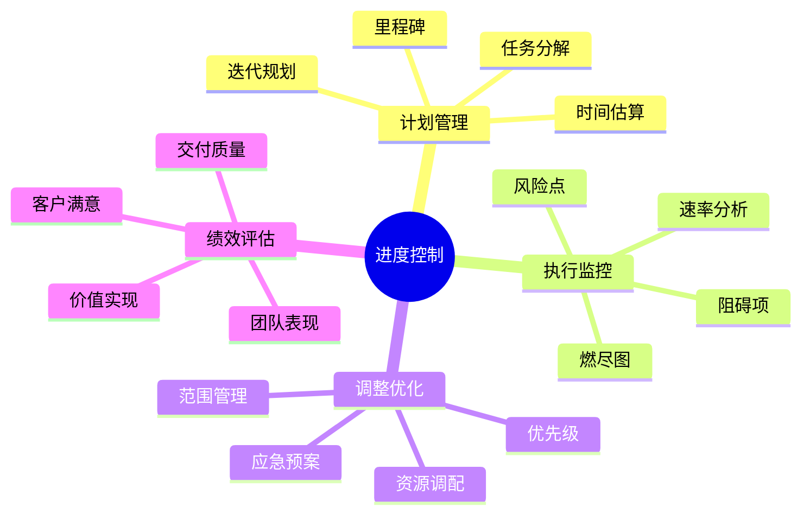
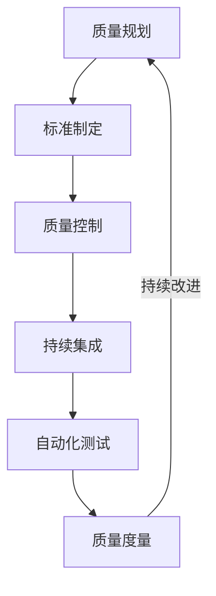

# 第二章：敏捷项目管理

> 🚀 "敏捷不是目标，而是通向卓越的旅程。" 在敏捷管理中，AI 就像一位经验丰富的敏捷教练，帮助你更好地实践敏捷价值观和原则。

## 引言：敏捷管理的智能时代

还记得繁琐的敏捷仪式和文档工作吗？现在，借助 AI 工具，我们可以更智能地进行敏捷管理，让团队专注于创造价值。

### 本章收获

- 🎯 掌握 AI 辅助敏捷管理方法
- 🚀 提升团队效率 350%
- 💡 建立智能化敏捷体系
- ⚡ 实现持续交付价值

## 2.1 敏捷实践

### 2.1.1 敏捷流程

### 2.1.2 智能工具应用

工具特点分析：

1. 敏捷管理工具
   - JIRA：敏捷项目管理
   - Azure DevOps：团队协作
   - Trello：看板管理
   - Monday：团队任务

2. AI辅助工具
   - Cursor：任务分析
   - ChatGPT：会议记录
   - Copilot：文档生成
   - Claude：进度预测

3. 协作工具
   - Confluence：知识管理
   - Notion：团队协作
   - Miro：远程协作
   - Slack：即时沟通

## 2.2 团队协作

### 2.2.1 协作模型

### 2.2.2 协作工具

工具清单：

1. 沟通协作
   - Microsoft Teams：团队协作
   - Zoom：远程会议
   - Slack：即时通讯
   - Discord：语音协作

2. AI辅助协作
   - 会议助手：自动记录
   - 任务分配：智能推荐
   - 进度跟踪：自动更新
   - 问题预警：智能提醒

## 2.3 进度控制

### 2.3.1 控制体系

### 2.3.2 控制工具

1. 进度管理工具
   - Jira：敏捷看板
   - Azure Boards：进度跟踪
   - ZenHub：GitHub集成
   - ClickUp：项目管理

2. 分析工具
   - 燃尽图分析
   - 速率预测
   - 瓶颈识别
   - 趋势分析

## 2.4 质量管理

### 2.4.1 质量管理流程

### 2.4.2 管理工具

推荐工具：
1. 质量管理
   - SonarQube：代码质量
   - Jenkins：持续集成
   - TestRail：测试管理
   - Selenium：自动化测试

2. AI分析工具
   - 代码审查
   - 缺陷预测
   - 质量评估
   - 改进建议

## 课后练习

1. **敏捷实践练习**
   - 待办管理
   - 迭代规划
   - 站会引导
   - 回顾改进

2. **团队协作练习**
   - 远程协作
   - 任务分配
   - 进度跟踪
   - 问题解决

3. **质量管理练习**
   - 标准制定
   - 质量控制
   - 自动化测试
   - 改进优化

## 实战项目

### 项目一：敏捷管理平台

目标：构建AI驱动的敏捷管理平台

步骤：
1. 需求分析
2. 平台设计
3. 功能开发
4. 实施部署

### 项目二：智能协作系统

目标：开发团队智能协作系统

步骤：
1. 场景分析
2. 系统设计
3. 功能实现
4. 效果验证

## 参考资源

- [敏捷管理指南](https://agile-management-guide.dev)
- [团队协作实践](https://team-collaboration-practice.dev)
- [质量管理工具](https://quality-management-tools.dev)
- [AI辅助敏捷](https://ai-assisted-agile.dev)

## 小贴士

> 💡 AI 能够提升敏捷实践效率，但敏捷的核心价值观和原则才是根本。

> 🎯 在敏捷管理中，保持对人的关注，让 AI 工具帮助团队更好地实现目标。 