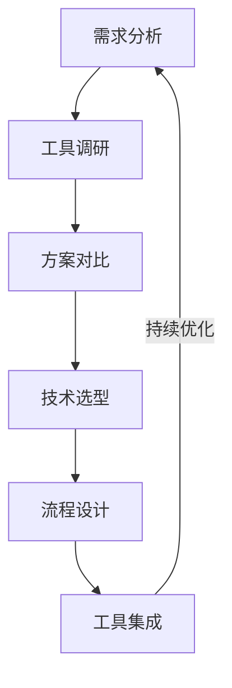
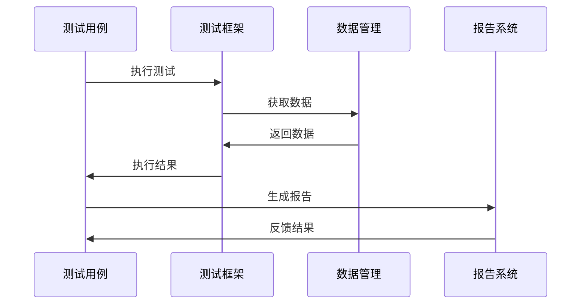
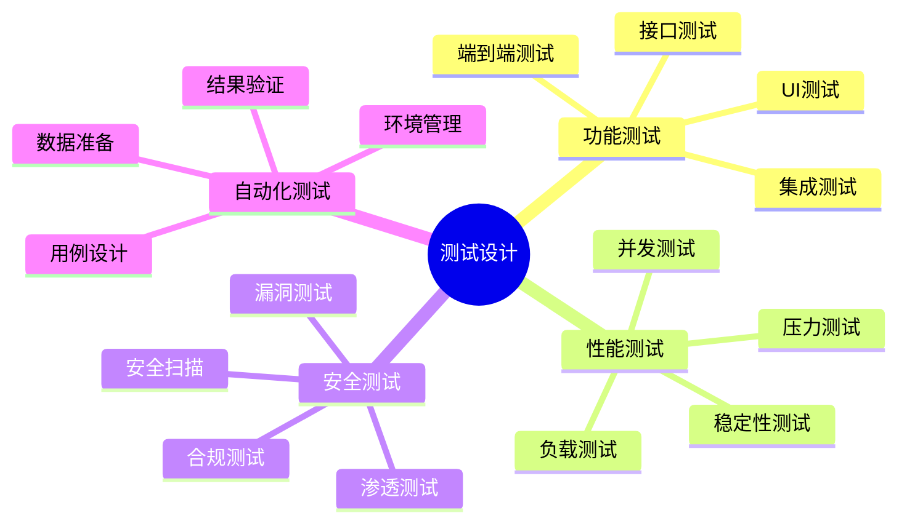
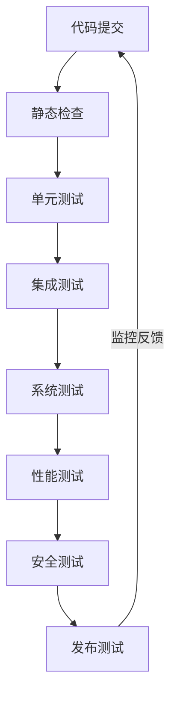

# 第一章：自动化测试基础

> 🔄 "工欲善其事，必先利其器。" 在自动化测试中，AI 就像一位经验丰富的测试专家，帮助你更高效地设计和执行测试。

## 引言：自动化测试的智能时代

还记得手动执行重复测试用例的繁琐吗？就像要一遍遍检查同样的问题。现在，借助 AI 工具，我们可以更智能地进行自动化测试，实现真正的持续测试。

### 本章收获

- 🎯 掌握 AI 辅助自动化测试方法
- 🚀 提升测试效率 300%
- 💡 建立自动化测试体系
- ⚡ 实现智能化测试管理

## 1.1 测试工具链

### 1.1.1 工具选型流程

### 1.1.2 主流工具对比

工具特点分析：

1. UI自动化工具
   - Selenium：Web自动化
   - Cypress：现代Web测试
   - Playwright：跨浏览器测试
   - Appium：移动测试

2. 接口测试工具
   - Postman：API测试
   - RestAssured：Java API测试
   - JMeter：性能测试
   - SoapUI：Web服务测试

3. 单元测试工具
   - JUnit：Java单元测试
   - TestNG：测试框架
   - Mocha：JS测试
   - PyTest：Python测试

推荐工具：
- Cursor：智能测试
- ChatGPT：用例生成
- TestComplete：AI测试
- Selenium IDE：录制回放

## 1.2 测试框架

### 1.2.1 框架设计

### 1.2.2 框架组件

工具清单：

1. 基础框架
   - TestNG：测试管理
   - Spring Test：集成测试
   - Mock框架：模拟数据
   - Allure：报告生成

2. 扩展工具
   - Log4j：日志管理
   - Maven：构建工具
   - Jenkins：持续集成
   - Docker：环境管理

## 1.3 测试设计

### 1.3.1 测试模型

### 1.3.2 设计工具

1. 测试设计工具
   - XMind：思维导图
   - JIRA：需求管理
   - TestRail：测试管理
   - qTest：测试平台

2. 测试数据工具
   - Faker：数据生成
   - DBUnit：数据库测试
   - MockServer：接口模拟
   - WireMock：服务模拟

## 1.4 持续测试

### 1.4.1 持续测试流程

### 1.4.2 持续测试工具

推荐工具：
1. CI/CD工具
   - Jenkins：自动化构建
   - GitLab CI：源码集成
   - GitHub Actions：云端CI
   - CircleCI：云服务

2. 质量工具
   - SonarQube：代码质量
   - Checkstyle：代码规范
   - PMD：静态分析
   - FindBugs：Bug检测

## 课后练习

1. **工具链搭建练习**
   - 选择工具集
   - 环境搭建
   - 工具集成
   - 流程测试

2. **框架开发练习**
   - 框架设计
   - 组件开发
   - 功能实现
   - 框架测试

3. **持续测试练习**
   - CI/CD配置
   - 自动化测试
   - 报告生成
   - 问题分析

## 实战项目

### 项目一：Web自动化测试框架

目标：构建完整的Web自动化测试框架

步骤：
1. 需求分析
2. 框架设计
3. 功能实现
4. 用例开发

### 项目二：接口自动化平台

目标：开发接口自动化测试平台

步骤：
1. 平台设计
2. 接口管理
3. 用例管理
4. 报告展示

## 参考资源

- [自动化测试指南](https://automation-test-guide.dev)
- [测试框架设计](https://test-framework-design.dev)
- [持续测试实践](https://continuous-testing-practice.dev)
- [测试工具集成](https://test-tools-integration.dev)

## 小贴士

> 💡 AI 能够加速测试过程，但对测试原理和方法的理解仍然至关重要。

> 🎯 在自动化测试实践中，保持对效率和质量的追求，让 AI 工具帮助你更好地实现测试目标。 