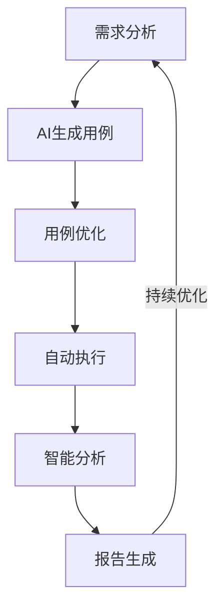
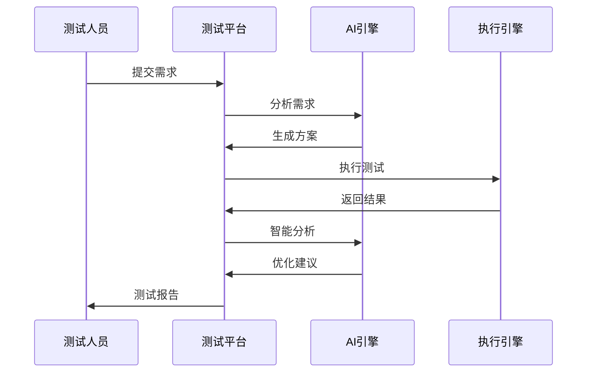
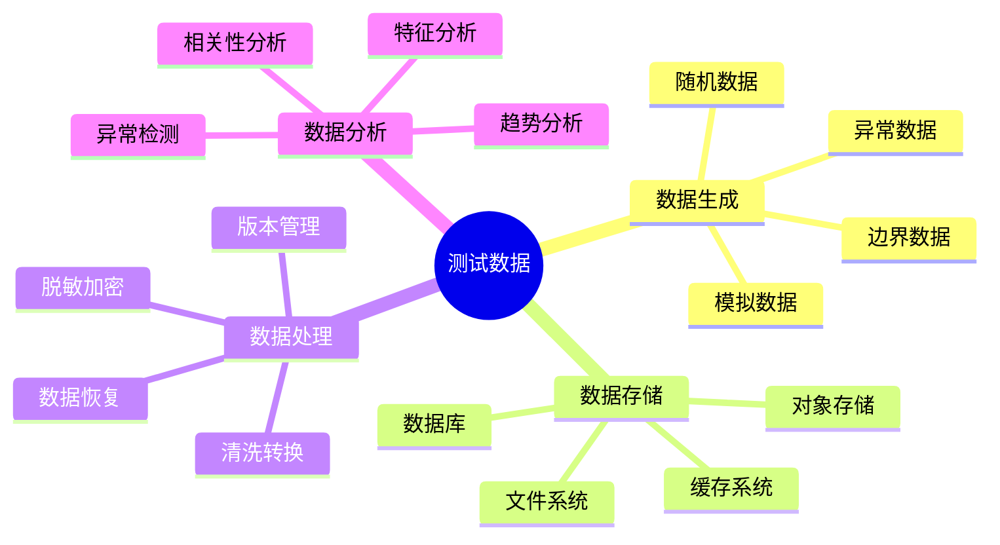
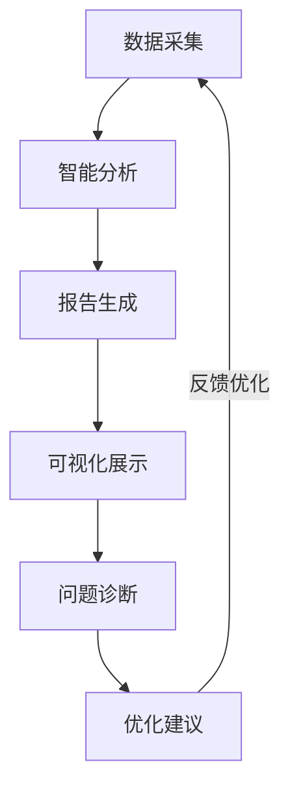

# 第三章：智能化测试

> 🤖 "工欲善其事，必先利其器。" 在智能化测试中，AI 不仅是工具，更是你的智能助手，帮助你实现测试的自动化和智能化。

## 引言：测试的智能化革命

还记得重复编写测试用例的烦恼吗？现在，借助 AI 工具，我们可以更智能地生成测试用例、执行测试、分析结果，让测试工作事半功倍。

### 本章收获

- 🎯 掌握 AI 辅助测试方法
- 🚀 提升测试效率 400%
- 💡 建立智能化测试体系
- ⚡ 实现自动化测试管理

## 3.1 AI辅助测试

### 3.1.1 智能测试流程

### 3.1.2 AI工具应用

工具特点分析：

1. 测试用例生成
   - Cursor：代码生成
   - ChatGPT：场景设计
   - Copilot：代码补全
   - Tabnine：智能提示

2. 智能执行工具
   - TestSigma：AI驱动测试
   - Applitools：视觉AI测试
   - Functionize：智能测试平台
   - Testim：自学习测试

3. 智能分析工具
   - Sealights：质量智能
   - Launchable：测试预测
   - Diffblue：AI测试生成
   - Mabl：智能测试云

## 3.2 自动化测试平台

### 3.2.1 平台架构

### 3.2.2 平台功能

核心功能：

1. 用例管理
   - 智能生成
   - 版本控制
   - 复用管理
   - 标签分类

2. 执行管理
   - 任务调度
   - 资源分配
   - 并行执行
   - 失败重试

## 3.3 测试数据管理

### 3.3.1 数据体系

### 3.3.2 数据工具

1. 数据生成工具
   - Faker：模拟数据
   - Mockaroo：在线生成
   - TestDataGen：智能生成
   - DBMonster：数据库填充

2. 数据管理工具
   - DMS：数据管理
   - Flyway：版本控制
   - Delphix：数据虚拟化
   - Tonic：数据脱敏

## 3.4 智能化报告

### 3.4.1 报告体系

### 3.4.2 报告工具

推荐工具：
1. 报告生成
   - Allure：测试报告
   - ExtentReports：美观报告
   - ReportPortal：AI分析
   - TestRail：测试管理

2. 可视化工具
   - Grafana：数据可视化
   - Kibana：日志分析
   - Tableau：数据展示
   - PowerBI：商业智能

## 课后练习

1. **AI测试练习**
   - 用例生成
   - 智能执行
   - 结果分析
   - 报告生成

2. **平台应用练习**
   - 环境搭建
   - 功能配置
   - 用例管理
   - 执行监控

3. **数据管理练习**
   - 数据生成
   - 数据处理
   - 数据分析
   - 报告展示

## 实战项目

### 项目一：智能测试平台

目标：构建AI驱动的测试平台

步骤：
1. 需求分析
2. 架构设计
3. 功能开发
4. 平台部署

### 项目二：智能报告系统

目标：开发智能化测试报告系统

步骤：
1. 数据采集
2. 智能分析
3. 报告生成
4. 可视化展示

## 参考资源

- [AI测试实践](https://ai-testing-practice.dev)
- [测试平台搭建](https://test-platform-setup.dev)
- [数据管理指南](https://test-data-management.dev)
- [智能报告工具](https://smart-report-tools.dev)

## 小贴士

> 💡 AI 能够大幅提升测试效率，但测试的本质是确保软件质量，不要过度依赖工具。

> 🎯 在智能化测试实践中，保持对测试本质的关注，让 AI 工具帮助你更好地实现测试目标。 