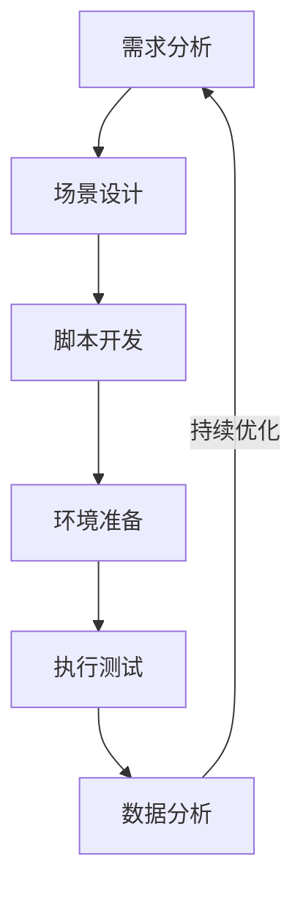
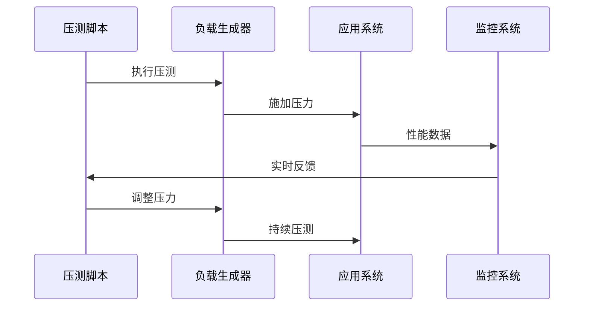
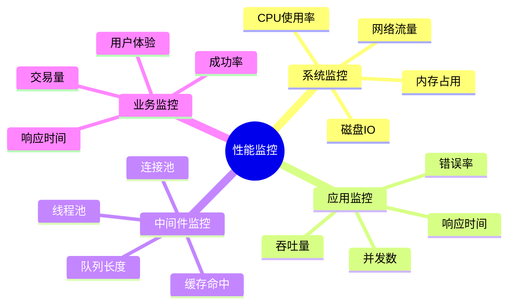
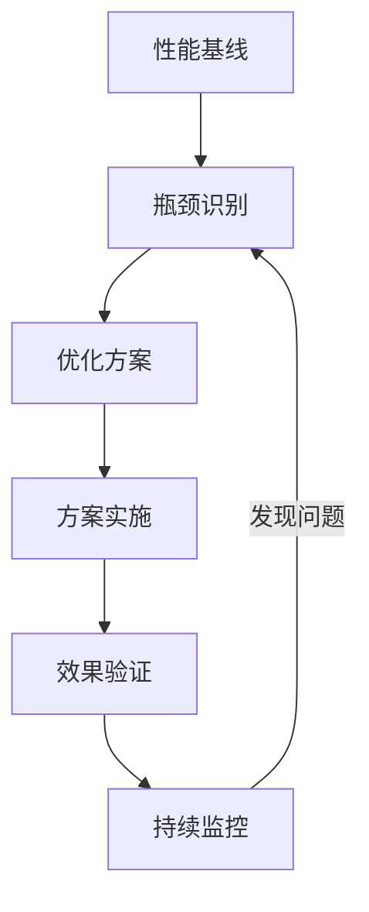

# 第二章：性能测试实践

> 🚀 "知己知彼，百战不殆。" 在性能测试中，AI 就像一位经验丰富的性能专家，帮助你更精准地发现和解决性能问题。

## 引言：性能测试的智能时代

还记得盲目进行压力测试的困惑吗？就像在黑暗中摸索性能瓶颈。现在，借助 AI 工具，我们可以更智能地进行性能测试，实现精准的性能优化。

### 本章收获

- 🎯 掌握 AI 辅助性能测试方法
- 🚀 提升分析效率 250%
- 💡 建立性能测试体系
- ⚡ 实现智能化性能优化

## 2.1 性能测试方法

### 2.1.1 测试流程

### 2.1.2 主流工具对比

工具特点分析：

1. 性能测试工具
   - JMeter：开源全能
   - Gatling：高性能
   - K6：现代化
   - LoadRunner：企业级

2. 监控工具
   - Prometheus：指标监控
   - Grafana：可视化
   - Elastic APM：应用监控
   - Dynatrace：全栈监控

3. 分析工具
   - ELK：日志分析
   - Splunk：数据分析
   - New Relic：性能分析
   - AppDynamics：APM工具

推荐工具：
- Cursor：智能分析
- ChatGPT：问题诊断
- Artillery：云性能测试
- nGrinder：分布式测试

## 2.2 压力测试

### 2.2.1 压测架构

### 2.2.2 压测工具

工具清单：

1. 负载生成
   - JMeter Slaves
   - Gatling Cluster
   - K6 Cloud
   - BlazeMeter

2. 数据采集
   - Telegraf
   - Beats
   - StatsD
   - Collectd

## 2.3 监控分析

### 2.3.1 监控体系

### 2.3.2 分析工具

1. 实时监控
   - Grafana：仪表盘
   - Kibana：日志分析
   - Prometheus：时序数据
   - Zabbix：系统监控

2. 性能分析
   - JProfiler：Java分析
   - YourKit：性能分析
   - Arthas：诊断工具
   - BTrace：动态追踪

## 2.4 性能优化

### 2.4.1 优化流程

### 2.4.2 优化工具

推荐工具：
1. 代码优化
   - JMH：基准测试
   - VisualVM：可视化
   - MAT：内存分析
   - JConsole：监控工具

2. 系统优化
   - Linux perf
   - Brendan工具集
   - SystemTap
   - DTrace

## 课后练习

1. **性能测试练习**
   - 场景设计
   - 脚本开发
   - 压测执行
   - 数据分析

2. **监控配置练习**
   - 监控部署
   - 指标配置
   - 告警设置
   - 数据可视化

3. **优化实践练习**
   - 问题诊断
   - 方案设计
   - 优化实施
   - 效果验证

## 实战项目

### 项目一：电商性能测试

目标：完成电商系统的性能测试与优化

步骤：
1. 场景设计
2. 脚本开发
3. 执行测试
4. 性能优化

### 项目二：监控平台搭建

目标：构建全栈性能监控平台

步骤：
1. 架构设计
2. 监控部署
3. 数据采集
4. 可视化展示

## 参考资源

- [性能测试指南](https://performance-testing-guide.dev)
- [监控系统搭建](https://monitoring-system-setup.dev)
- [性能优化实践](https://performance-optimization-practice.dev)
- [APM工具应用](https://apm-tools-application.dev)

## 小贴士

> 💡 AI 能够加速性能分析过程，但对性能优化原理的理解仍然至关重要。

> 🎯 在性能测试实践中，保持对性能和稳定性的追求，让 AI 工具帮助你更好地实现优化目标。 