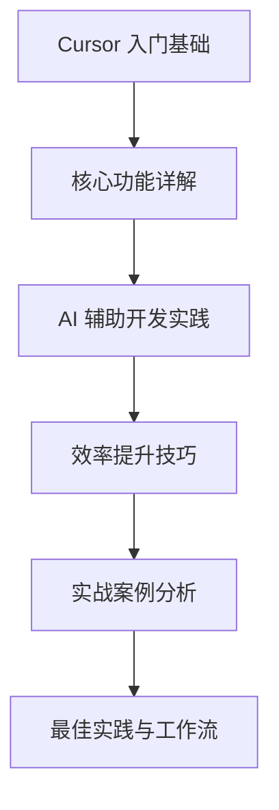

# 前言

在当今快速发展的软件开发领域，提高开发效率已经成为每个开发者的必修课。Cursor 作为一款革命性的 AI 驱动的开发工具，为开发者带来了全新的开发体验和效率提升方案。本书旨在帮助开发者全面掌握 Cursor 的使用技巧，从而显著提升开发效率。

## 本书目标

本书的主要目标是：
1. 帮助开发者快速上手 Cursor
2. 深入讲解 Cursor 的核心功能和最佳实践
3. 通过实际案例展示如何利用 Cursor 提升开发效率
4. 分享在实际开发中的经验和技巧

## 目标读者

本书适合以下读者：
- 想要提升开发效率的程序员
- 对 AI 辅助开发感兴趣的开发者
- 正在使用或计划使用 Cursor 的团队
- 希望改善开发工作流程的技术管理者

## 内容组织

本书分为以下几个主要部分：

## 如何使用本书

建议读者按照以下方式使用本书：
1. 先通过入门基础部分快速了解 Cursor
2. 根据个人需求选择性深入学习核心功能
3. 在实际开发中实践书中的技巧
4. 参考实战案例，结合自身项目进行实践

## 特别说明

本书采用 Markdown 格式编写，并包含大量实例代码、流程图和时序图等可视化内容，以帮助读者更好地理解和掌握相关知识。我们会持续更新本书的内容，以确保与 Cursor 的最新特性保持同步。

让我们开始这段提升开发效率的旅程吧！
