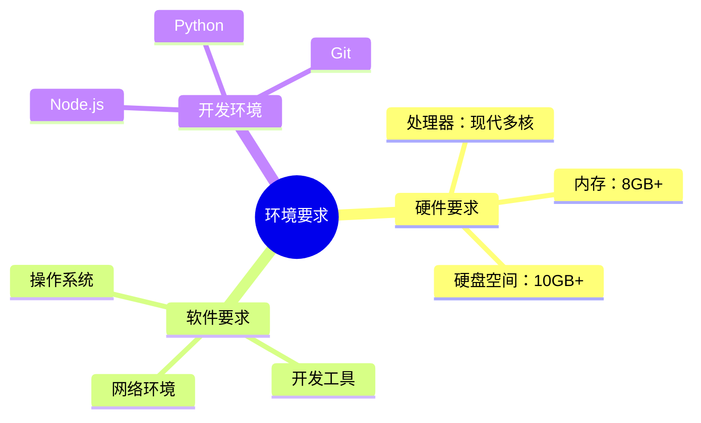
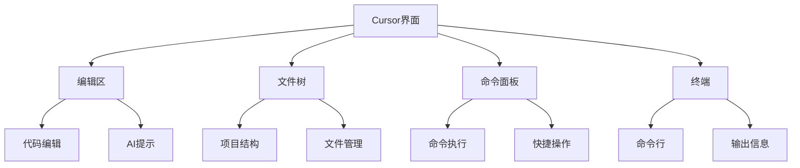
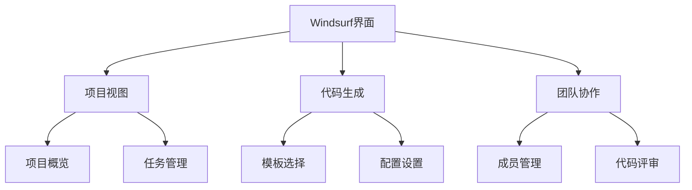
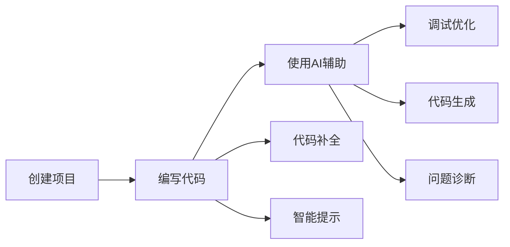
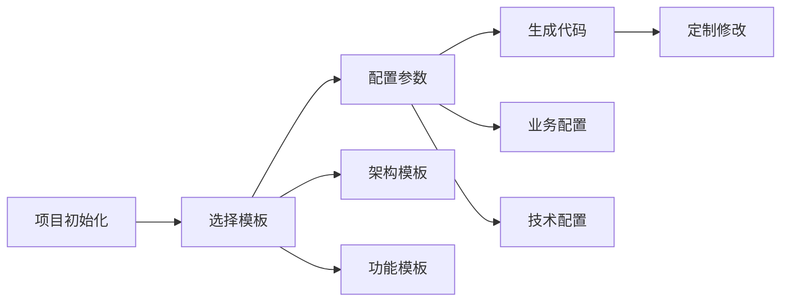
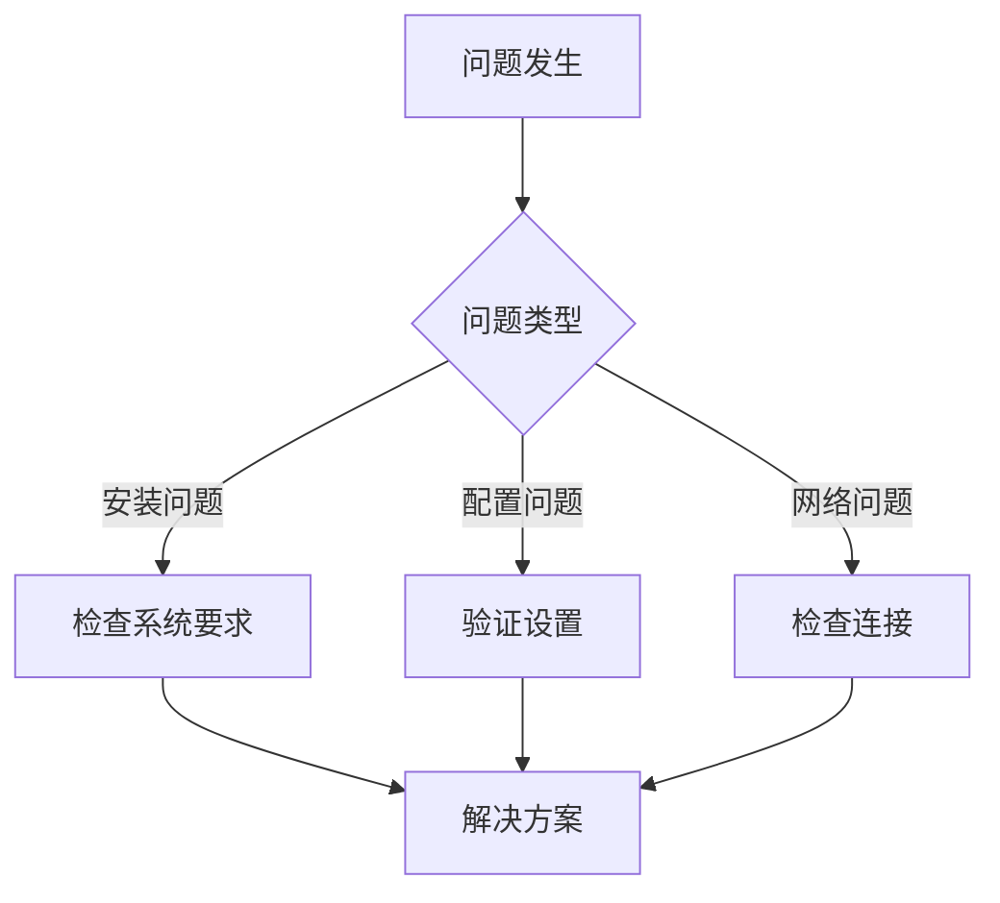

# 第一章 基础入门

## 1.1 开发环境准备

### 1.1.1 系统要求



### 1.1.2 安装配置

1. Cursor 安装步骤
```plaintext
1. 访问 Cursor 官网下载安装包
2. 根据系统选择对应版本
3. 运行安装程序
4. 完成基础配置
   - 选择主题
   - 设置快捷键
   - 配置 Git
```

2. Windsurf 安装步骤
```plaintext
1. 获取 Windsurf 安装包
2. 安装依赖组件
3. 运行安装向导
4. 初始化配置
   - 账号设置
   - 团队配置
   - 项目设置
```

## 1.2 界面功能介绍

### 1.2.1 Cursor 界面



1. 主要功能区
```plaintext
- 代码编辑区：主要的代码编写区域
- 文件树：项目文件结构
- 命令面板：快捷命令执行
- 终端：命令行操作
```

2. AI 功能区
```plaintext
- AI 提示区：显示 AI 建议
- 代码补全：实时代码补全
- 错误提示：代码问题标记
```

### 1.2.2 Windsurf 界面



1. 主要功能区
```plaintext
- 项目管理：项目概览和任务
- 代码生成：模板和配置
- 团队协作：成员和评审
- 设置中心：个性化配置
```

2. 协作功能区
```plaintext
- 团队面板：成员管理
- 任务看板：任务跟踪
- 评审区域：代码审查
```

## 1.3 基本操作入门

### 1.3.1 Cursor 基本操作

1. 文件操作
```plaintext
- 创建文件：Cmd/Ctrl + N
- 保存文件：Cmd/Ctrl + S
- 查找文件：Cmd/Ctrl + P
- 切换文件：Cmd/Ctrl + Tab
```

2. 编辑操作
```plaintext
- 代码补全：Tab
- 智能提示：Cmd/Ctrl + Space
- 快速修复：Alt + Enter
- 重构操作：Cmd/Ctrl + R
```

3. AI 辅助操作
```plaintext
- 触发 AI：Cmd/Ctrl + I
- 代码生成：Cmd/Ctrl + Enter
- 代码解释：Alt + /
- 问题诊断：Cmd/Ctrl + Shift + D
```

### 1.3.2 Windsurf 基本操作

1. 项目操作
```plaintext
- 创建项目：New Project
- 导入项目：Import
- 项目配置：Settings
- 团队管理：Team
```

2. 代码生成操作
```plaintext
- 选择模板：Templates
- 配置参数：Config
- 生成代码：Generate
- 预览修改：Preview
```

3. 协作操作
```plaintext
- 任务创建：New Task
- 代码评审：Review
- 团队讨论：Discussion
- 知识共享：Share
```

## 1.4 快速上手实践

### 1.4.1 Cursor 实践



1. 基础开发流程
```plaintext
1. 创建新项目
2. 编写基础代码
3. 使用 AI 补全
4. 代码优化
5. 调试运行
```

2. AI 辅助示例
```plaintext
- 生成函数实现
- 添加错误处理
- 优化代码结构
- 生成单元测试
```

### 1.4.2 Windsurf 实践



1. 项目创建流程
```plaintext
1. 创建新项目
2. 选择项目模板
3. 配置项目参数
4. 生成基础代码
5. 定制化修改
```

2. 团队协作流程
```plaintext
1. 设置团队
2. 分配任务
3. 代码评审
4. 合并代码
```

## 1.5 常见问题解决

### 1.5.1 环境问题



1. 安装问题
```plaintext
- 系统兼容性检查
- 依赖组件验证
- 权限设置确认
```

2. 配置问题
```plaintext
- 环境变量设置
- 工具配置检查
- 账号授权验证
```

### 1.5.2 使用问题

1. Cursor 常见问题
```plaintext
- AI 响应慢：检查网络连接
- 补全不准确：优化提示词
- 代码格式化：检查配置
```

2. Windsurf 常见问题
```plaintext
- 模板问题：更新模板库
- 生成失败：检查参数配置
- 协作问题：验证权限设置
```

## 1.6 小结

本章介绍了 AI 辅助开发工具的基础入门知识：

1. 环境准备
   - 系统要求
   - 安装配置

2. 界面功能
   - Cursor 界面布局和功能
   - Windsurf 界面布局和功能

3. 基本操作
   - 常用快捷键
   - 基础功能操作

4. 实践应用
   - 快速上手示例
   - 常见问题解决

通过本章的学习，您应该能够：
- 完成工具的安装和配置
- 了解基本界面和功能
- 掌握常用操作方法
- 解决常见使用问题

在下一章中，我们将深入探讨 AI 编辑器的核心概念和高级应用。

---
[回到目录](Readme.md)

上一章：[前言](前言.md)

下一章：[第二章-AI编辑器简介](第二章-AI编辑器简介.md)
